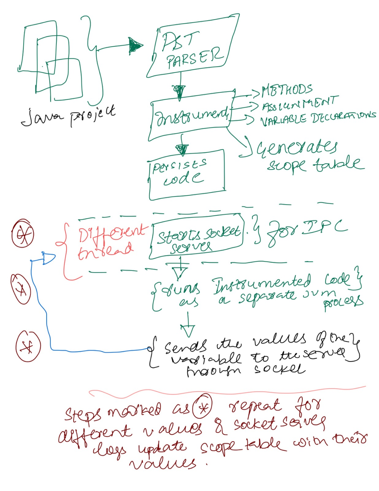

# Course Project - CS474 


### Instrumentation program that takes syntactically correct source code of some java applications from public repo

Team Members:

- Mayank K Rastogi
- Mohammed Siddiq (Leader)
- Bharath Koneti  


### Run an application:

- Clone this Repo
```
git clone <REPO-URL>
```
- Test the project
```
sbt clean test
```

- Run the project
```
sbt run
```
  
## Execution Flow





--

The parser takes the Java project extracts the java files from the project and generates AST for each .java file
 
For every AST
   
- Nodes are traversed using the Visitor pattern.
 
- The following constructs are visited and instrumented :
     
     - Methods
     - Assignment statements
     - Variable declarations

- Scope table is generated for the every run which captures the variables with their scopes for following constructs:   
    - Method declaration  
    - variable declaration
    
- Instrumentation is done which captures the variable values and communicates the values to the launcher program through
the socket.
 
- The following instrumented constructs return the values :

   - Method declaration
    
   - Assignment Declaration


- Template code fragments are located under 

    `src/main/resources/sample-projects`


- Once the instrumentation is finished, the instrumented AST is persisted onto a the output directory 
(which is configurable) , defaults to `code-gen/` directory

- IPC between the launcher and instrumented execution is done through sockets. Before spawning a new JVM process with
the existing code, socket server is instantiated in a new thread which updates the scope table with corresponding values.

- The launcher does multiple runs of the instrument project with different values in each run.

- The updated scope table before and after each run is logged.


##  Project Structure


The project is structured into two modules :

1. Client-lib : The client library which will be used to instrument values  and 'message pass' the values to 
the server thread

2. Tools : Houses all the tools and the launcher program which orchestrates instrumentation and scoping.

### client-lib module

- Opens a socket connection for message passing using messageClient class

- Instrumentor Object sends instrumentation log messages to the execution server.

### tools module

- `JavaProcessExecutor` compiles and executes the java files
- `SocketServer` is a IPC server which listens to client's message at a specific port
- `scopetable`  holds the scope table definitions

- `Instrumentationvisitor`  A visitor for visiting the nodes of an Abstract Syntax Tree (AST) of a Java Program, 
constructing a scope table from the method and variable declarations, 
and inserting instrumentation logging statements into the program.
 When a syntax tree `accept`s this visitor, the following tasks are performed by the visitor:
  1. An `import` statement is inserted for importing the [[com.javainstrumentor.clientlib.Instrumentor]] client
  library which is responsible for sending the execution log to the instrumentation (server) program.
    2. A `scopeTable` is populated, with a unique identifier (unique within the same scope), for each method
  declaration (and its parameters) and variable declaration.
   3. An instrumentation log statement using [[com.javainstrumentor.clientlib.Instrumentor#log]] is inserted into
   the AST after each method declaration, parameters of the method declaration, and all assignment statements. 
- `Instrumentor` class Instruments the given java project and returns the scope table for the project

- `Launcher` executes and orchestrates all the above components


## Tests covered in the testing module


```Scala

  test("A JavaProject, when parsed" must
    -  "parse ASTs for all source files in the project" 
    - "have the same structure as the input source files" )

  test("A JavaProject, when instrumented" must
    - "add import statement for the Instrumentor client library in all source files" 
    - "add instrumentation log statements for all method declarations" )
 
```


## Output


Scope Table before execution of the instrumented program 

```scala
------------------------------ | ------ | ------------------------- | ------------------------------ | ------------------------------------------------------------ | ------------------------------ | -------------------------------------------------- | ---------------------------------------------------------------------------------------------------- | ------------------------------------------------------------------------------------------
                     File Name | Line # |                Identifier |                           Type |                                             Method Arguments |                Declaring Class |                                          File Path |                                                                                                   ID | Values
------------------------------ | ------ | ------------------------- | ------------------------------ | ------------------------------------------------------------ | ------------------------------ | -------------------------------------------------- | ---------------------------------------------------------------------------------------------------- | ------------------------------------------------------------------------------------------
                    Board.java |     15 |                     Board |                          Board |                                                              |                          Board |                                        /Board.java |                                                                                          LBoard;.()V | 
                    Board.java |     19 |                     Board |                          Board |                                                int boardSize |                          Board |                                        /Board.java |                                                                                         LBoard;.(I)V | 
                    Board.java |     19 |                 boardSize |                            int |                                                          N/A |                            N/A |                                        /Board.java |                                                                           LBoard;.(I)V#boardSize#0#0 | 
                    Board.java |     23 |               boardValues |                        int[][] |                                                          N/A |                            N/A |                                        /Board.java |                                                                       LBoard;.([[I)V#boardValues#0#0 | 
                    Board.java |     23 |                     Board |                          Board |                                          int[][] boardValues |                          Board |                                        /Board.java |                                                                                       LBoard;.([[I)V | 
                    Board.java |     27 |                totalMoves |                            int |                                                          N/A |                            N/A |                                        /Board.java |                                                                       LBoard;.([[II)V#totalMoves#0#1 | 
                    Board.java |     27 |                     Board |                          Board |                          int[][] boardValues, int totalMoves |                          Board |                                        /Board.java |                                                                                      LBoard;.([[II)V | 
                    Board.java |     27 |               boardValues |                        int[][] |                                                          N/A |                            N/A |                                        /Board.java |                                                                      LBoard;.([[II)V#boardValues#0#0 | 
                    Board.java |     32 |                     Board |                          Board |                                                  Board board |                          Board |                                        /Board.java |                                                                                   LBoard;.(LBoard;)V | 
                    Board.java |     32 |                     board |                          Board |                                                          N/A |                            N/A |                                        /Board.java |                                                                         LBoard;.(LBoard;)V#board#0#0 | 
                    Board.java |     33 |               boardLength |                            int |                                                          N/A |                            N/A |                                        /Board.java |                                                                       LBoard;.(LBoard;)V#boardLength | 
                    Board.java |     35 |               boardValues |                        int[][] |                                                          N/A |                            N/A |                                        /Board.java |                                                                       LBoard;.(LBoard;)V#boardValues | 
                    Board.java |     36 |                         n |                            int |                                                          N/A |                            N/A |                                        /Board.java |                                                                                 LBoard;.(LBoard;)V#n | 
                    Board.java |     38 |                         m |                            int |                                                          N/A |                            N/A |                                        /Board.java |                                                                             LBoard;.(LBoard;)V#0#0#m | 
                    Board.java |     45 |                         p |                       Position |                                                          N/A |                            N/A |                                        /Board.java |                                                              LBoard;.performMove(ILPosition;)V#p#0#1 | 
                    Board.java |     45 |                    player |                            int |                                                          N/A |                            N/A |                                        /Board.java |                                                         LBoard;.performMove(ILPosition;)V#player#0#0 | 
                    Board.java |     45 |               performMove |                           void |                                       int player, Position p |                          Board |                                        /Board.java |                                                                    LBoard;.performMove(ILPosition;)V | 
                    Board.java |     50 |            getBoardValues |                        int[][] |                                                              |                          Board |                                        /Board.java |                                                                          LBoard;.getBoardValues()[[I | 
                    Board.java |     54 |               boardValues |                        int[][] |                                                          N/A |                            N/A |                                        /Board.java |                                                         LBoard;.setBoardValues([[I)V#boardValues#0#0 | 
                    Board.java |     54 |            setBoardValues |                           void |                                          int[][] boardValues |                          Board |                                        /Board.java |                                                                         LBoard;.setBoardValues([[I)V | 
                    Board.java |     58 |               checkStatus |                            int |                                                              |                          Board |                                        /Board.java |                                                                               LBoard;.checkStatus()I | 
                    Board.java |     59 |                 boardSize |                            int |                                                          N/A |                            N/A |                                        /Board.java |                                                                     LBoard;.checkStatus()I#boardSize | 
                    Board.java |     60 |                  maxIndex |                            int |                                                          N/A |                            N/A |                                        /Board.java |                                                                      LBoard;.checkStatus()I#maxIndex | 
                    Board.java |     61 |                     diag1 |                          int[] |                                                          N/A |                            N/A |                                        /Board.java |                                                                         LBoard;.checkStatus()I#diag1 | 
                    Board.java |     62 |                     diag2 |                          int[] |                                                          N/A |                            N/A |                                        /Board.java |                                                                         LBoard;.checkStatus()I#diag2 | 
                    Board.java |     65 |                       row |                          int[] |                                                          N/A |                            N/A |                                        /Board.java |                                                                       LBoard;.checkStatus()I#0#0#row | 
                    Board.java |     66 |                       col |                          int[] |                                                          N/A |                            N/A |                                        /Board.java |                                                                       LBoard;.checkStatus()I#0#0#col | 
                    Board.java |     71 |            checkRowForWin |                            int |                                                          N/A |                            N/A |                                        /Board.java |                                                            LBoard;.checkStatus()I#0#0#checkRowForWin | 
                    Board.java |     75 |            checkColForWin |                            int |                                                          N/A |                            N/A |                                        /Board.java |                                                            LBoard;.checkStatus()I#0#0#checkColForWin | 
                    Board.java |     83 |          checkDia1gForWin |                            int |                                                          N/A |                            N/A |                                        /Board.java |                                                              LBoard;.checkStatus()I#checkDia1gForWin | 
                    Board.java |     87 |          checkDiag2ForWin |                            int |                                                          N/A |                            N/A |                                        /Board.java |                                                              LBoard;.checkStatus()I#checkDiag2ForWin | 
                    Board.java |     97 |                       row |                          int[] |                                                          N/A |                            N/A |                                        /Board.java |                                                                     LBoard;.checkForWin([I)I#row#0#0 | 
                    Board.java |     97 |               checkForWin |                            int |                                                    int[] row |                          Board |                                        /Board.java |                                                                             LBoard;.checkForWin([I)I | 
                    Board.java |     98 |                   isEqual |                        boolean |                                                          N/A |                            N/A |                                        /Board.java |                                                                     LBoard;.checkForWin([I)I#isEqual | 
                    Board.java |     99 |                      size |                            int |                                                          N/A |                            N/A |                                        /Board.java |                                                                        LBoard;.checkForWin([I)I#size | 
                    Board.java |    100 |                  previous |                            int |                                                          N/A |                            N/A |                                        /Board.java |                                                                    LBoard;.checkForWin([I)I#previous | 
                    Board.java |    114 |                printBoard |                           void |                                                              |                          Board |                                        /Board.java |                                                                                LBoard;.printBoard()V | 
                    Board.java |    115 |                      size |                            int |                                                          N/A |                            N/A |                                        /Board.java |                                                                           LBoard;.printBoard()V#size | 
                    Board.java |    124 |         getEmptyPositions |       java.util.List<Position> |                                                              |                          Board |                                        /Board.java |                                              LBoard;.getEmptyPositions()Ljava/util/List<LPosition;>; | 
                    Board.java |    125 |                      size |                            int |                                                          N/A |                            N/A |                                        /Board.java |                                         LBoard;.getEmptyPositions()Ljava/util/List<LPosition;>;#size | 
                    Board.java |    126 |            emptyPositions |       java.util.List<Position> |                                                          N/A |                            N/A |                                        /Board.java |                               LBoard;.getEmptyPositions()Ljava/util/List<LPosition;>;#emptyPositions | 
                    Board.java |    136 |               printStatus |                           void |                                                              |                          Board |                                        /Board.java |                                                                               LBoard;.printStatus()V | 
                     Main.java |      3 |                      main |                           void |                                                String[] args |                           Main |                                         /Main.java |                                                                    LMain;.main([Ljava/lang/String;)V | 
                     Main.java |      3 |                      args |             java.lang.String[] |                                                          N/A |                            N/A |                                         /Main.java |                                                           LMain;.main([Ljava/lang/String;)V#args#0#0 | 
                     Main.java |      8 |                  gameTree |                           Tree |                                                          N/A |                            N/A |                                         /Main.java |                                                           LMain;.main([Ljava/lang/String;)V#gameTree | 
                     Main.java |      9 |                      mcts |           MonteCarloTreeSearch |                                                          N/A |                            N/A |                                         /Main.java |                                                               LMain;.main([Ljava/lang/String;)V#mcts | 
                     Main.java |     11 |                        v1 |                            int |                                                          N/A |                            N/A |                                         /Main.java |                                                                 LMain;.main([Ljava/lang/String;)V#v1 | 
                     Main.java |     12 |                        v2 |                            int |                                                          N/A |                            N/A |                                         /Main.java |                                                                 LMain;.main([Ljava/lang/String;)V#v2 | 
                     Main.java |     13 |                        v3 |                            int |                                                          N/A |                            N/A |                                         /Main.java |                                                                 LMain;.main([Ljava/lang/String;)V#v3 | 
                     Main.java |     16 |               UctResponse |                         double |                                                          N/A |                            N/A |                                         /Main.java |                                                        LMain;.main([Ljava/lang/String;)V#UctResponse | 
                     Main.java |     18 |                     board |                          Board |                                                          N/A |                            N/A |                                         /Main.java |                                                              LMain;.main([Ljava/lang/String;)V#board | 
                     Main.java |     19 |                     mcts1 |           MonteCarloTreeSearch |                                                          N/A |                            N/A |                                         /Main.java |                                                              LMain;.main([Ljava/lang/String;)V#mcts1 | 
                     Main.java |     21 |                     mcts3 |           MonteCarloTreeSearch |                                                          N/A |                            N/A |                                         /Main.java |                                                              LMain;.main([Ljava/lang/String;)V#mcts3 | 
                     Main.java |     24 |                    player |                            int |                                                          N/A |                            N/A |                                         /Main.java |                                                             LMain;.main([Ljava/lang/String;)V#player | 
                     Main.java |     25 |                totalMoves |                            int |                                                          N/A |                            N/A |                                         /Main.java |                                                         LMain;.main([Ljava/lang/String;)V#totalMoves | 
                     Main.java |     37 |                 winStatus |                            int |                                                          N/A |                            N/A |                                         /Main.java |                                                          LMain;.main([Ljava/lang/String;)V#winStatus | 
     MonteCarloTreeSearch.java |     11 |      MonteCarloTreeSearch |           MonteCarloTreeSearch |                                                              |           MonteCarloTreeSearch |                         /MonteCarloTreeSearch.java |                                                                           LMonteCarloTreeSearch;.()V | 
     MonteCarloTreeSearch.java |     15 |                  getLevel |                            int |                                                              |           MonteCarloTreeSearch |                         /MonteCarloTreeSearch.java |                                                                   LMonteCarloTreeSearch;.getLevel()I | 
     MonteCarloTreeSearch.java |     19 |                     level |                            int |                                                          N/A |                            N/A |                         /MonteCarloTreeSearch.java |                                                        LMonteCarloTreeSearch;.setLevel(I)V#level#0#0 | 
     MonteCarloTreeSearch.java |     19 |                  setLevel |                           void |                                                    int level |           MonteCarloTreeSearch |                         /MonteCarloTreeSearch.java |                                                                  LMonteCarloTreeSearch;.setLevel(I)V | 
     MonteCarloTreeSearch.java |     23 |  getMillisForCurrentLevel |                            int |                                                              |           MonteCarloTreeSearch |                         /MonteCarloTreeSearch.java |                                                   LMonteCarloTreeSearch;.getMillisForCurrentLevel()I | 
     MonteCarloTreeSearch.java |     27 |                  playerNo |                            int |                                                          N/A |                            N/A |                         /MonteCarloTreeSearch.java |                                    LMonteCarloTreeSearch;.findNextMove(LBoard;I)LBoard;#playerNo#0#1 | 
     MonteCarloTreeSearch.java |     27 |              findNextMove |                          Board |                                    Board board, int playerNo |           MonteCarloTreeSearch |                         /MonteCarloTreeSearch.java |                                                 LMonteCarloTreeSearch;.findNextMove(LBoard;I)LBoard; | 
     MonteCarloTreeSearch.java |     27 |                     board |                          Board |                                                          N/A |                            N/A |                         /MonteCarloTreeSearch.java |                                       LMonteCarloTreeSearch;.findNextMove(LBoard;I)LBoard;#board#0#0 | 
     MonteCarloTreeSearch.java |     28 |                     start |                           long |                                                          N/A |                            N/A |                         /MonteCarloTreeSearch.java |                                           LMonteCarloTreeSearch;.findNextMove(LBoard;I)LBoard;#start | 
     MonteCarloTreeSearch.java |     29 |                       end |                           long |                                                          N/A |                            N/A |                         /MonteCarloTreeSearch.java |                                             LMonteCarloTreeSearch;.findNextMove(LBoard;I)LBoard;#end | 
     MonteCarloTreeSearch.java |     32 |                      tree |                           Tree |                                                          N/A |                            N/A |                         /MonteCarloTreeSearch.java |                                            LMonteCarloTreeSearch;.findNextMove(LBoard;I)LBoard;#tree | 
     MonteCarloTreeSearch.java |     33 |                  rootNode |                           Node |                                                          N/A |                            N/A |                         /MonteCarloTreeSearch.java |                                        LMonteCarloTreeSearch;.findNextMove(LBoard;I)LBoard;#rootNode | 
     MonteCarloTreeSearch.java |     39 |             promisingNode |                           Node |                                                          N/A |                            N/A |                         /MonteCarloTreeSearch.java |                                 LMonteCarloTreeSearch;.findNextMove(LBoard;I)LBoard;#0#promisingNode | 
     MonteCarloTreeSearch.java |     45 |             nodeToExplore |                           Node |                                                          N/A |                            N/A |                         /MonteCarloTreeSearch.java |                                 LMonteCarloTreeSearch;.findNextMove(LBoard;I)LBoard;#0#nodeToExplore | 
     MonteCarloTreeSearch.java |     49 |             playoutResult |                            int |                                                          N/A |                            N/A |                         /MonteCarloTreeSearch.java |                                 LMonteCarloTreeSearch;.findNextMove(LBoard;I)LBoard;#0#playoutResult | 
     MonteCarloTreeSearch.java |     54 |                winnerNode |                           Node |                                                          N/A |                            N/A |                         /MonteCarloTreeSearch.java |                                      LMonteCarloTreeSearch;.findNextMove(LBoard;I)LBoard;#winnerNode | 
     MonteCarloTreeSearch.java |     59 |                  rootNode |                           Node |                                                          N/A |                            N/A |                         /MonteCarloTreeSearch.java |                                LMonteCarloTreeSearch;.selectPromisingNode(LNode;)LNode;#rootNode#0#0 | 
     MonteCarloTreeSearch.java |     59 |       selectPromisingNode |                           Node |                                                Node rootNode |           MonteCarloTreeSearch |                         /MonteCarloTreeSearch.java |                                             LMonteCarloTreeSearch;.selectPromisingNode(LNode;)LNode; | 
     MonteCarloTreeSearch.java |     60 |                      node |                           Node |                                                          N/A |                            N/A |                         /MonteCarloTreeSearch.java |                                        LMonteCarloTreeSearch;.selectPromisingNode(LNode;)LNode;#node | 
     MonteCarloTreeSearch.java |     67 |                      node |                           Node |                                                          N/A |                            N/A |                         /MonteCarloTreeSearch.java |                                                  LMonteCarloTreeSearch;.expandNode(LNode;)V#node#0#0 | 
     MonteCarloTreeSearch.java |     67 |                expandNode |                           void |                                                    Node node |           MonteCarloTreeSearch |                         /MonteCarloTreeSearch.java |                                                           LMonteCarloTreeSearch;.expandNode(LNode;)V | 
     MonteCarloTreeSearch.java |     68 |            possibleStates |          java.util.List<State> |                                                          N/A |                            N/A |                         /MonteCarloTreeSearch.java |                                            LMonteCarloTreeSearch;.expandNode(LNode;)V#possibleStates | 
     MonteCarloTreeSearch.java |     70 |                   newNode |                           Node |                                                          N/A |                            N/A |                         /MonteCarloTreeSearch.java |                                       LMonteCarloTreeSearch;.lambda$0(Ljava/lang/Object;)V#0#newNode | 
     MonteCarloTreeSearch.java |     77 |           backPropogation |                           void |                             Node nodeToExplore, int playerNo |           MonteCarloTreeSearch |                         /MonteCarloTreeSearch.java |                                                     LMonteCarloTreeSearch;.backPropogation(LNode;I)V | 
     MonteCarloTreeSearch.java |     77 |                  playerNo |                            int |                                                          N/A |                            N/A |                         /MonteCarloTreeSearch.java |                                        LMonteCarloTreeSearch;.backPropogation(LNode;I)V#playerNo#0#1 | 
     MonteCarloTreeSearch.java |     77 |             nodeToExplore |                           Node |                                                          N/A |                            N/A |                         /MonteCarloTreeSearch.java |                                   LMonteCarloTreeSearch;.backPropogation(LNode;I)V#nodeToExplore#0#0 | 
     MonteCarloTreeSearch.java |     78 |                  tempNode |                           Node |                                                          N/A |                            N/A |                         /MonteCarloTreeSearch.java |                                            LMonteCarloTreeSearch;.backPropogation(LNode;I)V#tempNode | 
     MonteCarloTreeSearch.java |     87 |                      node |                           Node |                                                          N/A |                            N/A |                         /MonteCarloTreeSearch.java |                                       LMonteCarloTreeSearch;.simulateRandomPlayout(LNode;)I#node#0#0 | 
     MonteCarloTreeSearch.java |     87 |     simulateRandomPlayout |                            int |                                                    Node node |           MonteCarloTreeSearch |                         /MonteCarloTreeSearch.java |                                                LMonteCarloTreeSearch;.simulateRandomPlayout(LNode;)I | 
     MonteCarloTreeSearch.java |     88 |                  tempNode |                           Node |                                                          N/A |                            N/A |                         /MonteCarloTreeSearch.java |                                       LMonteCarloTreeSearch;.simulateRandomPlayout(LNode;)I#tempNode | 
     MonteCarloTreeSearch.java |     89 |                 tempState |                          State |                                                          N/A |                            N/A |                         /MonteCarloTreeSearch.java |                                      LMonteCarloTreeSearch;.simulateRandomPlayout(LNode;)I#tempState | 
     MonteCarloTreeSearch.java |     90 |               boardStatus |                            int |                                                          N/A |                            N/A |                         /MonteCarloTreeSearch.java |                                    LMonteCarloTreeSearch;.simulateRandomPlayout(LNode;)I#boardStatus | 
                     Node.java |     11 |                      Node |                           Node |                                                              |                           Node |                                         /Node.java |                                                                                           LNode;.()V | 
                     Node.java |     16 |                      Node |                           Node |                                                  State state |                           Node |                                         /Node.java |                                                                                    LNode;.(LState;)V | 
                     Node.java |     16 |                     state |                          State |                                                          N/A |                            N/A |                                         /Node.java |                                                                          LNode;.(LState;)V#state#0#0 | 
                     Node.java |     21 |                     state |                          State |                                                          N/A |                            N/A |                                         /Node.java |                                            LNode;.(LState;LNode;Ljava/util/List<LNode;>;)V#state#0#0 | 
                     Node.java |     21 |                      Node |                           Node |              State state, Node parent, List<Node> childArray |                           Node |                                         /Node.java |                                                      LNode;.(LState;LNode;Ljava/util/List<LNode;>;)V | 
                     Node.java |     21 |                childArray |           java.util.List<Node> |                                                          N/A |                            N/A |                                         /Node.java |                                       LNode;.(LState;LNode;Ljava/util/List<LNode;>;)V#childArray#0#2 | 
                     Node.java |     21 |                    parent |                           Node |                                                          N/A |                            N/A |                                         /Node.java |                                           LNode;.(LState;LNode;Ljava/util/List<LNode;>;)V#parent#0#1 | 
                     Node.java |     27 |                      Node |                           Node |                                                    Node node |                           Node |                                         /Node.java |                                                                                     LNode;.(LNode;)V | 
                     Node.java |     27 |                      node |                           Node |                                                          N/A |                            N/A |                                         /Node.java |                                                                            LNode;.(LNode;)V#node#0#0 | 
                     Node.java |     32 |                childArray |           java.util.List<Node> |                                                          N/A |                            N/A |                                         /Node.java |                                                                          LNode;.(LNode;)V#childArray | 
                     Node.java |     38 |                  getState |                          State |                                                              |                           Node |                                         /Node.java |                                                                             LNode;.getState()LState; | 
                     Node.java |     42 |                     state |                          State |                                                          N/A |                            N/A |                                         /Node.java |                                                                  LNode;.setState(LState;)V#state#0#0 | 
                     Node.java |     42 |                  setState |                           void |                                                  State state |                           Node |                                         /Node.java |                                                                            LNode;.setState(LState;)V | 
                     Node.java |     46 |                 getParent |                           Node |                                                              |                           Node |                                         /Node.java |                                                                             LNode;.getParent()LNode; | 
                     Node.java |     50 |                 setParent |                           void |                                                  Node parent |                           Node |                                         /Node.java |                                                                            LNode;.setParent(LNode;)V | 
                     Node.java |     50 |                    parent |                           Node |                                                          N/A |                            N/A |                                         /Node.java |                                                                 LNode;.setParent(LNode;)V#parent#0#0 | 
                     Node.java |     54 |             getChildArray |           java.util.List<Node> |                                                              |                           Node |                                         /Node.java |                                                       LNode;.getChildArray()Ljava/util/List<LNode;>; | 
                     Node.java |     58 |             setChildArray |                           void |                                        List<Node> childArray |                           Node |                                         /Node.java |                                                      LNode;.setChildArray(Ljava/util/List<LNode;>;)V | 
                     Node.java |     58 |                childArray |           java.util.List<Node> |                                                          N/A |                            N/A |                                         /Node.java |                                       LNode;.setChildArray(Ljava/util/List<LNode;>;)V#childArray#0#0 | 
                     Node.java |     62 |        getRandomChildNode |                           Node |                                                              |                           Node |                                         /Node.java |                                                                    LNode;.getRandomChildNode()LNode; | 
                     Node.java |     63 |         noOfPossibleMoves |                            int |                                                          N/A |                            N/A |                                         /Node.java |                                                  LNode;.getRandomChildNode()LNode;#noOfPossibleMoves | 
                     Node.java |     64 |              selectRandom |                            int |                                                          N/A |                            N/A |                                         /Node.java |                                                       LNode;.getRandomChildNode()LNode;#selectRandom | 
                     Node.java |     68 |      getChildWithMaxScore |                           Node |                                                              |                           Node |                                         /Node.java |                                                                  LNode;.getChildWithMaxScore()LNode; | 
                 Position.java |      5 |                  Position |                       Position |                                                              |                       Position |                                     /Position.java |                                                                                       LPosition;.()V | 
                 Position.java |      8 |                         y |                            int |                                                          N/A |                            N/A |                                     /Position.java |                                                                               LPosition;.(II)V#y#0#1 | 
                 Position.java |      8 |                         x |                            int |                                                          N/A |                            N/A |                                     /Position.java |                                                                               LPosition;.(II)V#x#0#0 | 
                 Position.java |      8 |                  Position |                       Position |                                                 int x, int y |                       Position |                                     /Position.java |                                                                                     LPosition;.(II)V | 
                 Position.java |     13 |                      getX |                            int |                                                              |                       Position |                                     /Position.java |                                                                                   LPosition;.getX()I | 
                 Position.java |     17 |                      setX |                           void |                                                        int x |                       Position |                                     /Position.java |                                                                                  LPosition;.setX(I)V | 
                 Position.java |     17 |                         x |                            int |                                                          N/A |                            N/A |                                     /Position.java |                                                                            LPosition;.setX(I)V#x#0#0 | 
                 Position.java |     21 |                      getY |                            int |                                                              |                       Position |                                     /Position.java |                                                                                   LPosition;.getY()I | 
                 Position.java |     25 |                         y |                            int |                                                          N/A |                            N/A |                                     /Position.java |                                                                            LPosition;.setY(I)V#y#0#0 | 
                 Position.java |     25 |                      setY |                           void |                                                        int y |                       Position |                                     /Position.java |                                                                                  LPosition;.setY(I)V | 
                    State.java |     11 |                     State |                          State |                                                              |                          State |                                        /State.java |                                                                                          LState;.()V | 
                    State.java |     15 |                     state |                          State |                                                          N/A |                            N/A |                                        /State.java |                                                                         LState;.(LState;)V#state#0#0 | 
                    State.java |     15 |                     State |                          State |                                                  State state |                          State |                                        /State.java |                                                                                   LState;.(LState;)V | 
                    State.java |     22 |                     State |                          State |                                                  Board board |                          State |                                        /State.java |                                                                                   LState;.(LBoard;)V | 
                    State.java |     22 |                     board |                          Board |                                                          N/A |                            N/A |                                        /State.java |                                                                         LState;.(LBoard;)V#board#0#0 | 
                    State.java |     26 |                  getBoard |                          Board |                                                              |                          State |                                        /State.java |                                                                            LState;.getBoard()LBoard; | 
                    State.java |     30 |                  setBoard |                           void |                                                  Board board |                          State |                                        /State.java |                                                                           LState;.setBoard(LBoard;)V | 
                    State.java |     30 |                     board |                          Board |                                                          N/A |                            N/A |                                        /State.java |                                                                 LState;.setBoard(LBoard;)V#board#0#0 | 
                    State.java |     34 |               getPlayerNo |                            int |                                                              |                          State |                                        /State.java |                                                                               LState;.getPlayerNo()I | 
                    State.java |     38 |                  playerNo |                            int |                                                          N/A |                            N/A |                                        /State.java |                                                                 LState;.setPlayerNo(I)V#playerNo#0#0 | 
                    State.java |     38 |               setPlayerNo |                           void |                                                 int playerNo |                          State |                                        /State.java |                                                                              LState;.setPlayerNo(I)V | 
                    State.java |     42 |               getOpponent |                            int |                                                              |                          State |                                        /State.java |                                                                               LState;.getOpponent()I | 
                    State.java |     46 |             getVisitCount |                            int |                                                              |                          State |                                        /State.java |                                                                             LState;.getVisitCount()I | 
                    State.java |     50 |                visitCount |                            int |                                                          N/A |                            N/A |                                        /State.java |                                                             LState;.setVisitCount(I)V#visitCount#0#0 | 
                    State.java |     50 |             setVisitCount |                           void |                                               int visitCount |                          State |                                        /State.java |                                                                            LState;.setVisitCount(I)V | 
                    State.java |     54 |               getWinScore |                         double |                                                              |                          State |                                        /State.java |                                                                               LState;.getWinScore()D | 
                    State.java |     58 |               setWinScore |                           void |                                              double winScore |                          State |                                        /State.java |                                                                              LState;.setWinScore(D)V | 
                    State.java |     58 |                  winScore |                         double |                                                          N/A |                            N/A |                                        /State.java |                                                                 LState;.setWinScore(D)V#winScore#0#0 | 
                    State.java |     62 |      getAllPossibleStates |          java.util.List<State> |                                                              |                          State |                                        /State.java |                                              LState;.getAllPossibleStates()Ljava/util/List<LState;>; | 
                    State.java |     63 |            possibleStates |          java.util.List<State> |                                                          N/A |                            N/A |                                        /State.java |                               LState;.getAllPossibleStates()Ljava/util/List<LState;>;#possibleStates | 
                    State.java |     64 |        availablePositions |       java.util.List<Position> |                                                          N/A |                            N/A |                                        /State.java |                           LState;.getAllPossibleStates()Ljava/util/List<LState;>;#availablePositions | 
                    State.java |     66 |                  newState |                          State |                                                          N/A |                            N/A |                                        /State.java |                                                     LState;.lambda$0(Ljava/lang/Object;)V#0#newState | 
                    State.java |     74 |            incrementVisit |                           void |                                                              |                          State |                                        /State.java |                                                                            LState;.incrementVisit()V | 
                    State.java |     78 |                     score |                         double |                                                          N/A |                            N/A |                                        /State.java |                                                                       LState;.addScore(D)V#score#0#0 | 
                    State.java |     78 |                  addScore |                           void |                                                 double score |                          State |                                        /State.java |                                                                                 LState;.addScore(D)V | 
                    State.java |     83 |                randomPlay |                           void |                                                              |                          State |                                        /State.java |                                                                                LState;.randomPlay()V | 
                    State.java |     84 |        availablePositions |       java.util.List<Position> |                                                          N/A |                            N/A |                                        /State.java |                                                             LState;.randomPlay()V#availablePositions | 
                    State.java |     85 |        totalPossibilities |                            int |                                                          N/A |                            N/A |                                        /State.java |                                                             LState;.randomPlay()V#totalPossibilities | 
                    State.java |     86 |              selectRandom |                            int |                                                          N/A |                            N/A |                                        /State.java |                                                                   LState;.randomPlay()V#selectRandom | 
                    State.java |     90 |              togglePlayer |                           void |                                                              |                          State |                                        /State.java |                                                                              LState;.togglePlayer()V | 
```


Scope Table after Execution of the instrumented program

```
------------------------------ | ------ | ------------------------- | ------------------------------ | ------------------------------------------------------------ | ------------------------------ | -------------------------------------------------- | ---------------------------------------------------------------------------------------------------- | ------------------------------------------------------------------------------------------
                     File Name | Line # |                Identifier |                           Type |                                             Method Arguments |                Declaring Class |                                          File Path |                                                                                                   ID | Values
------------------------------ | ------ | ------------------------- | ------------------------------ | ------------------------------------------------------------ | ------------------------------ | -------------------------------------------------- | ---------------------------------------------------------------------------------------------------- | ------------------------------------------------------------------------------------------
                    Board.java |     15 |                     Board |                          Board |                                                              |                          Board |                                        /Board.java |                                                                                          LBoard;.()V | 
                    Board.java |     19 |                     Board |                          Board |                                                int boardSize |                          Board |                                        /Board.java |                                                                                         LBoard;.(I)V | 
                    Board.java |     19 |                 boardSize |                            int |                                                          N/A |                            N/A |                                        /Board.java |                                                                           LBoard;.(I)V#boardSize#0#0 | 
                    Board.java |     23 |               boardValues |                        int[][] |                                                          N/A |                            N/A |                                        /Board.java |                                                                       LBoard;.([[I)V#boardValues#0#0 | 
                    Board.java |     23 |                     Board |                          Board |                                          int[][] boardValues |                          Board |                                        /Board.java |                                                                                       LBoard;.([[I)V | 
                    Board.java |     27 |                totalMoves |                            int |                                                          N/A |                            N/A |                                        /Board.java |                                                                       LBoard;.([[II)V#totalMoves#0#1 | 
                    Board.java |     27 |                     Board |                          Board |                          int[][] boardValues, int totalMoves |                          Board |                                        /Board.java |                                                                                      LBoard;.([[II)V | 
                    Board.java |     27 |               boardValues |                        int[][] |                                                          N/A |                            N/A |                                        /Board.java |                                                                      LBoard;.([[II)V#boardValues#0#0 | 
                    Board.java |     32 |                     Board |                          Board |                                                  Board board |                          Board |                                        /Board.java |                                                                                   LBoard;.(LBoard;)V | 
                    Board.java |     32 |                     board |                          Board |                                                          N/A |                            N/A |                                        /Board.java |                                                                         LBoard;.(LBoard;)V#board#0#0 | Board@1329eff, Board@1329eff, Board@1329eff, Board@1329eff, Board@1329eff, Board@1329eff, Board@1329eff, Board@1329eff, Board@1329eff, Board@152aa092, Board@7e9131d5, Board@7e9131d5, Board@7e9131d5, Board@7e9131d5, Board@7e9131d5, Board@7e9131d5, Board@7e9131d5, Board@7e9131d5, Board@625732, Board@4e268090, Board@4e268090, Board@4e268090, Board@4e268090, Board@4e268090, Board@4e268090, Board@4e268090, Board@4e268090, Board@1e683a3e, Board@5939a379, Board@5939a379, Board@5939a379, Board@5939a379, Board@5939a379, Board@5939a379, Board@5939a379, Board@5939a379, Board@3d6f0054, Board@40cb8df7, Board@40cb8df7, Board@40cb8df7, Board@40cb8df7, Board@40cb8df7, Board@40cb8df7, Board@40cb8df7, Board@40cb8df7, Board@593aaf41, Board@3315d2d7, Board@3315d2d7, Board@3315d2d7, Board@3315d2d7, Board@3315d2d7, Board@3315d2d7, Board@3315d2d7, Board@3315d2d7, Board@26e356f0, Board@366647c2, Board@366647c2, Board@366647c2, Board@366647c2, Board@366647c2, Board@366647c2, Board@366647c2, Board@366647c2, Board@7b36aa0c, Board@3972a855, Board@3972a855, Board@3972a855, Board@3972a855, Board@3972a855, Board@3972a855, Board@3972a855, Board@3972a855, Board@6e6f2380, Board@770d3326, Board@770d3326, Board@770d3326, Board@770d3326, Board@770d3326, Board@770d3326, Board@770d3326, Board@770d3326, Board@53fb3dab, Board@3738449f, Board@3738449f, Board@3738449f, Board@3738449f, Board@3738449f, Board@3738449f, Board@3738449f, Board@7ce69770, Board@152aa092, Board@152aa092, Board@152aa092, Board@152aa092, Board@152aa092, Board@152aa092, Board@152aa092, Board@152aa092, Board@4d0d9fe7, Board@6d3a388c, Board@6d3a388c, Board@6d3a388c, Board@6d3a388c, Board@6d3a388c, Board@6d3a388c, Board@6d3a388c, Board@6cb107fd, Board@662b4c69, Board@662b4c69, Board@662b4c69, Board@662b4c69, Board@662b4c69, Board@662b4c69, Board@662b4c69, Board@782859e, Board@f5acb9d, Board@f5acb9d, Board@f5acb9d, Board@f5acb9d, Board@f5acb9d, Board@f5acb9d, Board@f5acb9d, Board@169bb4dd, Board@4dbb42b7, Board@4dbb42b7, Board@4dbb42b7, Board@4dbb42b7, Board@4dbb42b7, Board@4dbb42b7, Board@4dbb42b7, Board@f58853c, Board@202b0582, Board@202b0582, Board@202b0582, Board@202b0582, Board@202b0582, Board@202b0582, Board@202b0582, Board@7f2cfe3f, Board@1eb5174b, Board@1eb5174b, Board@1eb5174b, Board@1eb5174b, Board@1eb5174b, Board@1eb5174b, Board@1eb5174b, Board@264f218, Board@2c35e847, Board@2c35e847, Board@2c35e847, Board@2c35e847, Board@2c35e847, Board@2c35e847, Board@2c35e847, Board@19b89d4, Board@7bab3f1a, Board@7bab3f1a, Board@7bab3f1a, Board@7bab3f1a, Board@7bab3f1a, Board@7bab3f1a, Board@7bab3f1a, Board@42e25b0b, Board@4e7912d8, Board@4e7912d8, Board@4e7912d8, Board@4e7912d8, Board@4e7912d8, Board@4e7912d8, Board@4e7912d8, Board@7f8a9499, Board@7e9131d5, Board@7e9131d5, Board@7e9131d5, Board@7e9131d5, Board@7e9131d5, Board@7e9131d5, Board@7e9131d5, Board@7e9131d5, Board@2d9caaeb, Board@6b6776cb, Board@6b6776cb, Board@6b6776cb, Board@6b6776cb, Board@6b6776cb, Board@6b6776cb, Board@6b6776cb, Board@5c669da8, Board@53b7f657, Board@53b7f657, Board@53b7f657, Board@53b7f657, Board@53b7f657, Board@53b7f657, Board@53b7f657, Board@19e7a160, Board@6b58b9e9, Board@6b58b9e9, Board@6b58b9e9, Board@6b58b9e9, Board@6b58b9e9, Board@6b58b9e9, Board@6b58b9e9, Board@4278284b, Board@27508c5d, Board@27508c5d, Board@27508c5d, Board@27508c5d, Board@27508c5d, Board@27508c5d, Board@27508c5d, Board@4397ad89, Board@704deff2, Board@704deff2, Board@704deff2, Board@704deff2, Board@704deff2, Board@704deff2, Board@704deff2, Board@73d983ea, Board@6986852, Board@6986852, Board@6986852, Board@6986852, Board@6986852, Board@6986852, Board@6986852, Board@39ac0c0a, Board@6c61a903, Board@6c61a903, Board@6c61a903, Board@6c61a903, Board@6c61a903, Board@6c61a903, Board@6c61a903, Board@62010f5c, Board@6e15fe2, Board@6e15fe2, Board@6e15fe2, Board@6e15fe2, Board@6e15fe2, Board@6e15fe2, Board@7a1a14a4, Board@6d07a63d, Board@6d07a63d, Board@6d07a63d, Board@6d07a63d, Board@6d07a63d, Board@6d07a63d, Board@1c33c17b, Board@3e2059ae, Board@3e2059ae, Board@3e2059ae, Board@3e2059ae, Board@3e2059ae, Board@3e2059ae, Board@5ce8d869, Board@d278d2b, Board@d278d2b, Board@d278d2b, Board@d278d2b, Board@d278d2b, Board@d278d2b, Board@676cf48, Board@4fbe37eb, Board@4fbe37eb, Board@4fbe37eb, Board@4fbe37eb, Board@4fbe37eb, Board@4fbe37eb, Board@22356acd, Board@3081f72c, Board@3081f72c, Board@3081f72c, Board@3081f72c, Board@3081f72c, Board@3081f72c, Board@503ecb24, Board@6b6776cb, Board@6b6776cb, Board@6b6776cb, Board@6b6776cb, Board@6b6776cb, Board@6b6776cb, Board@6b6776cb, Board@4748a0f9, Board@77d67cf3, Board@77d67cf3, Board@77d67cf3, Board@77d67cf3, Board@77d67cf3, Board@77d67cf3, Board@64b73e7a, Board@5d12a356, Board@5d12a356, Board@5d12a356, Board@5d12a356, Board@5d12a356, Board@5d12a356, Board@63f8276e, Board@4b3ed2f0, Board@4b3ed2f0, Board@4b3ed2f0, Board@4b3ed2f0, Board@4b3ed2f0, Board@4b3ed2f0, Board@5cde6747, Board@1941a8ff, Board@1941a8ff, Board@1941a8ff, Board@1941a8ff, Board@1941a8ff, Board@1941a8ff, Board@5d9b7a8a, Board@33fe57a9, Board@33fe57a9, Board@33fe57a9, Board@33fe57a9, Board@33fe57a9, Board@33fe57a9, Board@66746f57, Board@512535ff, Board@512535ff, Board@512535ff, Board@512535ff, Board@512535ff, Board@512535ff, Board@fade1fc, Board@4748a0f9, Board@4748a0f9, Board@4748a0f9, Board@4748a0f9, Board@4748a0f9, Board@4748a0f9, Board@6622fc65, Board@6187d1f5, Board@6187d1f5, Board@6187d1f5, Board@6187d1f5, Board@6187d1f5, Board@180da663, Board@2eee3069, Board@2eee3069, Board@2eee3069, Board@2eee3069, Board@2eee3069, Board@c2db68f, Board@66565121, Board@66565121, Board@66565121, Board@66565121, Board@66565121, Board@1a9c38eb, Board@550a1967, Board@550a1967, Board@550a1967, Board@550a1967, Board@550a1967, Board@5e8ac0e1, Board@1338fb5, Board@1338fb5, Board@1338fb5, Board@1338fb5, Board@1338fb5, Board@1506f20f, Board@2ceb80a1, Board@2ceb80a1, Board@2ceb80a1, Board@2ceb80a1, Board@2ceb80a1, Board@4c4748bf, Board@46944ca9, Board@46944ca9, Board@46944ca9, Board@46944ca9, Board@46944ca9, Board@13f17eb4, Board@13d9b21f, Board@13d9b21f, Board@13d9b21f, Board@13d9b21f, Board@13d9b21f, Board@a202ccb, Board@576f63f6, Board@576f63f6, Board@576f63f6, Board@576f63f6, Board@576f63f6, Board@5bc9ba1d, Board@7103cb56, Board@7103cb56, Board@7103cb56, Board@7103cb56, Board@7103cb56, Board@40cb698e, Board@2654635, Board@2654635, Board@2654635, Board@2654635, Board@2654635, Board@4febb875, Board@1e636ea3, Board@1e636ea3, Board@1e636ea3, Board@1e636ea3, Board@1e636ea3, Board@72cf2de5, Board@76012793, Board@76012793, Board@76012793, Board@76012793, Board@76012793, Board@4678a2eb, Board@1253e7cb, Board@1253e7cb, Board@1253e7cb, Board@1253e7cb, Board@12bfd80d, Board@66b7550d, Board@66b7550d, Board@66b7550d, Board@66b7550d, Board@7894f09b, Board@7c209437, Board@7c209437, Board@7c209437, Board@7c209437, Board@652a7737, Board@53812a9b, Board@53812a9b, Board@53812a9b, Board@53812a9b, Board@3829ac1, Board@63f8276e, Board@63f8276e, Board@63f8276e, Board@63f8276e, Board@63f8276e, Board@366ef90e, Board@5c3b6c6e, Board@5c3b6c6e, Board@5c3b6c6e, Board@5c3b6c6e, Board@62fad19, Board@2c7b5824, Board@2c7b5824, Board@2c7b5824, Board@2c7b5824, Board@58e6d4b8, Board@4212a0c8, Board@4212a0c8, Board@4212a0c8, Board@4212a0c8, Board@7e3f95fe, Board@35a9782c, Board@35a9782c, Board@35a9782c, Board@35a9782c, Board@35a9782c, Board@1c9f0a20, Board@5674e1f2, Board@5674e1f2, Board@5674e1f2, Board@5674e1f2, Board@5674e1f2, Board@62e70ea3, Board@e54303, Board@e54303, Board@e54303, Board@e54303, Board@e54303, Board@410ae9a3, Board@5ef6ae06, Board@5ef6ae06, Board@5ef6ae06, Board@5ef6ae06, Board@5ef6ae06, Board@165b8a71, Board@628c4ac0, Board@628c4ac0, Board@628c4ac0, Board@628c4ac0, Board@628c4ac0, Board@3e2943ab, Board@6ad59d92, Board@6ad59d92, Board@6ad59d92, Board@6ad59d92, Board@6ad59d92, Board@5f3b9c57, Board@4189d70b, Board@4189d70b, Board@4189d70b, Board@4189d70b, Board@66629f63, Board@320de594, Board@320de594, Board@320de594, Board@320de594, Board@62dae245, Board@2974f221, Board@2974f221, Board@2974f221, Board@2974f221, Board@549621f3, Board@4044fb95, Board@4044fb95, Board@4044fb95, Board@4044fb95, Board@4f8969b0, Board@2807bdeb, Board@2807bdeb, Board@2807bdeb, Board@2807bdeb, Board@2807bdeb, Board@372ea2bc, Board@5f6722d3, Board@5f6722d3, Board@5f6722d3, Board@5f6722d3, Board@5f6722d3, Board@35d6ca49, Board@2002348, Board@2002348, Board@2002348, Board@2002348, Board@2002348, Board@3bd7f8dc, Board@328cf0e1, Board@328cf0e1, Board@328cf0e1, Board@328cf0e1, Board@2f4854d6, Board@d8305c2, Board@d8305c2, Board@d8305c2, Board@d8305c2, Board@2e77b8cf, Board@275fe372, Board@275fe372, Board@275fe372, Board@275fe372, Board@3f093abe, Board@12bcd0c0, Board@12bcd0c0, Board@12bcd0c0, Board@12bcd0c0, Board@5b800468, Board@681a8b4e, Board@681a8b4e, Board@681a8b4e, Board@681a8b4e, Board@4b629f13, Board@476b0ae6, Board@476b0ae6, Board@476b0ae6, Board@476b0ae6, Board@1df98368, Board@183e8023, Board@183e8023, Board@183e8023, Board@183e8023, Board@3174cb09, Board@531c311e, Board@531c311e, Board@531c311e, Board@531c311e, Board@21a5fd96, Board@78fb9a67, Board@78fb9a67, Board@78fb9a67, Board@78fb9a67, Board@702ed190, Board@1fdfafd2, Board@1fdfafd2, Board@1fdfafd2, Board@1fdfafd2, Board@5bd1ceca, Board@5829e4f4, Board@5829e4f4, Board@5829e4f4, Board@5829e4f4, Board@7544a1e4, Board@17a87e37, Board@17a87e37, Board@17a87e37, Board@17a87e37, Board@372b0d86, Board@30bcf3c1, Board@4b672daa, Board@2611b9a3, Board@2611b9a3, Board@2611b9a3, Board@2611b9a3, Board@1fe8d51b, Board@5c87bfe2, Board@5c87bfe2, Board@5c87bfe2, Board@5c87bfe2, Board@58a55449, Board@73511076, Board@73511076, Board@73511076, Board@58783f6c, Board@408b35bf, Board@408b35bf, Board@408b35bf, Board@10b3df93, Board@3b366632, Board@3b366632, Board@3b366632, Board@18e8473e, Board@fac80, Board@fac80, Board@fac80, Board@32c0915e, Board@6b5966e1, Board@6b5966e1, Board@6b5966e1, Board@3ef41c66, Board@361c294e, Board@361c294e, Board@361c294e, Board@271f18d3, Board@1cf2fed4, Board@1cf2fed4, Board@1cf2fed4, Board@85ec632, Board@5ae76500, Board@5ae76500, Board@5ae76500, Board@5ae76500, Board@1c65121, Board@797501a, Board@797501a, Board@797501a, Board@36b6964d, Board@1dfd5f51, Board@1dfd5f51, Board@17f9344b, Board@6e9c413e, Board@6c44052e, Board@5bd1ceca, Board@5bd1ceca, Board@5bd1ceca, Board@2c1dc8e, Board@610db97e, Board@610db97e, Board@73e132e0, Board@10b3df93, Board@54f5f647, Board@5fa47fea, Board@10b3df93, Board@10b3df93, Board@5d12a356, Board@5d12a356, Board@5d12a356, Board@5d12a356, Board@5d12a356, Board@5d12a356, Board@2d83c5a5, Board@15b986cd, Board@15b986cd, Board@15b986cd, Board@15b986cd, Board@15b986cd, Board@74cf8b28, Board@678040b3, Board@678040b3, Board@678040b3, Board@678040b3, Board@678040b3, Board@42561fba, Board@2c0f7678, Board@2c0f7678, Board@2c0f7678, Board@2c0f7678, Board@2c0f7678, Board@1bdbf9be, Board@88a8218, Board@88a8218, Board@88a8218, Board@88a8218, Board@88a8218, Board@c7a977f, Board@5c09d180, Board@5c09d180, Board@5c09d180, Board@5c09d180, Board@5c09d180, Board@cd7f1ae, Board@2d83c5a5, Board@2d83c5a5, Board@2d83c5a5, Board@2d83c5a5, Board@2d83c5a5, Board@2bfeb1ef, Board@5bdaf2ce, Board@5bdaf2ce, Board@5bdaf2ce, Board@5bdaf2ce, Board@4925f4f5, Board@46044faa, Board@46044faa, Board@46044faa, Board@46044faa, Board@7e31ce0f, Board@34448e6c, Board@34448e6c, Board@34448e6c, Board@34448e6c, Board@55120f99, Board@7dc51783, Board@7dc51783, Board@7dc51783, Board@7dc51783, Board@ba1f559, Board@36453307, Board@36453307, Board@36453307, Board@30b9eadd, Board@2bfeb1ef, Board@2bfeb1ef, Board@2bfeb1ef, Board@2bfeb1ef, Board@7d151a, Board@5d28bcd5, Board@5d28bcd5, Board@5d28bcd5, Board@3c5a54b7, Board@6c8a68c1, Board@6c8a68c1, Board@6c8a68c1, Board@d0ec63, Board@7f9e1534, Board@7f9e1534, Board@7f9e1534, Board@4a183d02, Board@757194dc, Board@7e31ce0f, Board@7e31ce0f, Board@7e31ce0f, Board@2160e52a, Board@6e92c6ad, Board@6e92c6ad, Board@779de014, Board@757194dc, Board@757194dc, Board@757194dc, Board@37ff4054, Board@37ff4054, Board@37ff4054, Board@37ff4054, Board@74fef3f7, Board@1d269ed7, Board@1d269ed7, Board@1d269ed7, Board@1d269ed7, Board@6331250e, Board@2d83c5a5, Board@2d83c5a5, Board@2d83c5a5, Board@2d83c5a5, Board@2d83c5a5, Board@312afbc7, Board@61533ae, Board@61533ae, Board@61533ae, Board@61533ae, Board@66434cc8, Board@4463d9d3, Board@4463d9d3, Board@4463d9d3, Board@4463d9d3, Board@1eea9d2d, Board@13d186db, Board@13d186db, Board@13d186db, Board@13d186db, Board@5eeedb60, Board@466d49f0, Board@466d49f0, Board@466d49f0, Board@466d49f0, Board@1dab9dd6, Board@4482469c, Board@4482469c, Board@4482469c, Board@52a36910, Board@312afbc7, Board@312afbc7, Board@312afbc7, Board@312afbc7, Board@f973499, Board@5c20ffa8, Board@5c20ffa8, Board@5c20ffa8, Board@2d195ee4, Board@278f8425, Board@278f8425, Board@278f8425, Board@6ef81f31, Board@50825a02, Board@50825a02, Board@50825a02, Board@65cc8228, Board@4bdcaf36, Board@4bdcaf36, Board@4bdcaf36, Board@34523d46, Board@6df7988f, Board@6df7988f, Board@1bcb79c2, Board@1473b8c0, Board@1473b8c0, Board@2a49fe, Board@5ecba515, Board@5ecba515, Board@5ecba515, Board@4cd1c1dc, Board@5eeedb60, Board@5eeedb60, Board@5eeedb60, Board@6ceb7b5e, Board@56ccd751, Board@56ccd751, Board@56ccd751, Board@383790cf, Board@72ed9aad, Board@72ed9aad, Board@72ed9aad, Board@ecfbe91, Board@11a7ba62, Board@11a7ba62, Board@22d1886d, Board@2b97cc1f, Board@2b97cc1f, Board@2b97cc1f, Board@4a55a6e8, Board@5ee34b1b, Board@8a62297, Board@5ee34b1b, Board@8a62297, Board@5ee34b1b, Board@8a62297, Board@5ee34b1b, Board@f973499, Board@f973499, Board@f973499, Board@1698d7c0, Board@4d74c3ba, Board@736f3e9e, Board@736f3e9e, Board@432034a, Board@4d74c3ba, Board@4d74c3ba, Board@4d74c3ba, Board@5467eea4, Board@1965539b, Board@4d74c3ba, Board@4d74c3ba, Board@8a62297, Board@4d74c3ba, Board@5ee34b1b, Board@4d74c3ba, Board@8a62297, Board@6dd93a21, Board@6dd93a21, Board@7e7f0f0a, Board@24097e9b, Board@24097e9b, Board@65ae095c, Board@4d74c3ba, Board@5ee34b1b, Board@4d74c3ba, Board@8a62297, Board@5467eea4, Board@1965539b, Board@4d74c3ba, Board@5ee34b1b, Board@4d74c3ba, Board@8a62297, Board@4d74c3ba, Board@5ee34b1b, Board@5467eea4, Board@4a55a6e8, Board@4d74c3ba, Board@8a62297, Board@4d74c3ba, Board@5ee34b1b, Board@5467eea4, Board@59429fac, Board@2f7dcef2, Board@4d74c3ba, Board@8a62297, Board@4d74c3ba, Board@5ee34b1b, Board@5467eea4, Board@1965539b, Board@4d74c3ba, Board@8a62297, Board@4d74c3ba, Board@5ee34b1b, Board@5467eea4, Board@4a55a6e8, Board@4d74c3ba, Board@8a62297, Board@4d74c3ba, Board@5ee34b1b, Board@5467eea4, Board@65ae095c, Board@2b556bb2, Board@4d74c3ba, Board@8a62297, Board@4d74c3ba, Board@5ee34b1b, Board@5467eea4, Board@1965539b, Board@4d74c3ba, Board@8a62297, Board@4d74c3ba, Board@5ee34b1b, Board@5467eea4, Board@4a55a6e8, Board@4d74c3ba, Board@8a62297, Board@4d74c3ba, Board@5ee34b1b, Board@5467eea4, Board@2f7dcef2, Board@4d74c3ba, Board@8a62297, Board@5467eea4, Board@1965539b, Board@4d74c3ba, Board@5ee34b1b, Board@4d74c3ba, Board@8a62297, Board@5467eea4, Board@4a55a6e8, Board@4d74c3ba, Board@5ee34b1b, Board@4d74c3ba, Board@8a62297, Board@5467eea4, Board@2b556bb2, Board@4d74c3ba, Board@5ee34b1b, Board@5467eea4, Board@1965539b, Board@4d74c3ba, Board@8a62297, Board@4d74c3ba, Board@5ee34b1b, Board@5467eea4, Board@4a55a6e8, Board@4d74c3ba, Board@8a62297, Board@4d74c3ba, Board@5ee34b1b, Board@5467eea4, Board@2f7dcef2, Board@4d74c3ba, Board@8a62297, Board@5467eea4, Board@1965539b, Board@4d74c3ba, Board@5ee34b1b, Board@4d74c3ba, Board@8a62297, Board@5467eea4, Board@4a55a6e8, Board@4d74c3ba, Board@5ee34b1b, Board@4d74c3ba, Board@8a62297, Board@5467eea4, Board@2b556bb2, Board@4d74c3ba, Board@5ee34b1b, Board@5467eea4, Board@1965539b, Board@4d74c3ba, Board@8a62297, Board@4d74c3ba, Board@5ee34b1b, Board@5467eea4, Board@4a55a6e8, Board@4d74c3ba, Board@8a62297, Board@5467eea4, Board@2f7dcef2, Board@4d74c3ba, Board@5ee34b1b, Board@4d74c3ba, Board@8a62297, Board@5467eea4, Board@1965539b, Board@4d74c3ba, Board@5ee34b1b, Board@5467eea4, Board@4a55a6e8, Board@4d74c3ba, Board@8a62297, Board@4d74c3ba, Board@5ee34b1b, Board@5467eea4, Board@2b556bb2, Board@4d74c3ba, Board@8a62297, Board@5467eea4, Board@1965539b, Board@4d74c3ba, Board@5ee34b1b, Board@4d74c3ba, Board@8a62297, Board@5467eea4, Board@4a55a6e8, Board@4d74c3ba, Board@5ee34b1b, Board@5467eea4, Board@2f7dcef2, Board@4d74c3ba, Board@8a62297, Board@4d74c3ba, Board@5ee34b1b, Board@5467eea4, Board@1965539b, Board@4d74c3ba, Board@8a62297, Board@5467eea4, Board@4a55a6e8, Board@4d74c3ba, Board@5ee34b1b, Board@4d74c3ba, Board@8a62297, Board@5467eea4, Board@2b556bb2, Board@4d74c3ba, Board@5ee34b1b, Board@5467eea4, Board@1965539b, Board@4d74c3ba, Board@8a62297, Board@5467eea4, Board@4a55a6e8, Board@4d74c3ba, Board@5ee34b1b, Board@4d74c3ba, Board@8a62297, Board@5467eea4, Board@2f7dcef2, Board@4d74c3ba, Board@5ee34b1b, Board@5467eea4, Board@1965539b, Board@4d74c3ba, Board@8a62297, Board@4d74c3ba, Board@5ee34b1b, Board@5467eea4, Board@4a55a6e8, Board@4d74c3ba, Board@8a62297, Board@5467eea4, Board@2b556bb2, Board@4d74c3ba, Board@5ee34b1b, Board@4d74c3ba, Board@8a62297, Board@5467eea4, Board@1965539b, Board@4d74c3ba, Board@5ee34b1b, Board@5467eea4, Board@4a55a6e8, Board@4d74c3ba, Board@8a62297, Board@5467eea4, Board@2f7dcef2, Board@4d74c3ba, Board@5ee34b1b, Board@4d74c3ba, Board@8a62297, Board@5467eea4, Board@1965539b, Board@4d74c3ba, Board@5ee34b1b, Board@5467eea4, Board@4a55a6e8, Board@4d74c3ba, Board@8a62297, Board@4d74c3ba, Board@5467eea4, Board@2b556bb2, Board@5ee34b1b, Board@4d74c3ba, Board@8a62297, Board@5467eea4, Board@1965539b, Board@4d74c3ba, Board@5ee34b1b, Board@5467eea4, Board@4a55a6e8, Board@4d74c3ba, Board@312afbc7, Board@312afbc7, Board@312afbc7, Board@312afbc7, Board@28e19366, Board@77e7246b, Board@77e7246b, Board@77e7246b, Board@1ff55ff, Board@5017e1, Board@5017e1, Board@5017e1, Board@55a609dd, Board@61dde151, Board@61dde151, Board@61dde151, Board@5eb2172, Board@28e19366, Board@28e19366, Board@28e19366, Board@184fb68d, Board@46d63dbb, Board@205bed61, Board@205bed61, Board@5c73f672, Board@184fb68d, Board@46d63dbb, Board@184fb68d, Board@46d63dbb, Board@184fb68d, Board@46d63dbb, Board@184fb68d, Board@46d63dbb, Board@184fb68d, Board@46d63dbb, Board@184fb68d, Board@46d63dbb, Board@184fb68d, Board@46d63dbb, Board@184fb68d, Board@46d63dbb, Board@184fb68d, Board@46d63dbb, Board@184fb68d, Board@46d63dbb, Board@184fb68d, Board@46d63dbb, Board@184fb68d, Board@46d63dbb, Board@184fb68d, Board@46d63dbb, Board@184fb68d, Board@46d63dbb, Board@184fb68d, Board@46d63dbb, Board@184fb68d, Board@46d63dbb, Board@184fb68d, Board@46d63dbb, Board@184fb68d, Board@46d63dbb, Board@184fb68d, Board@46d63dbb, Board@184fb68d, Board@46d63dbb, Board@184fb68d, Board@46d63dbb, Board@184fb68d, Board@46d63dbb, Board@184fb68d, Board@46d63dbb, Board@184fb68d, Board@46d63dbb, Board@184fb68d, Board@46d63dbb, Board@184fb68d, Board@46d63dbb, Board@184fb68d, Board@46d63dbb, Board@184fb68d, Board@46d63dbb, Board@184fb68d, Board@46d63dbb, Board@184fb68d, Board@46d63dbb, Board@184fb68d, Board@46d63dbb, Board@184fb68d, Board@46d63dbb, Board@184fb68d, Board@46d63dbb, Board@184fb68d, Board@46d63dbb, Board@184fb68d, Board@46d63dbb, Board@184fb68d, Board@46d63dbb, Board@184fb68d, Board@28e19366, Board@28e19366, Board@28e19366, Board@2b9f74d0, Board@3dd818e8, Board@7ca8d498, Board@7ca8d498, Board@6cd164a6, Board@3dd818e8, Board@2b9f74d0, Board@3e104d4b, Board@3dd818e8, Board@2b9f74d0, Board@3dd818e8, Board@2b9f74d0, Board@3dd818e8, Board@2b9f74d0, Board@3dd818e8, Board@2b9f74d0, Board@3dd818e8, Board@2b9f74d0, Board@3dd818e8, Board@2b9f74d0, Board@3dd818e8, Board@2b9f74d0, Board@3dd818e8, Board@2b9f74d0, Board@3dd818e8, Board@2b9f74d0, Board@3dd818e8, Board@2b9f74d0, Board@3dd818e8, Board@2b9f74d0, Board@3dd818e8, Board@2b9f74d0, Board@3dd818e8, Board@2b9f74d0, Board@3dd818e8, Board@2b9f74d0, Board@3dd818e8, Board@2b9f74d0, Board@3dd818e8, Board@2b9f74d0, Board@3dd818e8, Board@2b9f74d0, Board@3dd818e8, Board@2b9f74d0, Board@3dd818e8, Board@2b9f74d0, Board@3dd818e8, Board@2b9f74d0, Board@3dd818e8, Board@2b9f74d0, Board@3dd818e8, Board@2b9f74d0, Board@3dd818e8, Board@2b9f74d0, Board@3dd818e8, Board@2b9f74d0, Board@3dd818e8, Board@2b9f74d0, Board@3dd818e8, Board@2b9f74d0, Board@3dd818e8, Board@2b9f74d0, Board@3dd818e8, Board@2b9f74d0, Board@3dd818e8, Board@2b9f74d0, Board@3dd818e8, Board@2b9f74d0, Board@3dd818e8, Board@2b9f74d0, Board@3dd818e8, Board@2b9f74d0, Board@3dd818e8, Board@2b9f74d0, Board@3dd818e8, Board@2b9f74d0, Board@3dd818e8, Board@2b9f74d0, Board@3dd818e8, Board@2b9f74d0, Board@3dd818e8, Board@2b9f74d0, Board@3dd818e8, Board@2b9f74d0, Board@3dd818e8, Board@2b9f74d0, Board@3dd818e8, Board@2b9f74d0, Board@3dd818e8, Board@2b9f74d0, Board@3dd818e8, Board@2b9f74d0, Board@3dd818e8, Board@2b9f74d0, Board@3dd818e8, Board@2b9f74d0, Board@3dd818e8, Board@2b9f74d0, Board@3dd818e8, Board@2b9f74d0, Board@3dd818e8, Board@2b9f74d0, Board@3dd818e8, Board@2b9f74d0, Board@3dd818e8, Board@2b9f74d0, Board@3dd818e8, Board@2b9f74d0, Board@3dd818e8, Board@2b9f74d0, Board@3dd818e8, Board@2b9f74d0, Board@3dd818e8, Board@2b9f74d0, Board@3dd818e8, Board@2b9f74d0, Board@3dd818e8, Board@2b9f74d0, Board@3dd818e8, Board@2b9f74d0, Board@3dd818e8, Board@2b9f74d0, Board@3dd818e8, Board@2b9f74d0, Board@3dd818e8, Board@2b9f74d0, Board@3dd818e8, Board@2b9f74d0, Board@3dd818e8, Board@2b9f74d0, Board@3dd818e8, Board@2b9f74d0, Board@3dd818e8, Board@2b9f74d0, Board@3dd818e8, Board@2b9f74d0, Board@3dd818e8, Board@2b9f74d0, Board@3dd818e8, Board@2b9f74d0, Board@3dd818e8, Board@2b9f74d0, Board@3dd818e8, Board@2b9f74d0, Board@3dd818e8, Board@2b9f74d0, Board@3dd818e8, Board@2b9f74d0, Board@3dd818e8, Board@2b9f74d0, Board@3dd818e8, Board@2b9f74d0, Board@3dd818e8, Board@2b9f74d0, Board@3dd818e8, Board@2b9f74d0, Board@3dd818e8, Board@2b9f74d0, Board@3dd818e8, Board@2b9f74d0, Board@3dd818e8, Board@2b9f74d0, Board@3dd818e8, Board@2b9f74d0, Board@3dd818e8, Board@2b9f74d0, Board@3dd818e8, Board@2b9f74d0, Board@3dd818e8, Board@2b9f74d0, Board@3dd818e8, Board@2b9f74d0, Board@3dd818e8, Board@2b9f74d0, Board@3dd818e8, Board@2b9f74d0, Board@3dd818e8, Board@2b9f74d0, Board@3dd818e8, Board@2b9f74d0, Board@3dd818e8, Board@2b9f74d0, Board@3dd818e8, Board@2b9f74d0, Board@3dd818e8, Board@2b9f74d0, Board@3dd818e8, Board@2b9f74d0, Board@3dd818e8, Board@2b9f74d0, Board@3dd818e8, Board@2b9f74d0, Board@3dd818e8, Board@2b9f74d0, Board@3dd818e8, Board@2b9f74d0, Board@3dd818e8, Board@2b9f74d0, Board@3dd818e8, Board@2b9f74d0, Board@3dd818e8, Board@2b9f74d0, Board@3dd818e8, Board@2b9f74d0, Board@3dd818e8, Board@2b9f74d0, Board@3dd818e8, Board@2b9f74d0, Board@3dd818e8, Board@2b9f74d0, Board@3dd818e8, Board@2b9f74d0, Board@3dd818e8, Board@2b9f74d0, Board@3dd818e8, Board@2b9f74d0, Board@3dd818e8, Board@2b9f74d0, Board@3dd818e8, Board@2b9f74d0, Board@3dd818e8, Board@2b9f74d0, Board@3dd818e8, Board@2b9f74d0, Board@3dd818e8, Board@2b9f74d0, Board@3dd818e8, Board@2b9f74d0, Board@3dd818e8, Board@2b9f74d0, Board@3dd818e8, Board@2b9f74d0, Board@3dd818e8, Board@2b9f74d0, Board@3dd818e8, Board@2b9f74d0, Board@3dd818e8, Board@2b9f74d0, Board@3dd818e8, Board@2b9f74d0, Board@3dd818e8, Board@2b9f74d0, Board@3dd818e8, Board@2b9f74d0, Board@3dd818e8, Board@2b9f74d0, Board@3dd818e8, Board@2b9f74d0, Board@3dd818e8, Board@2b9f74d0, Board@3dd818e8, Board@2b9f74d0, Board@3dd818e8, Board@2b9f74d0, Board@3dd818e8, Board@2b9f74d0, Board@3dd818e8, Board@2b9f74d0, Board@3dd818e8, Board@2b9f74d0, Board@3dd818e8, Board@2b9f74d0, Board@3dd818e8, Board@2b9f74d0, Board@3dd818e8, Board@2b9f74d0, Board@3dd818e8, Board@2b9f74d0, Board@3dd818e8, Board@2b9f74d0, Board@3dd818e8, Board@2b9f74d0, Board@3dd818e8, Board@2b9f74d0, Board@3dd818e8, Board@2b9f74d0, Board@3dd818e8, Board@2b9f74d0, Board@3dd818e8, Board@2b9f74d0, Board@3dd818e8, Board@2b9f74d0, Board@3dd818e8, Board@2b9f74d0, Board@3dd818e8, Board@2b9f74d0, Board@3dd818e8, Board@2b9f74d0, Board@3dd818e8, Board@2b9f74d0, Board@3dd818e8, Board@2b9f74d0, Board@3dd818e8, Board@2b9f74d0, Board@3dd818e8, Board@2b9f74d0, Board@3dd818e8, Board@2b9f74d0, Board@3dd818e8, Board@2b9f74d0, Board@3dd818e8, Board@2b9f74d0, Board@3dd818e8, Board@2b9f74d0, Board@3dd818e8, Board@2b9f74d0, Board@3dd818e8, Board@2b9f74d0, Board@3dd818e8, Board@2b9f74d0, Board@3dd818e8, Board@2b9f74d0, Board@3dd818e8, Board@2b9f74d0, Board@3dd818e8, Board@2b9f74d0, Board@3dd818e8, Board@2b9f74d0, Board@3dd818e8, Board@2b9f74d0, Board@3dd818e8, Board@2b9f74d0, Board@3dd818e8, Board@2b9f74d0, Board@3dd818e8, Board@2b9f74d0, Board@3dd818e8, Board@2b9f74d0, Board@3dd818e8, Board@2b9f74d0, Board@3dd818e8, Board@2b9f74d0, Board@3dd818e8, Board@2b9f74d0, Board@3dd818e8, Board@2b9f74d0, Board@3dd818e8, Board@2b9f74d0, Board@3dd818e8, Board@2b9f74d0, Board@3dd818e8, Board@2b9f74d0, Board@3dd818e8, Board@2b9f74d0, Board@3dd818e8, Board@2b9f74d0, Board@3dd818e8, Board@2b9f74d0, Board@3dd818e8, Board@2b9f74d0, Board@3dd818e8, Board@2b9f74d0, Board@3dd818e8, Board@2b9f74d0, Board@3dd818e8, Board@2b9f74d0, Board@3dd818e8, Board@2b9f74d0, Board@3dd818e8, Board@2b9f74d0, Board@3dd818e8, Board@2b9f74d0, Board@3dd818e8, Board@2b9f74d0, Board@3dd818e8, Board@2b9f74d0, Board@3dd818e8, Board@2b9f74d0, Board@3dd818e8, Board@2b9f74d0, Board@3dd818e8, Board@2b9f74d0, Board@3dd818e8, Board@2b9f74d0, Board@3dd818e8, Board@2b9f74d0, Board@3dd818e8, Board@2b9f74d0, Board@3dd818e8, Board@2b9f74d0, Board@3dd818e8, Board@2b9f74d0, Board@3dd818e8, Board@2b9f74d0, Board@3dd818e8, Board@2b9f74d0, Board@3dd818e8, Board@2b9f74d0, Board@3dd818e8, Board@2b9f74d0, Board@3dd818e8, Board@2b9f74d0, Board@3dd818e8, Board@2b9f74d0, Board@3dd818e8, Board@2b9f74d0, Board@3dd818e8, Board@2b9f74d0, Board@3dd818e8, Board@2b9f74d0, Board@3dd818e8, Board@2b9f74d0, Board@3dd818e8, Board@2b9f74d0, Board@3dd818e8, Board@2b9f74d0, Board@3dd818e8, Board@2b9f74d0, Board@3dd818e8, Board@2b9f74d0, Board@3dd818e8, Board@2b9f74d0, Board@3dd818e8, Board@2b9f74d0, Board@3dd818e8, Board@2b9f74d0, Board@3dd818e8, Board@2b9f74d0, Board@3dd818e8, Board@2b9f74d0, Board@3dd818e8, Board@2b9f74d0, Board@3dd818e8, Board@2b9f74d0, Board@3dd818e8, Board@2b9f74d0, Board@3dd818e8, Board@2b9f74d0, Board@3dd818e8, Board@2b9f74d0, Board@3dd818e8, Board@2b9f74d0, Board@3dd818e8, Board@2b9f74d0, Board@3dd818e8, Board@2b9f74d0, Board@3dd818e8, Board@2b9f74d0, Board@3dd818e8, Board@2b9f74d0, Board@3dd818e8, Board@2b9f74d0, Board@3dd818e8, Board@2b9f74d0, Board@3dd818e8, Board@2b9f74d0, Board@3dd818e8, Board@2b9f74d0, Board@3dd818e8, Board@2b9f74d0, Board@3dd818e8, Board@2b9f74d0, Board@3dd818e8, Board@2b9f74d0, Board@3dd818e8, Board@2b9f74d0, Board@3dd818e8, Board@2b9f74d0, Board@3dd818e8, Board@2b9f74d0, Board@3dd818e8, Board@2b9f74d0, Board@3dd818e8, Board@2b9f74d0, Board@3dd818e8, Board@2b9f74d0, Board@3dd818e8, Board@2b9f74d0, Board@3dd818e8, Board@2b9f74d0, Board@3dd818e8, Board@2b9f74d0, Board@3dd818e8, Board@2b9f74d0, Board@3dd818e8, Board@2b9f74d0, Board@3dd818e8, Board@2b9f74d0, Board@3dd818e8, Board@2b9f74d0, Board@3dd818e8, Board@2b9f74d0, Board@3dd818e8, Board@2b9f74d0, Board@3dd818e8, Board@2b9f74d0, Board@3dd818e8, Board@2b9f74d0, Board@3dd818e8, Board@2b9f74d0, Board@3dd818e8, Board@2b9f74d0, Board@3dd818e8, Board@2b9f74d0, Board@3dd818e8, Board@2b9f74d0, Board@3dd818e8, Board@2b9f74d0, Board@3dd818e8, Board@2b9f74d0, Board@3dd818e8, Board@2b9f74d0, Board@3dd818e8, Board@2b9f74d0, Board@3dd818e8, Board@2b9f74d0, Board@3dd818e8, Board@2b9f74d0, Board@3dd818e8, Board@2b9f74d0, Board@3dd818e8, Board@2b9f74d0, Board@3dd818e8, Board@2b9f74d0, Board@3dd818e8, Board@2b9f74d0, Board@3dd818e8, Board@2b9f74d0, Board@3dd818e8, Board@2b9f74d0, Board@3dd818e8, Board@2b9f74d0, Board@3dd818e8, Board@2b9f74d0, Board@3dd818e8, Board@2b9f74d0, Board@3dd818e8, Board@2b9f74d0, Board@3dd818e8, Board@2b9f74d0, Board@3dd818e8, Board@2b9f74d0, Board@3dd818e8, Board@2b9f74d0, Board@3dd818e8, Board@2b9f74d0, Board@3dd818e8, Board@2b9f74d0, Board@3dd818e8, Board@2b9f74d0, Board@3dd818e8, Board@2b9f74d0, Board@3dd818e8, Board@2b9f74d0, Board@3dd818e8, Board@2b9f74d0, Board@3dd818e8, Board@2b9f74d0, Board@3dd818e8, Board@2b9f74d0, Board@3dd818e8, Board@2b9f74d0, Board@3dd818e8, Board@2b9f74d0, Board@3dd818e8, Board@2b9f74d0, Board@3dd818e8, Board@2b9f74d0, Board@3dd818e8, Board@2b9f74d0
                    Board.java |     33 |               boardLength |                            int |                                                          N/A |                            N/A |                                        /Board.java |                                                                       LBoard;.(LBoard;)V#boardLength | 
                    Board.java |     35 |               boardValues |                        int[][] |                                                          N/A |                            N/A |                                        /Board.java |                                                                       LBoard;.(LBoard;)V#boardValues | 
                    Board.java |     36 |                         n |                            int |                                                          N/A |                            N/A |                                        /Board.java |                                                                                 LBoard;.(LBoard;)V#n | 
                    Board.java |     38 |                         m |                            int |                                                          N/A |                            N/A |                                        /Board.java |                                                                             LBoard;.(LBoard;)V#0#0#m | 
                    Board.java |     45 |                         p |                       Position |                                                          N/A |                            N/A |                                        /Board.java |                                                              LBoard;.performMove(ILPosition;)V#p#0#1 | Position@2e1d27ba, Position@44a7bfbc, Position@1bb266b3, Position@e1de817, Position@13b13b5d, Position@d6e7bab, Position@6a6afff2, Position@62e7f11d, Position@4cc8eb05, Position@3a6bb9bf, Position@34f7cfd9, Position@65f095f8, Position@59af0466, Position@3e6ef8ad, Position@346d61be, Position@55536d9e, Position@747edf66, Position@69e1dd28, Position@67080771, Position@53976f5c, Position@be35cd9, Position@732c2a62, Position@51dcb805, Position@b62d79, Position@4e096385, Position@15bbf42f, Position@550ee7e5, Position@5f9b2141, Position@247d8ae, Position@48974e45, Position@193f604a, Position@d29f28, Position@446293d, Position@15aab8c6, Position@6babf3bf, Position@3fb1549b, Position@2053d869, Position@3c73951, Position@1b1426f4, Position@32b260fa, Position@581ac8a8, Position@6d4e5011, Position@57d7f8ca, Position@fa49800, Position@505fc5a4, Position@156b88f5, Position@4d465b11, Position@7133da86, Position@f736069, Position@2b91004a, Position@7205765b, Position@614ca7df, Position@4738a206, Position@66d3eec0, Position@1e04fa0a, Position@1af2d44a, Position@4fb3ee4e, Position@7bd4937b, Position@741a8937, Position@bae7dc0, Position@2ed2d9cb, Position@5d0a1059, Position@5a56cdac, Position@434a63ab, Position@3e11f9e9, Position@1de5f259, Position@729d991e, Position@66f57048, Position@437da279, Position@290222c1, Position@27462a88, Position@201a4587, Position@47d9a273, Position@2dc54ad4, Position@428640fa, Position@52b1beb6, Position@273e7444, Position@7db12bb6, Position@783a467b, Position@272113c4, Position@3527942a, Position@4f80542f, Position@576d5deb, Position@a38c7fe, Position@52719fb6, Position@5824a83d, Position@4d154ccd, Position@38cee291, Position@1e6a3214, Position@368247b9, Position@1a6d8329, Position@1a942c18, Position@4145bad8, Position@750e2b97, Position@2a7f1f10, Position@f78a47e, Position@6d4d66d2, Position@76a4ebf2, Position@5b1669c0, Position@4b741d6d, Position@5d0bf09b, Position@793f29ff, Position@3e8c3cb, Position@563f38c4, Position@543295b0, Position@54422e18, Position@235ecd9f, Position@74d1dc36, Position@19e4653c, Position@3a7442c7, Position@cb0755b, Position@75437611, Position@196a42c3, Position@4b29d1d2, Position@606e4010, Position@8458f04, Position@48075da3, Position@68c9133c, Position@7a35b0f5, Position@5e2c3d18, Position@2cb4893b, Position@16eb3ea3, Position@5032714f, Position@402c4085, Position@14028087, Position@1750fbeb, Position@6c284af, Position@7c137fd5, Position@7188af83, Position@6be968ce, Position@7c37508a, Position@247310d0, Position@4082ba93, Position@43df23d3, Position@73eb439a, Position@7ae0a9ec, Position@548a24a, Position@533bda92, Position@45d84a20, Position@c430e6c, Position@5c80cf32, Position@7d900ecf, Position@6f01b95f, Position@4007f65e, Position@1a245833, Position@673fdbce, Position@710636b0, Position@740fb309, Position@6f204a1a, Position@3cce5371, Position@338fc1d8, Position@480d3575, Position@65f8f5ae, Position@33ecda92, Position@14fc5f04, Position@6e2829c7, Position@dc7df28, Position@c05fddc, Position@50378a4, Position@7a6d7e92, Position@16150369, Position@23f5b5dc, Position@5db6b9cd, Position@69504ae9, Position@387a8303, Position@28cda624, Position@1500b2f3, Position@7eecb5b8, Position@5276d6ee, Position@4dc27487, Position@6933b6c6, Position@1f9e9475, Position@14dd7b39, Position@51891008, Position@12591ac8, Position@23941fb4, Position@7486b455, Position@660acfb, Position@5d908d47, Position@2d29b4ee, Position@1224144a, Position@1e16c0aa, Position@5e3f861, Position@6d5620ce, Position@4f49f6af, Position@15d49048, Position@461ad730, Position@4ee203eb, Position@1a5a4e19, Position@7068e664, Position@5167f57d, Position@e3b3b2f, Position@1a5b6f42, Position@7d9f158f, Position@383dc82c, Position@5f9edf14, Position@a8ef162, Position@5852c06f, Position@4149c063, Position@9cb8225, Position@76b07f29, Position@38af9828, Position@376a0d86, Position@222a59e6, Position@7283d3eb, Position@47c81abf, Position@3cce57c7, Position@3576ddc2, Position@747f281, Position@2ca923bb, Position@c667f46, Position@51bd8b5c, Position@7b50df34, Position@1b410b60, Position@1e13529a, Position@3cfdd820, Position@dc9876b, Position@57a3e26a, Position@3b5fad2d, Position@74f6c5d8, Position@4bbf6d0e, Position@31edaa7d, Position@26adfd2d, Position@3336e6b6, Position@2663e964, Position@39b43d60, Position@5e21e98f, Position@3fce8fd9, Position@23202fce, Position@7f284218, Position@2cb2fc20, Position@748741cb, Position@3e44f2a5, Position@1b266842, Position@bb9e6dc, Position@39d76cb5, Position@1cb346ea, Position@e3c0e40, Position@11d8ae8b, Position@5d43661b, Position@a82c5f1, Position@7b7fdc8, Position@1863d2fe, Position@797b0699, Position@f14a7d4, Position@42a15bdc, Position@4f704591, Position@379614be, Position@1bab8268, Position@658c5a19, Position@135606db, Position@518caac3, Position@68034211, Position@4f74980d, Position@6c372fe6, Position@68f1b17f, Position@398dada8, Position@12a94400, Position@11bb571c, Position@125290e5, Position@1205bd62, Position@31920ade, Position@3eb81efb, Position@1ae8bcbc, Position@6cdba6dc, Position@7d3d101b, Position@30c8681, Position@4b7dc788, Position@4e31276e, Position@5117dd67, Position@662706a7, Position@c7045b9, Position@7e19ebf0, Position@68f4865, Position@6676f6a0, Position@7cbd9d24, Position@1672fe87, Position@5026735c, Position@4416d64f, Position@6ee4d9ab, Position@13d4992d, Position@9573584, Position@6853425f, Position@7d898981, Position@6c0d7c83, Position@41005828, Position@60b4beb4, Position@7fcf2fc1, Position@2141a12, Position@4196c360, Position@41294f8, Position@571c5681, Position@2d6c53fc, Position@3148f668, Position@59e32960, Position@56c4278e, Position@59cba5a, Position@768fc0f2, Position@79dc5318, Position@8e50104, Position@37e4d7bb, Position@6f7923a5, Position@74a6f9c1, Position@73302995, Position@51133c06, Position@44d52de2, Position@babafc2, Position@69f1a286, Position@3f57bcad, Position@36a5cabc, Position@d771cc9, Position@36b4091c, Position@36060e, Position@be68757, Position@1f53a5dc, Position@c7ba306, Position@6c4980d3, Position@38b27cdc, Position@3e6104fc, Position@21ba0741, Position@58ce9668, Position@172b013, Position@56673b2c, Position@51fadaff, Position@67d18ed7, Position@7a67e3c6, Position@600b90df, Position@78d6692f, Position@558bdf1f, Position@5f354bcf, Position@1046d517, Position@3b7d3a38, Position@416c58f5, Position@5505ae1a, Position@73cd37c0, Position@21337f7b, Position@4ae9cfc1, Position@1458ed9c, Position@363a52f, Position@5f9be66c, Position@6ccdb29f, Position@265adfad, Position@38089a5a, Position@30e868be, Position@66c92293, Position@5bf0fe62, Position@6ce86ce1, Position@32c4e8b2, Position@5a755cc1, Position@63fbfaeb, Position@22f31dec, Position@2ef14fe, Position@77102b91, Position@45312be2, Position@7fb95505, Position@58be6e8, Position@e70f13a, Position@d62fe5b, Position@27eedb64, Position@2f62ea70, Position@1b84f475, Position@3ad2e17, Position@1a20270e, Position@6b88ca8c, Position@336f1079, Position@2f16c6b3, Position@34158c08, Position@21fd5faa, Position@3fc9504b, Position@740d2e78, Position@5a1de7fb, Position@6eb2384f, Position@12f9af83, Position@8ad6665, Position@42039326, Position@63787180, Position@386f0da3, Position@6e4566f1, Position@648c94da, Position@6c0d9d86, Position@561868a0, Position@2ea6e30c, Position@6138e79a, Position@531f4093, Position@74f5ce22, Position@7776ab, Position@2f1de2d6, Position@289710d9, Position@4c51cf28, Position@6fb365ed, Position@6e950bcf, Position@16414e40, Position@4b14918a, Position@6dee4f1b, Position@134d26af, Position@4fad9bb2, Position@22d7b4f8, Position@4982cc36, Position@71529963, Position@331acdad, Position@41d426b5, Position@8dbfffb, Position@f316aeb, Position@6aa3a905, Position@a22cb6a, Position@2445445a, Position@22bac7bc, Position@79c7532f, Position@e8df99a, Position@530712d, Position@55322aab, Position@6986bbaf, Position@2da59753, Position@2826f61, Position@737a135b, Position@115667d, Position@75f95314, Position@635572a7, Position@46268f08, Position@2a76840c, Position@71454b9d, Position@2fc6f97f, Position@67304a40, Position@6399551e, Position@1e0f9063, Position@63a270c9, Position@1fdf1c5, Position@49d3c823, Position@436bc36, Position@5fe1ce85, Position@2a640157, Position@2dca0d64, Position@55dfebeb, Position@1e8ce150, Position@7b84fcf8, Position@56f0cc85, Position@34cdeda2, Position@6ee660fb, Position@305a0c5f, Position@4535b6d5, Position@1ecee32c, Position@42721fe, Position@447a020, Position@1817f1eb, Position@10ded6a9, Position@56113384, Position@189aa67a, Position@1d730606, Position@3bcbb589, Position@3b00856b, Position@3016fd5e, Position@35d08e6c, Position@42463763, Position@67c2e933, Position@1b765a2c, Position@72c28d64, Position@2c532cd8, Position@5911e990, Position@57ea113a, Position@4b45dcb8, Position@70a36a66, Position@299321e2, Position@5e1fa5b1, Position@71cf1b07, Position@260e86a1, Position@49872d67, Position@56303b57, Position@4b2a01d4, Position@23bff419, Position@1d2bd371, Position@26bab2f1, Position@a43ce46, Position@7a560583, Position@1dd6d4b7, Position@56e8b606, Position@2dd29a59, Position@784c3487, Position@2d36e77e, Position@302a07d, Position@5cbe877d, Position@4218500f, Position@3cc41abc, Position@710b18a6, Position@35e5d0e5, Position@3401a114, Position@58ffcbd7, Position@319bc845, Position@54a67a45, Position@7d42c224, Position@56aaaecd, Position@23d1e5d0, Position@37ddb69a, Position@aafcffa, Position@18b0930f, Position@68044f4, Position@52de51b6, Position@18c5069b, Position@3a0d172f, Position@68ad99fe, Position@1755e85b, Position@7b5a12ae, Position@74a6a609, Position@47a5b70d, Position@6e6d5d29, Position@4e70a728, Position@b7838a9, Position@f478a81, Position@7ce97ee5, Position@4795ded0, Position@42f33b5d, Position@4bd1f8dd, Position@43aaf813, Position@57ac5227, Position@4ba302e0, Position@e98770d, Position@463b4ac8, Position@1d0d6318, Position@758a34ce, Position@5644dc81, Position@6bea52d4, Position@45905bff, Position@3543df7d, Position@1e7aa82b, Position@1c6804cd, Position@3eeb318f, Position@20f12539, Position@1021f6c9, Position@3fa2213, Position@3dd1dc90, Position@58fe0499, Position@aa549e5, Position@4da602fc, Position@2a8d39c4, Position@25b2cfcb, Position@607fbe09, Position@3382f8ae, Position@a5bd950, Position@2bd2b28e, Position@674658f7, Position@207b8649, Position@65b3a85a, Position@34997338, Position@57eda880, Position@2262b621, Position@25e2a451, Position@63b1d4fa, Position@45efc20d, Position@2a3c96e3, Position@505a9d7c, Position@758c83d8, Position@129b4fe2, Position@5af3a0f, Position@2bb7bd00, Position@14b030a0, Position@56bca85b, Position@22b53226, Position@ea9b7c6, Position@fd8294b, Position@5974109, Position@27305e6, Position@1ef3efa8, Position@4fbda97b, Position@4879f0f2, Position@5b43fbf6, Position@a4b2d8f, Position@2fea7088, Position@75ed9710, Position@4fc5e095, Position@435871cb, Position@609640d5, Position@27953a83, Position@666b83a4, Position@2b95e48b, Position@41925502, Position@36546a22, Position@388ba540, Position@3d484181, Position@37bd68c3, Position@45cff11c, Position@12dae582, Position@5b7ea70d, Position@4f2c9ba6, Position@4c37b5b, Position@3c435123, Position@25748410, Position@2b43529a, Position@4264b240, Position@2783717b, Position@4baf352a, Position@2453f95d, Position@3e34ace1, Position@339bf286, Position@38be305c, Position@269f4bad, Position@40e10ff8, Position@33e01298, Position@73ff4fae, Position@54227100, Position@5778826f, Position@56f6d40b, Position@36676c1a, Position@7e3060d8, Position@47dbb1e2, Position@6d24ffa1, Position@4c51bb7, Position@69637b10, Position@71984c3, Position@165b2f7f, Position@1bc715b8, Position@5ddabb18, Position@1de5f0ef, Position@38f57b3d, Position@40258c2f, Position@2cac4385, Position@6731787b, Position@71ae31b0, Position@4e517165, Position@42f3156d, Position@34625ccd, Position@4bf3798b, Position@58670130, Position@74e47444, Position@46f699d5, Position@10650953, Position@55787112, Position@3276732, Position@5be067de, Position@3a94964, Position@346a361, Position@482d776b, Position@5bf22f18, Position@3efe7086, Position@68d6972f, Position@32f0fba8, Position@545de5a4, Position@61526469, Position@180e6ac4, Position@319988b0, Position@592e843a, Position@25ddbbbb, Position@649725e3, Position@3c0fae6c, Position@4c168660, Position@475835b1, Position@226642a5, Position@89c10b7, Position@119f1f2a, Position@6175619b, Position@5f2f577, Position@6273c5a4, Position@117e0fe5, Position@4f936da8, Position@184497d1, Position@70dd7e15, Position@6c67e137, Position@5e8f9e2d, Position@51df223b, Position@fd46303, Position@60d8c0dc, Position@79e18e38, Position@5fcacc0, Position@62679465, Position@2b58f754, Position@1e044120, Position@60bdf15d, Position@47da3952, Position@51e4ccb3, Position@46e8a539, Position@841e575, Position@65e61854, Position@f9879ac, Position@5d5d9e5, Position@5fb97279, Position@63cd604c, Position@4b6579e8, Position@2f94c4db, Position@493dfb8e, Position@71c5b236, Position@2cab9998, Position@7859e786, Position@15a902e7, Position@4985cbcb, Position@54361a9, Position@77307458, Position@1fc0053e, Position@290b1b2e, Position@18e7143f, Position@1bdf8190, Position@b672aa8, Position@29cfd92b, Position@6bab2585, Position@74bdc168, Position@7f811d00, Position@b91d8c4, Position@a1217f9, Position@791cbf87, Position@4cc76301, Position@5471388b, Position@66ea1466, Position@142eef62, Position@1950e8a6, Position@cf65451, Position@64da2a7, Position@3b9d6699, Position@64712be, Position@53499d85, Position@30ed9c6c, Position@782a4fff, Position@6063d80a, Position@24f360b2, Position@54107f42, Position@2f2bf0e2, Position@1a69561c, Position@16423501, Position@2c95ac9e, Position@44a2b17b, Position@61d9efe0, Position@388ffbc2, Position@5db99216, Position@2c4ca0f9, Position@56db847e, Position@578524c3, Position@7555b920, Position@69f63d95, Position@9cd25ff, Position@27e0f2f5, Position@61a002b1, Position@548e76f1, Position@3aa3193a, Position@16fb356, Position@58c540cf, Position@7927bd9f, Position@51f49060, Position@3af4e0bf, Position@2e185cd7, Position@3d3f761a, Position@3546d80f, Position@579d011c, Position@7689ddef, Position@70925b45, Position@5922ae77, Position@62d363ab, Position@27eb3298, Position@34abdee4, Position@21ca139c, Position@52350abb, Position@63f34b70, Position@4c4d362a, Position@16afbd92, Position@f713686, Position@1051817b, Position@4d411036, Position@54afd745, Position@677dbd89, Position@fff25f1, Position@f31c0c6, Position@67af833b, Position@5769e7ae, Position@5489c777, Position@2b5cb9b2, Position@35038141, Position@ecf9049, Position@41200e0c, Position@324c64cd, Position@2555fff0, Position@173b9122, Position@37d80fe7, Position@29ad44e3, Position@726386ed, Position@1a15b789, Position@30c31dd7, Position@31500940, Position@1c25b8a7, Position@2ef8a8c3, Position@70e0accd, Position@82c57b3, Position@5bbc9f97, Position@133e019b, Position@41382722, Position@65f87a2c, Position@d816dde, Position@47747fb9, Position@20312893, Position@cc62a3b, Position@6cc0bcf6, Position@29539e36, Position@781e7326, Position@503d56b5, Position@329a1243, Position@37d3d232, Position@3caa4757, Position@69c43e48, Position@1804f60d, Position@3e2fc448, Position@2d8f2f3a, Position@5949eba8, Position@2d0566ba, Position@4d157787, Position@68ed96ca, Position@51c929ae, Position@3a7b503d, Position@88d6f9b, Position@ea27e34, Position@3c321bdb, Position@6f0628de, Position@5a2f016d, Position@1deb2c43, Position@1bdaa23d, Position@a23a01d, Position@4acf72b6, Position@57a4d5ee, Position@33d05366, Position@106faf11, Position@26f143ed, Position@3c1e3314, Position@19868320, Position@6b739528, Position@3d526ad9, Position@f325091, Position@437e951d, Position@6bd51ed8, Position@315df4bb, Position@1e287667, Position@58cd06cb, Position@3be8821f, Position@1c05a54d, Position@e362c57, Position@e27ba81, Position@6e5bfdfc, Position@3d829787, Position@2fb68ec6, Position@159e366, Position@6ac4944a, Position@5d332969, Position@5c371e13, Position@31198ceb, Position@282308c3, Position@6979efad, Position@27f0ad19, Position@1af1347d, Position@64d7b720, Position@b273a59, Position@51671b08, Position@30865a90, Position@3773862a, Position@2392212b, Position@6bb7cce7, Position@17f460bb, Position@44d70181, Position@50b1f030, Position@23aae55, Position@48d7ad8b, Position@169da7f2, Position@3c1e23ff, Position@ceb4bd2, Position@60297f36, Position@894858, Position@36c54a56, Position@125c082e, Position@4fbb001b, Position@181d7f28, Position@757f675c, Position@2617f816, Position@676f0a60, Position@5d10455d, Position@6759f091, Position@5ba745bc, Position@3f3c7bdb, Position@31be6b49, Position@595f4da5, Position@437ebf59, Position@1e7f2e0f, Position@71154f21, Position@72889280, Position@2aa27288, Position@67fe380b, Position@4a325eb9, Position@3dedb4a6, Position@57f64f5e, Position@ec50f54, Position@2577d6c8, Position@6974a715, Position@40147317, Position@55caeb35, Position@11a82d0f, Position@73d6d0c, Position@d2387c8, Position@29d334c, Position@60e949e1, Position@42d236fb, Position@1358b28e, Position@778ca8ef, Position@60e9df3c, Position@4b61d0c6, Position@56f2bbea, Position@78f9ed3e, Position@64040287, Position@1ad926d3, Position@28782602, Position@5339bbad, Position@1e411d81, Position@53b98ff6, Position@3e6fd0b9, Position@7dcc91fd, Position@56193c7d, Position@138a7441, Position@99a65d3, Position@4fcc529, Position@7882c44a, Position@78dc4696, Position@794b435f, Position@3e521715, Position@48b0e701, Position@3f4f9acd, Position@1d2644e3, Position@3c443976, Position@61942c1, Position@4cfbaf4, Position@58faa93b, Position@497570fb, Position@a8a8b75, Position@2e647e59, Position@65f00478, Position@4a1e3ac1, Position@294bdeb4, Position@54acff7d, Position@1a1ed4e5, Position@667e34b1, Position@4351171a, Position@faa3fed, Position@61f2c3f0, Position@e93f3d5, Position@4cee7fa0, Position@5a5c128, Position@5a865416, Position@2fb5fe30, Position@72ab05ed, Position@27e32fe4, Position@6b7d1df8, Position@5d05ef57, Position@143d9a93, Position@759d81f3, Position@267bbe1a, Position@29f0802c, Position@3bc735b3, Position@5c41d037, Position@6719a5b8, Position@6fe46b62, Position@17ca8b92, Position@1ec7d8b3, Position@2a037324, Position@67207d8a, Position@1813f3e9, Position@25c5e994, Position@a10c1b5, Position@4d847d32, Position@1ee29c84, Position@732bb66d, Position@43b0ade, Position@6f6962ba, Position@599f571f, Position@710d7aff, Position@72ba28ee, Position@2e3a5237, Position@c3fa05a, Position@17ae7628, Position@42f22995, Position@1c12f3ee, Position@68e62ca4, Position@5328a9c1, Position@5b78fdb1, Position@16fe9c29, Position@60921b21, Position@6b580b88, Position@a567e72, Position@71a3a190, Position@588ffeb, Position@3703bf3c, Position@695a69a1, Position@40021799, Position@61d01788, Position@4a03bb68, Position@247667dd, Position@7fedfe27, Position@458544e0, Position@4690f583, Position@6872f9c8, Position@6d2d99fc, Position@bdecc21, Position@3a095ec0, Position@27b22f74, Position@66bfd864, Position@4d33940d, Position@68809cc7, Position@512d4583, Position@60723d6a, Position@29be7749, Position@53dfacba, Position@6edaa77a, Position@2d6aca33, Position@1280851e, Position@5e840abf, Position@5b5c0057, Position@6075b2d3, Position@7a18e8d, Position@3bcd426c, Position@5f14a673, Position@160396db, Position@53093491, Position@57b9e423, Position@7923f5b3, Position@6b63d445, Position@340b7ef6, Position@11841b15, Position@7cedfa63, Position@2b0b4d53, Position@7068f7ca, Position@d1a10ac, Position@12db3386, Position@4cbd03e7, Position@66596a88, Position@27f74733, Position@7a6ebe1e, Position@3c89bb12, Position@61a91912, Position@47f08b81, Position@1bc425e7, Position@7dd00705, Position@6f952d6c, Position@392a04e7, Position@1bbae752, Position@460b6d54, Position@74971ed9, Position@29fc1a2b, Position@30331109, Position@67dba613, Position@57540fd0, Position@20ed3303, Position@65004ff6, Position@31cb96e1, Position@444548a0, Position@3766c667, Position@3e48e859, Position@7df60067, Position@2fc07784, Position@8c46918, Position@5eb97ced, Position@41c204a0, Position@bdc8014, Position@281f23f2, Position@1bfe3203, Position@78de58ea, Position@173373b4, Position@5bcde458, Position@7ec58feb, Position@77d18d0b, Position@5b2f8ab6, Position@4c03a37, Position@57aa341b, Position@769a58e5, Position@4a3be6a5, Position@44cb460e, Position@5918c260, Position@65b66b08, Position@5b275174, Position@b25b095, Position@188b6035, Position@4a34e9f, Position@6f6621e3, Position@351f2244, Position@43da41e, Position@4eb45fec, Position@4afd21c6, Position@25a5c7db, Position@3c782d8e, Position@41ffaeb8, Position@7a1f45ed, Position@2eb917d0, Position@71d8cfe7, Position@4088741b, Position@129fed45, Position@8ee0c23, Position@71f0b72e, Position@4cb40e3b, Position@65c86db8, Position@7187bac9, Position@55e2fe3c, Position@242a209e, Position@3e7c4815
                    Board.java |     45 |                    player |                            int |                                                          N/A |                            N/A |                                        /Board.java |                                                         LBoard;.performMove(ILPosition;)V#player#0#0 | 1, 1, 1, 1, 1, 1, 1, 1, 1, 2, 1, 2, 1, 2, 1, 2, 1, 2, 2, 2, 2, 2, 2, 2, 2, 1, 2, 1, 2, 1, 2, 2, 2, 2, 2, 2, 2, 2, 1, 2, 1, 2, 1, 2, 2, 2, 2, 2, 2, 2, 2, 1, 2, 1, 2, 1, 2, 2, 2, 2, 2, 2, 2, 2, 1, 2, 1, 2, 2, 2, 2, 2, 2, 2, 2, 1, 2, 1, 2, 1, 2, 2, 2, 2, 2, 2, 2, 2, 1, 2, 1, 2, 2, 2, 2, 2, 2, 2, 2, 2, 1, 2, 1, 2, 1, 2, 2, 2, 2, 2, 2, 2, 2, 2, 1, 2, 1, 2, 1, 2, 1, 1, 1, 1, 1, 1, 1, 1, 2, 1, 2, 1, 2, 2, 2, 2, 2, 2, 2, 2, 1, 2, 1, 2, 1, 2, 1, 1, 1, 1, 1, 1, 1, 2, 1, 2, 1, 1, 1, 1, 1, 1, 1, 2, 1, 2, 1, 2, 1, 1, 1, 1, 1, 1, 1, 2, 1, 2, 1, 1, 1, 1, 1, 1, 1, 1, 2, 1, 2, 1, 1, 1, 1, 1, 1, 1, 1, 2, 1, 2, 1, 2, 1, 1, 1, 1, 1, 1, 1, 1, 2, 1, 2, 1, 1, 1, 1, 1, 1, 1, 1, 2, 1, 2, 1, 1, 1, 1, 1, 1, 1, 2, 1, 1, 1, 1, 1, 1, 1, 1, 2, 1, 2, 2, 2, 2, 2, 2, 2, 2, 1, 2, 1, 2, 1, 1, 1, 1, 1, 1, 1, 1, 2, 1, 2, 1, 2, 1, 1, 1, 1, 1, 1, 1, 2, 1, 2, 1, 1, 1, 1, 1, 1, 1, 1, 2, 1, 2, 1, 2, 1, 1, 1, 1, 1, 1, 1, 1, 2, 1, 2, 1, 2, 1, 1, 1, 1, 1, 1, 1, 2, 1, 1, 1, 1, 1, 1, 1, 1, 2, 1, 2, 1, 1, 1, 1, 1, 1, 1, 1, 2, 1, 2, 1, 2, 1, 2, 2, 2, 2, 2, 2, 1, 2, 1, 2, 2, 2, 2, 2, 2, 1, 2, 1, 2, 1, 2, 2, 2, 2, 2, 2, 1, 2, 1, 2, 1, 2, 2, 2, 2, 2, 2, 1, 2, 2, 2, 2, 2, 2, 1, 2, 1, 2, 2, 2, 2, 2, 2, 1, 2, 1, 1, 1, 1, 1, 1, 1, 1, 2, 1, 2, 1, 2, 1, 2, 2, 2, 2, 2, 2, 1, 2, 2, 2, 2, 2, 2, 1, 2, 1, 2, 2, 2, 2, 2, 2, 1, 2, 1, 2, 2, 2, 2, 2, 2, 1, 2, 1, 2, 1, 2, 2, 2, 2, 2, 2, 1, 2, 1, 2, 1, 2, 2, 2, 2, 2, 2, 1, 2, 2, 2, 2, 2, 2, 1, 2, 1, 1, 1, 1, 1, 1, 2, 1, 2, 1, 1, 1, 1, 1, 1, 1, 1, 1, 1, 1, 2, 1, 2, 1, 1, 1, 1, 1, 2, 1, 2, 1, 1, 1, 1, 1, 1, 2, 1, 1, 1, 1, 1, 1, 2, 1, 2, 1, 1, 1, 1, 1, 1, 2, 1, 1, 1, 1, 1, 1, 1, 1, 1, 1, 2, 1, 2, 1, 1, 1, 1, 1, 2, 1, 2, 1, 1, 1, 1, 1, 1, 2, 1, 2, 1, 1, 1, 1, 1, 1, 2, 1, 2, 1, 1, 1, 1, 1, 1, 2, 1, 2, 1, 2, 2, 2, 2, 1, 2, 2, 2, 2, 1, 2, 2, 2, 2, 1, 2, 1, 2, 2, 2, 2, 1, 2, 1, 1, 1, 1, 1, 1, 2, 1, 2, 2, 2, 2, 1, 2, 1, 2, 2, 2, 2, 1, 2, 1, 2, 2, 2, 2, 1, 2, 1, 1, 1, 1, 1, 1, 2, 1, 1, 1, 1, 1, 2, 1, 1, 1, 1, 1, 1, 2, 1, 2, 1, 1, 1, 1, 1, 2, 1, 1, 1, 1, 1, 1, 2, 1, 2, 1, 1, 1, 1, 1, 1, 2, 1, 2, 1, 2, 2, 2, 2, 1, 2, 2, 2, 2, 1, 2, 2, 2, 2, 2, 1, 2, 1, 2, 2, 2, 2, 1, 2, 1, 1, 1, 1, 1, 2, 1, 1, 1, 1, 1, 1, 2, 1, 2, 1, 1, 1, 1, 1, 1, 2, 2, 2, 2, 2, 1, 2, 2, 2, 2, 1, 2, 1, 2, 2, 2, 2, 1, 2, 2, 2, 2, 1, 2, 1, 2, 2, 2, 2, 1, 2, 2, 2, 2, 1, 2, 2, 2, 2, 1, 2, 1, 2, 2, 2, 2, 1, 2, 1, 2, 2, 2, 2, 1, 2, 2, 2, 2, 1, 2, 2, 2, 2, 1, 2, 1, 2, 2, 2, 2, 1, 2, 1, 2, 2, 2, 2, 1, 2, 1, 2, 2, 2, 2, 1, 2, 1, 1, 1, 1, 1, 1, 1, 1, 1, 2, 1, 1, 1, 1, 2, 1, 1, 1, 1, 2, 1, 1, 1, 1, 2, 1, 1, 1, 1, 2, 1, 2, 2, 2, 2, 1, 1, 1, 2, 2, 1, 1, 1, 1, 2, 2, 1, 2, 2, 2, 2, 2, 2, 1, 2, 1, 2, 1, 1, 1, 1, 1, 2, 1, 2, 1, 1, 1, 1, 1, 1, 1, 1, 1, 1, 1, 2, 1, 2, 1, 1, 1, 1, 1, 1, 1, 1, 1, 1, 1, 1, 1, 1, 1, 1, 2, 1, 2, 2, 2, 2, 1, 2, 1, 2, 2, 2, 2, 1, 2, 2, 2, 2, 1, 2, 2, 2, 2, 1, 2, 1, 1, 1, 2, 2, 2, 2, 1, 2, 1, 1, 1, 2, 1, 1, 1, 1, 2, 1, 1, 1, 1, 1, 1, 1, 2, 2, 1, 2, 2, 2, 2, 1, 2, 2, 2, 2, 1, 1, 1, 1, 1, 1, 2, 1, 2, 2, 2, 2, 1, 2, 1, 2, 2, 2, 2, 1, 2, 2, 2, 2, 2, 1, 2, 2, 2, 2, 1, 2, 1, 1, 1, 1, 2, 2, 2, 2, 1, 1, 1, 1, 2, 1, 1, 1, 1, 2, 1, 1, 1, 1, 2, 1, 1, 1, 1, 2, 1, 2, 2, 1, 2, 2, 1, 1, 1, 1, 2, 1, 1, 1, 2, 1, 1, 1, 1, 2, 1, 1, 1, 1, 2, 1, 2, 2, 1, 1, 1, 1, 1, 1, 2, 2, 2, 1, 2, 2, 1, 2, 2, 1, 1, 1, 2, 2, 2, 2, 1, 2, 1, 1, 1, 1, 1, 1, 1, 1, 1, 1, 1, 1, 1, 2, 2, 1, 1, 1, 2, 2, 1
                    Board.java |     45 |               performMove |                           void |                                       int player, Position p |                          Board |                                        /Board.java |                                                                    LBoard;.performMove(ILPosition;)V | 
                    Board.java |     50 |            getBoardValues |                        int[][] |                                                              |                          Board |                                        /Board.java |                                                                          LBoard;.getBoardValues()[[I | 
                    Board.java |     54 |               boardValues |                        int[][] |                                                          N/A |                            N/A |                                        /Board.java |                                                         LBoard;.setBoardValues([[I)V#boardValues#0#0 | 
                    Board.java |     54 |            setBoardValues |                           void |                                          int[][] boardValues |                          Board |                                        /Board.java |                                                                         LBoard;.setBoardValues([[I)V | 
                    Board.java |     58 |               checkStatus |                            int |                                                              |                          Board |                                        /Board.java |                                                                               LBoard;.checkStatus()I | 
                    Board.java |     59 |                 boardSize |                            int |                                                          N/A |                            N/A |                                        /Board.java |                                                                     LBoard;.checkStatus()I#boardSize | 
                    Board.java |     60 |                  maxIndex |                            int |                                                          N/A |                            N/A |                                        /Board.java |                                                                      LBoard;.checkStatus()I#maxIndex | 
                    Board.java |     61 |                     diag1 |                          int[] |                                                          N/A |                            N/A |                                        /Board.java |                                                                         LBoard;.checkStatus()I#diag1 | 
                    Board.java |     62 |                     diag2 |                          int[] |                                                          N/A |                            N/A |                                        /Board.java |                                                                         LBoard;.checkStatus()I#diag2 | 
                    Board.java |     65 |                       row |                          int[] |                                                          N/A |                            N/A |                                        /Board.java |                                                                       LBoard;.checkStatus()I#0#0#row | 
                    Board.java |     66 |                       col |                          int[] |                                                          N/A |                            N/A |                                        /Board.java |                                                                       LBoard;.checkStatus()I#0#0#col | 
                    Board.java |     71 |            checkRowForWin |                            int |                                                          N/A |                            N/A |                                        /Board.java |                                                            LBoard;.checkStatus()I#0#0#checkRowForWin | 
                    Board.java |     75 |            checkColForWin |                            int |                                                          N/A |                            N/A |                                        /Board.java |                                                            LBoard;.checkStatus()I#0#0#checkColForWin | 
                    Board.java |     83 |          checkDia1gForWin |                            int |                                                          N/A |                            N/A |                                        /Board.java |                                                              LBoard;.checkStatus()I#checkDia1gForWin | 
                    Board.java |     87 |          checkDiag2ForWin |                            int |                                                          N/A |                            N/A |                                        /Board.java |                                                              LBoard;.checkStatus()I#checkDiag2ForWin | 
                    Board.java |     97 |                       row |                          int[] |                                                          N/A |                            N/A |                                        /Board.java |                                                                     LBoard;.checkForWin([I)I#row#0#0 | [0,0,0], [0,0,0], [0,0,0], [0,0,0], [0,0,0], [0,0,0], [0,0,0], [0,0,0], [0,1,0], [0,0,0], [0,0,0], [1,0,0], [0,0,0], [0,0,0], [0,0,0], [0,0,0], [0,1,0], [0,0,0], [0,2,0], [1,2,0], [0,0,0], [0,0,0], [0,2,0], [0,2,0], [0,1,0], [0,0,0], [0,2,0], [1,2,0], [0,0,1], [0,0,1], [0,2,1], [0,2,0], [0,1,0], [0,0,0], [0,2,2], [1,2,0], [0,0,1], [0,2,1], [0,2,1], [0,2,0], [0,1,0], [0,1,0], [1,2,2], [1,2,0], [0,0,1], [0,2,1], [0,2,1], [0,2,0], [2,1,0], [2,1,0], [1,2,2], [1,2,0], [0,0,1], [0,2,1], [2,2,1], [0,2,0], [2,1,0], [2,1,0], [1,2,2], [1,2,1], [0,1,1], [0,2,1], [2,2,1], [0,2,0], [2,1,2], [2,1,0], [1,2,2], [1,2,1], [0,1,1], [2,2,1], [2,2,1], [0,2,2], [2,1,2], [2,1,1], [1,2,2], [1,2,1], [1,1,1], [1,0,0], [1,0,0], [0,0,0], [0,0,0], [0,0,0], [0,0,0], [1,0,0], [0,0,0], [1,0,0], [1,0,2], [0,0,0], [0,0,0], [2,0,0], [0,0,0], [1,0,0], [2,0,0], [1,0,0], [1,0,2], [0,1,0], [0,1,0], [2,0,0], [0,0,0], [1,1,0], [2,1,0], [1,0,0], [1,0,2], [0,1,0], [0,1,0], [2,0,2], [0,0,2], [1,1,2], [2,1,0], [1,0,0], [1,0,2], [0,1,0], [0,1,1], [2,1,2], [0,0,2], [1,1,2], [2,1,0], [1,0,0], [1,2,2], [2,1,0], [0,1,1], [2,1,2], [0,0,2], [1,1,2], [2,1,0], [1,1,0], [1,2,2], [2,1,0], [1,1,1], [0,0,1], [0,0,0], [0,0,0], [0,0,0], [0,0,0], [1,0,0], [0,0,0], [0,0,1], [0,0,1], [0,0,0], [0,0,0], [0,0,2], [0,2,0], [1,0,0], [0,0,0], [0,0,1], [1,0,1], [1,0,0], [0,0,0], [0,0,2], [0,2,0], [1,0,0], [1,0,0], [0,0,1], [1,2,1], [1,0,0], [0,0,0], [2,0,2], [0,2,0], [1,0,0], [1,0,0], [0,0,1], [1,2,1], [1,0,1], [0,0,0], [2,0,2], [1,2,0], [1,0,0], [1,0,0], [1,0,1], [1,2,1], [1,2,1], [2,0,0], [2,0,2], [1,2,0], [1,0,0], [1,0,0], [1,0,1], [1,2,1], [1,2,1], [2,1,0], [2,1,2], [1,2,0], [1,0,0], [1,1,0], [1,1,1], [0,0,0], [0,1,0], [1,0,0], [0,0,0], [0,0,0], [0,0,0], [0,0,0], [0,0,0], [0,2,0], [0,1,0], [1,0,0], [2,0,0], [0,0,0], [0,0,0], [0,0,0], [0,0,0], [0,2,1], [0,1,0], [1,0,0], [2,0,0], [0,0,0], [1,0,0], [0,0,0], [0,0,1], [0,2,1], [0,1,0], [1,0,0], [2,0,2], [0,2,0], [1,0,0], [0,0,0], [0,0,1], [0,2,1], [0,1,0], [1,0,1], [2,0,2], [0,2,0], [1,1,0], [0,0,0], [0,0,1], [0,2,1], [0,1,2], [1,0,1], [2,0,2], [2,2,0], [1,1,0], [0,0,0], [2,0,1], [0,2,1], [0,1,2], [1,0,1], [2,0,2], [2,2,1], [1,1,1], [0,0,0], [0,0,0], [0,1,0], [0,1,0], [0,0,0], [0,0,0], [0,1,0], [0,1,0], [0,0,0], [0,0,0], [0,1,0], [0,1,2], [0,2,0], [0,0,0], [0,1,0], [0,1,0], [0,0,0], [0,0,0], [0,1,0], [0,1,2], [0,2,1], [0,0,1], [0,1,1], [0,1,0], [0,0,0], [0,0,2], [0,1,0], [0,1,2], [2,2,1], [0,0,1], [0,1,1], [2,1,0], [1,0,0], [1,0,2], [0,1,0], [0,1,2], [2,2,1], [0,0,1], [1,1,1], [0,0,0], [0,0,0], [0,0,1], [0,0,0], [0,0,0], [0,1,0], [0,0,0], [0,0,0], [0,0,0], [0,0,2], [0,0,1], [0,0,0], [2,0,0], [0,1,0], [0,0,0], [2,0,0], [0,0,0], [0,0,2], [0,1,1], [0,1,0], [2,0,0], [0,1,0], [0,1,0], [2,1,0], [0,0,0], [0,2,2], [2,1,1], [0,1,0], [2,0,0], [0,1,0], [0,1,0], [2,1,0], [1,0,0], [1,2,2], [2,1,1], [0,1,0], [2,0,0], [0,1,0], [1,1,0], [2,1,0], [1,0,2], [1,2,2], [2,1,1], [0,1,0], [2,0,0], [2,1,0], [1,1,0], [2,1,2], [1,0,2], [1,2,2], [2,1,1], [0,1,0], [2,0,1], [2,1,1], [1,1,1], [0,0,0], [0,0,1], [0,0,0], [0,0,0], [1,0,0], [0,0,0], [0,0,0], [1,0,0], [0,0,0], [0,0,1], [0,0,2], [0,0,0], [1,0,0], [0,2,0], [0,0,0], [1,0,0], [0,1,0], [0,0,1], [0,0,2], [1,0,0], [1,0,0], [0,2,0], [0,0,0], [1,0,0], [0,1,0], [0,2,1], [2,0,2], [1,0,0], [1,0,0], [0,2,0], [0,0,0], [1,0,0], [1,1,0], [1,2,1], [2,0,2], [1,0,0], [1,0,0], [0,2,0], [1,0,0], [1,0,0], [1,1,0], [1,2,1], [2,2,2], [0,0,0], [0,0,0], [0,0,0], [0,0,1], [0,1,0], [0,0,0], [0,0,0], [0,0,0], [0,0,0], [0,0,0], [0,0,2], [0,0,1], [0,1,0], [0,2,0], [0,0,0], [0,0,0], [0,1,0], [0,0,0], [0,0,2], [1,0,1], [0,1,0], [0,2,0], [0,0,0], [0,0,0], [0,1,0], [0,0,0], [0,0,2], [1,0,1], [0,1,2], [0,2,2], [0,0,2], [0,0,0], [0,1,0], [0,0,1], [0,0,2], [1,0,1], [1,1,2], [0,2,2], [0,0,2], [1,0,0], [2,1,0], [2,0,1], [0,0,2], [1,0,1], [1,1,2], [0,2,2], [2,0,2], [1,0,0], [2,1,0], [2,1,1], [1,0,2], [1,0,1], [1,1,2], [0,2,2], [2,0,2], [1,0,0], [2,1,2], [2,1,1], [1,0,2], [1,0,1], [1,1,2], [2,2,2], [0,0,0], [0,0,0], [0,0,0], [0,0,0], [0,0,1], [0,0,1], [0,0,1], [0,0,0], [0,0,0], [0,0,0], [0,2,0], [0,2,0], [0,0,1], [0,0,1], [0,2,1], [0,2,0], [0,0,0], [0,0,0], [0,2,0], [0,2,1], [0,1,1], [0,0,1], [0,2,1], [0,2,0], [0,0,2], [0,0,0], [0,2,0], [0,2,1], [0,1,1], [2,0,1], [0,2,1], [0,2,2], [0,0,2], [0,1,0], [1,2,0], [0,2,1], [0,1,1], [2,0,1], [0,2,1], [0,2,2], [2,0,2], [2,1,0], [1,2,0], [0,2,1], [0,1,1], [2,0,1], [2,2,1], [0,2,2], [2,1,2], [2,1,0], [1,2,0], [1,2,1], [0,1,1], [2,0,1], [2,2,1], [0,2,2], [2,1,2], [2,1,0], [1,2,2], [1,2,1], [0,1,1], [2,2,1], [2,2,1], [0,2,2], [2,1,2], [2,1,1], [1,2,2], [1,2,1], [1,1,1], [1,2,0], [1,0,0], [0,0,0], [2,0,0], [0,0,0], [0,0,0], [1,0,0], [0,0,0], [1,2,0], [1,0,1], [0,0,0], [2,0,0], [1,0,0], [0,0,0], [1,0,0], [1,0,0], [1,2,0], [1,0,1], [0,2,0], [2,2,0], [1,0,0], [0,0,0], [1,2,0], [1,2,0], [1,2,0], [1,0,1], [0,2,1], [2,2,0], [1,0,0], [0,1,0], [1,2,0], [1,2,0], [1,2,2], [1,0,1], [0,2,1], [2,2,0], [1,0,0], [2,1,0], [1,2,0], [1,2,2], [1,2,2], [1,1,1], [0,1,0], [0,0,0], [0,0,0], [1,0,0], [0,0,0], [0,0,0], [0,0,0], [0,0,0], [0,1,0], [0,0,0], [0,0,0], [1,0,0], [0,0,2], [0,0,2], [0,0,2], [0,0,0], [0,1,0], [0,0,0], [0,0,1], [1,0,0], [0,0,2], [0,1,2], [0,0,2], [0,0,0], [0,1,0], [0,0,0], [0,2,1], [1,2,0], [0,0,2], [0,1,2], [0,2,2], [0,2,0], [0,1,0], [0,1,0], [1,2,1], [1,2,0], [0,0,2], [0,1,2], [0,2,2], [0,2,0], [0,1,0], [0,1,2], [1,2,1], [1,2,0], [2,0,2], [0,1,2], [0,2,2], [2,2,0], [0,1,1], [0,1,2], [1,2,1], [1,2,0], [2,0,2], [1,1,2], [0,2,2], [2,2,1], [2,1,1], [2,1,2], [1,2,1], [1,2,0], [2,0,2], [1,1,2], [2,2,2], [2,0,1], [2,0,0], [0,0,0], [0,0,0], [0,0,0], [1,0,0], [2,0,0], [0,0,1], [2,1,1], [2,0,0], [0,0,0], [1,0,0], [0,0,0], [1,0,0], [2,0,0], [0,0,1], [2,1,1], [2,0,0], [0,2,0], [1,2,0], [0,0,0], [1,0,0], [2,2,0], [0,2,1], [2,1,1], [2,0,0], [0,2,0], [1,2,1], [0,1,0], [1,0,0], [2,2,0], [0,2,1], [2,1,1], [2,0,0], [0,2,0], [1,2,1], [0,1,2], [1,0,2], [2,2,2], [2,0,0], [2,1,0], [1,0,0], [0,0,0], [0,0,0], [0,0,0], [2,0,0], [0,0,0], [2,0,0], [2,1,0], [1,0,0], [0,0,1], [0,1,0], [0,0,0], [2,0,0], [0,0,0], [2,0,0], [2,1,2], [1,0,0], [0,0,1], [2,1,0], [0,0,0], [2,0,0], [2,0,0], [2,1,0], [2,1,2], [1,0,0], [1,0,1], [2,1,0], [0,0,0], [2,0,0], [2,0,0], [2,1,0], [2,1,2], [1,0,0], [1,0,1], [2,1,2], [0,0,2], [2,0,2], [2,0,0], [2,1,0], [2,1,2], [1,0,1], [1,0,1], [2,1,2], [0,1,2], [2,0,2], [2,0,0], [2,1,0], [2,1,2], [1,2,1], [1,2,1], [2,1,2], [0,1,2], [2,2,2], [2,0,0], [2,0,0], [0,1,0], [0,1,0], [0,0,0], [0,0,0], [2,1,0], [0,1,0], [2,0,0], [2,0,0], [0,1,1], [0,1,0], [0,0,0], [0,1,0], [2,1,0], [0,1,0], [2,0,0], [2,2,0], [2,1,1], [0,1,0], [0,0,0], [0,1,0], [2,1,0], [0,1,0], [2,0,1], [2,2,0], [2,1,1], [0,1,0], [0,0,0], [1,1,0], [2,1,0], [0,1,1], [2,0,1], [2,2,0], [2,1,1], [0,1,2], [0,2,0], [1,1,0], [2,1,0], [0,1,1], [2,0,1], [2,2,1], [2,1,1], [0,1,2], [1,2,0], [1,1,0], [2,1,0], [1,1,1], [2,0,0], [2,0,0], [0,0,1], [0,0,0], [0,0,0], [0,1,0], [2,0,0], [0,0,0], [2,0,1], [2,0,0], [0,0,1], [0,0,0], [0,0,0], [1,1,0], [2,0,0], [0,0,1], [2,0,1], [2,0,0], [0,2,1], [0,2,0], [0,0,0], [1,1,0], [2,2,0], [0,2,1], [2,0,1], [2,0,0], [0,2,1], [0,2,1], [0,1,0], [1,1,0], [2,2,0], [0,2,1], [2,0,1], [2,2,0], [2,2,1], [0,2,1], [0,1,0], [1,1,0], [2,2,0], [0,2,1], [2,0,1], [2,2,0], [2,2,1], [0,2,1], [0,1,1], [1,1,1], [2,0,0], [2,0,0], [0,0,0], [0,0,0], [0,0,1], [0,0,1], [2,0,1], [0,0,0], [2,0,0], [2,1,0], [1,0,0], [0,0,0], [0,0,1], [0,0,1], [2,0,1], [0,0,0], [2,0,0], [2,1,0], [1,0,0], [0,0,2], [0,2,1], [0,0,1], [2,0,1], [0,0,0], [2,0,0], [2,1,1], [1,0,0], [0,0,2], [1,2,1], [0,0,1], [2,0,1], [1,0,0], [2,0,0], [2,1,1], [1,0,2], [0,0,2], [1,2,1], [0,2,1], [2,0,1], [1,0,0], [2,0,1], [2,1,1], [1,0,2], [0,0,2], [1,2,1], [1,2,1], [2,0,1], [1,0,1], [2,0,1], [2,1,1], [1,2,2], [0,2,2], [1,2,1], [1,2,1], [2,2,1], [1,2,1], [2,1,1], [2,1,1], [1,2,2], [1,2,2], [1,2,1], [1,2,1], [2,2,1], [1,2,1], [1,0,2], [1,0,0], [0,0,0], [0,0,0], [0,0,0], [2,0,0], [1,0,0], [0,0,2], [1,0,2], [1,0,1], [0,0,0], [0,0,0], [1,0,0], [2,0,0], [1,0,0], [1,0,2], [1,0,2], [1,0,1], [0,2,0], [0,2,0], [1,0,0], [2,0,0], [1,2,0], [1,2,2], [1,0,2], [1,0,1], [0,2,0], [0,2,0], [1,0,1], [2,0,1], [1,2,1], [1,2,2], [1,2,2], [1,0,1], [0,2,0], [2,2,0], [1,0,1], [2,0,1], [1,2,1], [1,2,2], [1,2,2], [1,0,1], [0,2,0], [2,2,1], [1,1,1], [0,2,0], [0,0,0], [0,1,0], [2,1,0], [0,0,0], [0,0,0], [0,1,0], [0,1,0], [0,2,0], [0,0,0], [0,1,0], [2,1,0], [0,0,1], [0,0,1], [0,1,1], [0,1,0], [2,2,0], [2,0,0], [0,1,0], [2,1,0], [0,0,1], [0,0,1], [2,1,1], [0,1,0], [2,2,0], [2,0,1], [0,1,0], [2,1,0], [1,0,1], [0,0,1], [2,1,1], [1,1,0], [2,2,2], [0,2,0], [0,0,0], [0,0,1], [2,0,0], [0,0,0], [0,1,0], [0,0,0], [0,0,0], [0,2,1], [0,0,0], [0,0,1], [2,0,0], [0,0,0], [1,1,0], [0,0,0], [0,0,1], [0,2,1], [0,0,0], [0,2,1], [2,2,0], [0,0,0], [1,1,0], [0,2,0], [0,2,1], [0,2,1], [0,0,0], [0,2,1], [2,2,0], [0,0,1], [1,1,1], [1,0,0], [1,2,0], [2,0,0], [0,0,0], [0,0,0], [0,0,0], [1,0,0], [0,0,0], [1,0,0], [1,2,0], [2,0,0], [0,0,0], [0,0,1], [0,0,1], [1,0,1], [0,0,0], [1,0,0], [1,2,0], [2,0,2], [0,0,0], [0,0,1], [0,2,1], [1,0,1], [0,0,0], [1,0,0], [1,2,0], [2,1,2], [0,1,0], [0,0,1], [0,2,1], [1,1,1], [1,0,0], [1,0,0], [0,0,0], [0,0,0], [0,0,0], [0,0,0], [1,0,0], [0,0,0], [1,0,0], [1,0,0], [0,0,0], [0,0,0], [0,0,0], [0,0,0], [1,0,0], [0,0,0], [1,0,0], [1,0,0], [0,2,0], [0,2,0], [0,0,0], [0,0,0], [1,2,0], [0,2,0], [1,0,0], [1,0,0], [0,2,0], [0,2,1], [0,1,0], [0,0,0], [1,2,0], [0,2,0], [1,0,0], [1,0,0], [0,2,0], [0,2,1], [0,1,2], [0,0,2], [1,2,2], [0,2,0], [1,0,0], [1,0,1], [0,2,0], [0,2,1], [1,1,2], [0,0,2], [1,2,2], [1,2,0], [1,0,0], [1,0,1], [0,2,2], [0,2,1], [1,1,2], [0,2,2], [1,2,2], [1,2,0], [1,0,0], [1,1,1], [1,2,0], [1,0,0], [0,0,0], [2,0,0], [0,0,0], [0,0,0], [1,0,0], [0,0,0], [1,2,0], [1,0,0], [0,0,0], [2,0,0], [0,0,1], [0,0,1], [1,0,1], [0,0,0], [1,2,0], [1,0,0], [0,0,0], [2,0,2], [0,2,1], [0,0,1], [1,0,1], [0,0,0], [1,2,1], [1,0,0], [0,0,0], [2,0,2], [0,2,1], [1,0,1], [1,0,1], [0,0,1], [1,2,1], [1,0,2], [0,0,0], [2,0,2], [2,2,1], [1,0,1], [1,0,1], [2,0,1], [1,2,1], [1,1,2], [1,0,0], [2,0,2], [2,2,1], [1,0,1], [1,0,1], [2,0,1], [1,2,1], [1,1,2], [1,2,0], [2,2,2], [1,0,2], [1,0,0], [0,0,0], [0,0,0], [0,0,0], [2,0,0], [1,0,0], [0,0,2], [1,0,2], [1,0,0], [0,0,1], [0,0,0], [0,0,0], [2,1,0], [1,0,0], [0,0,2], [1,0,2], [1,2,0], [2,0,1], [0,0,0], [0,0,0], [2,1,0], [1,0,0], [0,0,2], [1,0,2], [1,2,0], [2,0,1], [0,0,0], [0,0,1], [2,1,1], [1,0,1], [0,0,2], [1,2,2], [1,2,0], [2,0,1], [2,0,0], [0,0,1], [2,1,1], [1,0,1], [0,0,2], [1,2,2], [1,2,0], [2,1,1], [2,1,0], [0,0,1], [2,1,1], [1,1,1], [1,0,0], [1,2,0], [2,0,0], [0,0,0], [0,0,0], [0,0,0], [1,0,0], [0,0,0], [1,0,0], [1,2,0], [2,0,1], [0,0,0], [0,0,0], [0,1,0], [1,0,0], [0,0,0], [1,0,0], [1,2,2], [2,0,1], [0,0,0], [2,0,0], [0,1,0], [1,0,0], [2,0,0], [1,0,0], [1,2,2], [2,1,1], [0,1,0], [2,0,0], [0,1,0], [1,1,0], [2,1,0], [1,0,0], [1,2,2], [2,1,1], [0,1,0], [2,0,2], [0,1,2], [1,1,2], [2,1,0], [1,0,0], [1,2,2], [2,1,1], [0,1,1], [2,1,2], [0,1,2], [1,1,2], [2,1,0], [1,0,2], [1,2,2], [2,1,1], [0,1,1], [2,1,2], [2,1,2], [1,1,2], [2,1,2], [1,1,2], [1,2,2], [2,1,1], [1,1,1], [1,0,0], [1,0,0], [0,0,2], [0,0,0], [0,0,0], [0,2,0], [1,0,0], [0,0,0], [1,0,0], [1,0,0], [0,0,2], [0,0,1], [0,1,0], [0,2,0], [1,0,0], [0,0,0], [1,0,0], [1,0,0], [0,2,2], [0,2,1], [0,1,0], [0,2,0], [1,2,0], [0,2,0], [1,1,0], [1,0,0], [0,2,2], [1,2,1], [0,1,0], [0,2,0], [1,2,0], [0,2,0], [1,1,2], [1,0,0], [0,2,2], [1,2,1], [0,1,0], [2,2,0], [1,2,0], [0,2,2], [1,1,2], [1,1,0], [1,2,2], [1,2,1], [0,1,0], [2,2,0], [1,2,0], [0,2,2], [1,1,2], [1,1,0], [1,2,2], [1,2,1], [0,1,2], [2,2,2], [1,0,0], [1,0,2], [0,0,0], [0,0,0], [2,0,0], [0,0,0], [1,0,0], [2,0,0], [1,0,0], [1,0,2], [0,0,0], [0,0,0], [2,0,1], [0,0,1], [1,0,1], [2,0,0], [1,0,2], [1,0,2], [0,0,0], [0,0,0], [2,0,1], [2,0,1], [1,0,1], [2,0,2], [1,0,2], [1,0,2], [0,1,0], [0,1,0], [2,0,1], [2,0,1], [1,1,1], [1,0,0], [1,0,0], [0,0,0], [0,0,2], [0,2,0], [0,0,0], [1,0,0], [0,0,0], [1,0,0], [1,0,0], [0,1,0], [0,1,2], [0,2,0], [0,0,0], [1,1,0], [0,1,0], [1,0,0], [1,2,0], [2,1,0], [0,1,2], [0,2,0], [0,0,0], [1,1,0], [0,1,0], [1,0,1], [1,2,0], [2,1,0], [0,1,2], [0,2,0], [1,0,0], [1,1,0], [0,1,1], [1,0,1], [1,2,0], [2,1,2], [0,1,2], [0,2,0], [1,2,0], [1,1,0], [0,1,1], [1,1,1], [1,0,0], [1,0,0], [0,0,0], [0,0,0], [0,0,2], [0,0,2], [1,0,2], [0,0,0], [1,1,0], [1,0,0], [0,0,0], [1,0,0], [0,0,2], [0,0,2], [1,0,2], [0,0,0], [1,1,0], [1,0,0], [0,2,0], [1,2,0], [0,0,2], [0,0,2], [1,2,2], [0,2,0], [1,1,0], [1,0,1], [0,2,0], [1,2,0], [1,0,2], [0,0,2], [1,2,2], [1,2,0], [1,1,0], [1,2,1], [2,2,0], [1,2,0], [1,0,2], [0,0,2], [1,2,2], [1,2,0], [1,1,0], [1,2,1], [2,2,1], [1,2,0], [1,0,2], [0,1,2], [1,2,2], [1,2,0], [1,1,2], [1,2,1], [2,2,1], [1,2,0], [1,0,2], [2,1,2], [1,2,2], [1,2,2], [1,1,2], [1,2,1], [2,2,1], [1,2,1], [1,1,2], [2,1,2], [1,2,2], [1,2,2], [1,2,1], [1,0,0], [0,0,0], [2,0,0], [0,0,0], [1,0,0], [1,0,0], [0,0,1], [1,2,1], [1,0,0], [0,0,0], [2,0,0], [0,0,2], [1,0,2], [1,0,2], [0,0,1], [1,2,1], [1,0,1], [0,0,0], [2,0,0], [1,0,2], [1,0,2], [1,0,2], [1,0,1], [1,2,1], [1,0,1], [0,0,2], [2,0,0], [1,0,2], [1,2,2], [1,0,2], [1,0,1], [1,2,1], [1,0,1], [0,1,2], [2,1,0], [1,0,2], [1,2,2], [1,1,2], [1,1,1], [1,1,0], [1,0,0], [0,0,2], [1,0,0], [0,0,0], [0,2,0], [1,0,0], [0,0,0], [1,1,2], [1,0,0], [0,0,2], [1,0,0], [0,0,0], [2,2,0], [1,0,0], [0,0,2], [1,1,2], [1,0,0], [0,0,2], [1,0,0], [0,0,1], [2,2,1], [1,0,1], [0,0,2], [1,1,2], [1,0,0], [0,0,2], [1,0,2], [0,2,1], [2,2,1], [1,0,1], [0,0,2], [1,1,2], [1,0,1], [0,0,2], [1,0,2], [1,2,1], [2,2,1], [1,0,1], [1,0,2], [1,1,2], [1,2,1], [2,0,2], [1,0,2], [1,2,1], [2,2,1], [1,0,1], [1,0,2], [1,1,2], [1,2,1], [2,1,2], [1,1,2], [1,2,1], [2,2,1], [1,1,1], [1,2,0], [1,1,0], [1,0,0], [2,0,0], [0,0,0], [0,0,0], [1,0,0], [0,0,0], [1,2,0], [1,1,0], [1,0,2], [2,0,0], [0,0,0], [0,2,0], [1,0,0], [0,0,0], [1,2,0], [1,1,0], [1,0,2], [2,0,1], [0,1,0], [0,2,0], [1,0,0], [0,0,0], [1,2,2], [1,1,0], [1,0,2], [2,0,1], [0,1,0], [2,2,0], [1,0,0], [0,0,2], [1,2,2], [1,1,0], [1,0,2], [2,0,1], [0,1,1], [2,2,1], [1,0,1], [0,0,2], [1,2,2], [1,1,2], [1,0,2], [2,0,1], [2,1,1], [2,2,1], [1,0,1], [2,0,2], [1,2,2], [1,1,2], [1,1,2], [2,1,1], [2,1,1], [2,2,1], [1,1,1], [1,0,1], [1,0,0], [0,0,2], [0,0,0], [0,0,0], [1,2,0], [1,0,0], [0,0,1], [1,0,1], [1,0,2], [0,0,2], [0,0,0], [2,0,0], [1,2,0], [1,0,0], [2,0,1], [1,1,1], [1,2,0], [1,0,0], [0,1,0], [2,1,0], [0,0,0], [0,0,0], [1,1,0], [0,1,0], [1,2,0], [1,0,0], [0,1,2], [2,1,0], [0,0,0], [0,2,0], [1,1,0], [0,1,0], [1,2,1], [1,0,0], [0,1,2], [2,1,0], [0,0,0], [1,2,0], [1,1,0], [0,1,1], [1,2,1], [1,0,0], [0,1,2], [2,1,2], [0,2,0], [1,2,0], [1,1,0], [0,1,1], [1,2,1], [1,0,0], [0,1,2], [2,1,2], [0,2,1], [1,2,1], [1,1,1], [1,0,0], [1,1,0], [1,0,2], [0,0,0], [0,0,0], [0,2,0], [1,0,0], [0,0,0], [1,0,0], [1,1,0], [1,0,2], [0,0,0], [0,0,2], [0,2,2], [1,0,2], [0,0,0], [1,1,0], [1,1,0], [1,0,2], [1,0,0], [0,0,2], [0,2,2], [1,0,2], [0,0,0], [1,1,0], [1,1,0], [1,0,2], [1,0,2], [0,2,2], [0,2,2], [1,0,2], [0,0,0], [1,1,1], [1,2,0], [1,0,0], [0,0,0], [2,0,0], [0,0,0], [0,0,0], [1,0,0], [0,0,0], [1,2,0], [1,0,0], [0,0,0], [2,0,0], [0,0,0], [0,0,0], [1,0,0], [0,0,0], [1,2,1], [1,0,0], [0,0,0], [2,0,0], [0,0,0], [1,0,0], [1,0,0], [0,0,1], [1,2,1], [1,0,0], [0,0,2], [2,0,0], [0,0,0], [1,2,0], [1,0,0], [0,0,1], [1,2,1], [1,0,0], [0,0,2], [2,0,1], [0,1,0], [1,2,0], [1,0,0], [0,0,1], [1,2,1], [1,0,0], [0,2,2], [2,2,1], [0,1,0], [1,2,0], [1,2,0], [0,2,1], [1,2,1], [1,1,0], [1,2,2], [2,2,1], [0,1,0], [1,2,0], [1,2,0], [0,2,1], [1,2,1], [1,1,0], [1,2,2], [2,2,1], [0,1,2], [1,2,2], [1,2,2], [0,2,1], [1,2,1], [1,1,1], [1,2,0], [1,1,0], [1,0,0], [2,0,0], [0,0,0], [0,0,0], [1,0,0], [0,0,0], [1,2,0], [1,1,0], [1,0,0], [2,0,2], [0,2,0], [0,0,0], [1,0,0], [0,0,0], [1,2,0], [1,1,1], [1,2,0], [1,0,0], [0,1,0], [2,1,0], [0,0,0], [0,0,0], [1,1,0], [0,1,0], [1,2,0], [1,0,0], [0,1,0], [2,1,2], [0,2,0], [0,0,0], [1,1,0], [0,1,0], [1,2,1], [1,0,0], [0,1,0], [2,1,2], [0,2,0], [1,0,0], [1,1,0], [0,1,1], [1,2,1], [1,0,0], [0,1,0], [2,1,2], [0,2,2], [1,0,2], [1,1,2], [0,1,1], [1,2,1], [1,0,1], [0,1,0], [2,1,2], [1,2,2], [1,0,2], [1,1,2], [1,1,1], [1,2,0], [1,0,0], [0,0,1], [2,0,0], [0,0,0], [0,1,0], [1,0,0], [0,0,0], [1,2,0], [1,0,0], [0,0,1], [2,0,2], [0,2,0], [0,1,0], [1,0,0], [0,0,0], [1,2,0], [1,1,0], [1,0,1], [2,0,2], [0,2,0], [0,1,0], [1,0,0], [0,0,0], [1,2,0], [1,1,0], [1,0,1], [2,0,2], [0,2,2], [0,1,2], [1,0,2], [0,0,0], [1,2,0], [1,1,0], [1,1,1], [1,2,0], [1,0,1], [0,0,0], [2,0,0], [1,0,0], [0,0,0], [1,0,0], [1,0,0], [1,2,0], [1,0,1], [0,0,2], [2,0,0], [1,0,0], [0,2,0], [1,0,0], [1,0,0], [1,2,0], [1,0,1], [0,0,2], [2,0,1], [1,1,0], [0,2,0], [1,0,0], [1,0,0], [1,2,0], [1,0,1], [0,0,2], [2,0,1], [1,1,2], [0,2,2], [1,0,2], [1,0,0], [1,2,1], [1,0,1], [0,0,2], [2,0,1], [1,1,2], [1,2,2], [1,0,2], [1,0,1], [1,2,1], [1,2,1], [2,0,2], [2,0,1], [1,1,2], [1,2,2], [1,0,2], [1,0,1], [1,2,1], [1,2,1], [2,1,2], [2,1,1], [1,1,2], [1,2,2], [1,1,2], [1,1,1], [1,2,0], [1,0,0], [0,0,0], [2,0,1], [0,1,0], [0,0,0], [1,0,0], [0,0,0], [1,2,0], [1,2,0], [2,0,0], [2,0,1], [0,1,0], [0,0,0], [1,0,0], [0,0,0], [1,2,0], [1,2,0], [2,0,1], [2,0,1], [0,1,0], [0,1,0], [1,0,0], [0,0,0], [1,2,0], [1,2,0], [2,0,1], [2,0,1], [0,1,2], [0,1,2], [1,0,2], [0,0,0], [1,2,1], [1,2,0], [2,0,1], [2,0,1], [0,1,2], [1,1,2], [1,0,2], [0,0,1], [1,2,1], [1,2,0], [2,2,1], [2,2,1], [0,1,2], [1,1,2], [1,2,2], [0,2,1], [1,2,1], [1,2,1], [2,2,1], [2,2,1], [1,1,2], [1,1,2], [1,2,2], [1,2,1], [1,2,0], [1,0,0], [0,0,0], [2,0,0], [0,0,1], [0,0,1], [1,0,1], [0,0,0], [1,2,0], [1,2,0], [2,0,0], [2,0,0], [0,0,1], [0,0,1], [1,0,1], [0,0,0], [1,2,0], [1,2,0], [2,1,0], [2,1,0], [0,0,1], [0,0,1], [1,1,1], [1,2,1], [1,0,0], [0,0,0], [2,0,0], [0,0,0], [1,0,0], [1,0,0], [0,0,1], [1,2,1], [1,0,0], [0,0,2], [2,0,0], [0,0,0], [1,2,0], [1,0,0], [0,0,1], [1,2,1], [1,0,0], [0,1,2], [2,1,0], [0,0,0], [1,2,0], [1,1,0], [0,1,1], [1,2,1], [1,0,0], [0,1,2], [2,1,2], [0,2,0], [1,2,0], [1,1,0], [0,1,1], [1,2,1], [1,0,1], [0,1,2], [2,1,2], [1,2,0], [1,2,0], [1,1,0], [1,1,1], [1,2,2], [1,1,0], [1,0,0], [2,0,0], [0,0,0], [2,0,0], [1,0,0], [0,0,2], [1,2,2], [1,1,0], [1,0,0], [2,0,1], [0,1,0], [2,0,0], [1,0,0], [0,0,2], [1,2,2], [1,1,2], [1,0,0], [2,0,1], [2,1,0], [2,0,0], [1,0,0], [2,0,2], [1,2,2], [1,1,2], [1,1,0], [2,1,1], [2,1,0], [2,0,0], [1,1,0], [2,1,2], [1,2,2], [1,1,2], [1,1,0], [2,1,1], [2,1,2], [2,0,2], [1,1,2], [2,1,2], [1,2,2], [1,1,2], [1,1,1], [1,2,2], [1,0,0], [0,1,0], [2,1,0], [0,0,0], [2,0,0], [1,1,0], [0,1,2], [1,2,2], [1,0,0], [0,1,0], [2,1,0], [0,0,1], [2,0,1], [1,1,1], [1,2,2], [1,0,0], [0,0,1], [2,0,0], [0,0,0], [2,1,0], [1,0,0], [0,0,2], [1,2,2], [1,0,0], [0,0,1], [2,0,0], [0,0,1], [2,1,1], [1,0,1], [0,0,2], [1,2,2], [1,0,0], [0,0,1], [2,0,2], [0,2,1], [2,1,1], [1,0,1], [0,0,2], [1,2,2], [1,0,1], [0,0,1], [2,0,2], [1,2,1], [2,1,1], [1,0,1], [1,0,2], [1,2,2], [1,0,1], [0,2,1], [2,2,2], [1,2,2], [1,0,1], [0,0,0], [2,0,0], [1,0,0], [2,0,0], [1,0,0], [1,0,2], [1,2,2], [1,0,1], [0,0,1], [2,0,0], [1,0,0], [2,1,0], [1,0,0], [1,0,2], [1,2,2], [1,2,1], [2,0,1], [2,0,0], [1,0,0], [2,1,0], [1,0,0], [1,0,2], [1,2,2], [1,2,1], [2,0,1], [2,0,0], [1,0,1], [2,1,1], [1,0,1], [1,0,2], [1,2,2], [1,2,1], [2,0,1], [2,0,2], [1,2,1], [2,1,1], [1,0,1], [1,0,2], [1,2,2], [1,2,1], [2,1,1], [2,1,2], [1,2,1], [2,1,1], [1,1,1], [1,2,2], [1,0,0], [0,0,0], [2,0,0], [0,0,1], [2,0,1], [1,0,1], [0,0,2], [1,2,2], [1,0,1], [0,0,0], [2,0,0], [1,0,1], [2,0,1], [1,0,1], [1,0,2], [1,2,2], [1,0,1], [0,0,2], [2,0,0], [1,0,1], [2,2,1], [1,0,1], [1,0,2], [1,2,2], [1,1,1], [1,2,1], [1,2,0], [2,0,0], [2,0,0], [0,0,0], [1,0,0], [1,0,0], [0,0,1], [1,2,1], [1,2,0], [2,0,1], [2,0,0], [0,0,0], [1,1,0], [1,0,0], [0,0,1], [1,2,1], [1,2,0], [2,0,1], [2,0,0], [0,0,2], [1,1,2], [1,0,2], [0,0,1], [1,2,1], [1,2,0], [2,0,1], [2,0,1], [0,1,2], [1,1,2], [1,0,2], [0,0,1], [1,2,1], [1,2,0], [2,2,1], [2,2,1], [0,1,2], [1,1,2], [1,2,2], [0,2,1], [1,2,1], [1,2,1], [2,2,1], [2,2,1], [1,1,2], [1,1,2], [1,2,2], [1,2,1], [1,2,0], [1,1,0], [1,2,0], [2,2,0], [0,0,0], [0,0,0], [1,2,0], [0,2,0], [1,2,0], [1,1,0], [1,2,1], [2,2,0], [0,0,0], [0,1,0], [1,2,0], [0,2,0], [1,2,0], [1,1,0], [1,2,1], [2,2,2], [1,2,0], [1,2,0], [2,1,0], [2,1,0], [0,0,0], [0,0,0], [1,1,0], [0,1,0], [1,2,0], [1,2,0], [2,1,0], [2,1,0], [0,0,1], [0,0,1], [1,1,1], [1,2,0], [1,2,1], [2,0,0], [2,0,0], [1,0,0], [0,0,0], [1,0,0], [1,0,0], [1,2,1], [1,2,1], [2,0,0], [2,0,0], [1,0,0], [1,0,0], [1,0,0], [1,0,1], [1,2,1], [1,2,1], [2,0,2], [2,0,0], [1,0,0], [1,2,0], [1,0,0], [1,0,1], [1,2,1], [1,2,1], [2,0,2], [2,0,0], [1,0,1], [1,2,1], [1,0,1], [1,0,1], [1,2,1], [1,2,1], [2,2,2], [1,2,0], [1,0,0], [0,2,0], [2,2,0], [0,0,1], [0,0,1], [1,2,1], [0,2,0], [1,2,0], [1,1,0], [1,2,0], [2,2,0], [0,0,1], [0,0,1], [1,2,1], [0,2,0], [1,2,0], [1,1,2], [1,2,0], [2,2,0], [2,0,1], [0,0,1], [1,2,1], [2,2,0], [1,2,1], [1,1,2], [1,2,0], [2,2,0], [2,0,1], [1,0,1], [1,2,1], [2,2,1], [1,2,1], [1,1,2], [1,2,2], [2,2,0], [2,0,1], [1,2,1], [1,2,1], [2,2,1], [1,2,1], [1,1,2], [1,2,2], [2,2,1], [2,1,1], [1,2,1], [1,2,1], [2,2,1], [1,2,0], [1,0,0], [0,1,2], [2,1,0], [0,0,0], [0,2,0], [1,1,0], [0,1,0], [1,2,0], [1,1,0], [1,1,2], [2,1,0], [0,0,0], [0,2,0], [1,1,0], [0,1,0], [1,2,0], [1,1,2], [1,1,2], [2,1,0], [2,0,0], [0,2,0], [1,1,0], [2,1,0], [1,2,1], [1,1,2], [1,1,2], [2,1,0], [2,0,0], [1,2,0], [1,1,0], [2,1,1], [1,2,1], [1,1,2], [1,1,2], [2,1,2], [2,2,0], [1,2,0], [1,1,0], [2,1,1], [1,2,1], [1,1,2], [1,1,2], [2,1,2], [2,2,1], [1,2,1], [1,1,1], [1,2,0], [1,0,2], [0,1,0], [2,1,0], [2,0,0], [0,0,0], [1,1,0], [2,1,0], [1,2,1], [1,0,2], [0,1,0], [2,1,0], [2,0,0], [1,0,0], [1,1,0], [2,1,1], [1,2,1], [1,0,2], [0,1,2], [2,1,0], [2,0,0], [1,2,0], [1,1,0], [2,1,1], [1,2,1], [1,1,2], [1,1,2], [2,1,0], [2,0,0], [1,2,0], [1,1,0], [2,1,1], [1,2,1], [1,1,2], [1,1,2], [2,1,2], [2,2,0], [1,2,0], [1,1,0], [2,1,1], [1,2,1], [1,1,2], [1,1,2], [2,1,2], [2,2,1], [1,2,1], [1,1,1], [1,2,0], [1,0,0], [0,1,0], [2,1,0], [0,0,2], [0,0,2], [1,1,2], [0,1,0], [1,2,0], [1,0,0], [0,1,1], [2,1,0], [0,0,2], [0,1,2], [1,1,2], [0,1,0], [1,2,2], [1,0,0], [0,1,1], [2,1,0], [0,0,2], [2,1,2], [1,1,2], [0,1,2], [1,2,2], [1,0,1], [0,1,1], [2,1,0], [1,0,2], [2,1,2], [1,1,2], [1,1,2], [1,2,2], [1,2,1], [2,1,1], [2,1,0], [1,0,2], [2,1,2], [1,1,2], [1,1,2], [1,2,2], [1,2,1], [2,1,1], [2,1,1], [1,1,2], [2,1,2], [1,1,2], [1,1,2], [1,2,2], [1,1,0], [1,1,0], [2,1,0], [0,0,0], [2,0,0], [1,1,0], [0,1,2], [1,2,2], [1,1,0], [1,1,0], [2,1,0], [0,0,2], [2,0,2], [1,1,2], [0,1,2], [1,2,2], [1,1,1], [1,2,1], [1,2,0], [2,1,0], [2,1,0], [0,0,0], [1,0,0], [1,1,0], [0,1,1], [1,2,1], [1,2,2], [2,1,0], [2,1,0], [2,0,0], [1,0,0], [1,1,0], [2,1,1], [1,2,1], [1,2,2], [2,1,0], [2,1,0], [2,0,1], [1,0,1], [1,1,1], [1,2,1], [1,0,0], [0,1,2], [2,1,0], [0,0,0], [1,2,0], [1,1,0], [0,1,1], [1,2,1], [1,2,0], [2,1,2], [2,1,0], [0,0,0], [1,2,0], [1,1,0], [0,1,1], [1,2,1], [1,2,0], [2,1,2], [2,1,1], [0,1,0], [1,2,0], [1,1,0], [0,1,1], [1,2,1], [1,2,2], [2,1,2], [2,1,1], [2,1,0], [1,2,0], [1,1,0], [2,1,1], [1,2,1], [1,2,2], [2,1,2], [2,1,1], [2,1,1], [1,2,1], [1,1,1], [1,2,0], [1,1,2], [1,1,0], [2,1,0], [2,0,0], [0,0,0], [1,1,0], [2,1,0], [1,2,0], [1,1,2], [1,1,2], [2,1,0], [2,0,0], [0,2,0], [1,1,0], [2,1,0], [1,2,0], [1,1,2], [1,1,2], [2,1,1], [2,1,0], [0,2,0], [1,1,0], [2,1,0], [1,2,0], [1,1,2], [1,1,2], [2,1,1], [2,1,2], [0,2,2], [1,1,2], [2,1,0], [1,2,1], [1,1,2], [1,1,2], [2,1,1], [2,1,2], [1,2,2], [1,1,2], [2,1,1], [1,2,0], [1,0,0], [0,1,0], [2,1,2], [0,2,0], [0,0,0], [1,1,0], [0,1,0], [1,2,0], [1,1,0], [1,1,0], [2,1,2], [0,2,0], [0,0,0], [1,1,0], [0,1,0], [1,2,2], [1,1,0], [1,1,0], [2,1,2], [0,2,0], [2,0,0], [1,1,0], [0,1,2], [1,2,2], [1,1,0], [1,1,1], [1,2,1], [1,0,0], [0,1,0], [2,1,0], [0,0,2], [1,0,2], [1,1,2], [0,1,1], [1,2,1], [1,0,0], [0,1,2], [2,1,0], [0,0,2], [1,2,2], [1,1,2], [0,1,1], [1,2,1], [1,1,0], [1,1,2], [2,1,0], [0,0,2], [1,2,2], [1,1,2], [0,1,1], [1,2,1], [1,1,2], [1,1,2], [2,1,0], [2,0,2], [1,2,2], [1,1,2], [2,1,1], [1,2,1], [1,1,2], [1,1,2], [2,1,1], [2,1,2], [1,2,2], [1,1,2], [2,1,1], [1,2,2], [1,0,0], [0,1,1], [2,1,0], [0,0,0], [2,1,0], [1,1,0], [0,1,2], [1,2,2], [1,0,0], [0,1,1], [2,1,2], [0,2,0], [2,1,0], [1,1,0], [0,1,2], [1,2,2], [1,0,1], [0,1,1], [2,1,2], [1,2,0], [2,1,0], [1,1,0], [1,1,2], [1,2,2], [1,2,1], [2,1,1], [2,1,2], [1,2,0], [2,1,0], [1,1,0], [1,1,2], [1,2,2], [1,2,1], [2,1,1], [2,1,2], [1,2,1], [2,1,1], [1,1,1], [1,2,0], [1,2,0], [2,1,1], [2,1,0], [0,0,0], [0,1,0], [1,1,0], [0,1,0], [1,2,0], [1,2,0], [2,1,1], [2,1,0], [0,0,2], [0,1,2], [1,1,2], [0,1,0], [1,2,1], [1,2,0], [2,1,1], [2,1,0], [0,0,2], [1,1,2], [1,1,2], [0,1,1], [1,2,1], [1,2,2], [2,1,1], [2,1,0], [2,0,2], [1,1,2], [1,1,2], [2,1,1], [1,2,1], [1,2,2], [2,1,1], [2,1,1], [2,1,2], [1,1,2], [1,1,2], [2,1,1], [1,2,1], [1,0,0], [0,2,0], [2,2,0], [0,0,0], [1,0,0], [1,2,0], [0,2,1], [1,2,1], [1,0,1], [0,2,0], [2,2,0], [1,0,0], [1,0,0], [1,2,0], [1,2,1], [1,2,1], [1,0,1], [0,2,0], [2,2,2], [1,2,0], [1,1,0], [1,0,2], [2,0,0], [0,0,0], [0,2,0], [1,0,0], [0,0,0], [1,2,0], [1,1,0], [1,0,2], [2,0,1], [0,1,0], [0,2,0], [1,0,0], [0,0,0], [1,2,2], [1,1,0], [1,0,2], [2,0,1], [0,1,0], [2,2,0], [1,0,0], [0,0,2], [1,2,2], [1,1,1], [1,2,0], [1,1,2], [1,0,0], [2,0,0], [2,0,0], [0,0,0], [1,0,0], [2,0,0], [1,2,0], [1,1,2], [1,0,1], [2,0,0], [2,0,0], [0,1,0], [1,0,0], [2,0,0], [1,2,0], [1,1,2], [1,2,1], [2,2,0], [2,0,0], [0,1,0], [1,2,0], [2,2,0], [1,2,0], [1,1,2], [1,2,1], [2,2,0], [2,0,1], [0,1,1], [1,2,1], [2,2,0], [1,2,0], [1,1,2], [1,2,1], [2,2,2], [1,2,0], [1,0,1], [0,2,0], [2,2,0], [1,0,0], [0,0,0], [1,2,0], [1,2,0], [1,2,0], [1,0,1], [0,2,0], [2,2,0], [1,0,1], [0,0,1], [1,2,1], [1,2,0], [1,2,0], [1,2,1], [2,2,0], [2,2,0], [1,0,1], [0,0,1], [1,2,1], [1,2,0], [1,2,0], [1,2,1], [2,2,0], [2,2,1], [1,1,1], [1,2,0], [1,0,1], [0,0,0], [2,0,2], [1,2,0], [0,0,0], [1,0,0], [1,0,0], [1,2,0], [1,0,1], [0,0,1], [2,0,2], [1,2,0], [0,1,0], [1,0,0], [1,0,0], [1,2,0], [1,2,1], [2,0,1], [2,0,2], [1,2,0], [0,1,0], [1,0,0], [1,0,0], [1,2,1], [1,2,1], [2,0,1], [2,0,2], [1,2,0], [1,1,0], [1,0,0], [1,0,1], [1,2,1], [1,2,1], [2,0,1], [2,0,2], [1,2,2], [1,1,2], [1,0,2], [1,0,1], [1,2,1], [1,2,1], [2,1,1], [2,1,2], [1,2,2], [1,1,2], [1,1,2], [1,1,1], [1,2,0], [1,0,1], [0,0,0], [2,0,0], [1,0,2], [0,0,2], [1,0,2], [1,0,0], [1,2,0], [1,0,1], [0,0,0], [2,0,1], [1,1,2], [0,0,2], [1,0,2], [1,0,0], [1,2,0], [1,0,1], [0,0,2], [2,0,1], [1,1,2], [0,2,2], [1,0,2], [1,0,0], [1,2,1], [1,0,1], [0,0,2], [2,0,1], [1,1,2], [1,2,2], [1,0,2], [1,0,1], [1,2,1], [1,0,1], [0,2,2], [2,2,1], [1,1,2], [1,2,2], [1,2,2], [1,2,1], [1,2,1], [1,1,1], [1,2,0], [1,2,1], [2,1,0], [2,1,0], [1,0,0], [0,0,0], [1,1,0], [1,1,0], [1,2,2], [1,2,1], [2,1,0], [2,1,0], [1,0,0], [2,0,0], [1,1,0], [1,1,2], [1,2,2], [1,2,1], [2,1,0], [2,1,0], [1,0,1], [2,0,1], [1,1,1], [1,2,0], [1,2,1], [2,0,1], [2,0,0], [1,0,0], [0,1,0], [1,0,0], [1,0,0], [1,2,0], [1,2,1], [2,2,1], [2,2,0], [1,0,0], [0,1,0], [1,2,0], [1,2,0], [1,2,1], [1,2,1], [2,2,1], [2,2,0], [1,0,0], [1,1,0], [1,2,0], [1,2,1], [1,2,1], [1,2,1], [2,2,1], [2,2,2], [1,2,0], [1,2,1], [2,0,0], [2,0,1], [1,1,0], [0,0,0], [1,0,0], [1,0,0], [1,2,0], [1,2,1], [2,0,0], [2,0,1], [1,1,2], [0,0,2], [1,0,2], [1,0,0], [1,2,1], [1,2,1], [2,0,0], [2,0,1], [1,1,2], [1,0,2], [1,0,2], [1,0,1], [1,2,1], [1,2,1], [2,0,2], [2,0,1], [1,1,2], [1,2,2], [1,0,2], [1,0,1], [1,2,1], [1,2,1], [2,1,2], [2,1,1], [1,1,2], [1,2,2], [1,1,2], [1,1,1], [1,2,0], [1,2,1], [2,0,0], [2,0,0], [1,0,1], [0,0,1], [1,0,1], [1,0,0], [1,2,0], [1,2,1], [2,2,0], [2,2,0], [1,0,1], [0,0,1], [1,2,1], [1,2,0], [1,2,1], [1,2,1], [2,2,0], [2,2,0], [1,0,1], [1,0,1], [1,2,1], [1,2,1], [1,2,1], [1,2,1], [2,2,2], [1,2,0], [1,0,0], [0,0,2], [2,0,0], [0,0,1], [0,2,1], [1,0,1], [0,0,0], [1,2,0], [1,0,0], [0,0,2], [2,0,1], [0,1,1], [0,2,1], [1,0,1], [0,0,0], [1,2,0], [1,2,0], [2,0,2], [2,0,1], [0,1,1], [0,2,1], [1,0,1], [0,0,0], [1,2,0], [1,2,1], [2,0,2], [2,0,1], [1,1,1], [1,2,0], [1,0,2], [0,0,0], [2,0,0], [2,0,1], [0,0,1], [1,0,1], [2,0,0], [1,2,0], [1,1,2], [1,0,0], [2,0,0], [2,0,1], [0,0,1], [1,0,1], [2,0,0], [1,2,0], [1,1,2], [1,0,0], [2,0,2], [2,2,1], [0,0,1], [1,0,1], [2,0,0], [1,2,1], [1,1,2], [1,0,0], [2,0,2], [2,2,1], [1,0,1], [1,0,1], [2,0,1], [1,2,1], [1,1,2], [1,0,2], [2,0,2], [2,2,1], [1,2,1], [1,0,1], [2,0,1], [1,2,1], [1,1,2], [1,1,2], [2,1,2], [2,2,1], [1,2,1], [1,1,1], [1,2,0], [1,0,0], [0,0,0], [2,0,2], [0,2,1], [0,0,1], [1,0,1], [0,0,0], [1,2,0], [1,0,0], [0,0,1], [2,0,2], [0,2,1], [0,1,1], [1,0,1], [0,0,0], [1,2,0], [1,0,0], [0,2,1], [2,2,2], [1,2,0], [1,0,1], [0,1,2], [2,1,0], [1,0,0], [0,2,0], [1,1,0], [1,1,0], [1,2,0], [1,0,1], [0,1,2], [2,1,2], [1,2,0], [0,2,0], [1,1,0], [1,1,0], [1,2,1], [1,0,1], [0,1,2], [2,1,2], [1,2,0], [1,2,0], [1,1,0], [1,1,1], [1,2,0], [1,0,2], [0,1,1], [2,1,0], [2,0,0], [0,1,0], [1,1,0], [2,1,0], [1,2,2], [1,0,2], [0,1,1], [2,1,0], [2,0,0], [2,1,0], [1,1,0], [2,1,2], [1,2,2], [1,0,2], [0,1,1], [2,1,1], [2,1,0], [2,1,0], [1,1,0], [2,1,2], [1,2,2], [1,0,2], [0,1,1], [2,1,1], [2,1,2], [2,1,2], [1,1,2], [2,1,2], [1,2,2], [1,1,2], [1,1,1], [1,2,1], [1,0,0], [0,1,0], [2,1,2], [0,2,0], [1,0,0], [1,1,0], [0,1,1], [1,2,1], [1,2,0], [2,1,0], [2,1,2], [0,2,0], [1,0,0], [1,1,0], [0,1,1], [1,2,1], [1,2,1], [2,1,0], [2,1,2], [1,2,0], [1,0,0], [1,1,0], [1,1,1], [1,2,0], [1,1,0], [1,1,0], [2,1,0], [0,0,2], [0,0,2], [1,1,2], [0,1,0], [1,2,0], [1,1,0], [1,1,0], [2,1,2], [0,2,2], [0,0,2], [1,1,2], [0,1,0], [1,2,1], [1,1,0], [1,1,0], [2,1,2], [0,2,2], [1,0,2], [1,1,2], [0,1,1], [1,2,1], [1,1,0], [1,1,2], [2,1,2], [0,2,2], [1,2,2], [1,1,2], [0,1,1], [1,2,1], [1,1,1], [1,2,2], [1,0,1], [0,1,0], [2,1,0], [1,0,0], [2,0,0], [1,1,0], [1,1,2], [1,2,2], [1,0,1], [0,1,2], [2,1,0], [1,0,0], [2,2,0], [1,1,0], [1,1,2], [1,2,2], [1,0,1], [0,1,2], [2,1,0], [1,0,1], [2,2,1], [1,1,1], [1,2,0], [1,2,1], [2,1,0], [2,1,0], [1,0,0], [0,0,0], [1,1,0], [1,1,0], [1,2,0], [1,2,1], [2,1,2], [2,1,0], [1,0,0], [0,2,0], [1,1,0], [1,1,0], [1,2,1], [1,2,1], [2,1,2], [2,1,0], [1,0,0], [1,2,0], [1,1,0], [1,1,1], [1,2,0], [1,0,0], [0,1,2], [2,1,1], [0,1,0], [0,2,0], [1,1,0], [0,1,0], [1,2,0], [1,0,0], [0,1,2], [2,1,1], [0,1,2], [0,2,2], [1,1,2], [0,1,0], [1,2,0], [1,0,1], [0,1,2], [2,1,1], [1,1,2], [0,2,2], [1,1,2], [1,1,0], [1,2,0], [1,2,1], [2,1,2], [2,1,1], [1,1,2], [0,2,2], [1,1,2], [1,1,0], [1,2,1], [1,2,1], [2,1,2], [2,1,1], [1,1,2], [1,2,2], [1,1,2], [1,1,1], [1,2,0], [1,0,2], [0,1,0], [2,1,1], [2,1,0], [0,0,0], [1,1,0], [2,1,0], [1,2,0], [1,0,2], [0,1,2], [2,1,1], [2,1,0], [0,2,0], [1,1,0], [2,1,0], [1,2,1], [1,0,2], [0,1,2], [2,1,1], [2,1,0], [1,2,0], [1,1,0], [2,1,1], [1,2,1], [1,0,2], [0,1,2], [2,1,1], [2,1,2], [1,2,2], [1,1,2], [2,1,1], [1,2,1], [1,1,2], [1,1,2], [2,1,1], [2,1,2], [1,2,2], [1,1,2], [2,1,1], [1,2,0], [1,0,0], [0,1,1], [2,1,2], [0,2,0], [0,1,0], [1,1,0], [0,1,0], [1,2,0], [1,0,0], [0,1,1], [2,1,2], [0,2,2], [0,1,2], [1,1,2], [0,1,0], [1,2,0], [1,1,0], [1,1,1], [1,2,0], [1,0,1], [0,1,0], [2,1,0], [1,0,2], [0,0,2], [1,1,2], [1,1,0], [1,2,0], [1,0,1], [0,1,0], [2,1,2], [1,2,2], [0,0,2], [1,1,2], [1,1,0], [1,2,0], [1,1,1], [1,2,2], [1,0,0], [0,1,0], [2,1,1], [0,1,0], [2,0,0], [1,1,0], [0,1,2], [1,2,2], [1,0,2], [0,1,0], [2,1,1], [2,1,0], [2,0,0], [1,1,0], [2,1,2], [1,2,2], [1,0,2], [0,1,1], [2,1,1], [2,1,0], [2,1,0], [1,1,0], [2,1,2], [1,2,2], [1,0,2], [0,1,1], [2,1,1], [2,1,2], [2,1,2], [1,1,2], [2,1,2], [1,2,2], [1,1,2], [1,1,1], [1,2,0], [1,2,0], [2,1,0], [2,1,1], [0,1,0], [0,0,0], [1,1,0], [0,1,0], [1,2,0], [1,2,2], [2,1,0], [2,1,1], [2,1,0], [0,0,0], [1,1,0], [2,1,0], [1,2,1], [1,2,2], [2,1,0], [2,1,1], [2,1,0], [1,0,0], [1,1,0], [2,1,1], [1,2,1], [1,2,2], [2,1,0], [2,1,1], [2,1,2], [1,0,2], [1,1,2], [2,1,1], [1,2,1], [1,2,2], [2,1,1], [2,1,1], [2,1,2], [1,1,2], [1,1,2], [2,1,1], [1,2,0], [1,0,0], [0,1,2], [2,1,0], [0,0,1], [0,2,1], [1,1,1], [1,2,0], [1,0,0], [0,1,2], [2,1,0], [0,0,1], [0,2,1], [1,1,1], [1,2,0], [1,0,2], [0,1,0], [2,1,0], [2,0,1], [0,0,1], [1,1,1], [1,2,0], [1,0,2], [0,1,0], [2,1,0], [2,0,1], [0,0,1], [1,1,1], [1,2,0], [1,0,1], [0,1,0], [2,1,2], [1,2,0], [0,0,0], [1,1,0], [1,1,0], [1,2,2], [1,0,1], [0,1,0], [2,1,2], [1,2,0], [2,0,0], [1,1,0], [1,1,2], [1,2,2], [1,0,1], [0,1,1], [2,1,2], [1,2,0], [2,1,0], [1,1,0], [1,1,2], [1,2,2], [1,0,1], [0,1,1], [2,1,2], [1,2,2], [2,1,2], [1,1,2], [1,1,2], [1,2,2], [1,1,1], [1,2,0], [1,0,0], [0,1,0], [2,1,1], [0,1,2], [0,0,2], [1,1,2], [0,1,0], [1,2,0], [1,0,0], [0,1,2], [2,1,1], [0,1,2], [0,2,2], [1,1,2], [0,1,0], [1,2,0], [1,1,0], [1,1,2], [2,1,1], [0,1,2], [0,2,2], [1,1,2], [0,1,0], [1,2,2], [1,1,0], [1,1,2], [2,1,1], [0,1,2], [2,2,2], [1,2,2], [1,1,0], [1,1,0], [2,1,0], [0,0,2], [2,0,2], [1,1,2], [0,1,2], [1,2,2], [1,1,1], [1,2,2], [1,0,1], [0,1,0], [2,1,0], [1,0,2], [2,0,2], [1,1,2], [1,1,2], [1,2,2], [1,1,1], [1,2,0], [1,1,0], [1,1,2], [2,1,0], [0,0,2], [0,2,2], [1,1,2], [0,1,0], [1,2,1], [1,1,0], [1,1,2], [2,1,0], [0,0,2], [1,2,2], [1,1,2], [0,1,1], [1,2,1], [1,1,2], [1,1,2], [2,1,0], [2,0,2], [1,2,2], [1,1,2], [2,1,1], [1,2,1], [1,1,2], [1,1,2], [2,1,1], [2,1,2], [1,2,2], [1,1,2], [2,1,1], [1,2,0], [1,2,1], [2,1,0], [2,1,0], [1,0,2], [0,0,2], [1,1,2], [1,1,0], [1,2,0], [1,2,1], [2,1,0], [2,1,1], [1,1,2], [0,0,2], [1,1,2], [1,1,0], [1,2,2], [1,2,1], [2,1,0], [2,1,1], [1,1,2], [2,0,2], [1,1,2], [1,1,2], [1,2,2], [1,2,1], [2,1,1], [2,1,1], [1,1,2], [2,1,2], [1,1,2], [1,1,2], [1,2,0], [1,2,1], [2,1,2], [2,1,0], [1,0,0], [0,2,0], [1,1,0], [1,1,0], [1,2,0], [1,2,1], [2,1,2], [2,1,1], [1,1,0], [0,2,0], [1,1,0], [1,1,0], [1,2,0], [1,2,1], [2,1,2], [2,1,1], [1,1,2], [0,2,2], [1,1,2], [1,1,0], [1,2,1], [1,2,1], [2,1,2], [2,1,1], [1,1,2], [1,2,2], [1,1,2], [1,1,1], [1,2,2], [1,2,1], [2,0,0], [2,0,1], [1,1,0], [2,0,0], [1,0,0], [1,0,2], [1,2,2], [1,2,1], [2,1,0], [2,1,1], [1,1,0], [2,0,0], [1,1,0], [1,1,2], [1,2,2], [1,2,1], [2,1,0], [2,1,1], [1,1,2], [2,0,2], [1,1,2], [1,1,2], [1,2,2], [1,2,1], [2,1,1], [2,1,1], [1,1,2], [2,1,2], [1,1,2], [1,1,2], [1,2,0], [1,1,2], [1,1,0], [2,1,0], [2,0,2], [0,0,2], [1,1,2], [2,1,0], [1,2,1], [1,1,2], [1,1,0], [2,1,0], [2,0,2], [1,0,2], [1,1,2], [2,1,1], [1,2,1], [1,1,2], [1,1,2], [2,1,0], [2,0,2], [1,2,2], [1,1,2], [2,1,1], [1,2,1], [1,1,2], [1,1,2], [2,1,1], [2,1,2], [1,2,2], [1,1,2], [2,1,1], [1,2,1], [1,0,0], [0,0,0], [2,0,2], [0,2,1], [1,0,1], [1,0,1], [0,0,1], [1,2,1], [1,0,0], [0,2,0], [2,2,2], [1,2,0], [1,0,1], [0,1,2], [2,1,0], [1,0,2], [0,2,2], [1,1,2], [1,1,0], [1,2,0], [1,1,1], [1,2,2], [1,0,1], [0,1,1], [2,1,0], [1,0,2], [2,1,2], [1,1,2], [1,1,2], [1,2,2], [1,0,1], [0,1,1], [2,1,2], [1,2,2], [2,1,2], [1,1,2], [1,1,2], [1,2,2], [1,1,1], [1,2,1], [1,2,1], [2,1,0], [2,1,0], [1,0,2], [1,0,2], [1,1,2], [1,1,1], [1,2,1], [1,2,1], [2,1,0], [2,1,0], [1,0,2], [1,0,2], [1,1,2], [1,1,1], [1,2,1], [1,0,1], [0,1,2], [2,1,0], [1,0,2], [1,2,2], [1,1,2], [1,1,1], [1,2,1], [1,0,1], [0,1,2], [2,1,0], [1,0,2], [1,2,2], [1,1,2], [1,1,1], [1,2,0], [1,0,1], [0,1,0], [2,1,2], [1,2,2], [0,0,2], [1,1,2], [1,1,0], [1,2,0], [1,1,1], [1,2,2], [1,0,1], [0,1,0], [2,1,1], [1,1,2], [2,0,2], [1,1,2], [1,1,2], [1,2,2], [1,0,1], [0,1,2], [2,1,1], [1,1,2], [2,2,2], [1,2,2], [1,1,1], [1,2,2], [1,1,1], [1,2,2], [1,2,1], [2,1,1], [2,1,0], [1,0,2], [2,1,2], [1,1,2], [1,1,2], [1,2,2], [1,2,1], [2,1,1], [2,1,1], [1,1,2], [2,1,2], [1,1,2], [1,1,2], [1,2,2], [1,1,1], [1,2,2], [1,1,1], [1,2,2], [1,1,1], [1,2,2], [1,1,1], [1,2,0], [1,0,0], [0,1,0], [2,1,0], [0,0,0], [0,0,0], [1,1,0], [0,1,0], [1,2,0], [1,0,0], [0,1,0], [2,1,0], [0,0,0], [0,0,0], [1,1,0], [0,1,0], [1,2,0], [1,0,0], [0,1,0], [2,1,0], [0,0,2], [0,0,2], [1,1,2], [0,1,0], [1,2,0], [1,1,0], [1,1,0], [2,1,0], [0,0,2], [0,0,2], [1,1,2], [0,1,0], [1,2,0], [1,1,0], [1,1,0], [2,1,2], [0,2,2], [0,0,2], [1,1,2], [0,1,0], [1,2,1], [1,1,0], [1,1,0], [2,1,2], [0,2,2], [1,0,2], [1,1,2], [0,1,1], [1,2,1], [1,1,2], [1,1,0], [2,1,2], [2,2,2], [1,2,2], [1,0,0], [0,1,0], [2,1,0], [0,0,0], [2,0,0], [1,1,0], [0,1,2], [1,2,2], [1,0,0], [0,1,1], [2,1,0], [0,0,0], [2,1,0], [1,1,0], [0,1,2], [1,2,2], [1,0,0], [0,1,1], [2,1,2], [0,2,0], [2,1,0], [1,1,0], [0,1,2], [1,2,2], [1,0,1], [0,1,1], [2,1,2], [1,2,0], [2,1,0], [1,1,0], [1,1,2], [1,2,2], [1,0,1], [0,1,1], [2,1,2], [1,2,2], [2,1,2], [1,1,2], [1,1,2], [1,2,2], [1,1,1], [1,2,0], [1,2,0], [2,1,0], [2,1,0], [0,0,0], [0,0,0], [1,1,0], [0,1,0], [1,2,0], [1,2,0], [2,1,0], [2,1,0], [0,0,1], [0,0,1], [1,1,1], [1,2,0], [1,0,0], [0,1,2], [2,1,0], [0,0,0], [0,2,0], [1,1,0], [0,1,0], [1,2,0], [1,1,0], [1,1,2], [2,1,0], [0,0,0], [0,2,0], [1,1,0], [0,1,0], [1,2,0], [1,1,0], [1,1,2], [2,1,0], [0,0,2], [0,2,2], [1,1,2], [0,1,0], [1,2,0], [1,1,0], [1,1,2], [2,1,1], [0,1,2], [0,2,2], [1,1,2], [0,1,0], [1,2,0], [1,1,2], [1,1,2], [2,1,1], [2,1,2], [0,2,2], [1,1,2], [2,1,0], [1,2,1], [1,1,2], [1,1,2], [2,1,1], [2,1,2], [1,2,2], [1,1,2], [2,1,1], [1,2,0], [1,0,2], [0,1,0], [2,1,0], [2,0,0], [0,0,0], [1,1,0], [2,1,0], [1,2,0], [1,0,2], [0,1,0], [2,1,0], [2,0,1], [0,0,1], [1,1,1], [1,2,0], [1,0,0], [0,1,0], [2,1,2], [0,2,0], [0,0,0], [1,1,0], [0,1,0], [1,2,0], [1,0,0], [0,1,0], [2,1,2], [0,2,1], [0,0,1], [1,1,1], [1,2,0], [1,0,0], [0,1,0], [2,1,0], [0,0,2], [0,0,2], [1,1,2], [0,1,0], [1,2,0], [1,0,0], [0,1,1], [2,1,0], [0,0,2], [0,1,2], [1,1,2], [0,1,0], [1,2,0], [1,0,0], [0,1,1], [2,1,2], [0,2,2], [0,1,2], [1,1,2], [0,1,0], [1,2,0], [1,1,0], [1,1,1], [1,2,1], [1,0,0], [0,1,0], [2,1,0], [0,0,2], [1,0,2], [1,1,2], [0,1,1], [1,2,1], [1,0,0], [0,1,2], [2,1,0], [0,0,2], [1,2,2], [1,1,2], [0,1,1], [1,2,1], [1,1,0], [1,1,2], [2,1,0], [0,0,2], [1,2,2], [1,1,2], [0,1,1], [1,2,1], [1,1,2], [1,1,2], [2,1,0], [2,0,2], [1,2,2], [1,1,2], [2,1,1], [1,2,1], [1,1,2], [1,1,2], [2,1,1], [2,1,2], [1,2,2], [1,1,2], [2,1,1], [1,2,0], [1,1,0], [1,1,0], [2,1,0], [0,0,2], [0,0,2], [1,1,2], [0,1,0], [1,2,0], [1,1,0], [1,1,0], [2,1,2], [0,2,2], [0,0,2], [1,1,2], [0,1,0], [1,2,0], [1,1,1], [1,2,0], [1,0,1], [0,1,0], [2,1,0], [1,0,2], [0,0,2], [1,1,2], [1,1,0], [1,2,0], [1,0,1], [0,1,2], [2,1,0], [1,0,2], [0,2,2], [1,1,2], [1,1,0], [1,2,0], [1,1,1], [1,2,0], [1,0,0], [0,1,0], [2,1,1], [0,1,2], [0,0,2], [1,1,2], [0,1,0], [1,2,2], [1,0,0], [0,1,0], [2,1,1], [0,1,2], [2,0,2], [1,1,2], [0,1,2], [1,2,2], [1,1,0], [1,1,0], [2,1,1], [0,1,2], [2,0,2], [1,1,2], [0,1,2], [1,2,2], [1,1,0], [1,1,2], [2,1,1], [0,1,2], [2,2,2], [1,2,2], [1,1,0], [1,1,0], [2,1,0], [0,0,2], [2,0,2], [1,1,2], [0,1,2], [1,2,2], [1,1,0], [1,1,1], [1,2,0], [1,0,0], [0,1,1], [2,1,0], [0,0,2], [0,1,2], [1,1,2], [0,1,0], [1,2,0], [1,0,2], [0,1,1], [2,1,0], [2,0,2], [0,1,2], [1,1,2], [2,1,0], [1,2,1], [1,0,2], [0,1,1], [2,1,0], [2,0,2], [1,1,2], [1,1,2], [2,1,1], [1,2,1], [1,0,2], [0,1,1], [2,1,2], [2,2,2], [1,2,2], [1,0,1], [0,1,0], [2,1,0], [1,0,2], [2,0,2], [1,1,2], [1,1,2], [1,2,2], [1,0,1], [0,1,0], [2,1,1], [1,1,2], [2,0,2], [1,1,2], [1,1,2], [1,2,2], [1,2,1], [2,1,0], [2,1,1], [1,1,2], [2,0,2], [1,1,2], [1,1,2], [1,2,2], [1,2,1], [2,1,1], [2,1,1], [1,1,2], [2,1,2], [1,1,2], [1,1,2], [1,2,0], [1,1,0], [1,1,2], [2,1,0], [0,0,2], [0,2,2], [1,1,2], [0,1,0], [1,2,1], [1,1,0], [1,1,2], [2,1,0], [0,0,2], [1,2,2], [1,1,2], [0,1,1], [1,2,1], [1,1,2], [1,1,2], [2,1,0], [2,0,2], [1,2,2], [1,1,2], [2,1,1], [1,2,1], [1,1,2], [1,1,2], [2,1,1], [2,1,2], [1,2,2], [1,1,2], [2,1,1], [1,2,0], [1,1,2], [1,1,0], [2,1,0], [2,0,2], [0,0,2], [1,1,2], [2,1,0], [1,2,0], [1,1,2], [1,1,1], [1,2,0], [1,1,1], [1,2,0], [1,1,1], [1,2,0], [1,1,0], [1,1,0], [2,1,2], [0,2,2], [0,0,2], [1,1,2], [0,1,0], [1,2,0], [1,1,1], [1,2,0], [1,1,0], [1,1,2], [2,1,1], [0,1,2], [0,2,2], [1,1,2], [0,1,0], [1,2,0], [1,1,2], [1,1,2], [2,1,1], [2,1,2], [0,2,2], [1,1,2], [2,1,0], [1,2,1], [1,1,2], [1,1,2], [2,1,1], [2,1,2], [1,2,2], [1,1,2], [2,1,1], [1,2,0], [1,1,1], [1,2,0], [1,1,1], [1,2,0], [1,1,1], [1,2,0], [1,1,1], [1,2,0], [1,1,1], [1,2,0], [1,1,1], [1,2,2], [1,1,0], [1,1,0], [2,1,0], [0,0,0], [2,0,0], [1,1,0], [0,1,2], [1,2,2], [1,1,0], [1,1,0], [2,1,0], [0,0,2], [2,0,2], [1,1,2], [0,1,2], [1,2,2], [1,1,1], [1,2,1], [1,0,0], [0,1,2], [2,1,0], [0,0,0], [1,2,0], [1,1,0], [0,1,1], [1,2,1], [1,0,0], [0,1,2], [2,1,2], [0,2,0], [1,2,0], [1,1,0], [0,1,1], [1,2,1], [1,0,0], [0,1,2], [2,1,2], [0,2,1], [1,2,1], [1,1,1], [1,2,0], [1,0,0], [0,1,0], [2,1,0], [0,0,2], [0,0,2], [1,1,2], [0,1,0], [1,2,0], [1,0,0], [0,1,0], [2,1,0], [0,0,2], [0,0,2], [1,1,2], [0,1,0], [1,2,0], [1,0,1], [0,1,0], [2,1,0], [1,0,2], [0,0,2], [1,1,2], [1,1,0], [1,2,0], [1,0,1], [0,1,2], [2,1,0], [1,0,2], [0,2,2], [1,1,2], [1,1,0], [1,2,0], [1,1,1], [1,2,1], [1,0,0], [0,1,0], [2,1,0], [0,0,2], [1,0,2], [1,1,2], [0,1,1], [1,2,1], [1,0,2], [0,1,0], [2,1,0], [2,0,2], [1,0,2], [1,1,2], [2,1,1], [1,2,1], [1,0,2], [0,1,1], [2,1,0], [2,0,2], [1,1,2], [1,1,2], [2,1,1], [1,2,1], [1,2,2], [2,1,1], [2,1,0], [2,0,2], [1,1,2], [1,1,2], [2,1,1], [1,2,1], [1,2,2], [2,1,1], [2,1,1], [2,1,2], [1,1,2], [1,1,2], [2,1,1], [1,2,0], [1,1,0], [1,1,0], [2,1,0], [0,0,2], [0,0,2], [1,1,2], [0,1,0], [1,2,0], [1,1,0], [1,1,2], [2,1,0], [0,0,2], [0,2,2], [1,1,2], [0,1,0], [1,2,0], [1,1,0], [1,1,2], [2,1,1], [0,1,2], [0,2,2], [1,1,2], [0,1,0], [1,2,2], [1,1,0], [1,1,2], [2,1,1], [0,1,2], [2,2,2], [1,2,0], [1,0,0], [0,1,1], [2,1,0], [0,0,2], [0,1,2], [1,1,2], [0,1,0], [1,2,0], [1,0,2], [0,1,1], [2,1,0], [2,0,2], [0,1,2], [1,1,2], [2,1,0], [1,2,0], [1,1,2], [1,1,1], [1,2,0], [1,0,0], [0,1,0], [2,1,1], [0,1,2], [0,0,2], [1,1,2], [0,1,0], [1,2,2], [1,0,0], [0,1,0], [2,1,1], [0,1,2], [2,0,2], [1,1,2], [0,1,2], [1,2,2], [1,1,0], [1,1,0], [2,1,1], [0,1,2], [2,0,2], [1,1,2], [0,1,2], [1,2,2], [1,1,2], [1,1,0], [2,1,1], [2,1,2], [2,0,2], [1,1,2], [2,1,2], [1,2,2], [1,1,2], [1,1,1], [1,2,2], [1,0,0], [0,1,1], [2,1,0], [0,0,2], [2,1,2], [1,1,2], [0,1,2], [1,2,2], [1,1,0], [1,1,1], [1,2,0], [1,0,1], [0,1,0], [2,1,0], [1,0,2], [0,0,2], [1,1,2], [1,1,0], [1,2,2], [1,0,1], [0,1,0], [2,1,0], [1,0,2], [2,0,2], [1,1,2], [1,1,2], [1,2,2], [1,1,1], [1,2,0], [1,2,0], [2,1,0], [2,1,1], [0,1,2], [0,0,2], [1,1,2], [0,1,0], [1,2,0], [1,2,1], [2,1,0], [2,1,1], [1,1,2], [0,0,2], [1,1,2], [1,1,0], [1,2,2], [1,2,1], [2,1,0], [2,1,1], [1,1,2], [2,0,2], [1,1,2], [1,1,2], [1,2,2], [1,2,1], [2,1,1], [2,1,1], [1,1,2], [2,1,2], [1,1,2], [1,1,2], [1,2,0], [1,2,0], [2,1,1], [2,1,0], [0,0,2], [0,1,2], [1,1,2], [0,1,0], [1,2,0], [1,2,1], [2,1,1], [2,1,0], [1,0,2], [0,1,2], [1,1,2], [1,1,0], [1,2,0], [1,2,1], [2,1,1], [2,1,2], [1,2,2], [0,1,2], [1,1,2], [1,1,0], [1,2,1], [1,2,1], [2,1,1], [2,1,2], [1,2,2], [1,1,2], [1,1,2], [1,1,1], [1,2,0], [1,2,1], [2,1,0], [2,1,0], [1,0,2], [0,0,2], [1,1,2], [1,1,0], [1,2,0], [1,2,1], [2,1,1], [2,1,0], [1,0,2], [0,1,2], [1,1,2], [1,1,0], [1,2,2], [1,2,1], [2,1,1], [2,1,0], [1,0,2], [2,1,2], [1,1,2], [1,1,2], [1,2,2], [1,2,1], [2,1,1], [2,1,1], [1,1,2], [2,1,2], [1,1,2], [1,1,2], [1,2,0], [1,0,0], [0,1,1], [2,1,2], [0,2,2], [0,1,2], [1,1,2], [0,1,0], [1,2,0], [1,0,1], [0,1,1], [2,1,2], [1,2,2], [0,1,2], [1,1,2], [1,1,0], [1,2,2], [1,0,1], [0,1,1], [2,1,2], [1,2,2], [2,1,2], [1,1,2], [1,1,2], [1,2,2], [1,1,1], [1,2,2], [1,0,1], [0,1,1], [2,1,0], [1,0,2], [2,1,2], [1,1,2], [1,1,2], [1,2,2], [1,2,1], [2,1,1], [2,1,0], [1,0,2], [2,1,2], [1,1,2], [1,1,2], [1,2,2], [1,2,1], [2,1,1], [2,1,1], [1,1,2], [2,1,2], [1,1,2], [1,1,2], [1,2,1], [1,2,0], [2,1,1], [2,1,0], [0,0,2], [1,1,2], [1,1,2], [0,1,1], [1,2,1], [1,2,2], [2,1,1], [2,1,0], [2,0,2], [1,1,2], [1,1,2], [2,1,1], [1,2,1], [1,2,2], [2,1,1], [2,1,1], [2,1,2], [1,1,2], [1,1,2], [2,1,1], [1,2,0], [1,0,1], [0,1,2], [2,1,0], [1,0,2], [0,2,2], [1,1,2], [1,1,0], [1,2,0], [1,0,1], [0,1,2], [2,1,1], [1,1,2], [0,2,2], [1,1,2], [1,1,0], [1,2,2], [1,0,1], [0,1,2], [2,1,1], [1,1,2], [2,2,2], [1,2,0], [1,0,2], [0,1,1], [2,1,0], [2,0,2], [0,1,2], [1,1,2], [2,1,0], [1,2,1], [1,0,2], [0,1,1], [2,1,0], [2,0,2], [1,1,2], [1,1,2], [2,1,1], [1,2,1], [1,2,2], [2,1,1], [2,1,0], [2,0,2], [1,1,2], [1,1,2], [2,1,1], [1,2,1], [1,2,2], [2,1,1], [2,1,1], [2,1,2], [1,1,2], [1,1,2], [2,1,1], [1,2,0], [1,0,0], [0,1,2], [2,1,1], [0,1,2], [0,2,2], [1,1,2], [0,1,0], [1,2,1], [1,0,0], [0,1,2], [2,1,1], [0,1,2], [1,2,2], [1,1,2], [0,1,1], [1,2,1], [1,2,0], [2,1,2], [2,1,1], [0,1,2], [1,2,2], [1,1,2], [0,1,1], [1,2,1], [1,2,1], [2,1,2], [2,1,1], [1,1,2], [1,2,2], [1,1,2], [1,1,1], [1,2,0], [1,0,2], [0,1,0], [2,1,1], [2,1,2], [0,0,2], [1,1,2], [2,1,0], [1,2,1], [1,0,2], [0,1,0], [2,1,1], [2,1,2], [1,0,2], [1,1,2], [2,1,1], [1,2,1], [1,2,2], [2,1,0], [2,1,1], [2,1,2], [1,0,2], [1,1,2], [2,1,1], [1,2,1], [1,2,2], [2,1,1], [2,1,1], [2,1,2], [1,1,2], [1,1,2], [2,1,1], [1,2,1], [1,0,0], [0,1,1], [2,1,2], [0,2,2], [1,1,2], [1,1,2], [0,1,1], [1,2,1], [1,0,2], [0,1,1], [2,1,2], [2,2,2], [1,2,0], [1,0,1], [0,1,0], [2,1,2], [1,2,2], [0,0,2], [1,1,2], [1,1,0], [1,2,0], [1,1,1], [1,2,1], [1,0,1], [0,1,2], [2,1,0], [1,0,2], [1,2,2], [1,1,2], [1,1,1], [1,2,1], [1,0,1], [0,1,2], [2,1,0], [1,0,2], [1,2,2], [1,1,2], [1,1,1], [1,2,0], [1,1,1], [1,2,0], [1,1,1], [1,2,1], [1,0,1], [0,1,2], [2,1,0], [1,0,2], [1,2,2], [1,1,2], [1,1,1], [1,2,1], [1,0,1], [0,1,2], [2,1,0], [1,0,2], [1,2,2], [1,1,2], [1,1,1], [1,2,0], [1,1,1], [1,2,0], [1,1,1], [1,2,1], [1,0,1], [0,1,2], [2,1,0], [1,0,2], [1,2,2], [1,1,2], [1,1,1], [1,2,1], [1,0,1], [0,1,2], [2,1,0], [1,0,2], [1,2,2], [1,1,2], [1,1,1], [1,2,0], [1,1,1], [1,2,0], [1,1,1], [1,2,1], [1,0,1], [0,1,2], [2,1,0], [1,0,2], [1,2,2], [1,1,2], [1,1,1], [1,2,1], [1,0,1], [0,1,2], [2,1,0], [1,0,2], [1,2,2], [1,1,2], [1,1,1], [1,2,2], [1,0,1], [0,1,0], [2,1,0], [1,0,2], [2,0,2], [1,1,2], [1,1,2], [1,2,2], [1,0,1], [0,1,0], [2,1,1], [1,1,2], [2,0,2], [1,1,2], [1,1,2], [1,2,2], [1,0,1], [0,1,2], [2,1,1], [1,1,2], [2,2,2], [1,2,2], [1,1,1], [1,2,2], [1,1,1], [1,2,2], [1,0,1], [0,1,1], [2,1,0], [1,0,2], [2,1,2], [1,1,2], [1,1,2], [1,2,2], [1,2,1], [2,1,1], [2,1,0], [1,0,2], [2,1,2], [1,1,2], [1,1,2], [1,2,2], [1,2,1], [2,1,1], [2,1,1], [1,1,2], [2,1,2], [1,1,2], [1,1,2], [1,2,2], [1,1,1], [1,2,2], [1,1,1], [1,2,2], [1,1,1], [1,2,2], [1,1,1], [1,2,2], [1,1,1], [1,2,2], [1,1,1], [1,2,1], [1,2,1], [2,1,0], [2,1,0], [1,0,2], [1,0,2], [1,1,2], [1,1,1], [1,2,1], [1,2,1], [2,1,0], [2,1,0], [1,0,2], [1,0,2], [1,1,2], [1,1,1], [1,2,1], [1,0,1], [0,1,0], [2,1,2], [1,2,2], [1,0,2], [1,1,2], [1,1,1], [1,2,1], [1,0,1], [0,1,0], [2,1,2], [1,2,2], [1,0,2], [1,1,2], [1,1,1], [1,2,2], [1,1,1], [1,2,2], [1,1,1], [1,2,2], [1,1,1], [1,2,2], [1,1,1], [1,2,0], [1,1,1], [1,2,0], [1,1,1], [1,2,2], [1,1,1], [1,2,2], [1,1,1], [1,2,1], [1,0,1], [0,1,2], [2,1,0], [1,0,2], [1,2,2], [1,1,2], [1,1,1], [1,2,1], [1,0,1], [0,1,2], [2,1,0], [1,0,2], [1,2,2], [1,1,2], [1,1,1], [1,2,2], [1,1,1], [1,2,2], [1,1,1], [1,2,0], [1,1,1], [1,2,0], [1,1,1], [1,2,0], [1,2,1], [2,1,0], [2,1,1], [1,1,2], [0,0,2], [1,1,2], [1,1,0], [1,2,2], [1,2,1], [2,1,0], [2,1,1], [1,1,2], [2,0,2], [1,1,2], [1,1,2], [1,2,2], [1,2,1], [2,1,1], [2,1,1], [1,1,2], [2,1,2], [1,1,2], [1,1,2], [1,2,0], [1,0,1], [0,1,1], [2,1,2], [1,2,2], [0,1,2], [1,1,2], [1,1,0], [1,2,2], [1,0,1], [0,1,1], [2,1,2], [1,2,2], [2,1,2], [1,1,2], [1,1,2], [1,2,2], [1,1,1], [1,2,2], [1,1,1], [1,2,2], [1,1,1], [1,2,1], [1,0,1], [0,1,2], [2,1,0], [1,0,2], [1,2,2], [1,1,2], [1,1,1], [1,2,1], [1,0,1], [0,1,2], [2,1,0], [1,0,2], [1,2,2], [1,1,2], [1,1,1], [1,2,2], [1,1,1], [1,2,2], [1,1,1], [1,2,0], [1,1,1], [1,2,0], [1,1,1], [1,2,1], [1,2,1], [2,1,0], [2,1,0], [1,0,2], [1,0,2], [1,1,2], [1,1,1], [1,2,1], [1,2,1], [2,1,0], [2,1,0], [1,0,2], [1,0,2], [1,1,2], [1,1,1], [1,2,1], [1,0,1], [0,1,0], [2,1,2], [1,2,2], [1,0,2], [1,1,2], [1,1,1], [1,2,1], [1,0,1], [0,1,0], [2,1,2], [1,2,2], [1,0,2], [1,1,2], [1,1,1], [1,2,2], [1,1,1], [1,2,2], [1,1,1], [1,2,1], [1,0,1], [0,1,2], [2,1,0], [1,0,2], [1,2,2], [1,1,2], [1,1,1], [1,2,1], [1,0,1], [0,1,2], [2,1,0], [1,0,2], [1,2,2], [1,1,2], [1,1,1], [1,2,2], [1,1,1], [1,2,2], [1,1,1], [1,2,0], [1,1,1], [1,2,0], [1,1,1], [1,2,2], [1,1,1], [1,2,2], [1,1,1], [1,2,1], [1,0,1], [0,1,2], [2,1,0], [1,0,2], [1,2,2], [1,1,2], [1,1,1], [1,2,1], [1,0,1], [0,1,2], [2,1,0], [1,0,2], [1,2,2], [1,1,2], [1,1,1], [1,2,1], [1,2,1], [2,1,0], [2,1,0], [1,0,2], [1,0,2], [1,1,2], [1,1,1], [1,2,1], [1,2,1], [2,1,0], [2,1,0], [1,0,2], [1,0,2], [1,1,2], [1,1,1], [1,2,0], [1,1,1], [1,2,0], [1,1,1], [1,2,2], [1,1,1], [1,2,2], [1,1,1], [1,2,0], [1,1,1], [1,2,0], [1,1,1], [1,2,2], [1,1,1], [1,2,2], [1,1,1], [1,2,1], [1,0,1], [0,1,2], [2,1,0], [1,0,2], [1,2,2], [1,1,2], [1,1,1], [1,2,1], [1,0,1], [0,1,2], [2,1,0], [1,0,2], [1,2,2], [1,1,2], [1,1,1], [1,2,1], [1,2,1], [2,1,0], [2,1,0], [1,0,2], [1,0,2], [1,1,2], [1,1,1], [1,2,1], [1,2,1], [2,1,0], [2,1,0], [1,0,2], [1,0,2], [1,1,2], [1,1,1], [1,2,0], [1,2,1], [2,1,1], [2,1,2], [1,2,2], [0,1,2], [1,1,2], [1,1,0], [1,2,1], [1,2,1], [2,1,1], [2,1,2], [1,2,2], [1,1,2], [1,1,2], [1,1,1], [1,2,2], [1,1,1], [1,2,2], [1,1,1], [1,2,0], [1,1,1], [1,2,0], [1,1,1], [1,2,2], [1,1,1], [1,2,2], [1,1,1], [1,2,1], [1,0,1], [0,1,2], [2,1,0], [1,0,2], [1,2,2], [1,1,2], [1,1,1], [1,2,1], [1,0,1], [0,1,2], [2,1,0], [1,0,2], [1,2,2], [1,1,2], [1,1,1], [1,2,1], [1,2,1], [2,1,0], [2,1,0], [1,0,2], [1,0,2], [1,1,2], [1,1,1], [1,2,1], [1,2,1], [2,1,0], [2,1,0], [1,0,2], [1,0,2], [1,1,2], [1,1,1], [1,2,1], [1,0,1], [0,1,0], [2,1,2], [1,2,2], [1,0,2], [1,1,2], [1,1,1], [1,2,1], [1,0,1], [0,1,0], [2,1,2], [1,2,2], [1,0,2], [1,1,2], [1,1,1], [1,2,2], [1,1,1], [1,2,2], [1,1,1], [1,2,0], [1,1,1], [1,2,0], [1,1,1], [1,2,2], [1,1,1], [1,2,2], [1,1,1], [1,2,1], [1,0,1], [0,1,2], [2,1,0], [1,0,2], [1,2,2], [1,1,2], [1,1,1], [1,2,1], [1,0,1], [0,1,2], [2,1,0], [1,0,2], [1,2,2], [1,1,2], [1,1,1], [1,2,1], [1,2,1], [2,1,0], [2,1,0], [1,0,2], [1,0,2], [1,1,2], [1,1,1], [1,2,1], [1,2,1], [2,1,0], [2,1,0], [1,0,2], [1,0,2], [1,1,2], [1,1,1], [1,2,0], [1,1,1], [1,2,0], [1,1,1], [1,2,2], [1,1,1], [1,2,2], [1,1,1], [1,2,0], [1,1,1], [1,2,0], [1,1,1], [1,2,2], [1,1,1], [1,2,2], [1,1,1], [1,2,1], [1,0,1], [0,1,2], [2,1,0], [1,0,2], [1,2,2], [1,1,2], [1,1,1], [1,2,1], [1,0,1], [0,1,2], [2,1,0], [1,0,2], [1,2,2], [1,1,2], [1,1,1], [1,2,1], [1,2,1], [2,1,0], [2,1,0], [1,0,2], [1,0,2], [1,1,2], [1,1,1], [1,2,1], [1,2,1], [2,1,0], [2,1,0], [1,0,2], [1,0,2], [1,1,2], [1,1,1], [1,2,2], [1,0,1], [0,1,1], [2,1,2], [1,2,2], [2,1,2], [1,1,2], [1,1,2], [1,2,2], [1,1,1], [1,2,2], [1,1,1], [1,2,2], [1,1,1], [1,2,0], [1,1,1], [1,2,0], [1,1,1], [1,2,2], [1,1,1], [1,2,2], [1,1,1], [1,2,1], [1,0,1], [0,1,2], [2,1,0], [1,0,2], [1,2,2], [1,1,2], [1,1,1], [1,2,1], [1,0,1], [0,1,2], [2,1,0], [1,0,2], [1,2,2], [1,1,2], [1,1,1], [1,2,1], [1,2,1], [2,1,0], [2,1,0], [1,0,2], [1,0,2], [1,1,2], [1,1,1], [1,2,1], [1,2,1], [2,1,0], [2,1,0], [1,0,2], [1,0,2], [1,1,2], [1,1,1], [1,2,1], [1,0,1], [0,1,0], [2,1,2], [1,2,2], [1,0,2], [1,1,2], [1,1,1], [1,2,1], [1,0,1], [0,1,0], [2,1,2], [1,2,2], [1,0,2], [1,1,2], [1,1,1], [1,2,2], [1,1,1], [1,2,2], [1,1,1], [1,2,0], [1,1,1], [1,2,0], [1,1,1], [1,2,2], [1,1,1], [1,2,2], [1,1,1], [1,2,1], [1,0,1], [0,1,2], [2,1,0], [1,0,2], [1,2,2], [1,1,2], [1,1,1], [1,2,1], [1,0,1], [0,1,2], [2,1,0], [1,0,2], [1,2,2], [1,1,2], [1,1,1], [1,2,1], [1,2,1], [2,1,0], [2,1,0], [1,0,2], [1,0,2], [1,1,2], [1,1,1], [1,2,1], [1,2,1], [2,1,0], [2,1,0], [1,0,2], [1,0,2], [1,1,2], [1,1,1], [1,2,0], [1,1,1], [1,2,0], [1,1,1], [1,2,2], [1,1,1], [1,2,2], [1,1,1], [1,2,0], [1,1,1], [1,2,0], [1,1,1], [1,2,2], [1,1,1], [1,2,2], [1,1,1], [1,2,1], [1,0,1], [0,1,2], [2,1,0], [1,0,2], [1,2,2], [1,1,2], [1,1,1], [1,2,1], [1,0,1], [0,1,2], [2,1,0], [1,0,2], [1,2,2], [1,1,2], [1,1,1], [1,2,1], [1,2,1], [2,1,0], [2,1,0], [1,0,2], [1,0,2], [1,1,2], [1,1,1], [1,2,1], [1,2,1], [2,1,0], [2,1,0], [1,0,2], [1,0,2], [1,1,2], [1,1,1], [1,2,1], [1,2,1], [2,1,1], [2,1,2], [1,2,2], [1,1,2], [1,1,2], [1,1,1], [1,2,1], [1,2,1], [2,1,1], [2,1,2], [1,2,2], [1,1,2], [1,1,2], [1,1,1], [1,2,2], [1,1,1], [1,2,2], [1,1,1], [1,2,0], [1,1,1], [1,2,0], [1,1,1], [1,2,1], [1,2,1], [2,1,0], [2,1,0], [1,0,2], [1,0,2], [1,1,2], [1,1,1], [1,2,1], [1,2,1], [2,1,0], [2,1,0], [1,0,2], [1,0,2], [1,1,2], [1,1,1], [1,2,1], [1,0,1], [0,1,0], [2,1,2], [1,2,2], [1,0,2], [1,1,2], [1,1,1], [1,2,1], [1,0,1], [0,1,0], [2,1,2], [1,2,2], [1,0,2], [1,1,2], [1,1,1], [1,2,2], [1,1,1], [1,2,2], [1,1,1], [1,2,1], [1,0,1], [0,1,2], [2,1,0], [1,0,2], [1,2,2], [1,1,2], [1,1,1], [1,2,1], [1,0,1], [0,1,2], [2,1,0], [1,0,2], [1,2,2], [1,1,2], [1,1,1], [1,2,2], [1,1,1], [1,2,2], [1,1,1], [1,2,0], [1,1,1], [1,2,0], [1,1,1], [1,2,1], [1,2,1], [2,1,0], [2,1,0], [1,0,2], [1,0,2], [1,1,2], [1,1,1], [1,2,1], [1,2,1], [2,1,0], [2,1,0], [1,0,2], [1,0,2], [1,1,2], [1,1,1], [1,2,0], [1,1,1], [1,2,0], [1,1,1], [1,2,2], [1,1,1], [1,2,2], [1,1,1], [1,2,1], [1,0,1], [0,1,2], [2,1,0], [1,0,2], [1,2,2], [1,1,2], [1,1,1], [1,2,1], [1,0,1], [0,1,2], [2,1,0], [1,0,2], [1,2,2], [1,1,2], [1,1,1], [1,2,2], [1,1,1], [1,2,2], [1,1,1], [1,2,0], [1,1,1], [1,2,0], [1,1,1], [1,2,1], [1,2,1], [2,1,0], [2,1,0], [1,0,2], [1,0,2], [1,1,2], [1,1,1], [1,2,1], [1,2,1], [2,1,0], [2,1,0], [1,0,2], [1,0,2], [1,1,2], [1,1,1], [1,2,2], [1,1,1], [1,2,2], [1,1,1], [1,2,2], [1,1,1], [1,2,2], [1,1,1], [1,2,1], [1,0,1], [0,1,2], [2,1,0], [1,0,2], [1,2,2], [1,1,2], [1,1,1], [1,2,1], [1,0,1], [0,1,2], [2,1,0], [1,0,2], [1,2,2], [1,1,2], [1,1,1], [1,2,1], [1,2,1], [2,1,0], [2,1,0], [1,0,2], [1,0,2], [1,1,2], [1,1,1], [1,2,1], [1,2,1], [2,1,0], [2,1,0], [1,0,2], [1,0,2], [1,1,2], [1,1,1], [1,2,1], [1,0,1], [0,1,0], [2,1,2], [1,2,2], [1,0,2], [1,1,2], [1,1,1], [1,2,1], [1,0,1], [0,1,0], [2,1,2], [1,2,2], [1,0,2], [1,1,2], [1,1,1], [1,2,2], [1,1,1], [1,2,2], [1,1,1], [1,2,0], [1,1,1], [1,2,0], [1,1,1], [1,2,2], [1,1,1], [1,2,2], [1,1,1], [1,2,1], [1,0,1], [0,1,2], [2,1,0], [1,0,2], [1,2,2], [1,1,2], [1,1,1], [1,2,1], [1,0,1], [0,1,2], [2,1,0], [1,0,2], [1,2,2], [1,1,2], [1,1,1], [1,2,1], [1,2,1], [2,1,0], [2,1,0], [1,0,2], [1,0,2], [1,1,2], [1,1,1], [1,2,1], [1,2,1], [2,1,0], [2,1,0], [1,0,2], [1,0,2], [1,1,2], [1,1,1], [1,2,0], [1,1,1], [1,2,0], [1,1,1], [1,2,2], [1,1,1], [1,2,2], [1,1,1], [1,2,0], [1,1,1], [1,2,0], [1,1,1], [1,2,2], [1,1,1], [1,2,2], [1,1,1], [1,2,1], [1,0,1], [0,1,2], [2,1,0], [1,0,2], [1,2,2], [1,1,2], [1,1,1], [1,2,1], [1,0,1], [0,1,2], [2,1,0], [1,0,2], [1,2,2], [1,1,2], [1,1,1], [1,2,1], [1,2,1], [2,1,0], [2,1,0], [1,0,2], [1,0,2], [1,1,2], [1,1,1], [1,2,1], [1,2,1], [2,1,0], [2,1,0], [1,0,2], [1,0,2], [1,1,2], [1,1,1], [1,2,1], [1,2,1], [2,1,1], [2,1,2], [1,2,2], [1,1,2], [1,1,2], [1,1,1], [1,2,1], [1,2,1], [2,1,1], [2,1,2], [1,2,2], [1,1,2], [1,1,2], [1,1,1], [1,2,2], [1,1,1], [1,2,2], [1,1,1], [1,2,0], [1,1,1], [1,2,0], [1,1,1], [1,2,1], [1,2,1], [2,1,0], [2,1,0], [1,0,2], [1,0,2], [1,1,2], [1,1,1], [1,2,1], [1,2,1], [2,1,0], [2,1,0], [1,0,2], [1,0,2], [1,1,2], [1,1,1], [1,2,1], [1,0,1], [0,1,0], [2,1,2], [1,2,2], [1,0,2], [1,1,2], [1,1,1], [1,2,1], [1,0,1], [0,1,0], [2,1,2], [1,2,2], [1,0,2], [1,1,2], [1,1,1], [1,2,2], [1,1,1], [1,2,2], [1,1,1], [1,2,1], [1,0,1], [0,1,2], [2,1,0], [1,0,2], [1,2,2], [1,1,2], [1,1,1], [1,2,1], [1,0,1], [0,1,2], [2,1,0], [1,0,2], [1,2,2], [1,1,2], [1,1,1], [1,2,2], [1,1,1], [1,2,2], [1,1,1], [1,2,0], [1,1,1], [1,2,0], [1,1,1], [1,2,1], [1,2,1], [2,1,0], [2,1,0], [1,0,2], [1,0,2], [1,1,2], [1,1,1], [1,2,1], [1,2,1], [2,1,0], [2,1,0], [1,0,2], [1,0,2], [1,1,2], [1,1,1], [1,2,0], [1,1,1], [1,2,0], [1,1,1], [1,2,2], [1,1,1], [1,2,2], [1,1,1], [1,2,1], [1,0,1], [0,1,2], [2,1,0], [1,0,2], [1,2,2], [1,1,2], [1,1,1], [1,2,1], [1,0,1], [0,1,2], [2,1,0], [1,0,2], [1,2,2], [1,1,2], [1,1,1], [1,2,2], [1,1,1], [1,2,2], [1,1,1], [1,2,0], [1,1,1], [1,2,0], [1,1,1], [1,2,1], [1,2,1], [2,1,0], [2,1,0], [1,0,2], [1,0,2], [1,1,2], [1,1,1], [1,2,1], [1,2,1], [2,1,0], [2,1,0], [1,0,2], [1,0,2], [1,1,2], [1,1,1], [1,2,2], [1,1,1], [1,2,2], [1,1,1], [1,2,2], [1,1,1], [1,2,2], [1,1,1], [1,2,1], [1,0,1], [0,1,2], [2,1,0], [1,0,2], [1,2,2], [1,1,2], [1,1,1], [1,2,1], [1,0,1], [0,1,2], [2,1,0], [1,0,2], [1,2,2], [1,1,2], [1,1,1], [1,2,1], [1,2,1], [2,1,0], [2,1,0], [1,0,2], [1,0,2], [1,1,2], [1,1,1], [1,2,1], [1,2,1], [2,1,0], [2,1,0], [1,0,2], [1,0,2], [1,1,2], [1,1,1], [1,2,1], [1,0,1], [0,1,0], [2,1,2], [1,2,2], [1,0,2], [1,1,2], [1,1,1], [1,2,1], [1,0,1], [0,1,0], [2,1,2], [1,2,2], [1,0,2], [1,1,2], [1,1,1], [1,2,2], [1,1,1], [1,2,2], [1,1,1], [1,2,0], [1,1,1], [1,2,0], [1,1,1], [1,2,2], [1,1,1], [1,2,2], [1,1,1], [1,2,1], [1,0,1], [0,1,2], [2,1,0], [1,0,2], [1,2,2], [1,1,2], [1,1,1], [1,2,1], [1,0,1], [0,1,2], [2,1,0], [1,0,2], [1,2,2], [1,1,2], [1,1,1], [1,2,1], [1,2,1], [2,1,0], [2,1,0], [1,0,2], [1,0,2], [1,1,2], [1,1,1], [1,2,1], [1,2,1], [2,1,0], [2,1,0], [1,0,2], [1,0,2], [1,1,2], [1,1,1], [1,2,0], [1,1,1], [1,2,0], [1,1,1], [1,2,2], [1,1,1], [1,2,2], [1,1,1], [1,2,0], [1,1,1], [1,2,0], [1,1,1], [1,2,1], [1,2,1], [2,1,0], [2,1,0], [1,0,2], [1,0,2], [1,1,2], [1,1,1], [1,2,1], [1,2,1], [2,1,0], [2,1,0], [1,0,2], [1,0,2], [1,1,2], [1,1,1], [1,2,1], [1,2,1], [2,1,1], [2,1,2], [1,2,2], [1,1,2], [1,1,2], [1,1,1], [1,2,1], [1,2,1], [2,1,1], [2,1,2], [1,2,2], [1,1,2], [1,1,2], [1,1,1], [1,2,2], [1,1,1], [1,2,2], [1,1,1], [1,2,1], [1,0,1], [0,1,2], [2,1,0], [1,0,2], [1,2,2], [1,1,2], [1,1,1], [1,2,1], [1,0,1], [0,1,2], [2,1,0], [1,0,2], [1,2,2], [1,1,2], [1,1,1], [1,2,2], [1,1,1], [1,2,2], [1,1,1], [1,2,0], [1,1,1], [1,2,0], [1,1,1], [1,2,1], [1,2,1], [2,1,0], [2,1,0], [1,0,2], [1,0,2], [1,1,2], [1,1,1], [1,2,1], [1,2,1], [2,1,0], [2,1,0], [1,0,2], [1,0,2], [1,1,2], [1,1,1], [1,2,1], [1,0,1], [0,1,0], [2,1,2], [1,2,2], [1,0,2], [1,1,2], [1,1,1], [1,2,1], [1,0,1], [0,1,0], [2,1,2], [1,2,2], [1,0,2], [1,1,2], [1,1,1], [1,2,2], [1,1,1], [1,2,2], [1,1,1], [1,2,1], [1,0,1], [0,1,2], [2,1,0], [1,0,2], [1,2,2], [1,1,2], [1,1,1], [1,2,1], [1,0,1], [0,1,2], [2,1,0], [1,0,2], [1,2,2], [1,1,2], [1,1,1], [1,2,1], [1,2,1], [2,1,0], [2,1,0], [1,0,2], [1,0,2], [1,1,2], [1,1,1], [1,2,1], [1,2,1], [2,1,0], [2,1,0], [1,0,2], [1,0,2], [1,1,2], [1,1,1], [1,2,0], [1,1,1], [1,2,0], [1,1,1], [1,2,2], [1,1,1], [1,2,2], [1,1,1], [1,2,0], [1,1,1], [1,2,0], [1,1,1], [1,2,2], [1,1,1], [1,2,2], [1,1,1], [1,2,1], [1,0,1], [0,1,2], [2,1,0], [1,0,2], [1,2,2], [1,1,2], [1,1,1], [1,2,1], [1,0,1], [0,1,2], [2,1,0], [1,0,2], [1,2,2], [1,1,2], [1,1,1], [1,2,1], [1,2,1], [2,1,0], [2,1,0], [1,0,2], [1,0,2], [1,1,2], [1,1,1], [1,2,1], [1,2,1], [2,1,0], [2,1,0], [1,0,2], [1,0,2], [1,1,2], [1,1,1], [1,2,2], [1,1,1], [1,2,2], [1,1,1], [1,2,2], [1,1,1], [1,2,2], [1,1,1], [1,2,0], [1,1,1], [1,2,0], [1,1,1], [1,2,1], [1,2,1], [2,1,0], [2,1,0], [1,0,2], [1,0,2], [1,1,2], [1,1,1], [1,2,1], [1,2,1], [2,1,0], [2,1,0], [1,0,2], [1,0,2], [1,1,2], [1,1,1], [1,2,1], [1,0,1], [0,1,0], [2,1,2], [1,2,2], [1,0,2], [1,1,2], [1,1,1], [1,2,1], [1,0,1], [0,1,0], [2,1,2], [1,2,2], [1,0,2], [1,1,2], [1,1,1], [1,2,2], [1,1,1], [1,2,2], [1,1,1], [1,2,1], [1,0,1], [0,1,2], [2,1,0], [1,0,2], [1,2,2], [1,1,2], [1,1,1], [1,2,1], [1,0,1], [0,1,2], [2,1,0], [1,0,2], [1,2,2], [1,1,2], [1,1,1], [1,2,2], [1,1,1], [1,2,2], [1,1,1], [1,2,0], [1,1,1], [1,2,0], [1,1,1], [1,2,1], [1,2,1], [2,1,0], [2,1,0], [1,0,2], [1,0,2], [1,1,2], [1,1,1], [1,2,1], [1,2,1], [2,1,0], [2,1,0], [1,0,2], [1,0,2], [1,1,2], [1,1,1], [1,2,0], [1,1,1], [1,2,0], [1,1,1], [1,2,2], [1,1,1], [1,2,2], [1,1,1], [1,2,1], [1,0,1], [0,1,2], [2,1,0], [1,0,2], [1,2,2], [1,1,2], [1,1,1], [1,2,1], [1,0,1], [0,1,2], [2,1,0], [1,0,2], [1,2,2], [1,1,2], [1,1,1], [1,2,1], [1,2,1], [2,1,0], [2,1,0], [1,0,2], [1,0,2], [1,1,2], [1,1,1], [1,2,1], [1,2,1], [2,1,0], [2,1,0], [1,0,2], [1,0,2], [1,1,2], [1,1,1], [1,2,1], [1,2,1], [2,1,1], [2,1,2], [1,2,2], [1,1,2], [1,1,2], [1,1,1], [1,2,1], [1,2,1], [2,1,1], [2,1,2], [1,2,2], [1,1,2], [1,1,2], [1,1,1], [1,2,2], [1,1,1], [1,2,2], [1,1,1], [1,2,0], [1,1,1], [1,2,0], [1,1,1], [1,2,2], [1,1,1], [1,2,2], [1,1,1], [1,2,1], [1,0,1], [0,1,2], [2,1,0], [1,0,2], [1,2,2], [1,1,2], [1,1,1], [1,2,1], [1,0,1], [0,1,2], [2,1,0], [1,0,2], [1,2,2], [1,1,2], [1,1,1], [1,2,1], [1,2,1], [2,1,0], [2,1,0], [1,0,2], [1,0,2], [1,1,2], [1,1,1], [1,2,1], [1,2,1], [2,1,0], [2,1,0], [1,0,2], [1,0,2], [1,1,2], [1,1,1], [1,2,1], [1,0,1], [0,1,0], [2,1,2], [1,2,2], [1,0,2], [1,1,2], [1,1,1], [1,2,1], [1,0,1], [0,1,0], [2,1,2], [1,2,2], [1,0,2], [1,1,2], [1,1,1], [1,2,2], [1,1,1], [1,2,2], [1,1,1], [1,2,0], [1,1,1], [1,2,0], [1,1,1], [1,2,1], [1,2,1], [2,1,0], [2,1,0], [1,0,2], [1,0,2], [1,1,2], [1,1,1], [1,2,1], [1,2,1], [2,1,0], [2,1,0], [1,0,2], [1,0,2], [1,1,2], [1,1,1], [1,2,0], [1,1,1], [1,2,0], [1,1,1], [1,2,2], [1,1,1], [1,2,2], [1,1,1], [1,2,1], [1,0,1], [0,1,2], [2,1,0], [1,0,2], [1,2,2], [1,1,2], [1,1,1], [1,2,1], [1,0,1], [0,1,2], [2,1,0], [1,0,2], [1,2,2], [1,1,2], [1,1,1], [1,2,2], [1,1,1], [1,2,2], [1,1,1], [1,2,0], [1,1,1], [1,2,0], [1,1,1], [1,2,1], [1,2,1], [2,1,0], [2,1,0], [1,0,2], [1,0,2], [1,1,2], [1,1,1], [1,2,1], [1,2,1], [2,1,0], [2,1,0], [1,0,2], [1,0,2], [1,1,2], [1,1,1], [1,2,2], [1,1,1], [1,2,2], [1,1,1], [1,2,2], [1,1,1], [1,2,2], [1,1,1], [1,2,1], [1,0,1], [0,1,2], [2,1,0], [1,0,2], [1,2,2], [1,1,2], [1,1,1], [1,2,1], [1,0,1], [0,1,2], [2,1,0], [1,0,2], [1,2,2], [1,1,2], [1,1,1], [1,2,1], [1,2,1], [2,1,0], [2,1,0], [1,0,2], [1,0,2], [1,1,2], [1,1,1], [1,2,1], [1,2,1], [2,1,0], [2,1,0], [1,0,2], [1,0,2], [1,1,2], [1,1,1], [1,2,1], [1,0,1], [0,1,0], [2,1,2], [1,2,2], [1,0,2], [1,1,2], [1,1,1], [1,2,1], [1,0,1], [0,1,0], [2,1,2], [1,2,2], [1,0,2], [1,1,2], [1,1,1], [1,2,2], [1,1,1], [1,2,2], [1,1,1], [1,2,0], [1,1,1], [1,2,0], [1,1,1], [1,2,1], [1,2,1], [2,1,0], [2,1,0], [1,0,2], [1,0,2], [1,1,2], [1,1,1], [1,2,1], [1,2,1], [2,1,0], [2,1,0], [1,0,2], [1,0,2], [1,1,2], [1,1,1], [1,2,0], [1,1,1], [1,2,0], [1,1,1], [1,2,2], [1,1,1], [1,2,2], [1,1,1], [1,2,1], [1,0,1], [0,1,2], [2,1,0], [1,0,2], [1,2,2], [1,1,2], [1,1,1], [1,2,1], [1,0,1], [0,1,2], [2,1,0], [1,0,2], [1,2,2], [1,1,2], [1,1,1], [1,2,2], [1,1,1], [1,2,2], [1,1,1], [1,2,0], [1,1,1], [1,2,0], [1,1,1], [1,2,1], [1,2,1], [2,1,0], [2,1,0], [1,0,2], [1,0,2], [1,1,2], [1,1,1], [1,2,1], [1,2,1], [2,1,0], [2,1,0], [1,0,2], [1,0,2], [1,1,2], [1,1,1], [1,2,1], [1,2,1], [2,1,1], [2,1,2], [1,2,2], [1,1,2], [1,1,2], [1,1,1], [1,2,1], [1,2,1], [2,1,1], [2,1,2], [1,2,2], [1,1,2], [1,1,2], [1,1,1], [1,2,2], [1,1,1], [1,2,2], [1,1,1], [1,2,1], [1,0,1], [0,1,2], [2,1,0], [1,0,2], [1,2,2], [1,1,2], [1,1,1], [1,2,1], [1,0,1], [0,1,2], [2,1,0], [1,0,2], [1,2,2], [1,1,2], [1,1,1], [1,2,1], [1,2,1], [2,1,0], [2,1,0], [1,0,2], [1,0,2], [1,1,2], [1,1,1], [1,2,1], [1,2,1], [2,1,0], [2,1,0], [1,0,2], [1,0,2], [1,1,2], [1,1,1], [1,2,1], [1,0,1], [0,1,0], [2,1,2], [1,2,2], [1,0,2], [1,1,2], [1,1,1], [1,2,1], [1,0,1], [0,1,0], [2,1,2], [1,2,2], [1,0,2], [1,1,2], [1,1,1], [1,2,2], [1,1,1], [1,2,2], [1,1,1], [1,2,0], [1,1,1], [1,2,0], [1,1,1], [1,2,2], [1,1,1], [1,2,2], [1,1,1], [1,2,1], [1,0,1], [0,1,2], [2,1,0], [1,0,2], [1,2,2], [1,1,2], [1,1,1], [1,2,1], [1,0,1], [0,1,2], [2,1,0], [1,0,2], [1,2,2], [1,1,2], [1,1,1], [1,2,1], [1,2,1], [2,1,0], [2,1,0], [1,0,2], [1,0,2], [1,1,2], [1,1,1], [1,2,1], [1,2,1], [2,1,0], [2,1,0], [1,0,2], [1,0,2], [1,1,2], [1,1,1], [1,2,0], [1,1,1], [1,2,0], [1,1,1], [1,2,2], [1,1,1], [1,2,2], [1,1,1], [1,2,0], [1,1,1], [1,2,0], [1,1,1], [1,2,1], [1,2,1], [2,1,0], [2,1,0], [1,0,2], [1,0,2], [1,1,2], [1,1,1], [1,2,1], [1,2,1], [2,1,0], [2,1,0], [1,0,2], [1,0,2], [1,1,2], [1,1,1], [1,2,2], [1,1,1], [1,2,2], [1,1,1], [1,2,2], [1,1,1], [1,2,2], [1,1,1], [1,2,1], [1,0,1], [0,1,2], [2,1,0], [1,0,2], [1,2,2], [1,1,2], [1,1,1], [1,2,1], [1,0,1], [0,1,2], [2,1,0], [1,0,2], [1,2,2], [1,1,2], [1,1,1], [1,2,2], [1,1,1], [1,2,2], [1,1,1], [1,2,0], [1,1,1], [1,2,0], [1,1,1], [1,2,1], [1,2,1], [2,1,0], [2,1,0], [1,0,2], [1,0,2], [1,1,2], [1,1,1], [1,2,1], [1,2,1], [2,1,0], [2,1,0], [1,0,2], [1,0,2], [1,1,2], [1,1,1], [1,2,1], [1,0,1], [0,1,0], [2,1,2], [1,2,2], [1,0,2], [1,1,2], [1,1,1], [1,2,1], [1,0,1], [0,1,0], [2,1,2], [1,2,2], [1,0,2], [1,1,2], [1,1,1], [1,2,2], [1,1,1], [1,2,2], [1,1,1], [1,2,1], [1,0,1], [0,1,2], [2,1,0], [1,0,2], [1,2,2], [1,1,2], [1,1,1], [1,2,1], [1,0,1], [0,1,2], [2,1,0], [1,0,2], [1,2,2], [1,1,2], [1,1,1], [1,2,1], [1,2,1], [2,1,0], [2,1,0], [1,0,2], [1,0,2], [1,1,2], [1,1,1], [1,2,1], [1,2,1], [2,1,0], [2,1,0], [1,0,2], [1,0,2], [1,1,2], [1,1,1], [1,2,0], [1,1,1], [1,2,0], [1,1,1], [1,2,2], [1,1,1], [1,2,2], [1,1,1], [1,2,0], [1,1,1], [1,2,0], [1,1,1], [1,2,1], [1,2,1], [2,1,0], [2,1,0], [1,0,2], [1,0,2], [1,1,2], [1,1,1], [1,2,1], [1,2,1], [2,1,0], [2,1,0], [1,0,2], [1,0,2], [1,1,2], [1,1,1], [1,2,1], [1,2,1], [2,1,1], [2,1,2], [1,2,2], [1,1,2], [1,1,2], [1,1,1], [1,2,1], [1,2,1], [2,1,1], [2,1,2], [1,2,2], [1,1,2], [1,1,2], [1,1,1], [1,2,2], [1,1,1], [1,2,2], [1,1,1], [1,2,1], [1,0,1], [0,1,2], [2,1,0], [1,0,2], [1,2,2], [1,1,2], [1,1,1], [1,2,1], [1,0,1], [0,1,2], [2,1,0], [1,0,2], [1,2,2], [1,1,2], [1,1,1], [1,2,2], [1,1,1], [1,2,2], [1,1,1], [1,2,0], [1,1,1], [1,2,0], [1,1,1], [1,2,1], [1,2,1], [2,1,0], [2,1,0], [1,0,2], [1,0,2], [1,1,2], [1,1,1], [1,2,1], [1,2,1], [2,1,0], [2,1,0], [1,0,2], [1,0,2], [1,1,2], [1,1,1], [1,2,1], [1,0,1], [0,1,0], [2,1,2], [1,2,2], [1,0,2], [1,1,2], [1,1,1], [1,2,1], [1,0,1], [0,1,0], [2,1,2], [1,2,2], [1,0,2], [1,1,2], [1,1,1], [1,2,2], [1,1,1], [1,2,2], [1,1,1], [1,2,1], [1,0,1], [0,1,2], [2,1,0], [1,0,2], [1,2,2], [1,1,2], [1,1,1], [1,2,1], [1,0,1], [0,1,2], [2,1,0], [1,0,2], [1,2,2], [1,1,2], [1,1,1], [1,2,1], [1,2,1], [2,1,0], [2,1,0], [1,0,2], [1,0,2], [1,1,2], [1,1,1], [1,2,1], [1,2,1], [2,1,0], [2,1,0], [1,0,2], [1,0,2], [1,1,2], [1,1,1], [1,2,0], [1,1,1], [1,2,0], [1,1,1], [1,2,2], [1,1,1], [1,2,2], [1,1,1], [1,2,0], [1,1,1], [1,2,0], [1,1,1], [1,2,2], [1,1,1], [1,2,2], [1,1,1], [1,2,1], [1,2,1], [2,1,0], [2,1,0], [1,0,2], [1,0,2], [1,1,2], [1,1,1], [1,2,1], [1,2,1], [2,1,0], [2,1,0], [1,0,2], [1,0,2], [1,1,2], [1,1,1], [1,2,2], [1,1,1], [1,2,2], [1,1,1], [1,2,1], [1,0,1], [0,1,2], [2,1,0], [1,0,2], [1,2,2], [1,1,2], [1,1,1], [1,2,1], [1,0,1], [0,1,2], [2,1,0], [1,0,2], [1,2,2], [1,1,2], [1,1,1], [1,2,2], [1,1,1], [1,2,2], [1,1,1], [1,2,0], [1,1,1], [1,2,0], [1,1,1], [1,2,1], [1,2,1], [2,1,0], [2,1,0], [1,0,2], [1,0,2], [1,1,2], [1,1,1], [1,2,1], [1,2,1], [2,1,0], [2,1,0], [1,0,2], [1,0,2], [1,1,2], [1,1,1], [1,2,1], [1,0,1], [0,1,0], [2,1,2], [1,2,2], [1,0,2], [1,1,2], [1,1,1], [1,2,1], [1,0,1], [0,1,0], [2,1,2], [1,2,2], [1,0,2], [1,1,2], [1,1,1], [1,2,2], [1,1,1], [1,2,2], [1,1,1], [1,2,1], [1,0,1], [0,1,2], [2,1,0], [1,0,2], [1,2,2], [1,1,2], [1,1,1], [1,2,1], [1,0,1], [0,1,2], [2,1,0], [1,0,2], [1,2,2], [1,1,2], [1,1,1], [1,2,1], [1,2,1], [2,1,0], [2,1,0], [1,0,2], [1,0,2], [1,1,2], [1,1,1], [1,2,1], [1,2,1], [2,1,0], [2,1,0], [1,0,2], [1,0,2], [1,1,2], [1,1,1], [1,2,0], [1,1,1], [1,2,0], [1,1,1], [1,2,2], [1,1,1], [1,2,2], [1,1,1], [1,2,0], [1,0,1], [0,1,0], [2,1,0], [1,0,2], [0,0,2], [1,1,2], [1,1,0], [1,2,0], [1,0,1], [0,1,0], [2,1,0], [1,0,2], [0,0,2], [1,1,2], [1,1,0], [1,2,0], [1,0,1], [0,1,2], [2,1,0], [1,0,2], [0,2,2], [1,1,2], [1,1,0], [1,2,0], [1,0,1], [0,1,2], [2,1,1], [1,1,2], [0,2,2], [1,1,2], [1,1,0], [1,2,0], [1,2,1], [2,1,2], [2,1,1], [1,1,2], [0,2,2], [1,1,2], [1,1,0], [1,2,1], [1,2,1], [2,1,2], [2,1,1], [1,1,2], [1,2,2], [1,1,2], [1,1,1], [1,2,2], [1,0,1], [0,1,0], [2,1,0], [1,0,2], [2,0,2], [1,1,2], [1,1,2], [1,2,2], [1,1,1], [1,2,0], [1,2,1], [2,1,0], [2,1,0], [1,0,2], [0,0,2], [1,1,2], [1,1,0], [1,2,1], [1,2,1], [2,1,0], [2,1,0], [1,0,2], [1,0,2], [1,1,2], [1,1,1], [1,2,0], [1,0,1], [0,1,0], [2,1,2], [1,2,2], [0,0,2], [1,1,2], [1,1,0], [1,2,1], [1,0,1], [0,1,0], [2,1,2], [1,2,2], [1,0,2], [1,1,2], [1,1,1], [1,2,0], [1,0,1], [0,1,2], [2,1,0], [1,0,2], [0,2,2], [1,1,2], [1,1,0], [1,2,1], [1,0,1], [0,1,2], [2,1,0], [1,0,2], [1,2,2], [1,1,2], [1,1,1], [1,2,0], [1,1,1], [1,2,0], [1,1,1], [1,2,0], [1,0,1], [0,1,2], [2,1,1], [1,1,2], [0,2,2], [1,1,2], [1,1,0], [1,2,2], [1,0,1], [0,1,2], [2,1,1], [1,1,2], [2,2,2], [1,2,1], [1,0,1], [0,1,2], [2,1,0], [1,0,2], [1,2,2], [1,1,2], [1,1,1], [1,2,1], [1,0,1], [0,1,2], [2,1,0], [1,0,2], [1,2,2], [1,1,2], [1,1,1], [1,2,0], [1,1,1], [1,2,0], [1,1,1], [1,2,1], [1,0,1], [0,1,2], [2,1,0], [1,0,2], [1,2,2], [1,1,2], [1,1,1], [1,2,1], [1,0,1], [0,1,2], [2,1,0], [1,0,2], [1,2,2], [1,1,2], [1,1,1], [1,2,0], [1,1,1], [1,2,0], [1,1,1], [1,2,1], [1,0,1], [0,1,2], [2,1,0], [1,0,2], [1,2,2], [1,1,2], [1,1,1], [1,2,1], [1,0,1], [0,1,2], [2,1,0], [1,0,2], [1,2,2], [1,1,2], [1,1,1], [1,2,0], [1,1,1], [1,2,0], [1,1,1], [1,2,1], [1,0,1], [0,1,2], [2,1,0], [1,0,2], [1,2,2], [1,1,2], [1,1,1], [1,2,1], [1,0,1], [0,1,2], [2,1,0], [1,0,2], [1,2,2], [1,1,2], [1,1,1], [1,2,0], [1,1,1], [1,2,0], [1,1,1], [1,2,1], [1,0,1], [0,1,2], [2,1,0], [1,0,2], [1,2,2], [1,1,2], [1,1,1], [1,2,1], [1,0,1], [0,1,2], [2,1,0], [1,0,2], [1,2,2], [1,1,2], [1,1,1], [1,2,0], [1,1,1], [1,2,0], [1,1,1], [1,2,1], [1,0,1], [0,1,2], [2,1,0], [1,0,2], [1,2,2], [1,1,2], [1,1,1], [1,2,1], [1,0,1], [0,1,2], [2,1,0], [1,0,2], [1,2,2], [1,1,2], [1,1,1], [1,2,0], [1,1,1], [1,2,0], [1,1,1], [1,2,1], [1,0,1], [0,1,2], [2,1,0], [1,0,2], [1,2,2], [1,1,2], [1,1,1], [1,2,1], [1,0,1], [0,1,2], [2,1,0], [1,0,2], [1,2,2], [1,1,2], [1,1,1], [1,2,0], [1,1,1], [1,2,0], [1,1,1], [1,2,1], [1,0,1], [0,1,2], [2,1,0], [1,0,2], [1,2,2], [1,1,2], [1,1,1], [1,2,1], [1,0,1], [0,1,2], [2,1,0], [1,0,2], [1,2,2], [1,1,2], [1,1,1], [1,2,0], [1,1,1], [1,2,0], [1,1,1], [1,2,1], [1,0,1], [0,1,2], [2,1,0], [1,0,2], [1,2,2], [1,1,2], [1,1,1], [1,2,1], [1,0,1], [0,1,2], [2,1,0], [1,0,2], [1,2,2], [1,1,2], [1,1,1], [1,2,0], [1,1,1], [1,2,0], [1,1,1], [1,2,1], [1,0,1], [0,1,2], [2,1,0], [1,0,2], [1,2,2], [1,1,2], [1,1,1], [1,2,1], [1,0,1], [0,1,2], [2,1,0], [1,0,2], [1,2,2], [1,1,2], [1,1,1], [1,2,0], [1,1,1], [1,2,0], [1,1,1], [1,2,1], [1,0,1], [0,1,2], [2,1,0], [1,0,2], [1,2,2], [1,1,2], [1,1,1], [1,2,1], [1,0,1], [0,1,2], [2,1,0], [1,0,2], [1,2,2], [1,1,2], [1,1,1], [1,2,0], [1,1,1], [1,2,0], [1,1,1], [1,2,1], [1,0,1], [0,1,2], [2,1,0], [1,0,2], [1,2,2], [1,1,2], [1,1,1], [1,2,1], [1,0,1], [0,1,2], [2,1,0], [1,0,2], [1,2,2], [1,1,2], [1,1,1], [1,2,0], [1,1,1], [1,2,0], [1,1,1], [1,2,1], [1,0,1], [0,1,2], [2,1,0], [1,0,2], [1,2,2], [1,1,2], [1,1,1], [1,2,1], [1,0,1], [0,1,2], [2,1,0], [1,0,2], [1,2,2], [1,1,2], [1,1,1], [1,2,0], [1,1,1], [1,2,0], [1,1,1], [1,2,1], [1,0,1], [0,1,2], [2,1,0], [1,0,2], [1,2,2], [1,1,2], [1,1,1], [1,2,1], [1,0,1], [0,1,2], [2,1,0], [1,0,2], [1,2,2], [1,1,2], [1,1,1], [1,2,0], [1,1,1], [1,2,0], [1,1,1], [1,2,1], [1,0,1], [0,1,2], [2,1,0], [1,0,2], [1,2,2], [1,1,2], [1,1,1], [1,2,1], [1,0,1], [0,1,2], [2,1,0], [1,0,2], [1,2,2], [1,1,2], [1,1,1], [1,2,0], [1,1,1], [1,2,0], [1,1,1], [1,2,1], [1,0,1], [0,1,2], [2,1,0], [1,0,2], [1,2,2], [1,1,2], [1,1,1], [1,2,1], [1,0,1], [0,1,2], [2,1,0], [1,0,2], [1,2,2], [1,1,2], [1,1,1], [1,2,0], [1,1,1], [1,2,0], [1,1,1], [1,2,1], [1,0,1], [0,1,2], [2,1,0], [1,0,2], [1,2,2], [1,1,2], [1,1,1], [1,2,1], [1,0,1], [0,1,2], [2,1,0], [1,0,2], [1,2,2], [1,1,2], [1,1,1], [1,2,0], [1,1,1], [1,2,0], [1,1,1], [1,2,1], [1,0,1], [0,1,2], [2,1,0], [1,0,2], [1,2,2], [1,1,2], [1,1,1], [1,2,1], [1,0,1], [0,1,2], [2,1,0], [1,0,2], [1,2,2], [1,1,2], [1,1,1], [1,2,0], [1,1,1], [1,2,0], [1,1,1], [1,2,1], [1,0,1], [0,1,2], [2,1,0], [1,0,2], [1,2,2], [1,1,2], [1,1,1], [1,2,1], [1,0,1], [0,1,2], [2,1,0], [1,0,2], [1,2,2], [1,1,2], [1,1,1], [1,2,0], [1,1,1], [1,2,0], [1,1,1], [1,2,1], [1,0,1], [0,1,2], [2,1,0], [1,0,2], [1,2,2], [1,1,2], [1,1,1], [1,2,1], [1,0,1], [0,1,2], [2,1,0], [1,0,2], [1,2,2], [1,1,2], [1,1,1], [1,2,0], [1,1,1], [1,2,0], [1,1,1], [1,2,1], [1,0,1], [0,1,2], [2,1,0], [1,0,2], [1,2,2], [1,1,2], [1,1,1], [1,2,1], [1,0,1], [0,1,2], [2,1,0], [1,0,2], [1,2,2], [1,1,2], [1,1,1], [1,2,0], [1,1,1], [1,2,0], [1,1,1], [1,2,1], [1,0,1], [0,1,2], [2,1,0], [1,0,2], [1,2,2], [1,1,2], [1,1,1], [1,2,1], [1,0,1], [0,1,2], [2,1,0], [1,0,2], [1,2,2], [1,1,2], [1,1,1], [1,2,0], [1,1,1], [1,2,0], [1,1,1], [1,2,1], [1,0,1], [0,1,2], [2,1,0], [1,0,2], [1,2,2], [1,1,2], [1,1,1], [1,2,1], [1,0,1], [0,1,2], [2,1,0], [1,0,2], [1,2,2], [1,1,2], [1,1,1], [1,2,0], [1,1,1], [1,2,0], [1,1,1], [1,2,1], [1,0,1], [0,1,2], [2,1,0], [1,0,2], [1,2,2], [1,1,2], [1,1,1], [1,2,1], [1,0,1], [0,1,2], [2,1,0], [1,0,2], [1,2,2], [1,1,2], [1,1,1], [1,2,0], [1,1,1], [1,2,0], [1,1,1], [1,2,1], [1,0,1], [0,1,2], [2,1,0], [1,0,2], [1,2,2], [1,1,2], [1,1,1], [1,2,1], [1,0,1], [0,1,2], [2,1,0], [1,0,2], [1,2,2], [1,1,2], [1,1,1], [1,2,0], [1,1,1], [1,2,0], [1,1,1], [1,2,1], [1,0,1], [0,1,2], [2,1,0], [1,0,2], [1,2,2], [1,1,2], [1,1,1], [1,2,1], [1,0,1], [0,1,2], [2,1,0], [1,0,2], [1,2,2], [1,1,2], [1,1,1], [1,2,0], [1,1,1], [1,2,0], [1,1,1], [1,2,1], [1,0,1], [0,1,2], [2,1,0], [1,0,2], [1,2,2], [1,1,2], [1,1,1], [1,2,1], [1,0,1], [0,1,2], [2,1,0], [1,0,2], [1,2,2], [1,1,2], [1,1,1], [1,2,0], [1,1,1], [1,2,0], [1,1,1], [1,2,1], [1,0,1], [0,1,2], [2,1,0], [1,0,2], [1,2,2], [1,1,2], [1,1,1], [1,2,1], [1,0,1], [0,1,2], [2,1,0], [1,0,2], [1,2,2], [1,1,2], [1,1,1], [1,2,0], [1,1,1], [1,2,0], [1,1,1], [1,2,1], [1,0,1], [0,1,2], [2,1,0], [1,0,2], [1,2,2], [1,1,2], [1,1,1], [1,2,1], [1,0,1], [0,1,2], [2,1,0], [1,0,2], [1,2,2], [1,1,2], [1,1,1], [1,2,0], [1,1,1], [1,2,0], [1,1,1], [1,2,1], [1,0,1], [0,1,2], [2,1,0], [1,0,2], [1,2,2], [1,1,2], [1,1,1], [1,2,1], [1,0,1], [0,1,2], [2,1,0], [1,0,2], [1,2,2], [1,1,2], [1,1,1], [1,2,0], [1,1,1], [1,2,0], [1,1,1], [1,2,1], [1,0,1], [0,1,2], [2,1,0], [1,0,2], [1,2,2], [1,1,2], [1,1,1], [1,2,1], [1,0,1], [0,1,2], [2,1,0], [1,0,2], [1,2,2], [1,1,2], [1,1,1], [1,2,0], [1,1,1], [1,2,0], [1,1,1], [1,2,1], [1,0,1], [0,1,2], [2,1,0], [1,0,2], [1,2,2], [1,1,2], [1,1,1], [1,2,1], [1,0,1], [0,1,2], [2,1,0], [1,0,2], [1,2,2], [1,1,2], [1,1,1], [1,2,0], [1,1,1], [1,2,0], [1,1,1], [1,2,1], [1,0,1], [0,1,2], [2,1,0], [1,0,2], [1,2,2], [1,1,2], [1,1,1], [1,2,1], [1,0,1], [0,1,2], [2,1,0], [1,0,2], [1,2,2], [1,1,2], [1,1,1], [1,2,0], [1,1,1], [1,2,0], [1,1,1], [1,2,1], [1,0,1], [0,1,2], [2,1,0], [1,0,2], [1,2,2], [1,1,2], [1,1,1], [1,2,1], [1,0,1], [0,1,2], [2,1,0], [1,0,2], [1,2,2], [1,1,2], [1,1,1], [1,2,0], [1,1,1], [1,2,0], [1,1,1], [1,2,1], [1,0,1], [0,1,2], [2,1,0], [1,0,2], [1,2,2], [1,1,2], [1,1,1], [1,2,1], [1,0,1], [0,1,2], [2,1,0], [1,0,2], [1,2,2], [1,1,2], [1,1,1], [1,2,0], [1,1,1], [1,2,0], [1,1,1], [1,2,1], [1,0,1], [0,1,2], [2,1,0], [1,0,2], [1,2,2], [1,1,2], [1,1,1], [1,2,1], [1,0,1], [0,1,2], [2,1,0], [1,0,2], [1,2,2], [1,1,2], [1,1,1], [1,2,0], [1,1,1], [1,2,0], [1,1,1], [1,2,1], [1,0,1], [0,1,2], [2,1,0], [1,0,2], [1,2,2], [1,1,2], [1,1,1], [1,2,1], [1,0,1], [0,1,2], [2,1,0], [1,0,2], [1,2,2], [1,1,2], [1,1,1], [1,2,0], [1,0,1], [0,1,2], [2,1,0], [1,0,2], [0,2,2], [1,1,2], [1,1,0], [1,2,0], [1,0,1], [0,1,2], [2,1,0], [1,0,2], [0,2,2], [1,1,2], [1,1,0], [1,2,0], [1,1,1], [1,2,1], [1,0,1], [0,1,2], [2,1,0], [1,0,2], [1,2,2], [1,1,2], [1,1,1], [1,2,1], [1,0,1], [0,1,2], [2,1,0], [1,0,2], [1,2,2], [1,1,2], [1,1,1], [1,2,0], [1,0,1], [0,1,2], [2,1,1], [1,1,2], [0,2,2], [1,1,2], [1,1,0], [1,2,0], [1,2,1], [2,1,2], [2,1,1], [1,1,2], [0,2,2], [1,1,2], [1,1,0], [1,2,1], [1,2,1], [2,1,2], [2,1,1], [1,1,2], [1,2,2], [1,1,2], [1,1,1], [1,2,1], [1,0,1], [0,1,2], [2,1,0], [1,0,2], [1,2,2], [1,1,2], [1,1,1], [1,2,1], [1,0,1], [0,1,2], [2,1,0], [1,0,2], [1,2,2], [1,1,2], [1,1,1], [1,2,0], [1,1,1], [1,2,0], [1,1,1], [1,2,2], [1,0,1], [0,1,2], [2,1,1], [1,1,2], [2,2,2], [1,2,2], [1,0,1], [0,1,2], [2,1,1], [1,1,2], [2,2,2], [1,2,1], [1,0,1], [0,1,2], [2,1,0], [1,0,2], [1,2,2], [1,1,2], [1,1,1], [1,2,1], [1,0,1], [0,1,2], [2,1,0], [1,0,2], [1,2,2], [1,1,2], [1,1,1], [1,2,0], [1,1,1], [1,2,0], [1,1,1], [1,2,1], [1,0,1], [0,1,2], [2,1,0], [1,0,2], [1,2,2], [1,1,2], [1,1,1], [1,2,1], [1,0,1], [0,1,2], [2,1,0], [1,0,2], [1,2,2], [1,1,2], [1,1,1], [1,2,0], [1,1,1], [1,2,0], [1,1,1], [1,2,1], [1,0,1], [0,1,2], [2,1,0], [1,0,2], [1,2,2], [1,1,2], [1,1,1], [1,2,1], [1,0,1], [0,1,2], [2,1,0], [1,0,2], [1,2,2], [1,1,2], [1,1,1], [1,2,0], [1,1,1], [1,2,0], [1,1,1], [1,2,1], [1,0,1], [0,1,2], [2,1,0], [1,0,2], [1,2,2], [1,1,2], [1,1,1], [1,2,1], [1,0,1], [0,1,2], [2,1,0], [1,0,2], [1,2,2], [1,1,2], [1,1,1], [1,2,0], [1,1,1], [1,2,0], [1,1,1], [1,2,1], [1,0,1], [0,1,2], [2,1,0], [1,0,2], [1,2,2], [1,1,2], [1,1,1], [1,2,1], [1,0,1], [0,1,2], [2,1,0], [1,0,2], [1,2,2], [1,1,2], [1,1,1], [1,2,0], [1,1,1], [1,2,0], [1,1,1], [1,2,1], [1,0,1], [0,1,2], [2,1,0], [1,0,2], [1,2,2], [1,1,2], [1,1,1], [1,2,1], [1,0,1], [0,1,2], [2,1,0], [1,0,2], [1,2,2], [1,1,2], [1,1,1], [1,2,0], [1,1,1], [1,2,0], [1,1,1], [1,2,1], [1,0,1], [0,1,2], [2,1,0], [1,0,2], [1,2,2], [1,1,2], [1,1,1], [1,2,1], [1,0,1], [0,1,2], [2,1,0], [1,0,2], [1,2,2], [1,1,2], [1,1,1], [1,2,0], [1,1,1], [1,2,0], [1,1,1], [1,2,1], [1,0,1], [0,1,2], [2,1,0], [1,0,2], [1,2,2], [1,1,2], [1,1,1], [1,2,1], [1,0,1], [0,1,2], [2,1,0], [1,0,2], [1,2,2], [1,1,2], [1,1,1], [1,2,0], [1,1,1], [1,2,0], [1,1,1], [1,2,1], [1,0,1], [0,1,2], [2,1,0], [1,0,2], [1,2,2], [1,1,2], [1,1,1], [1,2,1], [1,0,1], [0,1,2], [2,1,0], [1,0,2], [1,2,2], [1,1,2], [1,1,1], [1,2,0], [1,1,1], [1,2,0], [1,1,1], [1,2,1], [1,0,1], [0,1,2], [2,1,0], [1,0,2], [1,2,2], [1,1,2], [1,1,1], [1,2,1], [1,0,1], [0,1,2], [2,1,0], [1,0,2], [1,2,2], [1,1,2], [1,1,1], [1,2,0], [1,1,1], [1,2,0], [1,1,1], [1,2,1], [1,0,1], [0,1,2], [2,1,0], [1,0,2], [1,2,2], [1,1,2], [1,1,1], [1,2,1], [1,0,1], [0,1,2], [2,1,0], [1,0,2], [1,2,2], [1,1,2], [1,1,1], [1,2,0], [1,1,1], [1,2,0], [1,1,1], [1,2,1], [1,0,1], [0,1,2], [2,1,0], [1,0,2], [1,2,2], [1,1,2], [1,1,1], [1,2,1], [1,0,1], [0,1,2], [2,1,0], [1,0,2], [1,2,2], [1,1,2], [1,1,1], [1,2,0], [1,1,1], [1,2,0], [1,1,1], [1,2,1], [1,0,1], [0,1,2], [2,1,0], [1,0,2], [1,2,2], [1,1,2], [1,1,1], [1,2,1], [1,0,1], [0,1,2], [2,1,0], [1,0,2], [1,2,2], [1,1,2], [1,1,1], [1,2,0], [1,1,1], [1,2,0], [1,1,1], [1,2,1], [1,0,1], [0,1,2], [2,1,0], [1,0,2], [1,2,2], [1,1,2], [1,1,1], [1,2,1], [1,0,1], [0,1,2], [2,1,0], [1,0,2], [1,2,2], [1,1,2], [1,1,1], [1,2,0], [1,1,1], [1,2,0], [1,1,1], [1,2,1], [1,0,1], [0,1,2], [2,1,0], [1,0,2], [1,2,2], [1,1,2], [1,1,1], [1,2,1], [1,0,1], [0,1,2], [2,1,0], [1,0,2], [1,2,2], [1,1,2], [1,1,1], [1,2,0], [1,1,1], [1,2,0], [1,1,1], [1,2,1], [1,0,1], [0,1,2], [2,1,0], [1,0,2], [1,2,2], [1,1,2], [1,1,1], [1,2,1], [1,0,1], [0,1,2], [2,1,0], [1,0,2], [1,2,2], [1,1,2], [1,1,1], [1,2,0], [1,1,1], [1,2,0], [1,1,1], [1,2,1], [1,0,1], [0,1,2], [2,1,0], [1,0,2], [1,2,2], [1,1,2], [1,1,1], [1,2,1], [1,0,1], [0,1,2], [2,1,0], [1,0,2], [1,2,2], [1,1,2], [1,1,1], [1,2,0], [1,1,1], [1,2,0], [1,1,1], [1,2,1], [1,0,1], [0,1,2], [2,1,0], [1,0,2], [1,2,2], [1,1,2], [1,1,1], [1,2,1], [1,0,1], [0,1,2], [2,1,0], [1,0,2], [1,2,2], [1,1,2], [1,1,1], [1,2,0], [1,1,1], [1,2,0], [1,1,1], [1,2,1], [1,0,1], [0,1,2], [2,1,0], [1,0,2], [1,2,2], [1,1,2], [1,1,1], [1,2,1], [1,0,1], [0,1,2], [2,1,0], [1,0,2], [1,2,2], [1,1,2], [1,1,1], [1,2,0], [1,1,1], [1,2,0], [1,1,1], [1,2,1], [1,0,1], [0,1,2], [2,1,0], [1,0,2], [1,2,2], [1,1,2], [1,1,1], [1,2,1], [1,0,1], [0,1,2], [2,1,0], [1,0,2], [1,2,2], [1,1,2], [1,1,1], [1,2,0], [1,1,1], [1,2,0], [1,1,1], [1,2,1], [1,0,1], [0,1,2], [2,1,0], [1,0,2], [1,2,2], [1,1,2], [1,1,1], [1,2,1], [1,0,1], [0,1,2], [2,1,0], [1,0,2], [1,2,2], [1,1,2], [1,1,1], [1,2,0], [1,1,1], [1,2,0], [1,1,1], [1,2,1], [1,0,1], [0,1,2], [2,1,0], [1,0,2], [1,2,2], [1,1,2], [1,1,1], [1,2,1], [1,0,1], [0,1,2], [2,1,0], [1,0,2], [1,2,2], [1,1,2], [1,1,1], [1,2,0], [1,1,1], [1,2,0], [1,1,1], [1,2,1], [1,0,1], [0,1,2], [2,1,0], [1,0,2], [1,2,2], [1,1,2], [1,1,1], [1,2,1], [1,0,1], [0,1,2], [2,1,0], [1,0,2], [1,2,2], [1,1,2], [1,1,1], [1,2,0], [1,1,1], [1,2,0], [1,1,1], [1,2,1], [1,0,1], [0,1,2], [2,1,0], [1,0,2], [1,2,2], [1,1,2], [1,1,1], [1,2,1], [1,0,1], [0,1,2], [2,1,0], [1,0,2], [1,2,2], [1,1,2], [1,1,1], [1,2,0], [1,1,1], [1,2,0], [1,1,1], [1,2,1], [1,0,1], [0,1,2], [2,1,0], [1,0,2], [1,2,2], [1,1,2], [1,1,1], [1,2,1], [1,0,1], [0,1,2], [2,1,0], [1,0,2], [1,2,2], [1,1,2], [1,1,1], [1,2,0], [1,1,1], [1,2,0], [1,1,1], [1,2,1], [1,0,1], [0,1,2], [2,1,0], [1,0,2], [1,2,2], [1,1,2], [1,1,1], [1,2,1], [1,0,1], [0,1,2], [2,1,0], [1,0,2], [1,2,2], [1,1,2], [1,1,1], [1,2,0], [1,1,1], [1,2,0], [1,1,1], [1,2,1], [1,0,1], [0,1,2], [2,1,0], [1,0,2], [1,2,2], [1,1,2], [1,1,1], [1,2,1], [1,0,1], [0,1,2], [2,1,0], [1,0,2], [1,2,2], [1,1,2], [1,1,1], [1,2,0], [1,1,1], [1,2,0], [1,1,1], [1,2,1], [1,0,1], [0,1,2], [2,1,0], [1,0,2], [1,2,2], [1,1,2], [1,1,1], [1,2,1], [1,0,1], [0,1,2], [2,1,0], [1,0,2], [1,2,2], [1,1,2], [1,1,1], [1,2,0], [1,1,1], [1,2,0], [1,1,1], [1,2,1], [1,0,1], [0,1,2], [2,1,0], [1,0,2], [1,2,2], [1,1,2], [1,1,1], [1,2,1], [1,0,1], [0,1,2], [2,1,0], [1,0,2], [1,2,2], [1,1,2], [1,1,1], [1,2,0], [1,1,1], [1,2,0], [1,1,1], [1,2,1], [1,0,1], [0,1,2], [2,1,0], [1,0,2], [1,2,2], [1,1,2], [1,1,1], [1,2,1], [1,0,1], [0,1,2], [2,1,0], [1,0,2], [1,2,2], [1,1,2], [1,1,1], [1,2,0], [1,1,1], [1,2,0], [1,1,1], [1,2,1], [1,0,1], [0,1,2], [2,1,0], [1,0,2], [1,2,2], [1,1,2], [1,1,1], [1,2,1], [1,0,1], [0,1,2], [2,1,0], [1,0,2], [1,2,2], [1,1,2], [1,1,1], [1,2,0], [1,1,1], [1,2,0], [1,1,1], [1,2,1], [1,0,1], [0,1,2], [2,1,0], [1,0,2], [1,2,2], [1,1,2], [1,1,1], [1,2,1], [1,0,1], [0,1,2], [2,1,0], [1,0,2], [1,2,2], [1,1,2], [1,1,1], [1,2,0], [1,1,1], [1,2,0], [1,1,1], [1,2,1], [1,0,1], [0,1,2], [2,1,0], [1,0,2], [1,2,2], [1,1,2], [1,1,1], [1,2,1], [1,0,1], [0,1,2], [2,1,0], [1,0,2], [1,2,2], [1,1,2], [1,1,1], [1,2,0], [1,1,1], [1,2,0], [1,1,1], [1,2,1], [1,0,1], [0,1,2], [2,1,0], [1,0,2], [1,2,2], [1,1,2], [1,1,1], [1,2,1], [1,0,1], [0,1,2], [2,1,0], [1,0,2], [1,2,2], [1,1,2], [1,1,1], [1,2,0], [1,1,1], [1,2,0], [1,1,1], [1,2,1], [1,0,1], [0,1,2], [2,1,0], [1,0,2], [1,2,2], [1,1,2], [1,1,1], [1,2,1], [1,0,1], [0,1,2], [2,1,0], [1,0,2], [1,2,2], [1,1,2], [1,1,1], [1,2,0], [1,1,1], [1,2,0], [1,1,1], [1,2,1], [1,0,1], [0,1,2], [2,1,0], [1,0,2], [1,2,2], [1,1,2], [1,1,1], [1,2,1], [1,0,1], [0,1,2], [2,1,0], [1,0,2], [1,2,2], [1,1,2], [1,1,1], [1,2,0], [1,1,1], [1,2,0], [1,1,1], [1,2,1], [1,0,1], [0,1,2], [2,1,0], [1,0,2], [1,2,2], [1,1,2], [1,1,1], [1,2,1], [1,0,1], [0,1,2], [2,1,0], [1,0,2], [1,2,2], [1,1,2], [1,1,1], [1,2,0], [1,1,1], [1,2,0], [1,1,1], [1,2,1], [1,0,1], [0,1,2], [2,1,0], [1,0,2], [1,2,2], [1,1,2], [1,1,1], [1,2,1], [1,0,1], [0,1,2], [2,1,0], [1,0,2], [1,2,2], [1,1,2], [1,1,1], [1,2,0], [1,1,1], [1,2,0], [1,1,1], [1,2,1], [1,0,1], [0,1,2], [2,1,0], [1,0,2], [1,2,2], [1,1,2], [1,1,1], [1,2,1], [1,0,1], [0,1,2], [2,1,0], [1,0,2], [1,2,2], [1,1,2], [1,1,1], [1,2,0], [1,1,1], [1,2,0], [1,1,1], [1,2,1], [1,0,1], [0,1,2], [2,1,0], [1,0,2], [1,2,2], [1,1,2], [1,1,1], [1,2,1], [1,0,1], [0,1,2], [2,1,0], [1,0,2], [1,2,2], [1,1,2], [1,1,1], [1,2,0], [1,1,1], [1,2,0], [1,1,1], [1,2,1], [1,0,1], [0,1,2], [2,1,0], [1,0,2], [1,2,2], [1,1,2], [1,1,1], [1,2,1], [1,0,1], [0,1,2], [2,1,0], [1,0,2], [1,2,2], [1,1,2], [1,1,1], [1,2,0], [1,1,1], [1,2,0], [1,1,1], [1,2,1], [1,0,1], [0,1,2], [2,1,0], [1,0,2], [1,2,2], [1,1,2], [1,1,1], [1,2,1], [1,0,1], [0,1,2], [2,1,0], [1,0,2], [1,2,2], [1,1,2], [1,1,1], [1,2,0], [1,1,1], [1,2,0], [1,1,1], [1,2,1], [1,0,1], [0,1,2], [2,1,0], [1,0,2], [1,2,2], [1,1,2], [1,1,1], [1,2,1], [1,0,1], [0,1,2], [2,1,0], [1,0,2], [1,2,2], [1,1,2], [1,1,1], [1,2,0], [1,1,1], [1,2,0], [1,1,1], [1,2,1], [1,0,1], [0,1,2], [2,1,0], [1,0,2], [1,2,2], [1,1,2], [1,1,1], [1,2,1], [1,0,1], [0,1,2], [2,1,0], [1,0,2], [1,2,2], [1,1,2], [1,1,1], [1,2,0], [1,1,1], [1,2,0], [1,1,1], [1,2,1], [1,0,1], [0,1,2], [2,1,0], [1,0,2], [1,2,2], [1,1,2], [1,1,1], [1,2,1], [1,0,1], [0,1,2], [2,1,0], [1,0,2], [1,2,2], [1,1,2], [1,1,1], [1,2,0], [1,1,1], [1,2,0], [1,1,1], [1,2,1], [1,0,1], [0,1,2], [2,1,0], [1,0,2], [1,2,2], [1,1,2], [1,1,1], [1,2,1], [1,0,1], [0,1,2], [2,1,0], [1,0,2], [1,2,2], [1,1,2], [1,1,1], [1,2,0], [1,1,1], [1,2,0], [1,1,1], [1,2,1], [1,0,1], [0,1,2], [2,1,0], [1,0,2], [1,2,2], [1,1,2], [1,1,1], [1,2,1], [1,0,1], [0,1,2], [2,1,0], [1,0,2], [1,2,2], [1,1,2], [1,1,1], [1,2,0], [1,1,1], [1,2,0], [1,1,1], [1,2,1], [1,0,1], [0,1,2], [2,1,0], [1,0,2], [1,2,2], [1,1,2], [1,1,1], [1,2,1], [1,0,1], [0,1,2], [2,1,0], [1,0,2], [1,2,2], [1,1,2], [1,1,1], [1,2,0], [1,1,1], [1,2,0], [1,1,1], [1,2,1], [1,0,1], [0,1,2], [2,1,0], [1,0,2], [1,2,2], [1,1,2], [1,1,1], [1,2,1], [1,0,1], [0,1,2], [2,1,0], [1,0,2], [1,2,2], [1,1,2], [1,1,1], [1,2,0], [1,1,1], [1,2,0], [1,1,1], [1,2,1], [1,0,1], [0,1,2], [2,1,0], [1,0,2], [1,2,2], [1,1,2], [1,1,1], [1,2,1], [1,0,1], [0,1,2], [2,1,0], [1,0,2], [1,2,2], [1,1,2], [1,1,1], [1,2,0], [1,1,1], [1,2,0], [1,1,1], [1,2,1], [1,0,1], [0,1,2], [2,1,0], [1,0,2], [1,2,2], [1,1,2], [1,1,1], [1,2,1], [1,0,1], [0,1,2], [2,1,0], [1,0,2], [1,2,2], [1,1,2], [1,1,1], [1,2,0], [1,1,1], [1,2,0], [1,1,1], [1,2,1], [1,0,1], [0,1,2], [2,1,0], [1,0,2], [1,2,2], [1,1,2], [1,1,1], [1,2,1], [1,0,1], [0,1,2], [2,1,0], [1,0,2], [1,2,2], [1,1,2], [1,1,1], [1,2,0], [1,1,1], [1,2,0], [1,1,1], [1,2,1], [1,0,1], [0,1,2], [2,1,0], [1,0,2], [1,2,2], [1,1,2], [1,1,1], [1,2,1], [1,0,1], [0,1,2], [2,1,0], [1,0,2], [1,2,2], [1,1,2], [1,1,1], [1,2,0], [1,1,1], [1,2,0], [1,1,1], [1,2,1], [1,0,1], [0,1,2], [2,1,0], [1,0,2], [1,2,2], [1,1,2], [1,1,1], [1,2,1], [1,0,1], [0,1,2], [2,1,0], [1,0,2], [1,2,2], [1,1,2], [1,1,1], [1,2,0], [1,1,1], [1,2,0], [1,1,1], [1,2,1], [1,0,1], [0,1,2], [2,1,0], [1,0,2], [1,2,2], [1,1,2], [1,1,1], [1,2,1], [1,0,1], [0,1,2], [2,1,0], [1,0,2], [1,2,2], [1,1,2], [1,1,1], [1,2,0], [1,1,1], [1,2,0], [1,1,1], [1,2,1], [1,0,1], [0,1,2], [2,1,0], [1,0,2], [1,2,2], [1,1,2], [1,1,1], [1,2,1], [1,0,1], [0,1,2], [2,1,0], [1,0,2], [1,2,2], [1,1,2], [1,1,1], [1,2,0], [1,1,1], [1,2,0], [1,1,1], [1,2,1], [1,0,1], [0,1,2], [2,1,0], [1,0,2], [1,2,2], [1,1,2], [1,1,1], [1,2,1], [1,0,1], [0,1,2], [2,1,0], [1,0,2], [1,2,2], [1,1,2], [1,1,1], [1,2,0], [1,1,1], [1,2,0], [1,1,1], [1,2,1], [1,0,1], [0,1,2], [2,1,0], [1,0,2], [1,2,2], [1,1,2], [1,1,1], [1,2,1], [1,0,1], [0,1,2], [2,1,0], [1,0,2], [1,2,2], [1,1,2], [1,1,1], [1,2,0], [1,1,1], [1,2,0], [1,1,1], [1,2,1], [1,0,1], [0,1,2], [2,1,0], [1,0,2], [1,2,2], [1,1,2], [1,1,1], [1,2,1], [1,0,1], [0,1,2], [2,1,0], [1,0,2], [1,2,2], [1,1,2], [1,1,1], [1,2,0], [1,1,1], [1,2,0], [1,1,1], [1,2,1], [1,0,1], [0,1,2], [2,1,0], [1,0,2], [1,2,2], [1,1,2], [1,1,1], [1,2,1], [1,0,1], [0,1,2], [2,1,0], [1,0,2], [1,2,2], [1,1,2], [1,1,1], [1,2,0], [1,1,1], [1,2,0], [1,1,1], [1,2,1], [1,0,1], [0,1,2], [2,1,0], [1,0,2], [1,2,2], [1,1,2], [1,1,1], [1,2,1], [1,0,1], [0,1,2], [2,1,0], [1,0,2], [1,2,2], [1,1,2], [1,1,1], [1,2,0], [1,1,1], [1,2,0], [1,1,1], [1,2,1], [1,0,1], [0,1,2], [2,1,0], [1,0,2], [1,2,2], [1,1,2], [1,1,1], [1,2,1], [1,0,1], [0,1,2], [2,1,0], [1,0,2], [1,2,2], [1,1,2], [1,1,1], [1,2,0], [1,1,1], [1,2,0], [1,1,1], [1,2,1], [1,0,1], [0,1,2], [2,1,0], [1,0,2], [1,2,2], [1,1,2], [1,1,1], [1,2,1], [1,0,1], [0,1,2], [2,1,0], [1,0,2], [1,2,2], [1,1,2], [1,1,1], [1,2,0], [1,1,1], [1,2,0], [1,1,1], [1,2,1], [1,0,1], [0,1,2], [2,1,0], [1,0,2], [1,2,2], [1,1,2], [1,1,1], [1,2,1], [1,0,1], [0,1,2], [2,1,0], [1,0,2], [1,2,2], [1,1,2], [1,1,1], [1,2,0], [1,1,1], [1,2,0], [1,1,1], [1,2,1], [1,0,1], [0,1,2], [2,1,0], [1,0,2], [1,2,2], [1,1,2], [1,1,1], [1,2,1], [1,0,1], [0,1,2], [2,1,0], [1,0,2], [1,2,2], [1,1,2], [1,1,1], [1,2,0], [1,1,1], [1,2,0], [1,1,1], [1,2,1], [1,0,1], [0,1,2], [2,1,0], [1,0,2], [1,2,2], [1,1,2], [1,1,1], [1,2,1], [1,0,1], [0,1,2], [2,1,0], [1,0,2], [1,2,2], [1,1,2], [1,1,1], [1,2,0], [1,1,1], [1,2,0], [1,1,1], [1,2,1], [1,0,1], [0,1,2], [2,1,0], [1,0,2], [1,2,2], [1,1,2], [1,1,1], [1,2,1], [1,0,1], [0,1,2], [2,1,0], [1,0,2], [1,2,2], [1,1,2], [1,1,1], [1,2,0], [1,1,1], [1,2,0], [1,1,1], [1,2,1], [1,0,1], [0,1,2], [2,1,0], [1,0,2], [1,2,2], [1,1,2], [1,1,1], [1,2,1], [1,0,1], [0,1,2], [2,1,0], [1,0,2], [1,2,2], [1,1,2], [1,1,1], [1,2,0], [1,1,1], [1,2,0], [1,1,1], [1,2,1], [1,0,1], [0,1,2], [2,1,0], [1,0,2], [1,2,2], [1,1,2], [1,1,1], [1,2,1], [1,0,1], [0,1,2], [2,1,0], [1,0,2], [1,2,2], [1,1,2], [1,1,1], [1,2,0], [1,1,1], [1,2,0], [1,1,1], [1,2,1], [1,0,1], [0,1,2], [2,1,0], [1,0,2], [1,2,2], [1,1,2], [1,1,1], [1,2,1], [1,0,1], [0,1,2], [2,1,0], [1,0,2], [1,2,2], [1,1,2], [1,1,1], [1,2,0], [1,1,1], [1,2,0], [1,1,1], [1,2,1], [1,0,1], [0,1,2], [2,1,0], [1,0,2], [1,2,2], [1,1,2], [1,1,1], [1,2,1], [1,0,1], [0,1,2], [2,1,0], [1,0,2], [1,2,2], [1,1,2], [1,1,1], [1,2,0], [1,1,1], [1,2,0], [1,1,1], [1,2,1], [1,0,1], [0,1,2], [2,1,0], [1,0,2], [1,2,2], [1,1,2], [1,1,1], [1,2,1], [1,0,1], [0,1,2], [2,1,0], [1,0,2], [1,2,2], [1,1,2], [1,1,1], [1,2,0], [1,1,1], [1,2,0], [1,1,1], [1,2,1], [1,0,1], [0,1,2], [2,1,0], [1,0,2], [1,2,2], [1,1,2], [1,1,1], [1,2,1], [1,0,1], [0,1,2], [2,1,0], [1,0,2], [1,2,2], [1,1,2], [1,1,1], [1,2,0], [1,1,1], [1,2,0], [1,1,1], [1,2,1], [1,0,1], [0,1,2], [2,1,0], [1,0,2], [1,2,2], [1,1,2], [1,1,1], [1,2,1], [1,0,1], [0,1,2], [2,1,0], [1,0,2], [1,2,2], [1,1,2], [1,1,1], [1,2,0], [1,1,1], [1,2,0], [1,1,1], [1,2,1], [1,0,1], [0,1,2], [2,1,0], [1,0,2], [1,2,2], [1,1,2], [1,1,1], [1,2,1], [1,0,1], [0,1,2], [2,1,0], [1,0,2], [1,2,2], [1,1,2], [1,1,1], [1,2,0], [1,1,1], [1,2,0], [1,1,1], [1,2,1], [1,0,1], [0,1,2], [2,1,0], [1,0,2], [1,2,2], [1,1,2], [1,1,1], [1,2,1], [1,0,1], [0,1,2], [2,1,0], [1,0,2], [1,2,2], [1,1,2], [1,1,1], [1,2,0], [1,1,1], [1,2,0], [1,1,1], [1,2,1], [1,0,1], [0,1,2], [2,1,0], [1,0,2], [1,2,2], [1,1,2], [1,1,1], [1,2,1], [1,0,1], [0,1,2], [2,1,0], [1,0,2], [1,2,2], [1,1,2], [1,1,1], [1,2,0], [1,1,1], [1,2,0], [1,1,1], [1,2,1], [1,0,1], [0,1,2], [2,1,0], [1,0,2], [1,2,2], [1,1,2], [1,1,1], [1,2,1], [1,0,1], [0,1,2], [2,1,0], [1,0,2], [1,2,2], [1,1,2], [1,1,1], [1,2,0], [1,1,1], [1,2,0], [1,1,1], [1,2,1], [1,0,1], [0,1,2], [2,1,0], [1,0,2], [1,2,2], [1,1,2], [1,1,1], [1,2,1], [1,0,1], [0,1,2], [2,1,0], [1,0,2], [1,2,2], [1,1,2], [1,1,1], [1,2,0], [1,1,1], [1,2,0], [1,1,1], [1,2,1], [1,0,1], [0,1,2], [2,1,0], [1,0,2], [1,2,2], [1,1,2], [1,1,1], [1,2,1], [1,0,1], [0,1,2], [2,1,0], [1,0,2], [1,2,2], [1,1,2], [1,1,1], [1,2,0], [1,1,1], [1,2,0], [1,1,1], [1,2,1], [1,0,1], [0,1,2], [2,1,0], [1,0,2], [1,2,2], [1,1,2], [1,1,1], [1,2,1], [1,0,1], [0,1,2], [2,1,0], [1,0,2], [1,2,2], [1,1,2], [1,1,1], [1,2,0], [1,1,1], [1,2,0], [1,1,1], [1,2,1], [1,0,1], [0,1,2], [2,1,0], [1,0,2], [1,2,2], [1,1,2], [1,1,1], [1,2,1], [1,0,1], [0,1,2], [2,1,0], [1,0,2], [1,2,2], [1,1,2], [1,1,1], [1,2,0], [1,1,1], [1,2,0], [1,1,1], [1,2,1], [1,0,1], [0,1,2], [2,1,0], [1,0,2], [1,2,2], [1,1,2], [1,1,1], [1,2,1], [1,0,1], [0,1,2], [2,1,0], [1,0,2], [1,2,2], [1,1,2], [1,1,1], [1,2,0], [1,1,1], [1,2,0], [1,1,1], [1,2,1], [1,0,1], [0,1,2], [2,1,0], [1,0,2], [1,2,2], [1,1,2], [1,1,1], [1,2,1], [1,0,1], [0,1,2], [2,1,0], [1,0,2], [1,2,2], [1,1,2], [1,1,1], [1,2,0], [1,1,1], [1,2,0], [1,1,1], [1,2,1], [1,0,1], [0,1,2], [2,1,0], [1,0,2], [1,2,2], [1,1,2], [1,1,1], [1,2,1], [1,0,1], [0,1,2], [2,1,0], [1,0,2], [1,2,2], [1,1,2], [1,1,1], [1,2,0], [1,1,1], [1,2,0], [1,1,1], [1,2,1], [1,0,1], [0,1,2], [2,1,0], [1,0,2], [1,2,2], [1,1,2], [1,1,1], [1,2,1], [1,0,1], [0,1,2], [2,1,0], [1,0,2], [1,2,2], [1,1,2], [1,1,1], [1,2,0], [1,1,1], [1,2,0], [1,1,1], [1,2,1], [1,0,1], [0,1,2], [2,1,0], [1,0,2], [1,2,2], [1,1,2], [1,1,1], [1,2,1], [1,0,1], [0,1,2], [2,1,0], [1,0,2], [1,2,2], [1,1,2], [1,1,1], [1,2,0], [1,1,1], [1,2,0], [1,1,1], [1,2,1], [1,0,1], [0,1,2], [2,1,0], [1,0,2], [1,2,2], [1,1,2], [1,1,1], [1,2,1], [1,0,1], [0,1,2], [2,1,0], [1,0,2], [1,2,2], [1,1,2], [1,1,1], [1,2,0], [1,1,1], [1,2,0], [1,1,1], [1,2,1], [1,0,1], [0,1,2], [2,1,0], [1,0,2], [1,2,2], [1,1,2], [1,1,1], [1,2,1], [1,0,1], [0,1,2], [2,1,0], [1,0,2], [1,2,2], [1,1,2], [1,1,1], [1,2,0], [1,1,1], [1,2,0], [1,1,1], [1,2,1], [1,0,1], [0,1,2], [2,1,0], [1,0,2], [1,2,2], [1,1,2], [1,1,1], [1,2,1], [1,0,1], [0,1,2], [2,1,0], [1,0,2], [1,2,2], [1,1,2], [1,1,1], [1,2,0], [1,1,1], [1,2,0], [1,1,1], [1,2,1], [1,0,1], [0,1,2], [2,1,0], [1,0,2], [1,2,2], [1,1,2], [1,1,1], [1,2,1], [1,0,1], [0,1,2], [2,1,0], [1,0,2], [1,2,2], [1,1,2], [1,1,1], [1,2,0], [1,1,1], [1,2,0], [1,1,1], [1,2,1], [1,0,1], [0,1,2], [2,1,0], [1,0,2], [1,2,2], [1,1,2], [1,1,1], [1,2,1], [1,0,1], [0,1,2], [2,1,0], [1,0,2], [1,2,2], [1,1,2], [1,1,1], [1,2,0], [1,1,1], [1,2,0], [1,1,1], [1,2,1], [1,0,1], [0,1,2], [2,1,0], [1,0,2], [1,2,2], [1,1,2], [1,1,1], [1,2,1], [1,0,1], [0,1,2], [2,1,0], [1,0,2], [1,2,2], [1,1,2], [1,1,1], [1,2,0], [1,1,1], [1,2,0], [1,1,1], [1,2,1], [1,0,1], [0,1,2], [2,1,0], [1,0,2], [1,2,2], [1,1,2], [1,1,1], [1,2,1], [1,0,1], [0,1,2], [2,1,0], [1,0,2], [1,2,2], [1,1,2], [1,1,1], [1,2,0], [1,1,1], [1,2,0], [1,1,1], [1,2,1], [1,0,1], [0,1,2], [2,1,0], [1,0,2], [1,2,2], [1,1,2], [1,1,1], [1,2,1], [1,0,1], [0,1,2], [2,1,0], [1,0,2], [1,2,2], [1,1,2], [1,1,1], [1,2,0], [1,1,1], [1,2,0], [1,1,1], [1,2,1], [1,0,1], [0,1,2], [2,1,0], [1,0,2], [1,2,2], [1,1,2], [1,1,1], [1,2,1], [1,0,1], [0,1,2], [2,1,0], [1,0,2], [1,2,2], [1,1,2], [1,1,1], [1,2,0], [1,1,1], [1,2,0], [1,1,1], [1,2,1], [1,0,1], [0,1,2], [2,1,0], [1,0,2], [1,2,2], [1,1,2], [1,1,1], [1,2,1], [1,0,1], [0,1,2], [2,1,0], [1,0,2], [1,2,2], [1,1,2], [1,1,1], [1,2,0], [1,1,1], [1,2,0], [1,1,1], [1,2,1], [1,0,1], [0,1,2], [2,1,0], [1,0,2], [1,2,2], [1,1,2], [1,1,1], [1,2,1], [1,0,1], [0,1,2], [2,1,0], [1,0,2], [1,2,2], [1,1,2], [1,1,1], [1,2,0], [1,1,1], [1,2,0], [1,1,1], [1,2,1], [1,0,1], [0,1,2], [2,1,0], [1,0,2], [1,2,2], [1,1,2], [1,1,1], [1,2,1], [1,0,1], [0,1,2], [2,1,0], [1,0,2], [1,2,2], [1,1,2], [1,1,1], [1,2,0], [1,1,1], [1,2,0], [1,1,1], [1,2,1], [1,0,1], [0,1,2], [2,1,0], [1,0,2], [1,2,2], [1,1,2], [1,1,1], [1,2,1], [1,0,1], [0,1,2], [2,1,0], [1,0,2], [1,2,2], [1,1,2], [1,1,1], [1,2,0], [1,1,1], [1,2,0], [1,1,1], [1,2,1], [1,0,1], [0,1,2], [2,1,0], [1,0,2], [1,2,2], [1,1,2], [1,1,1], [1,2,1], [1,0,1], [0,1,2], [2,1,0], [1,0,2], [1,2,2], [1,1,2], [1,1,1], [1,2,0], [1,1,1], [1,2,0], [1,1,1], [1,2,1], [1,0,1], [0,1,2], [2,1,0], [1,0,2], [1,2,2], [1,1,2], [1,1,1], [1,2,1], [1,0,1], [0,1,2], [2,1,0], [1,0,2], [1,2,2], [1,1,2], [1,1,1], [1,2,0], [1,1,1], [1,2,0], [1,1,1], [1,2,1], [1,0,1], [0,1,2], [2,1,0], [1,0,2], [1,2,2], [1,1,2], [1,1,1], [1,2,1], [1,0,1], [0,1,2], [2,1,0], [1,0,2], [1,2,2], [1,1,2], [1,1,1], [1,2,0], [1,1,1], [1,2,0], [1,1,1], [1,2,1], [1,0,1], [0,1,2], [2,1,0], [1,0,2], [1,2,2], [1,1,2], [1,1,1], [1,2,1], [1,0,1], [0,1,2], [2,1,0], [1,0,2], [1,2,2], [1,1,2], [1,1,1], [1,2,0], [1,1,1], [1,2,0], [1,1,1], [1,2,1], [1,0,1], [0,1,2], [2,1,0], [1,0,2], [1,2,2], [1,1,2], [1,1,1], [1,2,1], [1,0,1], [0,1,2], [2,1,0], [1,0,2], [1,2,2], [1,1,2], [1,1,1], [1,2,0], [1,1,1], [1,2,0], [1,1,1], [1,2,1], [1,0,1], [0,1,2], [2,1,0], [1,0,2], [1,2,2], [1,1,2], [1,1,1], [1,2,1], [1,0,1], [0,1,2], [2,1,0], [1,0,2], [1,2,2], [1,1,2], [1,1,1], [1,2,0], [1,1,1], [1,2,0], [1,1,1], [1,2,1], [1,0,1], [0,1,2], [2,1,0], [1,0,2], [1,2,2], [1,1,2], [1,1,1], [1,2,1], [1,0,1], [0,1,2], [2,1,0], [1,0,2], [1,2,2], [1,1,2], [1,1,1], [1,2,0], [1,1,1], [1,2,0], [1,1,1], [1,2,1], [1,0,1], [0,1,2], [2,1,0], [1,0,2], [1,2,2], [1,1,2], [1,1,1], [1,2,1], [1,0,1], [0,1,2], [2,1,0], [1,0,2], [1,2,2], [1,1,2], [1,1,1], [1,2,0], [1,1,1], [1,2,0], [1,1,1], [1,2,1], [1,0,1], [0,1,2], [2,1,0], [1,0,2], [1,2,2], [1,1,2], [1,1,1], [1,2,1], [1,0,1], [0,1,2], [2,1,0], [1,0,2], [1,2,2], [1,1,2], [1,1,1], [1,2,0], [1,1,1], [1,2,0], [1,1,1], [1,2,1], [1,0,1], [0,1,2], [2,1,0], [1,0,2], [1,2,2], [1,1,2], [1,1,1], [1,2,1], [1,0,1], [0,1,2], [2,1,0], [1,0,2], [1,2,2], [1,1,2], [1,1,1], [1,2,0], [1,1,1], [1,2,0], [1,1,1], [1,2,1], [1,0,1], [0,1,2], [2,1,0], [1,0,2], [1,2,2], [1,1,2], [1,1,1], [1,2,1], [1,0,1], [0,1,2], [2,1,0], [1,0,2], [1,2,2], [1,1,2], [1,1,1], [1,2,0], [1,1,1], [1,2,0], [1,1,1], [1,2,1], [1,0,1], [0,1,2], [2,1,0], [1,0,2], [1,2,2], [1,1,2], [1,1,1], [1,2,1], [1,0,1], [0,1,2], [2,1,0], [1,0,2], [1,2,2], [1,1,2], [1,1,1], [1,2,0], [1,1,1], [1,2,0], [1,1,1], [1,2,1], [1,0,1], [0,1,2], [2,1,0], [1,0,2], [1,2,2], [1,1,2], [1,1,1], [1,2,1], [1,0,1], [0,1,2], [2,1,0], [1,0,2], [1,2,2], [1,1,2], [1,1,1], [1,2,0], [1,1,1], [1,2,0], [1,1,1], [1,2,1], [1,0,1], [0,1,2], [2,1,0], [1,0,2], [1,2,2], [1,1,2], [1,1,1], [1,2,1], [1,0,1], [0,1,2], [2,1,0], [1,0,2], [1,2,2], [1,1,2], [1,1,1], [1,2,0], [1,1,1], [1,2,0], [1,1,1], [1,2,1], [1,0,1], [0,1,2], [2,1,0], [1,0,2], [1,2,2], [1,1,2], [1,1,1], [1,2,1], [1,0,1], [0,1,2], [2,1,0], [1,0,2], [1,2,2], [1,1,2], [1,1,1], [1,2,0], [1,1,1], [1,2,0], [1,1,1], [1,2,1], [1,0,1], [0,1,2], [2,1,0], [1,0,2], [1,2,2], [1,1,2], [1,1,1], [1,2,1], [1,0,1], [0,1,2], [2,1,0], [1,0,2], [1,2,2], [1,1,2], [1,1,1], [1,2,0], [1,1,1], [1,2,0], [1,1,1], [1,2,1], [1,0,1], [0,1,2], [2,1,0], [1,0,2], [1,2,2], [1,1,2], [1,1,1], [1,2,1], [1,0,1], [0,1,2], [2,1,0], [1,0,2], [1,2,2], [1,1,2], [1,1,1], [1,2,0], [1,1,1], [1,2,0], [1,1,1], [1,2,1], [1,0,1], [0,1,2], [2,1,0], [1,0,2], [1,2,2], [1,1,2], [1,1,1], [1,2,1], [1,0,1], [0,1,2], [2,1,0], [1,0,2], [1,2,2], [1,1,2], [1,1,1], [1,2,0], [1,1,1], [1,2,0], [1,1,1], [1,2,1], [1,0,1], [0,1,2], [2,1,0], [1,0,2], [1,2,2], [1,1,2], [1,1,1], [1,2,1], [1,0,1], [0,1,2], [2,1,0], [1,0,2], [1,2,2], [1,1,2], [1,1,1], [1,2,0], [1,1,1], [1,2,0], [1,1,1], [1,2,1], [1,0,1], [0,1,2], [2,1,0], [1,0,2], [1,2,2], [1,1,2], [1,1,1], [1,2,1], [1,0,1], [0,1,2], [2,1,0], [1,0,2], [1,2,2], [1,1,2], [1,1,1], [1,2,0], [1,1,1], [1,2,0], [1,1,1], [1,2,1], [1,0,1], [0,1,2], [2,1,0], [1,0,2], [1,2,2], [1,1,2], [1,1,1], [1,2,1], [1,0,1], [0,1,2], [2,1,0], [1,0,2], [1,2,2], [1,1,2], [1,1,1], [1,2,0], [1,1,1], [1,2,0], [1,1,1], [1,2,1], [1,0,1], [0,1,2], [2,1,0], [1,0,2], [1,2,2], [1,1,2], [1,1,1], [1,2,1], [1,0,1], [0,1,2], [2,1,0], [1,0,2], [1,2,2], [1,1,2], [1,1,1], [1,2,0], [1,1,1], [1,2,0], [1,1,1], [1,2,1], [1,0,1], [0,1,2], [2,1,0], [1,0,2], [1,2,2], [1,1,2], [1,1,1], [1,2,1], [1,0,1], [0,1,2], [2,1,0], [1,0,2], [1,2,2], [1,1,2], [1,1,1], [1,2,0], [1,1,1], [1,2,0], [1,1,1], [1,2,1], [1,0,1], [0,1,2], [2,1,0], [1,0,2], [1,2,2], [1,1,2], [1,1,1], [1,2,1], [1,0,1], [0,1,2], [2,1,0], [1,0,2], [1,2,2], [1,1,2], [1,1,1], [1,2,0], [1,1,1], [1,2,0], [1,1,1], [1,2,1], [1,0,1], [0,1,2], [2,1,0], [1,0,2], [1,2,2], [1,1,2], [1,1,1], [1,2,1], [1,0,1], [0,1,2], [2,1,0], [1,0,2], [1,2,2], [1,1,2], [1,1,1], [1,2,0], [1,1,1], [1,2,0], [1,1,1], [1,2,1], [1,0,1], [0,1,2], [2,1,0], [1,0,2], [1,2,2], [1,1,2], [1,1,1], [1,2,1], [1,0,1], [0,1,2], [2,1,0], [1,0,2], [1,2,2], [1,1,2], [1,1,1], [1,2,0], [1,1,1], [1,2,0], [1,1,1], [1,2,1], [1,0,1], [0,1,2], [2,1,0], [1,0,2], [1,2,2], [1,1,2], [1,1,1], [1,2,1], [1,0,1], [0,1,2], [2,1,0], [1,0,2], [1,2,2], [1,1,2], [1,1,1], [1,2,0], [1,1,1], [1,2,0], [1,1,1], [1,2,1], [1,0,1], [0,1,2], [2,1,0], [1,0,2], [1,2,2], [1,1,2], [1,1,1], [1,2,1], [1,0,1], [0,1,2], [2,1,0], [1,0,2], [1,2,2], [1,1,2], [1,1,1], [1,2,0], [1,1,1], [1,2,0], [1,1,1], [1,2,1], [1,0,1], [0,1,2], [2,1,0], [1,0,2], [1,2,2], [1,1,2], [1,1,1], [1,2,1], [1,0,1], [0,1,2], [2,1,0], [1,0,2], [1,2,2], [1,1,2], [1,1,1], [1,2,0], [1,1,1], [1,2,0], [1,1,1], [1,2,1], [1,0,1], [0,1,2], [2,1,0], [1,0,2], [1,2,2], [1,1,2], [1,1,1], [1,2,1], [1,0,1], [0,1,2], [2,1,0], [1,0,2], [1,2,2], [1,1,2], [1,1,1], [1,2,0], [1,1,1], [1,2,0], [1,1,1], [1,2,1], [1,0,1], [0,1,2], [2,1,0], [1,0,2], [1,2,2], [1,1,2], [1,1,1], [1,2,1], [1,0,1], [0,1,2], [2,1,0], [1,0,2], [1,2,2], [1,1,2], [1,1,1], [1,2,0], [1,1,1], [1,2,0], [1,1,1], [1,2,1], [1,0,1], [0,1,2], [2,1,0], [1,0,2], [1,2,2], [1,1,2], [1,1,1], [1,2,1], [1,0,1], [0,1,2], [2,1,0], [1,0,2], [1,2,2], [1,1,2], [1,1,1], [1,2,0], [1,1,1], [1,2,0], [1,1,1], [1,2,1], [1,0,1], [0,1,2], [2,1,0], [1,0,2], [1,2,2], [1,1,2], [1,1,1], [1,2,1], [1,0,1], [0,1,2], [2,1,0], [1,0,2], [1,2,2], [1,1,2], [1,1,1], [1,2,0], [1,1,1], [1,2,0], [1,1,1], [1,2,1], [1,0,1], [0,1,2], [2,1,0], [1,0,2], [1,2,2], [1,1,2], [1,1,1], [1,2,1], [1,0,1], [0,1,2], [2,1,0], [1,0,2], [1,2,2], [1,1,2], [1,1,1], [1,2,0], [1,1,1], [1,2,0], [1,1,1], [1,2,1], [1,0,1], [0,1,2], [2,1,0], [1,0,2], [1,2,2], [1,1,2], [1,1,1], [1,2,1], [1,0,1], [0,1,2], [2,1,0], [1,0,2], [1,2,2], [1,1,2], [1,1,1], [1,2,0], [1,1,1], [1,2,0], [1,1,1], [1,2,1], [1,0,1], [0,1,2], [2,1,0], [1,0,2], [1,2,2], [1,1,2], [1,1,1], [1,2,1], [1,0,1], [0,1,2], [2,1,0], [1,0,2], [1,2,2], [1,1,2], [1,1,1], [1,2,0], [1,1,1], [1,2,0], [1,1,1], [1,2,1], [1,0,1], [0,1,2], [2,1,0], [1,0,2], [1,2,2], [1,1,2], [1,1,1], [1,2,1], [1,0,1], [0,1,2], [2,1,0], [1,0,2], [1,2,2], [1,1,2], [1,1,1], [1,2,0], [1,1,1], [1,2,0], [1,1,1], [1,2,1], [1,0,1], [0,1,2], [2,1,0], [1,0,2], [1,2,2], [1,1,2], [1,1,1], [1,2,1], [1,0,1], [0,1,2], [2,1,0], [1,0,2], [1,2,2], [1,1,2], [1,1,1], [1,2,0], [1,1,1], [1,2,0], [1,1,1], [1,2,1], [1,0,1], [0,1,2], [2,1,0], [1,0,2], [1,2,2], [1,1,2], [1,1,1], [1,2,1], [1,0,1], [0,1,2], [2,1,0], [1,0,2], [1,2,2], [1,1,2], [1,1,1], [1,2,0], [1,1,1], [1,2,0], [1,1,1], [1,2,1], [1,0,1], [0,1,2], [2,1,0], [1,0,2], [1,2,2], [1,1,2], [1,1,1], [1,2,1], [1,0,1], [0,1,2], [2,1,0], [1,0,2], [1,2,2], [1,1,2], [1,1,1], [1,2,0], [1,1,1], [1,2,0], [1,1,1], [1,2,1], [1,0,1], [0,1,2], [2,1,0], [1,0,2], [1,2,2], [1,1,2], [1,1,1], [1,2,1], [1,0,1], [0,1,2], [2,1,0], [1,0,2], [1,2,2], [1,1,2], [1,1,1], [1,2,0], [1,1,1], [1,2,0], [1,1,1], [1,2,1], [1,0,1], [0,1,2], [2,1,0], [1,0,2], [1,2,2], [1,1,2], [1,1,1], [1,2,1], [1,0,1], [0,1,2], [2,1,0], [1,0,2], [1,2,2], [1,1,2], [1,1,1], [1,2,0], [1,1,1], [1,2,0], [1,1,1], [1,2,1], [1,0,1], [0,1,2], [2,1,0], [1,0,2], [1,2,2], [1,1,2], [1,1,1], [1,2,1], [1,0,1], [0,1,2], [2,1,0], [1,0,2], [1,2,2], [1,1,2], [1,1,1], [1,2,0], [1,1,1], [1,2,0], [1,1,1], [1,2,1], [1,0,1], [0,1,2], [2,1,0], [1,0,2], [1,2,2], [1,1,2], [1,1,1], [1,2,1], [1,0,1], [0,1,2], [2,1,0], [1,0,2], [1,2,2], [1,1,2], [1,1,1], [1,2,0], [1,1,1], [1,2,0], [1,1,1], [1,2,1], [1,0,1], [0,1,2], [2,1,0], [1,0,2], [1,2,2], [1,1,2], [1,1,1], [1,2,1], [1,0,1], [0,1,2], [2,1,0], [1,0,2], [1,2,2], [1,1,2], [1,1,1], [1,2,0], [1,1,1], [1,2,0], [1,1,1], [1,2,1], [1,0,1], [0,1,2], [2,1,0], [1,0,2], [1,2,2], [1,1,2], [1,1,1], [1,2,1], [1,0,1], [0,1,2], [2,1,0], [1,0,2], [1,2,2], [1,1,2], [1,1,1], [1,2,0], [1,1,1], [1,2,0], [1,1,1], [1,2,1], [1,0,1], [0,1,2], [2,1,0], [1,0,2], [1,2,2], [1,1,2], [1,1,1], [1,2,1], [1,0,1], [0,1,2], [2,1,0], [1,0,2], [1,2,2], [1,1,2], [1,1,1], [1,2,0], [1,1,1], [1,2,0], [1,1,1], [1,2,1], [1,0,1], [0,1,2], [2,1,0], [1,0,2], [1,2,2], [1,1,2], [1,1,1], [1,2,1], [1,0,1], [0,1,2], [2,1,0], [1,0,2], [1,2,2], [1,1,2], [1,1,1], [1,2,0], [1,1,1], [1,2,0], [1,1,1], [1,2,1], [1,0,1], [0,1,2], [2,1,0], [1,0,2], [1,2,2], [1,1,2], [1,1,1], [1,2,1], [1,0,1], [0,1,2], [2,1,0], [1,0,2], [1,2,2], [1,1,2], [1,1,1], [1,2,0], [1,1,1], [1,2,0], [1,1,1], [1,2,1], [1,0,1], [0,1,2], [2,1,0], [1,0,2], [1,2,2], [1,1,2], [1,1,1], [1,2,1], [1,0,1], [0,1,2], [2,1,0], [1,0,2], [1,2,2], [1,1,2], [1,1,1], [1,2,0], [1,1,1], [1,2,0], [1,1,1], [1,2,1], [1,0,1], [0,1,2], [2,1,0], [1,0,2], [1,2,2], [1,1,2], [1,1,1], [1,2,1], [1,0,1], [0,1,2], [2,1,0], [1,0,2], [1,2,2], [1,1,2], [1,1,1], [1,2,0], [1,1,1], [1,2,0], [1,1,1], [1,2,1], [1,0,1], [0,1,2], [2,1,0], [1,0,2], [1,2,2], [1,1,2], [1,1,1], [1,2,1], [1,0,1], [0,1,2], [2,1,0], [1,0,2], [1,2,2], [1,1,2], [1,1,1], [1,2,0], [1,1,1], [1,2,0], [1,1,1], [1,2,1], [1,0,1], [0,1,2], [2,1,0], [1,0,2], [1,2,2], [1,1,2], [1,1,1], [1,2,1], [1,0,1], [0,1,2], [2,1,0], [1,0,2], [1,2,2], [1,1,2], [1,1,1], [1,2,0], [1,1,1], [1,2,0], [1,1,1], [1,2,1], [1,0,1], [0,1,2], [2,1,0], [1,0,2], [1,2,2], [1,1,2], [1,1,1], [1,2,1], [1,0,1], [0,1,2], [2,1,0], [1,0,2], [1,2,2], [1,1,2], [1,1,1], [1,2,0], [1,1,1], [1,2,0], [1,1,1], [1,2,1], [1,0,1], [0,1,2], [2,1,0], [1,0,2], [1,2,2], [1,1,2], [1,1,1], [1,2,1], [1,0,1], [0,1,2], [2,1,0], [1,0,2], [1,2,2], [1,1,2], [1,1,1], [1,2,0], [1,1,1], [1,2,0], [1,1,1], [1,2,1], [1,0,1], [0,1,2], [2,1,0], [1,0,2], [1,2,2], [1,1,2], [1,1,1], [1,2,1], [1,0,1], [0,1,2], [2,1,0], [1,0,2], [1,2,2], [1,1,2], [1,1,1], [1,2,0], [1,1,1], [1,2,0], [1,1,1], [1,2,1], [1,0,1], [0,1,2], [2,1,0], [1,0,2], [1,2,2], [1,1,2], [1,1,1], [1,2,1], [1,0,1], [0,1,2], [2,1,0], [1,0,2], [1,2,2], [1,1,2], [1,1,1], [1,2,0], [1,1,1], [1,2,0], [1,1,1], [1,2,1], [1,0,1], [0,1,2], [2,1,0], [1,0,2], [1,2,2], [1,1,2], [1,1,1], [1,2,1], [1,0,1], [0,1,2], [2,1,0], [1,0,2], [1,2,2], [1,1,2], [1,1,1], [1,2,0], [1,1,1], [1,2,0], [1,1,1], [1,2,1], [1,0,1], [0,1,2], [2,1,0], [1,0,2], [1,2,2], [1,1,2], [1,1,1], [1,2,1], [1,0,1], [0,1,2], [2,1,0], [1,0,2], [1,2,2], [1,1,2], [1,1,1], [1,2,0], [1,1,1], [1,2,0], [1,1,1], [1,2,1], [1,0,1], [0,1,2], [2,1,0], [1,0,2], [1,2,2], [1,1,2], [1,1,1], [1,2,1], [1,0,1], [0,1,2], [2,1,0], [1,0,2], [1,2,2], [1,1,2], [1,1,1], [1,2,0], [1,1,1], [1,2,0], [1,1,1], [1,2,1], [1,0,1], [0,1,2], [2,1,0], [1,0,2], [1,2,2], [1,1,2], [1,1,1], [1,2,1], [1,0,1], [0,1,2], [2,1,0], [1,0,2], [1,2,2], [1,1,2], [1,1,1], [1,2,0], [1,1,1], [1,2,0], [1,1,1], [1,2,1], [1,0,1], [0,1,2], [2,1,0], [1,0,2], [1,2,2], [1,1,2], [1,1,1], [1,2,1], [1,0,1], [0,1,2], [2,1,0], [1,0,2], [1,2,2], [1,1,2], [1,1,1], [1,2,0], [1,1,1], [1,2,0], [1,1,1], [1,2,1], [1,0,1], [0,1,2], [2,1,0], [1,0,2], [1,2,2], [1,1,2], [1,1,1], [1,2,1], [1,0,1], [0,1,2], [2,1,0], [1,0,2], [1,2,2], [1,1,2], [1,1,1], [1,2,0], [1,1,1], [1,2,0], [1,1,1], [1,2,1], [1,0,1], [0,1,2], [2,1,0], [1,0,2], [1,2,2], [1,1,2], [1,1,1], [1,2,1], [1,0,1], [0,1,2], [2,1,0], [1,0,2], [1,2,2], [1,1,2], [1,1,1], [1,2,0], [1,1,1], [1,2,0], [1,1,1], [1,2,1], [1,0,1], [0,1,2], [2,1,0], [1,0,2], [1,2,2], [1,1,2], [1,1,1], [1,2,1], [1,0,1], [0,1,2], [2,1,0], [1,0,2], [1,2,2], [1,1,2], [1,1,1], [1,2,0], [1,1,1], [1,2,0], [1,1,1], [1,2,1], [1,0,1], [0,1,2], [2,1,0], [1,0,2], [1,2,2], [1,1,2], [1,1,1], [1,2,1], [1,0,1], [0,1,2], [2,1,0], [1,0,2], [1,2,2], [1,1,2], [1,1,1], [1,2,0], [1,1,1], [1,2,0], [1,1,1], [1,2,1], [1,0,1], [0,1,2], [2,1,0], [1,0,2], [1,2,2], [1,1,2], [1,1,1], [1,2,1], [1,0,1], [0,1,2], [2,1,0], [1,0,2], [1,2,2], [1,1,2], [1,1,1], [1,2,0], [1,1,1], [1,2,0], [1,1,1], [1,2,1], [1,0,1], [0,1,2], [2,1,0], [1,0,2], [1,2,2], [1,1,2], [1,1,1], [1,2,1], [1,0,1], [0,1,2], [2,1,0], [1,0,2], [1,2,2], [1,1,2], [1,1,1], [1,2,0], [1,1,1], [1,2,0], [1,1,1], [1,2,1], [1,0,1], [0,1,2], [2,1,0], [1,0,2], [1,2,2], [1,1,2], [1,1,1], [1,2,1], [1,0,1], [0,1,2], [2,1,0], [1,0,2], [1,2,2], [1,1,2], [1,1,1], [1,2,0], [1,1,1], [1,2,0], [1,1,1], [1,2,1], [1,0,1], [0,1,2], [2,1,0], [1,0,2], [1,2,2], [1,1,2], [1,1,1], [1,2,1], [1,0,1], [0,1,2], [2,1,0], [1,0,2], [1,2,2], [1,1,2], [1,1,1], [1,2,0], [1,1,1], [1,2,0], [1,1,1], [1,2,1], [1,0,1], [0,1,2], [2,1,0], [1,0,2], [1,2,2], [1,1,2], [1,1,1], [1,2,1], [1,0,1], [0,1,2], [2,1,0], [1,0,2], [1,2,2], [1,1,2], [1,1,1], [1,2,0], [1,1,1], [1,2,0], [1,1,1], [1,2,1], [1,0,1], [0,1,2], [2,1,0], [1,0,2], [1,2,2], [1,1,2], [1,1,1], [1,2,1], [1,0,1], [0,1,2], [2,1,0], [1,0,2], [1,2,2], [1,1,2], [1,1,1], [1,2,0], [1,1,1], [1,2,0], [1,1,1], [1,2,1], [1,0,1], [0,1,2], [2,1,0], [1,0,2], [1,2,2], [1,1,2], [1,1,1], [1,2,1], [1,0,1], [0,1,2], [2,1,0], [1,0,2], [1,2,2], [1,1,2], [1,1,1], [1,2,0], [1,1,1], [1,2,0], [1,1,1], [1,2,1], [1,0,1], [0,1,2], [2,1,0], [1,0,2], [1,2,2], [1,1,2], [1,1,1], [1,2,1], [1,0,1], [0,1,2], [2,1,0], [1,0,2], [1,2,2], [1,1,2], [1,1,1], [1,2,0], [1,1,1], [1,2,0], [1,1,1], [1,2,1], [1,0,1], [0,1,2], [2,1,0], [1,0,2], [1,2,2], [1,1,2], [1,1,1], [1,2,1], [1,0,1], [0,1,2], [2,1,0], [1,0,2], [1,2,2], [1,1,2], [1,1,1], [1,2,0], [1,1,1], [1,2,0], [1,1,1], [1,2,1], [1,0,1], [0,1,2], [2,1,0], [1,0,2], [1,2,2], [1,1,2], [1,1,1], [1,2,1], [1,0,1], [0,1,2], [2,1,0], [1,0,2], [1,2,2], [1,1,2], [1,1,1], [1,2,0], [1,1,1], [1,2,0], [1,1,1], [1,2,1], [1,0,1], [0,1,2], [2,1,0], [1,0,2], [1,2,2], [1,1,2], [1,1,1], [1,2,1], [1,0,1], [0,1,2], [2,1,0], [1,0,2], [1,2,2], [1,1,2], [1,1,1], [1,2,0], [1,1,1], [1,2,0], [1,1,1], [1,2,1], [1,0,1], [0,1,2], [2,1,0], [1,0,2], [1,2,2], [1,1,2], [1,1,1], [1,2,1], [1,0,1], [0,1,2], [2,1,0], [1,0,2], [1,2,2], [1,1,2], [1,1,1], [1,2,0], [1,1,1], [1,2,0], [1,1,1], [1,2,1], [1,0,1], [0,1,2], [2,1,0], [1,0,2], [1,2,2], [1,1,2], [1,1,1], [1,2,1], [1,0,1], [0,1,2], [2,1,0], [1,0,2], [1,2,2], [1,1,2], [1,1,1], [1,2,0], [1,1,1], [1,2,0], [1,1,1], [1,2,1], [1,0,1], [0,1,2], [2,1,0], [1,0,2], [1,2,2], [1,1,2], [1,1,1], [1,2,1], [1,0,1], [0,1,2], [2,1,0], [1,0,2], [1,2,2], [1,1,2], [1,1,1], [1,2,0], [1,1,1], [1,2,0], [1,1,1], [1,2,1], [1,0,1], [0,1,2], [2,1,0], [1,0,2], [1,2,2], [1,1,2], [1,1,1], [1,2,1], [1,0,1], [0,1,2], [2,1,0], [1,0,2], [1,2,2], [1,1,2], [1,1,1], [1,2,0], [1,1,1], [1,2,0], [1,1,1], [1,2,1], [1,0,1], [0,1,2], [2,1,0], [1,0,2], [1,2,2], [1,1,2], [1,1,1], [1,2,1], [1,0,1], [0,1,2], [2,1,0], [1,0,2], [1,2,2], [1,1,2], [1,1,1], [1,2,0], [1,1,1], [1,2,0], [1,1,1], [1,2,1], [1,0,1], [0,1,2], [2,1,0], [1,0,2], [1,2,2], [1,1,2], [1,1,1], [1,2,1], [1,0,1], [0,1,2], [2,1,0], [1,0,2], [1,2,2], [1,1,2], [1,1,1], [1,2,0], [1,1,1], [1,2,0], [1,1,1], [1,2,1], [1,0,1], [0,1,2], [2,1,0], [1,0,2], [1,2,2], [1,1,2], [1,1,1], [1,2,1], [1,0,1], [0,1,2], [2,1,0], [1,0,2], [1,2,2], [1,1,2], [1,1,1], [1,2,0], [1,1,1], [1,2,0], [1,1,1], [1,2,1], [1,0,1], [0,1,2], [2,1,0], [1,0,2], [1,2,2], [1,1,2], [1,1,1], [1,2,1], [1,0,1], [0,1,2], [2,1,0], [1,0,2], [1,2,2], [1,1,2], [1,1,1], [1,2,0], [1,1,1], [1,2,0], [1,1,1], [1,2,1], [1,0,1], [0,1,2], [2,1,0], [1,0,2], [1,2,2], [1,1,2], [1,1,1], [1,2,1], [1,0,1], [0,1,2], [2,1,0], [1,0,2], [1,2,2], [1,1,2], [1,1,1], [1,2,0], [1,1,1], [1,2,0], [1,1,1], [1,2,1], [1,0,1], [0,1,2], [2,1,0], [1,0,2], [1,2,2], [1,1,2], [1,1,1], [1,2,1], [1,0,1], [0,1,2], [2,1,0], [1,0,2], [1,2,2], [1,1,2], [1,1,1], [1,2,0], [1,1,1], [1,2,0], [1,1,1], [1,2,1], [1,0,1], [0,1,2], [2,1,0], [1,0,2], [1,2,2], [1,1,2], [1,1,1], [1,2,1], [1,0,1], [0,1,2], [2,1,0], [1,0,2], [1,2,2], [1,1,2], [1,1,1], [1,2,0], [1,1,1], [1,2,0], [1,1,1], [1,2,1], [1,0,1], [0,1,2], [2,1,0], [1,0,2], [1,2,2], [1,1,2], [1,1,1], [1,2,1], [1,0,1], [0,1,2], [2,1,0], [1,0,2], [1,2,2], [1,1,2], [1,1,1], [1,2,0], [1,1,1], [1,2,0], [1,1,1], [1,2,1], [1,0,1], [0,1,2], [2,1,0], [1,0,2], [1,2,2], [1,1,2], [1,1,1], [1,2,1], [1,0,1], [0,1,2], [2,1,0], [1,0,2], [1,2,2], [1,1,2], [1,1,1], [1,2,0], [1,1,1], [1,2,0], [1,1,1], [1,2,1], [1,0,1], [0,1,2], [2,1,0], [1,0,2], [1,2,2], [1,1,2], [1,1,1], [1,2,1], [1,0,1], [0,1,2], [2,1,0], [1,0,2], [1,2,2], [1,1,2], [1,1,1], [1,2,0], [1,1,1], [1,2,0], [1,1,1], [1,2,1], [1,0,1], [0,1,2], [2,1,0], [1,0,2], [1,2,2], [1,1,2], [1,1,1], [1,2,1], [1,0,1], [0,1,2], [2,1,0], [1,0,2], [1,2,2], [1,1,2], [1,1,1], [1,2,0], [1,1,1], [1,2,0], [1,1,1], [1,2,1], [1,0,1], [0,1,2], [2,1,0], [1,0,2], [1,2,2], [1,1,2], [1,1,1], [1,2,1], [1,0,1], [0,1,2], [2,1,0], [1,0,2], [1,2,2], [1,1,2], [1,1,1], [1,2,0], [1,1,1], [1,2,0], [1,1,1], [1,2,1], [1,0,1], [0,1,2], [2,1,0], [1,0,2], [1,2,2], [1,1,2], [1,1,1], [1,2,1], [1,0,1], [0,1,2], [2,1,0], [1,0,2], [1,2,2], [1,1,2], [1,1,1], [1,2,0], [1,1,1], [1,2,0], [1,1,1], [1,2,1], [1,0,1], [0,1,2], [2,1,0], [1,0,2], [1,2,2], [1,1,2], [1,1,1], [1,2,1], [1,0,1], [0,1,2], [2,1,0], [1,0,2], [1,2,2], [1,1,2], [1,1,1], [1,2,0], [1,1,1], [1,2,0], [1,1,1], [1,2,1], [1,0,1], [0,1,2], [2,1,0], [1,0,2], [1,2,2], [1,1,2], [1,1,1], [1,2,1], [1,0,1], [0,1,2], [2,1,0], [1,0,2], [1,2,2], [1,1,2], [1,1,1], [1,2,0], [1,1,1], [1,2,0], [1,1,1], [1,2,1], [1,0,1], [0,1,2], [2,1,0], [1,0,2], [1,2,2], [1,1,2], [1,1,1], [1,2,1], [1,0,1], [0,1,2], [2,1,0], [1,0,2], [1,2,2], [1,1,2], [1,1,1], [1,2,0], [1,1,1], [1,2,0], [1,1,1], [1,2,1], [1,0,1], [0,1,2], [2,1,0], [1,0,2], [1,2,2], [1,1,2], [1,1,1], [1,2,1], [1,0,1], [0,1,2], [2,1,0], [1,0,2], [1,2,2], [1,1,2], [1,1,1], [1,2,0], [1,1,1], [1,2,0], [1,1,1], [1,2,1], [1,0,1], [0,1,2], [2,1,0], [1,0,2], [1,2,2], [1,1,2], [1,1,1], [1,2,1], [1,0,1], [0,1,2], [2,1,0], [1,0,2], [1,2,2], [1,1,2], [1,1,1], [1,2,0], [1,1,1], [1,2,0], [1,1,1], [1,2,1], [1,0,1], [0,1,2], [2,1,0], [1,0,2], [1,2,2], [1,1,2], [1,1,1], [1,2,1], [1,0,1], [0,1,2], [2,1,0], [1,0,2], [1,2,2], [1,1,2], [1,1,1], [1,2,0], [1,1,1], [1,2,0], [1,1,1], [1,2,1], [1,0,1], [0,1,2], [2,1,0], [1,0,2], [1,2,2], [1,1,2], [1,1,1], [1,2,1], [1,0,1], [0,1,2], [2,1,0], [1,0,2], [1,2,2], [1,1,2], [1,1,1], [1,2,0], [1,1,1], [1,2,0], [1,1,1], [1,2,1], [1,0,1], [0,1,2], [2,1,0], [1,0,2], [1,2,2], [1,1,2], [1,1,1], [1,2,1], [1,0,1], [0,1,2], [2,1,0], [1,0,2], [1,2,2], [1,1,2], [1,1,1], [1,2,0], [1,1,1], [1,2,0], [1,1,1], [1,2,1], [1,0,1], [0,1,2], [2,1,0], [1,0,2], [1,2,2], [1,1,2], [1,1,1], [1,2,1], [1,0,1], [0,1,2], [2,1,0], [1,0,2], [1,2,2], [1,1,2], [1,1,1], [1,2,0], [1,1,1], [1,2,0], [1,1,1], [1,2,1], [1,0,1], [0,1,2], [2,1,0], [1,0,2], [1,2,2], [1,1,2], [1,1,1], [1,2,1], [1,0,1], [0,1,2], [2,1,0], [1,0,2], [1,2,2], [1,1,2], [1,1,1], [1,2,0], [1,1,1], [1,2,0], [1,1,1], [1,2,1], [1,0,1], [0,1,2], [2,1,0], [1,0,2], [1,2,2], [1,1,2], [1,1,1], [1,2,1], [1,0,1], [0,1,2], [2,1,0], [1,0,2], [1,2,2], [1,1,2], [1,1,1], [1,2,0], [1,1,1], [1,2,0], [1,1,1], [1,2,1], [1,0,1], [0,1,2], [2,1,0], [1,0,2], [1,2,2], [1,1,2], [1,1,1], [1,2,1], [1,0,1], [0,1,2], [2,1,0], [1,0,2], [1,2,2], [1,1,2], [1,1,1], [1,2,0], [1,1,1], [1,2,0], [1,1,1], [1,2,1], [1,0,1], [0,1,2], [2,1,0], [1,0,2], [1,2,2], [1,1,2], [1,1,1], [1,2,1], [1,0,1], [0,1,2], [2,1,0], [1,0,2], [1,2,2], [1,1,2], [1,1,1], [1,2,0], [1,1,1], [1,2,0], [1,1,1], [1,2,1], [1,0,1], [0,1,2], [2,1,0], [1,0,2], [1,2,2], [1,1,2], [1,1,1], [1,2,1], [1,0,1], [0,1,2], [2,1,0], [1,0,2], [1,2,2], [1,1,2], [1,1,1], [1,2,0], [1,1,1], [1,2,0], [1,1,1], [1,2,1], [1,0,1], [0,1,2], [2,1,0], [1,0,2], [1,2,2], [1,1,2], [1,1,1], [1,2,1], [1,0,1], [0,1,2], [2,1,0], [1,0,2], [1,2,2], [1,1,2], [1,1,1], [1,2,0], [1,1,1], [1,2,0], [1,1,1], [1,2,1], [1,0,1], [0,1,2], [2,1,0], [1,0,2], [1,2,2], [1,1,2], [1,1,1], [1,2,1], [1,0,1], [0,1,2], [2,1,0], [1,0,2], [1,2,2], [1,1,2], [1,1,1], [1,2,0], [1,1,1], [1,2,0], [1,1,1], [1,2,1], [1,0,1], [0,1,2], [2,1,0], [1,0,2], [1,2,2], [1,1,2], [1,1,1], [1,2,1], [1,0,1], [0,1,2], [2,1,0], [1,0,2], [1,2,2], [1,1,2], [1,1,1], [1,2,0], [1,1,1], [1,2,0], [1,1,1], [1,2,1], [1,0,1], [0,1,2], [2,1,0], [1,0,2], [1,2,2], [1,1,2], [1,1,1], [1,2,1], [1,0,1], [0,1,2], [2,1,0], [1,0,2], [1,2,2], [1,1,2], [1,1,1], [1,2,0], [1,1,1], [1,2,0], [1,1,1], [1,2,1], [1,0,1], [0,1,2], [2,1,0], [1,0,2], [1,2,2], [1,1,2], [1,1,1], [1,2,1], [1,0,1], [0,1,2], [2,1,0], [1,0,2], [1,2,2], [1,1,2], [1,1,1], [1,2,0], [1,1,1], [1,2,0], [1,1,1], [1,2,1], [1,0,1], [0,1,2], [2,1,0], [1,0,2], [1,2,2], [1,1,2], [1,1,1], [1,2,1], [1,0,1], [0,1,2], [2,1,0], [1,0,2], [1,2,2], [1,1,2], [1,1,1], [1,2,0], [1,1,1], [1,2,0], [1,1,1], [1,2,1], [1,0,1], [0,1,2], [2,1,0], [1,0,2], [1,2,2], [1,1,2], [1,1,1], [1,2,1], [1,0,1], [0,1,2], [2,1,0], [1,0,2], [1,2,2], [1,1,2], [1,1,1], [1,2,0], [1,1,1], [1,2,0], [1,1,1], [1,2,1], [1,0,1], [0,1,2], [2,1,0], [1,0,2], [1,2,2], [1,1,2], [1,1,1], [1,2,1], [1,0,1], [0,1,2], [2,1,0], [1,0,2], [1,2,2], [1,1,2], [1,1,1], [1,2,0], [1,1,1], [1,2,0], [1,1,1], [1,2,1], [1,0,1], [0,1,2], [2,1,0], [1,0,2], [1,2,2], [1,1,2], [1,1,1], [1,2,1], [1,0,1], [0,1,2], [2,1,0], [1,0,2], [1,2,2], [1,1,2], [1,1,1], [1,2,0], [1,1,1], [1,2,0], [1,1,1], [1,2,1], [1,0,1], [0,1,2], [2,1,0], [1,0,2], [1,2,2], [1,1,2], [1,1,1], [1,2,1], [1,0,1], [0,1,2], [2,1,0], [1,0,2], [1,2,2], [1,1,2], [1,1,1], [1,2,0], [1,1,1], [1,2,0], [1,1,1], [1,2,1], [1,0,1], [0,1,2], [2,1,0], [1,0,2], [1,2,2], [1,1,2], [1,1,1], [1,2,1], [1,0,1], [0,1,2], [2,1,0], [1,0,2], [1,2,2], [1,1,2], [1,1,1], [1,2,0], [1,1,1], [1,2,0], [1,1,1], [1,2,1], [1,0,1], [0,1,2], [2,1,0], [1,0,2], [1,2,2], [1,1,2], [1,1,1], [1,2,1], [1,0,1], [0,1,2], [2,1,0], [1,0,2], [1,2,2], [1,1,2], [1,1,1], [1,2,0], [1,1,1], [1,2,0], [1,1,1], [1,2,1], [1,0,1], [0,1,2], [2,1,0], [1,0,2], [1,2,2], [1,1,2], [1,1,1], [1,2,1], [1,0,1], [0,1,2], [2,1,0], [1,0,2], [1,2,2], [1,1,2], [1,1,1], [1,2,0], [1,1,1], [1,2,0], [1,1,1], [1,2,1], [1,0,1], [0,1,2], [2,1,0], [1,0,2], [1,2,2], [1,1,2], [1,1,1], [1,2,1], [1,0,1], [0,1,2], [2,1,0], [1,0,2], [1,2,2], [1,1,2], [1,1,1], [1,2,0], [1,1,1], [1,2,0], [1,1,1], [1,2,1], [1,0,1], [0,1,2], [2,1,0], [1,0,2], [1,2,2], [1,1,2], [1,1,1], [1,2,1], [1,0,1], [0,1,2], [2,1,0], [1,0,2], [1,2,2], [1,1,2], [1,1,1], [1,2,0], [1,1,1], [1,2,0], [1,1,1], [1,2,1], [1,0,1], [0,1,2], [2,1,0], [1,0,2], [1,2,2], [1,1,2], [1,1,1], [1,2,1], [1,0,1], [0,1,2], [2,1,0], [1,0,2], [1,2,2], [1,1,2], [1,1,1], [1,2,0], [1,1,1], [1,2,0], [1,1,1], [1,2,1], [1,0,1], [0,1,2], [2,1,0], [1,0,2], [1,2,2], [1,1,2], [1,1,1], [1,2,1], [1,0,1], [0,1,2], [2,1,0], [1,0,2], [1,2,2], [1,1,2], [1,1,1], [1,2,0], [1,1,1], [1,2,0], [1,1,1], [1,2,1], [1,0,1], [0,1,2], [2,1,0], [1,0,2], [1,2,2], [1,1,2], [1,1,1], [1,2,1], [1,0,1], [0,1,2], [2,1,0], [1,0,2], [1,2,2], [1,1,2], [1,1,1], [1,2,0], [1,1,1], [1,2,0], [1,1,1], [1,2,1], [1,0,1], [0,1,2], [2,1,0], [1,0,2], [1,2,2], [1,1,2], [1,1,1], [1,2,1], [1,0,1], [0,1,2], [2,1,0], [1,0,2], [1,2,2], [1,1,2], [1,1,1], [1,2,0], [1,1,1], [1,2,0], [1,1,1], [1,2,1], [1,0,1], [0,1,2], [2,1,0], [1,0,2], [1,2,2], [1,1,2], [1,1,1], [1,2,1], [1,0,1], [0,1,2], [2,1,0], [1,0,2], [1,2,2], [1,1,2], [1,1,1], [1,2,0], [1,1,1], [1,2,0], [1,1,1], [1,2,1], [1,0,1], [0,1,2], [2,1,0], [1,0,2], [1,2,2], [1,1,2], [1,1,1], [1,2,1], [1,0,1], [0,1,2], [2,1,0], [1,0,2], [1,2,2], [1,1,2], [1,1,1], [1,2,0], [1,1,1], [1,2,0], [1,1,1], [1,2,1], [1,0,1], [0,1,2], [2,1,0], [1,0,2], [1,2,2], [1,1,2], [1,1,1], [1,2,1], [1,0,1], [0,1,2], [2,1,0], [1,0,2], [1,2,2], [1,1,2], [1,1,1], [1,2,0], [1,1,1], [1,2,0], [1,1,1], [1,2,1], [1,0,1], [0,1,2], [2,1,0], [1,0,2], [1,2,2], [1,1,2], [1,1,1], [1,2,1], [1,0,1], [0,1,2], [2,1,0], [1,0,2], [1,2,2], [1,1,2], [1,1,1], [1,2,0], [1,1,1], [1,2,0], [1,1,1], [1,2,1], [1,0,1], [0,1,2], [2,1,0], [1,0,2], [1,2,2], [1,1,2], [1,1,1], [1,2,1], [1,0,1], [0,1,2], [2,1,0], [1,0,2], [1,2,2], [1,1,2], [1,1,1], [1,2,0], [1,1,1], [1,2,0], [1,1,1], [1,2,1], [1,0,1], [0,1,2], [2,1,0], [1,0,2], [1,2,2], [1,1,2], [1,1,1], [1,2,1], [1,0,1], [0,1,2], [2,1,0], [1,0,2], [1,2,2], [1,1,2], [1,1,1], [1,2,0], [1,1,1], [1,2,0], [1,1,1], [1,2,1], [1,0,1], [0,1,2], [2,1,0], [1,0,2], [1,2,2], [1,1,2], [1,1,1], [1,2,1], [1,0,1], [0,1,2], [2,1,0], [1,0,2], [1,2,2], [1,1,2], [1,1,1], [1,2,0], [1,1,1], [1,2,0], [1,1,1], [1,2,1], [1,0,1], [0,1,2], [2,1,0], [1,0,2], [1,2,2], [1,1,2], [1,1,1], [1,2,1], [1,0,1], [0,1,2], [2,1,0], [1,0,2], [1,2,2], [1,1,2], [1,1,1], [1,2,0], [1,1,1], [1,2,0], [1,1,1], [1,2,1], [1,0,1], [0,1,2], [2,1,0], [1,0,2], [1,2,2], [1,1,2], [1,1,1], [1,2,1], [1,0,1], [0,1,2], [2,1,0], [1,0,2], [1,2,2], [1,1,2], [1,1,1], [1,2,0], [1,1,1], [1,2,0], [1,1,1], [1,2,1], [1,0,1], [0,1,2], [2,1,0], [1,0,2], [1,2,2], [1,1,2], [1,1,1], [1,2,1], [1,0,1], [0,1,2], [2,1,0], [1,0,2], [1,2,2], [1,1,2], [1,1,1], [1,2,0], [1,1,1], [1,2,0], [1,1,1], [1,2,1], [1,0,1], [0,1,2], [2,1,0], [1,0,2], [1,2,2], [1,1,2], [1,1,1], [1,2,1], [1,0,1], [0,1,2], [2,1,0], [1,0,2], [1,2,2], [1,1,2], [1,1,1], [1,2,0], [1,1,1], [1,2,0], [1,1,1], [1,2,1], [1,0,1], [0,1,2], [2,1,0], [1,0,2], [1,2,2], [1,1,2], [1,1,1], [1,2,1], [1,0,1], [0,1,2], [2,1,0], [1,0,2], [1,2,2], [1,1,2], [1,1,1], [1,2,0], [1,1,1], [1,2,0], [1,1,1], [1,2,1], [1,0,1], [0,1,2], [2,1,0], [1,0,2], [1,2,2], [1,1,2], [1,1,1], [1,2,1], [1,0,1], [0,1,2], [2,1,0], [1,0,2], [1,2,2], [1,1,2], [1,1,1], [1,2,0], [1,1,1], [1,2,0], [1,1,1], [1,2,1], [1,0,1], [0,1,2], [2,1,0], [1,0,2], [1,2,2], [1,1,2], [1,1,1], [1,2,1], [1,0,1], [0,1,2], [2,1,0], [1,0,2], [1,2,2], [1,1,2], [1,1,1], [1,2,0], [1,1,1], [1,2,0], [1,1,1], [1,2,1], [1,0,1], [0,1,2], [2,1,0], [1,0,2], [1,2,2], [1,1,2], [1,1,1], [1,2,1], [1,0,1], [0,1,2], [2,1,0], [1,0,2], [1,2,2], [1,1,2], [1,1,1], [1,2,0], [1,1,1], [1,2,0], [1,1,1], [1,2,1], [1,0,1], [0,1,2], [2,1,0], [1,0,2], [1,2,2], [1,1,2], [1,1,1], [1,2,1], [1,0,1], [0,1,2], [2,1,0], [1,0,2], [1,2,2], [1,1,2], [1,1,1], [1,2,0], [1,1,1], [1,2,0], [1,1,1], [1,2,1], [1,0,1], [0,1,2], [2,1,0], [1,0,2], [1,2,2], [1,1,2], [1,1,1], [1,2,1], [1,0,1], [0,1,2], [2,1,0], [1,0,2], [1,2,2], [1,1,2], [1,1,1], [1,2,0], [1,1,1], [1,2,0], [1,1,1], [1,2,1], [1,0,1], [0,1,2], [2,1,0], [1,0,2], [1,2,2], [1,1,2], [1,1,1], [1,2,1], [1,0,1], [0,1,2], [2,1,0], [1,0,2], [1,2,2], [1,1,2], [1,1,1], [1,2,0], [1,1,1], [1,2,0], [1,1,1], [1,2,1], [1,0,1], [0,1,2], [2,1,0], [1,0,2], [1,2,2], [1,1,2], [1,1,1], [1,2,1], [1,0,1], [0,1,2], [2,1,0], [1,0,2], [1,2,2], [1,1,2], [1,1,1], [1,2,0], [1,1,1], [1,2,0], [1,1,1], [1,2,1], [1,0,1], [0,1,2], [2,1,0], [1,0,2], [1,2,2], [1,1,2], [1,1,1], [1,2,1], [1,0,1], [0,1,2], [2,1,0], [1,0,2], [1,2,2], [1,1,2], [1,1,1], [1,2,0], [1,1,1], [1,2,0], [1,1,1], [1,2,1], [1,0,1], [0,1,2], [2,1,0], [1,0,2], [1,2,2], [1,1,2], [1,1,1], [1,2,1], [1,0,1], [0,1,2], [2,1,0], [1,0,2], [1,2,2], [1,1,2], [1,1,1], [1,2,0], [1,1,1], [1,2,0], [1,1,1], [1,2,1], [1,0,1], [0,1,2], [2,1,0], [1,0,2], [1,2,2], [1,1,2], [1,1,1], [1,2,1], [1,0,1], [0,1,2], [2,1,0], [1,0,2], [1,2,2], [1,1,2], [1,1,1], [1,2,0], [1,1,1], [1,2,0], [1,1,1], [1,2,1], [1,0,1], [0,1,2], [2,1,0], [1,0,2], [1,2,2], [1,1,2], [1,1,1], [1,2,1], [1,0,1], [0,1,2], [2,1,0], [1,0,2], [1,2,2], [1,1,2], [1,1,1], [1,2,0], [1,1,1], [1,2,0], [1,1,1], [1,2,1], [1,0,1], [0,1,2], [2,1,0], [1,0,2], [1,2,2], [1,1,2], [1,1,1], [1,2,1], [1,0,1], [0,1,2], [2,1,0], [1,0,2], [1,2,2], [1,1,2], [1,1,1], [1,2,0], [1,1,1], [1,2,0], [1,1,1], [1,2,1], [1,0,1], [0,1,2], [2,1,0], [1,0,2], [1,2,2], [1,1,2], [1,1,1], [1,2,1], [1,0,1], [0,1,2], [2,1,0], [1,0,2], [1,2,2], [1,1,2], [1,1,1], [1,2,0], [1,1,1], [1,2,0], [1,1,1], [1,2,1], [1,0,1], [0,1,2], [2,1,0], [1,0,2], [1,2,2], [1,1,2], [1,1,1], [1,2,1], [1,0,1], [0,1,2], [2,1,0], [1,0,2], [1,2,2], [1,1,2], [1,1,1], [1,2,0], [1,1,1], [1,2,0], [1,1,1], [1,2,1], [1,0,1], [0,1,2], [2,1,0], [1,0,2], [1,2,2], [1,1,2], [1,1,1], [1,2,1], [1,0,1], [0,1,2], [2,1,0], [1,0,2], [1,2,2], [1,1,2], [1,1,1], [1,2,0], [1,1,1], [1,2,0], [1,1,1], [1,2,1], [1,0,1], [0,1,2], [2,1,0], [1,0,2], [1,2,2], [1,1,2], [1,1,1], [1,2,1], [1,0,1], [0,1,2], [2,1,0], [1,0,2], [1,2,2], [1,1,2], [1,1,1], [1,2,0], [1,1,1], [1,2,0], [1,1,1], [1,2,1], [1,0,1], [0,1,2], [2,1,0], [1,0,2], [1,2,2], [1,1,2], [1,1,1], [1,2,1], [1,0,1], [0,1,2], [2,1,0], [1,0,2], [1,2,2], [1,1,2], [1,1,1], [1,2,0], [1,1,1], [1,2,0], [1,1,1], [1,2,1], [1,0,1], [0,1,2], [2,1,0], [1,0,2], [1,2,2], [1,1,2], [1,1,1], [1,2,1], [1,0,1], [0,1,2], [2,1,0], [1,0,2], [1,2,2], [1,1,2], [1,1,1], [1,2,0], [1,1,1], [1,2,0], [1,1,1], [1,2,1], [1,0,1], [0,1,2], [2,1,0], [1,0,2], [1,2,2], [1,1,2], [1,1,1], [1,2,1], [1,0,1], [0,1,2], [2,1,0], [1,0,2], [1,2,2], [1,1,2], [1,1,1], [1,2,0], [1,1,1], [1,2,0], [1,1,1], [1,2,1], [1,0,1], [0,1,2], [2,1,0], [1,0,2], [1,2,2], [1,1,2], [1,1,1], [1,2,1], [1,0,1], [0,1,2], [2,1,0], [1,0,2], [1,2,2], [1,1,2], [1,1,1], [1,2,0], [1,1,1], [1,2,0], [1,1,1], [1,2,1], [1,0,1], [0,1,2], [2,1,0], [1,0,2], [1,2,2], [1,1,2], [1,1,1], [1,2,1], [1,0,1], [0,1,2], [2,1,0], [1,0,2], [1,2,2], [1,1,2], [1,1,1], [1,2,0], [1,1,1], [1,2,0], [1,1,1], [1,2,1], [1,0,1], [0,1,2], [2,1,0], [1,0,2], [1,2,2], [1,1,2], [1,1,1], [1,2,1], [1,0,1], [0,1,2], [2,1,0], [1,0,2], [1,2,2], [1,1,2], [1,1,1], [1,2,0], [1,1,1], [1,2,0], [1,1,1], [1,2,1], [1,0,1], [0,1,2], [2,1,0], [1,0,2], [1,2,2], [1,1,2], [1,1,1], [1,2,1], [1,0,1], [0,1,2], [2,1,0], [1,0,2], [1,2,2], [1,1,2], [1,1,1], [1,2,0], [1,1,1], [1,2,0], [1,1,1], [1,2,1], [1,0,1], [0,1,2], [2,1,0], [1,0,2], [1,2,2], [1,1,2], [1,1,1], [1,2,1], [1,0,1], [0,1,2], [2,1,0], [1,0,2], [1,2,2], [1,1,2], [1,1,1], [1,2,0], [1,1,1], [1,2,0], [1,1,1], [1,2,1], [1,0,1], [0,1,2], [2,1,0], [1,0,2], [1,2,2], [1,1,2], [1,1,1], [1,2,1], [1,0,1], [0,1,2], [2,1,0], [1,0,2], [1,2,2], [1,1,2], [1,1,1], [1,2,0], [1,1,1], [1,2,0], [1,1,1], [1,2,1], [1,0,1], [0,1,2], [2,1,0], [1,0,2], [1,2,2], [1,1,2], [1,1,1], [1,2,1], [1,0,1], [0,1,2], [2,1,0], [1,0,2], [1,2,2], [1,1,2], [1,1,1], [1,2,0], [1,1,1], [1,2,0], [1,1,1], [1,2,1], [1,0,1], [0,1,2], [2,1,0], [1,0,2], [1,2,2], [1,1,2], [1,1,1], [1,2,1], [1,0,1], [0,1,2], [2,1,0], [1,0,2], [1,2,2], [1,1,2], [1,1,1], [1,2,0], [1,1,1], [1,2,0], [1,1,1], [1,2,1], [1,0,1], [0,1,2], [2,1,0], [1,0,2], [1,2,2], [1,1,2], [1,1,1], [1,2,1], [1,0,1], [0,1,2], [2,1,0], [1,0,2], [1,2,2], [1,1,2], [1,1,1], [1,2,0], [1,1,1], [1,2,0], [1,1,1], [1,2,1], [1,0,1], [0,1,2], [2,1,0], [1,0,2], [1,2,2], [1,1,2], [1,1,1], [1,2,1], [1,0,1], [0,1,2], [2,1,0], [1,0,2], [1,2,2], [1,1,2], [1,1,1], [1,2,0], [1,1,1], [1,2,0], [1,1,1], [1,2,1], [1,0,1], [0,1,2], [2,1,0], [1,0,2], [1,2,2], [1,1,2], [1,1,1], [1,2,1], [1,0,1], [0,1,2], [2,1,0], [1,0,2], [1,2,2], [1,1,2], [1,1,1], [1,2,0], [1,1,1], [1,2,0], [1,1,1], [1,2,1], [1,0,1], [0,1,2], [2,1,0], [1,0,2], [1,2,2], [1,1,2], [1,1,1], [1,2,1], [1,0,1], [0,1,2], [2,1,0], [1,0,2], [1,2,2], [1,1,2], [1,1,1], [1,2,0], [1,1,1], [1,2,0], [1,1,1], [1,2,1], [1,0,1], [0,1,2], [2,1,0], [1,0,2], [1,2,2], [1,1,2], [1,1,1], [1,2,1], [1,0,1], [0,1,2], [2,1,0], [1,0,2], [1,2,2], [1,1,2], [1,1,1], [1,2,0], [1,1,1], [1,2,0], [1,1,1], [1,2,1], [1,0,1], [0,1,2], [2,1,0], [1,0,2], [1,2,2], [1,1,2], [1,1,1], [1,2,1], [1,0,1], [0,1,2], [2,1,0], [1,0,2], [1,2,2], [1,1,2], [1,1,1], [1,2,0], [1,1,1], [1,2,0], [1,1,1], [1,2,1], [1,0,1], [0,1,2], [2,1,0], [1,0,2], [1,2,2], [1,1,2], [1,1,1], [1,2,1], [1,0,1], [0,1,2], [2,1,0], [1,0,2], [1,2,2], [1,1,2], [1,1,1], [1,2,0], [1,1,1], [1,2,0], [1,1,1], [1,2,1], [1,0,1], [0,1,2], [2,1,0], [1,0,2], [1,2,2], [1,1,2], [1,1,1], [1,2,1], [1,0,1], [0,1,2], [2,1,0], [1,0,2], [1,2,2], [1,1,2], [1,1,1], [1,2,0], [1,1,1], [1,2,0], [1,1,1], [1,2,1], [1,0,1], [0,1,2], [2,1,0], [1,0,2], [1,2,2], [1,1,2], [1,1,1], [1,2,1], [1,0,1], [0,1,2], [2,1,0], [1,0,2], [1,2,2], [1,1,2], [1,1,1], [1,2,0], [1,1,1], [1,2,0], [1,1,1], [1,2,1], [1,0,1], [0,1,2], [2,1,0], [1,0,2], [1,2,2], [1,1,2], [1,1,1], [1,2,1], [1,0,1], [0,1,2], [2,1,0], [1,0,2], [1,2,2], [1,1,2], [1,1,1], [1,2,0], [1,1,1], [1,2,0], [1,1,1], [1,2,1], [1,0,1], [0,1,2], [2,1,0], [1,0,2], [1,2,2], [1,1,2], [1,1,1], [1,2,1], [1,0,1], [0,1,2], [2,1,0], [1,0,2], [1,2,2], [1,1,2], [1,1,1]
                    Board.java |     97 |               checkForWin |                            int |                                                    int[] row |                          Board |                                        /Board.java |                                                                             LBoard;.checkForWin([I)I | 
                    Board.java |     98 |                   isEqual |                        boolean |                                                          N/A |                            N/A |                                        /Board.java |                                                                     LBoard;.checkForWin([I)I#isEqual | false, false, false, false, false, false, false, false, false, false, false, false, false, false, false, false, false, false, false, false, false, false, false, false, false, false, false, false, false, false, false, false, false, false, false, false, false, false, false, false, false, false, false, false, false, false, false, false, false, false, false, false, false, false, false, false, false, false, false, false, false, false, false, false, false, false, false, false, false, false, false, false, false, false, false, false, false, false, false, false, false, false, false, false, false, false, false, false, false, false, false, false, false, false, false, false, false, false, false, false, false, false, false, false, false, false, false, false, false, false, false, false, false, false, false, false, false, false, false, false, false, false, false, false, false, false, false, false, false, false, false, false, false, false, false, false, false, false, false, false, false, false, false, false, false, false, false, false, false, false, false, false, false, false, false, false, false, false, false, false, false, false, false, false, false, false, false, false, false, false, false, false, false, false, false, false, false, false, false, false, false, false, false, false, false, false, false, false, false, false, false, false, false, false, false, false, false, false, false, false, false, false, false, false, false, false, false, false, false, false, false, false, false, false, false, false, false, false, false, false, false, false, false, false, false, false, false, false, false, false, false, false, false, false, false, false, false, false, false, false, false, false, false, false, false, false, false, false, false, false, false, false, false, false, false, false, false, false, false, false, false, false, false, false, false, false, false, false, false, false, false, false, false, false, false, false, false, false, false, false, false, false, false, false, false, false, false, false, false, false, false, false, false, false, false, false, false, false, false, false, false, false, false, false, false, false, false, false, false, false, false, false, false, false, false, false, false, false, false, false, false, false, false, false, false, false, false, false, false, false, false, false, false, false, false, false, false, false, false, false, false, false, false, false, false, false, false, false, false, false, false, false, false, false, false, false, false, false, false, false, false, false, false, false, false, false, false, false, false, false, false, false, false, false, false, false, false, false, false, false, false, false, false, false, false, false, false, false, false, false, false, false, false, false, false, false, false, false, false, false, false, false, false, false, false, false, false, false, false, false, false, false, false, false, false, false, false, false, false, false, false, false, false, false, false, false, false, false, false, false, false, false, false, false, false, false, false, false, false, false, false, false, false, false, false, false, false, false, false, false, false, false, false, false, false, false, false, false, false, false, false, false, false, false, false, false, false, false, false, false, false, false, false, false, false, false, false, false, false, false, false, false, false, false, false, false, false, false, false, false, false, false, false, false, false, false, false, false, false, false, false, false, false, false, false, false, false, false, false, false, false, false, false, false, false, false, false, false, false, false, false, false, false, false, false, false, false, false, false, false, false, false, false, false, false, false, false, false, false, false, false, false, false, false, false, false, false, false, false, false, false, false, false, false, false, false, false, false, false, false, false, false, false, false, false, false, false, false, false, false, false, false, false, false, false, false, false, false, false, false, false, false, false, false, false, false, false, false, false, false, false, false, false, false, false, false, false, false, false, false, false, false, false, false, false, false, false, false, false, false, false, false, false, false, false, false, false, false, false, false, false, false, false, false, false, false, false, false, false, false, false, false, false, false, false, false, false, false, false, false, false, false, false, false, false, false, false, false, false, false, false, false, false, false, false, false, false, false, false, false, false, false, false, false, false, false, false, false, false, false, false, false, false, false, false, false, false, false, false, false, false, false, false, false, false, false, false, false, false, false, false, false, false, false, false, false, false, false, false, false, false, false, false, false, false, false, false, false, false, false, false, false, false, false, false, false, false, false, false, false, false, false, false, false, false, false, false, false, false, false, false, false, false, false, false, false, false, false, false, false, false, false, false, false, false, false, false, false, false, false, false, false, false, false, false, false, false, false, false, false, false, false, false, false, false, false, false, false, false, false, false, false, false, false, false, false, false, false, false, false, false, false, false, false, false, false, false, false, false, false, false, false, false, false, false, false, false, false, false, false, false, false, false, false, false, false, false, false, false, false, false, false, false, false, false, false, false, false, false, false, false, false, false, false, false, false, false, false, false, false, false, false, false, false, false, false, false, false, false, false, false, false, false, false, false, false, false, false, false, false, false, false, false, false, false, false, false, false, false, false, false, false, false, false, false, false, false, false, false, false, false, false, false, false, false, false, false, false, false, false, false, false, false, false, false, false, false, false, false, false, false, false, false, false, false, false, false, false, false, false, false, false, false, false, false, false, false, false, false, false, false, false, false, false, false, false, false, false, false, false, false, false, false, false, false, false, false, false, false, false, false, false, false, false, false, false, false, false, false, false, false, false, false, false, false, false, false, false, false, false, false, false, false, false, false, false, false, false, false, false, false, false, false, false, false, false, false, false, false, false, false, false, false, false, false, false, false, false, false, false, false, false, false, false, false, false, false, false, false, false, false, false, false, false, false, false, false, false, false, false, false, false, false, false, false, false, false, false, false, false, false, false, false, false, false, false, false, false, false, false, false, false, false, false, false, false, false, false, false, false, false, false, false, false, false, false, false, false, false, false, false, false, false, false, false, false, false, false, false, false, false, false, false, false, false, false, false, false, false, false, false, false, false, false, false, false, false, false, false, false, false, false, false, false, false, false, false, false, false, false, false, false, false, false, false, false, false, false, false, false, false, false, false, false, false, false, false, false, false, false, false, false, false, false, false, false, false, false, false, false, false, false, false, false, false, false, false, false, false, false, false, false, false, false, false, false, false, false, false, false, false, false, false, false, false, false, false, false, false, false, false, false, false, false, false, false, false, false, false, false, false, false, false, false, false, false, false, false, false, false, false, false, false, false, false, false, false, false, false, false, false, false, false, false, false, false, false, false, false, false, false, false, false, false, false, false, false, false, false, false, false, false, false, false, false, false, false, false, false, false, false, false, false, false, false, false, false, false, false, false, false, false, false, false, false, false, false, false, false, false, false, false, false, false, false, false, false, false, false, false, false, false, false, false, false, false, false, false, false, false, false, false, false, false, false, false, false, false, false, false, false, false, false, false, false, false, false, false, false, false, false, false, false, false, false, false, false, false, false, false, false, false, false, false, false, false, false, false, false, false, false, false, false, false, false, false, false, false, false, false, false, false, false, false, false, false, false, false, false, false, false, false, false, false, false, false, false, false, false, false, false, false, false, false, false, false, false, false, false, false, false, false, false, false, false, false, false, false, false, false, false, false, false, false, false, false, false, false, false, false, false, false, false, false, false, false, false, false, false, false, false, false, false, false, false, false, false, false, false, false, false, false, false, false, false, false, false, false, false, false, false, false, false, false, false, false, false, false, false, false, false, false, false, false, false, false, false, false, false, false, false, false, false, false, false, false, false, false, false, false, false, false, false, false, false, false, false, false, false, false, false, false, false, false, false, false, false, false, false, false, false, false, false, false, false, false, false, false, false, false, false, false, false, false, false, false, false, false, false, false, false, false, false, false, false, false, false, false, false, false, false, false, false, false, false, false, false, false, false, false, false, false, false, false, false, false, false, false, false, false, false, false, false, false, false, false, false, false, false, false, false, false, false, false, false, false, false, false, false, false, false, false, false, false, false, false, false, false, false, false, false, false, false, false, false, false, false, false, false, false, false, false, false, false, false, false, false, false, false, false, false, false, false, false, false, false, false, false, false, false, false, false, false, false, false, false, false, false, false, false, false, false, false, false, false, false, false, false, false, false, false, false, false, false, false, false, false, false, false, false, false, false, false, false, false, false, false, false, false, false, false, false, false, false, false, false, false, false, false, false, false, false, false, false, false, false, false, false, false, false, false, false, false, false, false, false, false, false, false, false, false, false, false, false, false, false, false, false, false, false, false, false, false, false, false, false, false, false, false, false, false, false, false, false, false, false, false, false, false, false, false, false, false, false, false, false, false, false, false, false, false, false, false, false, false, false, false, false, false, false, false, false, false, false, false, false, false, false, false, false, false, false, false, false, false, false, false, false, false, false, false, false, false, false, false, false, false, false, false, false, false, false, false, false, false, false, false, false, false, false, false, false, false, false, false, false, false, false, false, false, false, false, false, false, false, false, false, false, false, false, false, false, false, false, false, false, false, false, false, false, false, false, false, false, false, false, false, false, false, false, false, false, false, false, false, false, false, false, false, false, false, false, false, false, false, false, false, false, false, false, false, false, false, false, false, false, false, false, false, false, false, false, false, false, false, false, false, false, false, false, false, false, false, false, false, false, false, false, false, false, false, false, false, false, false, false, false, false, false, false, false, false, false, false, false, false, false, false, false, false, false, false, false, false, false, false, false, false, false, false, false, false, false, false, false, false, false, false, false, false, false, false, false, false, false, false, false, false, false, false, false, false, false, false, false, false, false, false, false, false, false, false, false, false, false, false, false, false, false, false, false, false, false, false, false, false, false, false, false, false, false, false, false, false, false, false, false, false, false, false, false, false, false, false, false, false, false, false, false, false, false, false, false, false, false, false, false, false, false, false, false, false, false, false, false, false, false, false, false, false, false, false, false, false, false, false, false, false, false, false, false, false, false, false, false, false, false, false, false, false, false, false, false, false, false, false, false, false, false, false, false, false, false, false, false, false, false, false, false, false, false, false, false, false, false, false, false, false, false, false, false, false, false, false, false, false, false, false, false, false, false, false, false, false, false, false, false, false, false, false, false, false, false, false, false, false, false, false, false, false, false, false, false, false, false, false, false, false, false, false, false, false, false, false, false, false, false, false, false, false, false, false, false, false, false, false, false, false, false, false, false, false, false, false, false, false, false, false, false, false, false, false, false, false, false, false, false, false, false, false, false, false, false, false, false, false, false, false, false, false, false, false, false, false, false, false, false, false, false, false, false, false, false, false, false, false, false, false, false, false, false, false, false, false, false, false, false, false, false, false, false, false, false, false, false, false, false, false, false, false, false, false, false, false, false, false, false, false, false, false, false, false, false, false, false, false, false, false, false, false, false, false, false, false, false, false, false, false, false, false, false, false, false, false, false, false, false, false, false, false, false, false, false, false, false, false, false, false, false, false, false, false, false, false, false, false, false, false, false, false, false, false, false, false, false, false, false, false, false, false, false, false, false, false, false, false, false, false, false, false, false, false, false, false, false, false, false, false, false, false, false, false, false, false, false, false, false, false, false, false, false, false, false, false, false, false, false, false, false, false, false, false, false, false, false, false, false, false, false, false, false, false, false, false, false, false, false, false, false, false, false, false, false, false, false, false, false, false, false, false, false, false, false, false, false, false, false, false, false, false, false, false, false, false, false, false, false, false, false, false, false, false, false, false, false, false, false, false, false, false, false, false, false, false, false, false, false, false, false, false, false, false, false, false, false, false, false, false, false, false, false, false, false, false, false, false, false, false, false, false, false, false, false, false, false, false, false, false, false, false, false, false, false, false, false, false, false, false, false, false, false, false, false, false, false, false, false, false, false, false, false, false, false, false, false, false, false, false, false, false, false, false, false, false, false, false, false, false, false, false, false, false, false, false, false, false, false, false, false, false, false, false, false, false, false, false, false, false, false, false, false, false, false, false, false, false, false, false, false, false, false, false, false, false, false, false, false, false, false, false, false, false, false, false, false, false, false, false, false, false, false, false, false, false, false, false, false, false, false, false, false, false, false, false, false, false, false, false, false, false, false, false, false, false, false, false, false, false, false, false, false, false, false, false, false, false, false, false, false, false, false, false, false, false, false, false, false, false, false, false, false, false, false, false, false, false, false, false, false, false, false, false, false, false, false, false, false, false, false, false, false, false, false, false, false, false, false, false, false, false, false, false, false, false, false, false, false, false, false, false, false, false, false, false, false, false, false, false, false, false, false, false, false, false, false, false, false, false, false, false, false, false, false, false, false, false, false, false, false, false, false, false, false, false, false, false, false, false, false, false, false, false, false, false, false, false, false, false, false, false, false, false, false, false, false, false, false, false, false, false, false, false, false, false, false, false, false, false, false, false, false, false, false, false, false, false, false, false, false, false, false, false, false, false, false, false, false, false, false, false, false, false, false, false, false, false, false, false, false, false, false, false, false, false, false, false, false, false, false, false, false, false, false, false, false, false, false, false, false, false, false, false, false, false, false, false, false, false, false, false, false, false, false, false, false, false, false, false, false, false, false, false, false, false, false, false, false, false, false, false, false, false, false, false, false, false, false, false, false, false, false, false, false, false, false, false, false, false, false, false, false, false, false, false, false, false, false, false, false, false, false, false, false, false, false, false, false, false, false, false, false, false, false, false, false, false, false, false, false, false, false, false, false, false, false, false, false, false, false, false, false, false, false, false, false, false, false, false, false, false, false, false, false, false, false, false, false, false, false, false, false, false, false, false, false, false, false, false, false, false, false, false, false, false, false, false, false, false, false, false, false, false, false, false, false, false, false, false, false, false, false, false, false, false, false, false, false, false, false, false, false, false, false, false, false, false, false, false, false, false, false, false, false, false, false, false, false, false, false, false, false, false, false, false, false, false, false, false, false, false, false, false, false, false, false, false, false, false, false, false, false, false, false, false, false, false, false, false, false, false, false, false, false, false, false, false, false, false, false, false, false, false, false, false, false, false, false, false, false, false, false, false, false, false, false, false, false, false, false, false, false, false, false, false, false, false, false, false, false, false, false, false, false, false, false, false, false, false, false, false, false, false, false, false, false, false, false, false, false, false, false, false, false, false, false, false, false, false, false, false, false, false, false, false, false, false, false, false, false, false, false, false, false, false, false, false, false, false, false, false, false, false, false, false, false, false, false, false, false, false, false, false, false, false, false, false, false, false, false, false, false, false, false, false, false, false, false, false, false, false, false, false, false, false, false, false, false, false, false, false, false, false, false, false, false, false, false, false, false, false, false, false, false, false, false, false, false, false, false, false, false, false, false, false, false, false, false, false, false, false, false, false, false, false, false, false, false, false, false, false, false, false, false, false, false, false, false, false, false, false, false, false, false, false, false, false, false, false, false, false, false, false, false, false, false, false, false, false, false, false, false, false, false, false, false, false, false, false, false, false, false, false, false, false, false, false, false, false, false, false, false, false, false, false, false, false, false, false, false, false, false, false, false, false, false, false, false, false, false, false, false, false, false, false, false, false, false, false, false, false, false, false, false, false, false, false, false, false, false, false, false, false, false, false, false, false, false, false, false, false, false, false, false, false, false, false, false, false, false, false, false, false, false, false, false, false, false, false, false, false, false, false, false, false, false, false, false, false, false, false, false, false, false, false, false, false, false, false, false, false, false, false, false, false, false, false, false, false, false, false, false, false, false, false, false, false, false, false, false, false, false, false, false, false, false, false, false, false, false, false, false, false, false, false, false, false, false, false, false, false, false, false, false, false, false, false, false, false, false, false, false, false, false, false, false, false, false, false, false, false, false, false, false, false, false, false, false, false, false, false, false, false, false, false, false, false, false, false, false, false, false, false, false, false, false, false, false, false, false, false, false, false, false, false, false, false, false, false, false, false, false, false, false, false, false, false, false, false, false, false, false, false, false, false, false, false, false, false, false, false, false, false, false, false, false, false, false, false, false, false, false, false, false, false, false, false, false, false, false, false, false, false, false, false, false, false, false, false, false, false, false, false, false, false, false, false, false, false, false, false, false, false, false, false, false, false, false, false, false, false, false, false, false, false, false, false, false, false, false, false, false, false, false, false, false, false, false, false, false, false, false, false, false, false, false, false, false, false, false, false, false, false, false, false, false, false, false, false, false, false, false, false, false, false, false, false, false, false, false, false, false, false, false, false, false, false, false, false, false, false, false, false, false, false, false, false, false, false, false, false, false, false, false, false, false, false, false, false, false, false, false, false, false, false, false, false, false, false, false, false, false, false, false, false, false, false, false, false, false, false, false, false, false, false, false, false, false, false, false, false, false, false, false, false, false, false, false, false, false, false, false, false, false, false, false, false, false, false, false, false, false, false, false, false, false, false, false, false, false, false, false, false, false, false, false, false, false, false, false, false, false, false, false, false, false, false, false, false, false, false, false, false, false, false, false, false, false, false, false, false, false, false, false, false, false, false, false, false, false, false, false, false, false, false, false, false, false, false, false, false, false, false, false, false, false, false, false, false, false, false, false, false, false, false, false, false, false, false, false, false, false, false, false, false, false, false, false, false, false, false, false, false, false, false, false, false, false, false, false, false, false, false, false, false, false, false, false, false, false, false, false, false, false, false, false, false, false, false, false, false, false, false, false, false, false, false, false, false, false, false, false, false, false, false, false, false, false, false, false, false, false, false, false, false, false, false, false, false, false, false, false, false, false, false, false, false, false, false, false, false, false, false, false, false, false, false, false, false, false, false, false, false, false, false, false, false, false, false, false, false, false, false, false, false, false, false, false, false, false, false, false, false, false, false, false, false, false, false, false, false, false, false, false, false, false, false, false, false, false, false, false, false, false, false, false, false, false, false, false, false, false, false, false, false, false, false, false, false, false, false, false, false, false, false, false, false, false, false, false, false, false, false, false, false, false, false, false, false, false, false, false, false, false, false, false, false, false, false, false, false, false, false, false, false, false, false, false, false, false, false, false, false, false, false, false, false, false, false, false, false, false, false, false, false, false, false, false, false, false, false, false, false, false, false, false, false, false, false, false, false, false, false, false, false, false, false, false, false, false, false, false, false, false, false, false, false, false, false, false, false, false, false, false, false, false, false, false, false, false, false, false, false, false, false, false, false, false, false, false, false, false, false, false, false, false, false, false, false, false, false, false, false, false, false, false, false, false, false, false, false, false, false, false, false, false, false, false, false, false, false, false, false, false, false, false, false, false, false, false, false, false, false, false, false, false, false, false, false, false, false, false, false, false, false, false, false, false, false, false, false, false, false, false, false, false, false, false, false, false, false, false, false, false, false, false, false, false, false, false, false, false, false, false, false, false, false, false, false, false, false, false, false, false, false, false, false, false, false, false, false, false, false, false, false, false, false, false, false, false, false, false, false, false, false, false, false, false, false, false, false, false, false, false, false, false, false, false, false, false, false, false, false, false, false, false, false, false, false, false, false, false, false, false, false, false, false, false, false, false, false, false, false, false, false, false, false, false, false, false, false, false, false, false, false, false, false, false, false, false, false, false, false, false, false, false, false, false, false, false, false, false, false, false, false, false, false, false, false, false, false, false, false, false, false, false, false, false, false, false, false, false, false, false, false, false, false, false, false, false, false, false, false, false, false, false, false, false, false, false, false, false, false, false, false, false, false, false, false, false, false, false, false, false, false, false, false, false, false, false, false, false, false, false, false, false, false, false, false, false, false, false, false, false, false, false, false, false, false, false, false, false, false, false, false, false, false, false, false, false, false, false, false, false, false, false, false, false, false, false, false, false, false, false, false, false, false, false, false, false, false, false, false, false, false, false, false, false, false, false, false, false, false, false, false, false, false, false, false, false, false, false, false, false, false, false, false, false, false, false, false, false, false, false, false, false, false, false, false, false, false, false, false, false, false, false, false, false, false, false, false, false, false, false, false, false, false, false, false, false, false, false, false, false, false, false, false, false, false, false, false, false, false, false, false, false, false, false, false, false, false, false, false, false, false, false, false, false, false, false, false, false, false, false, false, false, false, false, false, false, false, false, false, false, false, false, false, false, false, false, false, false, false, false, false, false, false, false, false, false, false, false, false, false, false, false, false, false, false, false, false, false, false, false, false, false, false, false, false, false, false, false, false, false, false, false, false, false, false, false, false, false, false, false, false, false, false, false, false, false, false, false, false, false, false, false, false, false, false, false, false, false, false, false, false, false, false, false, false, false, false, false, false, false, false, false, false, false, false, false, false, false, false, false, false, false, false, false, false, false, false, false, false, false, false, false, false, false, false, false, false, false, false, false, false, false, false, false, false, false, false, false, false, false, false, false, false, false, false, false, false, false, false, false, false, false, false, false, false, false, false, false, false, false, false, false, false, false, false, false, false, false, false, false, false, false, false, false, false, false, false, false, false, false, false, false, false, false, false, false, false, false, false, false, false, false, false, false, false, false, false, false, false, false, false, false, false, false, false, false, false, false, false, false, false, false, false, false, false, false, false, false, false, false, false, false, false, false, false, false, false, false, false, false, false, false, false, false, false, false, false, false, false, false, false, false, false, false, false, false, false, false, false, false, false, false, false, false, false, false, false, false, false, false, false, false, false, false, false, false, false, false, false, false, false, false, false, false, false, false, false, false, false, false, false, false, false, false, false, false, false, false, false, false, false, false, false, false, false, false, false, false, false, false, false, false, false, false, false, false, false, false, false, false, false, false, false, false, false, false, false, false, false, false, false, false, false, false, false, false, false, false, false, false, false, false, false, false, false, false, false, false, false, false, false, false, false, false, false, false, false, false, false, false, false, false, false, false, false, false, false, false, false, false, false, false, false, false, false, false, false, false, false, false, false, false, false, false, false, false, false, false, false, false, false, false, false, false, false, false, false, false, false, false, false, false, false, false, false, false, false, false, false, false, false, false, false, false, false, false, false, false, false, false, false, false, false, false, false, false, false, false, false, false, false, false, false, false, false, false, false, false, false, false, false, false, false, false, false, false, false, false, false, false, false, false, false, false, false, false, false, false, false, false, false, false, false, false, false, false, false, false, false, false, false, false, false, false, false, false, false, false, false, false, false, false, false, false, false, false, false, false, false, false, false, false, false, false, false, false, false, false, false, false, false, false, false, false, false, false, false, false, false, false, false, false, false, false, false, false, false, false, false, false, false, false, false, false, false, false, false, false, false, false, false, false, false, false, false, false, false, false, false, false, false, false, false, false, false, false, false, false, false, false, false, false, false, false, false, false, false, false, false, false, false, false, false, false, false, false, false, false, false, false, false, false, false, false, false, false, false, false, false, false, false, false, false, false, false, false, false, false, false, false, false, false, false, false, false, false, false, false, false, false, false, false, false, false, false, false, false, false, false, false, false, false, false, false, false, false, false, false, false, false, false, false, false, false, false, false, false, false, false, false, false, false, false, false, false, false, false, false, false, false, false, false, false, false, false, false, false, false, false, false, false, false, false, false, false, false, false, false, false, false, false, false, false, false, false, false, false, false, false, false, false, false, false, false, false, false, false, false, false, false, false, false, false, false, false, false, false, false, false, false, false, false, false, false, false, false, false, false, false, false, false, false, false, false, false, false, false, false, false, false, false, false, false, false, false, false, false, false, false, false, false, false, false, false, false, false, false, false, false, false, false, false, false, false, false, false, false, false, false, false, false, false, false, false, false, false, false, false, false, false, false, false, false, false, false, false, false, false, false, false, false, false, false, false, false, false, false, false, false, false, false, false, false, false, false, false, false, false, false, false, false, false, false, false, false, false, false, false, false, false, false, false, false, false, false, false, false, false, false, false, false, false, false, false, false, false, false, false, false, false, false, false, false, false, false, false, false, false, false, false, false, false, false, false, false, false, false, false, false, false, false, false, false, false, false, false, false, false, false, false, false, false, false, false, false, false, false, false, false, false, false, false, false, false, false, false, false, false, false, false, false, false, false, false, false, false, false, false, false, false, false, false, false, false, false, false, false, false, false, false, false, false, false, false, false, false, false, false, false, false, false, false, false, false, false, false, false, false, false, false, false, false, false, false, false, false, false, false, false, false, false, false, false, false, false, false, false, false, false, false, false, false, false, false, false, false, false, false, false, false, false, false, false, false, false, false, false, false, false, false, false, false, false, false, false, false, false, false, false, false, false, false, false, false, false, false, false, false, false, false, false, false, false, false, false, false, false, false, false, false, false, false, false, false, false, false, false, false, false, false, false, false, false, false, false, false, false, false, false, false, false, false, false, false, false, false, false, false, false, false, false, false, false, false, false, false, false, false, false, false, false, false, false, false, false, false, false, false, false, false, false, false, false, false, false, false, false, false, false, false, false, false, false, false, false, false, false, false, false, false, false, false, false, false, false, false, false, false, false, false, false, false, false, false, false, false, false, false, false, false, false, false, false, false, false, false, false, false, false, false, false, false, false, false, false, false, false, false, false, false, false, false, false, false, false, false, false, false, false, false, false, false, false, false, false, false, false, false, false, false, false, false, false, false, false, false, false, false, false, false, false, false, false, false, false, false, false, false, false, false, false, false, false, false, false, false, false, false, false, false, false, false, false, false, false, false, false, false, false, false, false, false, false, false, false, false, false, false, false, false, false, false, false, false, false, false, false, false, false, false, false, false, false, false, false, false, false, false, false, false, false, false, false, false, false, false, false, false, false, false, false, false, false, false, false, false, false, false, false, false, false, false, false, false, false, false, false, false, false, false, false, false, false, false, false, false, false, false, false, false, false, false, false, false, false, false, false, false, false, false, false, false, false, false, false, false, false, false, false, false, false, false, false, false, false, false, false, false, false, false, false, false, false, false, false, false, false, false, false, false, false, false, false, false, false, false, false, false, false, false, false, false, false, false, false, false, false, false, false, false, false, false, false, false, false, false, false, false, false, false, false, false, false, false, false, false, false, false, false, false, false, false, false, false, false, false, false, false, false, false, false, false, false, false, false, false, false, false, false, false, false, false, false, false, false, false, false, false, false, false, false, false, false, false, false, false, false, false, false, false, false, false, false, false, false, false, false, false, false, false, false, false, false, false, false, false, false, false, false, false, false, false, false, false, false, false, false, false, false, false, false, false, false, false, false, false, false, false, false, false, false, false, false, false, false, false, false, false, false, false, false, false, false, false, false, false, false, false, false, false, false, false, false, false, false, false, false, false, false, false, false, false, false, false, false, false, false, false, false, false, false, false, false, false, false, false, false, false, false, false, false, false, false, false, false, false, false, false, false, false, false, false, false, false, false, false, false, false, false, false, false, false, false, false, false, false, false, false, false, false, false, false, false, false, false, false, false, false, false, false, false, false, false, false, false, false, false, false, false, false, false, false, false, false, false, false, false, false, false, false, false, false, false, false, false, false, false, false, false, false, false, false, false, false, false, false, false, false, false, false, false, false, false, false, false, false, false, false, false, false, false, false, false, false, false, false, false, false, false, false, false, false, false, false, false, false, false, false, false, false, false, false, false, false, false, false, false, false, false, false, false, false, false, false, false, false, false, false, false, false, false, false, false, false, false, false, false, false, false, false, false, false, false, false, false, false, false, false, false, false, false, false, false, false, false, false, false, false, false, false, false, false, false, false, false, false, false, false, false, false, false, false, false, false, false, false, false, false, false, false, false, false, false, false, false, false, false, false, false, false, false, false, false, false, false, false, false, false, false, false, false, false, false, false, false, false, false, false, false, false, false, false, false, false, false, false, false, false, false, false, false, false, false, false, false, false, false, false, false, false, false, false, false, false, false, false, false, false, false, false, false, false, false, false, false, false, false, false, false, false, false, false, false, false, false, false, false, false, false, false, false, false, false, false, false, false, false, false, false, false, false, false, false, false, false, false, false, false, false, false, false, false, false, false, false, false, false, false, false, false, false, false, false, false, false, false, false, false, false, false, false, false, false, false, false, false, false, false, false, false, false, false, false, false, false, false, false, false, false, false, false, false, false, false, false, false, false, false, false, false, false, false, false, false, false, false, false, false, false, false, false, false, false, false, false, false, false, false, false, false, false, false, false, false, false, false, false, false, false, false, false, false, false, false, false, false, false, false, false, false, false, false, false, false, false, false, false, false, false, false, false, false, false, false, false, false, false, false, false, false, false, false, false, false, false, false, false, false, false, false, false, false, false, false, false, false, false, false, false, false, false, false, false, false, false, false, false, false, false, false, false, false, false, false, false, false, false, false, false, false, false, false, false, false, false, false, false, false, false, false, false, false, false, false, false, false, false, false, false, false, false, false, false, false, false, false, false, false, false, false, false, false, false, false, false, false, false, false, false, false, false, false, false, false, false, false, false, false, false, false, false, false, false, false, false, false, false, false, false, false, false, false, false, false, false, false, false, false, false, false, false, false, false, false, false, false, false, false, false, false, false, false, false, false, false, false, false, false, false, false, false, false, false, false, false, false, false, false, false, false, false, false, false, false, false, false, false, false, false, false, false, false, false, false, false, false, false, false, false, false, false, false, false, false, false, false, false, false, false, false, false, false, false, false, false, false, false, false, false, false, false, false, false, false, false, false, false, false, false, false, false, false, false, false, false, false, false, false, false, false, false, false, false, false, false, false, false, false, false, false, false, false, false, false, false, false, false, false, false, false, false, false, false, false, false, false, false, false, false, false, false, false, false, false, false, false, false, false, false, false, false, false, false, false, false, false, false, false, false, false, false, false, false, false, false, false, false, false, false, false, false, false, false, false, false, false, false, false, false, false, false, false, false, false, false, false, false, false, false, false, false, false, false, false, false, false, false, false, false, false, false, false, false, false, false, false, false, false, false, false, false, false, false, false, false, false, false, false, false, false, false, false, false, false, false, false, false, false, false, false, false, false, false, false, false, false, false, false, false, false, false, false, false, false, false, false, false, false, false, false, false, false, false, false, false, false, false, false, false, false, false, false, false, false, false, false, false, false, false, false, false, false, false, false, false, false, false, false, false, false, false, false, false, false, false, false, false, false, false, false, false, false, false, false, false, false, false, false, false, false, false, false, false, false, false, false, false, false, false, false, false, false, false, false, false, false, false, false, false, false, false, false, false, false, false, false, false, false, false, false, false, false, false, false, false, false, false, false, false, false, false, false, false, false, false, false, false, false, false, false, false, false, false, false, false, false, false, false, false, false, false, false, false, false, false, false, false, false, false, false, false, false, false, false, false, false, false, false, false, false, false, false, false, false, false, false, false, false, false, false, false, false, false, false, false, false, false, false, false, false, false, false, false, false, false, false, false, false, false, false, false, false, false, false, false, false, false, false, false, false, false, false, false, false, false, false, false, false, false, false, false, false, false, false, false, false, false, false, false, false, false, false, false, false, false, false, false, false, false, false, false, false, false, false, false, false, false, false, false, false, false, false, false, false, false, false, false, false, false, false, false, false, false, false, false, false, false, false, false, false, false, false, false, false, false, false, false, false, false, false, false, false, false, false, false, false, false, false, false, false, false, false, false, false, false, false, false, false, false, false, false, false, false, false, false, false, false, false, false, false, false, false, false, false, false, false, false, false, false, false, false, false, false, false, false, false, false, false, false, false, false, false, false, false, false, false, false, false, false, false, false, false, false, false, false, false, false, false, false, false, false, false, false, false, false, false, false, false, false, false, false, false, false, false, false, false, false, false, false, false, false, false, false, false, false, false, false, false, false, false, false, false, false, false, false, false, false, false, false, false, false, false, false, false, false, false, false, false, false, false, false, false, false, false, false, false, false, false, false, false, false, false, false, false, false, false, false, false, false, false, false, false, false, false, false, false, false, false, false, false, false, false, false, false, false, false, false, false, false, false, false, false, false, false, false, false, false, false, false, false, false, false, false, false, false, false, false, false, false, false, false, false, false, false, false, false, false, false, false, false, false, false, false, false, false, false, false, false, false, false, false, false, false, false, false, false, false, false, false, false, false, false, false, false, false, false, false, false, false, false, false, false, false, false, false, false, false, false, false, false, false, false, false, false, false, false, false, false, false, false, false, false, false, false, false, false, false, false, false, false, false, false, false, false, false, false, false, false, false, false, false, false, false, false, false, false, false, false, false, false, false, false, false, false, false, false, false, false, false, false, false, false, false, false, false, false, false, false, false, false, false, false, false, false, false, false, false, false, false, false, false, false, false, false, false, false, false, false, false, false, false, false, false, false, false, false, false, false, false, false, false, false, false, false, false, false, false, false, false, false, false, false, false, false, false, false, false, false, false, false, false, false, false, false, false, false, false, false, false, false, false, false, false, false, false, false, false, false, false, false, false, false, false, false, false, false, false, false, false, false, false, false, false, false, false, false, false, false, false, false, false, false, false, false, false, false, false, false, false, false, false, false, false, false, false, false, false, false, false, false, false, false, false, false, false, false, false, false, false, false, false, false, false, false, false, false, false, false, false, false, false, false, false, false, false, false, false, false, false, false, false, false, false, false, false, false, false, false, false, false, false, false, false, false, false, false, false, false, false, false, false, false, false, false, false, false, false, false, false, false, false, false, false, false, false, false, false, false, false, false, false, false, false, false, false, false, false, false, false, false, false, false, false, false, false, false, false, false, false, false, false, false, false, false, false, false, false, false, false, false, false, false, false, false, false, false, false, false, false, false, false, false, false, false, false, false, false, false, false, false, false, false, false, false, false, false, false, false, false, false, false, false, false, false, false, false, false, false, false, false, false, false, false, false, false, false, false, false, false, false, false, false, false, false, false, false, false, false, false, false, false, false, false, false, false, false, false, false, false, false, false, false, false, false, false, false, false, false, false, false, false, false, false, false, false, false, false, false, false, false, false, false, false, false, false, false, false, false, false, false, false, false, false, false, false, false, false, false, false, false, false, false, false, false, false, false, false, false, false, false, false, false, false, false, false, false, false, false, false, false, false, false, false, false, false, false, false, false, false, false, false, false, false, false, false, false, false, false, false, false, false, false, false, false, false, false, false, false, false, false, false, false, false, false, false, false, false, false, false, false, false, false, false, false, false, false, false, false, false, false, false, false, false, false, false, false, false, false, false, false, false, false, false, false, false, false, false, false, false, false, false, false, false, false, false, false, false, false, false, false, false, false, false, false, false, false, false, false, false, false, false, false, false, false, false, false, false, false, false, false, false, false, false, false, false, false, false, false, false, false, false, false, false, false, false, false, false, false, false, false, false, false, false, false, false, false, false, false, false, false, false, false, false, false, false, false, false, false, false, false, false, false, false, false, false, false, false, false, false, false, false, false, false, false, false, false, false, false, false, false, false, false, false, false, false, false, false, false, false, false, false, false, false, false, false, false, false, false, false, false, false, false, false, false, false, false, false, false, false, false, false, false, false, false, false, false, false, false, false, false, false, false, false, false, false, false, false, false, false, false, false, false, false, false, false, false, false, false, false, false, false, false, false, false, false, false, false, false, false, false, false, false, false, false, false, false, false, false, false, false, false, false, false, false, false, false, false, false, false, false, false, false, false, false, false, false, false, false, false, false, false, false, false, false, false, false, false, false, false, false, false, false, false, false, false, false, false, false, false, false, false, false, false, false, false, false, false, false, false, false, false, false, false, false, false, false, false, false, false, false, false, false, false, false, false, false, false, false, false, false, false, false, false, false, false, false, false, false, false, false, false, false, false, false, false, false, false, false, false, false, false, false, false, false, false, false, false, false, false, false, false, false, false, false, false, false, false, false, false, false, false, false, false, false, false, false, false, false, false, false, false, false, false, false, false, false, false, false, false, false, false, false, false, false, false, false, false, false, false, false, false, false, false, false, false, false, false, false, false, false, false, false, false, false, false, false, false, false, false, false, false, false, false, false, false, false, false, false, false, false, false, false, false, false, false, false, false, false, false, false, false, false, false, false, false, false, false, false, false, false, false, false, false, false, false, false, false, false, false, false, false, false, false, false, false, false, false, false, false, false, false, false, false, false, false, false, false, false, false, false, false, false, false, false, false, false, false, false, false, false, false, false, false, false, false, false, false, false, false, false, false, false, false, false, false, false, false, false, false, false, false, false, false, false, false, false, false, false, false, false, false, false, false, false, false, false, false, false, false, false, false, false, false, false, false, false, false, false, false, false, false, false, false, false, false, false, false, false, false, false, false, false, false, false, false, false, false, false, false, false, false, false, false, false, false, false, false, false, false, false, false, false, false, false, false, false, false, false, false, false, false, false, false, false, false, false, false, false, false, false, false, false, false, false, false, false, false, false, false, false, false, false, false, false, false, false, false, false, false, false, false, false, false, false, false, false, false, false, false, false, false, false, false, false, false, false, false, false, false, false, false, false, false, false, false, false, false, false, false, false, false, false, false, false, false, false, false, false, false, false, false, false, false, false, false, false, false, false, false, false, false, false, false, false, false, false, false, false, false, false, false, false, false, false, false, false, false, false, false, false, false, false, false, false, false, false, false, false, false, false, false, false, false, false, false, false, false, false, false, false, false, false, false, false, false, false, false, false, false, false, false, false, false, false, false, false, false, false, false, false, false, false, false, false, false, false, false, false, false, false, false, false, false, false, false, false, false, false, false, false, false, false, false, false, false, false, false, false, false, false, false, false, false, false, false, false, false, false, false, false, false, false, false, false, false, false, false, false, false, false, false, false, false, false, false, false, false, false, false, false, false, false, false, false, false, false, false, false, false, false, false, false, false, false, false, false, false, false, false, false, false, false, false, false, false, false, false, false, false, false, false, false, false, false, false, false, false, false, false, false, false, false, false, false, false, false, false, false, false, false, false, false, false, false, false, false, false, false, false, false, false, false, false, false, false, false, false, false, false, false, false, false, false, false, false, false, false, false, false, false, false, false, false, false, false, false, false, false, false, false, false, false, false, false, false, false, false, false, false, false, false, false, false, false, false, false, false, false, false, false, false, false, false, false, false, false, false, false, false, false, false, false, false, false, false, false, false, false, false, false, false, false, false, false, false, false, false, false, false, false, false, false, false, false, false, false, false, false, false, false, false, false, false, false, false, false, false, false, false, false, false, false, false, false, false, false, false, false, false, false, false, false, false, false, false, false, false, false, false, false, false, false, false, false, false, false, false, false, false, false, false, false, false, false, false, false, false, false, false, false, false, false, false, false, false, false, false, false, false, false, false, false, false, false, false, false, false, false, false, false, false, false, false, false, false, false, false, false, false, false, false, false, false, false, false, false, false, false, false, false, false, false, false, false, false, false, false, false, false, false, false, false, false, false, false, false, false, false, false, false, false, false, false, false, false, false, false, false, false, false, false, false, false, false, false, false, false, false, false, false, false, false, false, false, false, false, false, false, false, false, false, false, false, false, false, false, false, false, false, false, false, false, false, false, false, false, false, false, false, false, false, false, false, false, false, false, false, false, false, false, false, false, false, false, false, false, false, false, false, false, false, false, false, false, false, false, false, false, false, false, false, false, false, false, false, false, false, false, false, false, false, false, false, false, false, false, false, false, false, false, false, false, false, false, false, false, false, false, false, false, false, false, false, false, false, false, false, false, false, false, false, false, false, false, false, false, false, false, false, false, false, false, false, false, false, false, false, false, false, false, false, false, false, false, false, false, false, false, false, false, false, false, false, false, false, false, false, false, false, false, false, false, false, false, false, false, false, false, false, false, false, false, false, false, false, false, false, false, false, false, false, false, false, false, false, false, false, false, false, false, false, false, false, false, false, false, false, false, false, false, false, false, false, false, false, false, false, false, false, false, false, false, false, false, false, false, false, false, false, false, false, false, false, false, false, false, false, false, false, false, false, false, false, false, false, false, false, false, false, false, false, false, false, false, false, false, false, false, false, false, false, false, false, false, false, false, false, false, false, false, false, false, false, false, false, false, false, false, false, false, false, false, false, false, false, false, false, false, false, false, false, false, false, false, false, false, false, false, false, false, false, false, false, false, false, false, false, false, false, false, false, false, false, false, false, false, false, false, false, false, false, false, false, false, false, false, false, false, false, false, false, false, false, false, false, false, false, false, false, false, false, false, false, false, false, false, false, false, false, false, false, false, false, false, false, false, false, false, false, false, false, false, false, false, false, false, false, false, false, false, false, false, false, false, false, false, false, false, false, false, false, false, false, false, false, false, false, false, false, false, false, false, false, false, false, false, false, false, false, false, false, false, false, false, false, false, false, false, false, false, false, false, false, false, false, false, false, false, false, false, false, false, false, false, false, false, false, false, false, false, false, false, false, false, false, false, false, false, false, false, false, false, false, false, false, false, false, false, false, false, false, false, false, false, false, false, false, false, false, false, false, false, false, false, false, false, false, false, false, false, false, false, false, false, false, false, false, false, false, false, false, false, false, false, false, false, false, false, false, false, false, false, false, false, false, false, false, false, false, false, false, false, false, false, false, false, false, false, false, false, false, false, false, false, false, false, false, false, false, false, false, false, false, false, false, false, false, false, false, false, false, false, false, false, false, false, false, false, false, false, false, false, false, false, false, false, false, false, false, false, false, false, false, false, false, false, false, false, false, false, false, false, false, false, false, false, false, false, false, false, false, false, false, false, false, false, false, false, false, false, false, false, false, false, false, false, false, false, false, false, false, false, false, false, false, false, false, false, false, false, false, false, false, false, false, false, false, false, false, false, false, false, false, false, false, false, false, false, false, false, false, false, false, false, false, false, false, false, false, false, false, false, false, false, false, false, false, false, false, false, false, false, false, false, false, false, false, false, false, false, false, false, false, false, false, false, false, false, false, false, false, false, false, false, false, false, false, false, false, false, false, false, false, false, false, false, false, false, false, false, false, false, false, false, false, false, false, false, false, false, false, false, false, false, false, false, false, false, false, false, false, false, false, false, false, false, false, false, false, false, false, false, false, false, false, false, false, false, false, false, false, false, false, false, false, false, false, false, false, false, false, false, false, false, false, false, false, false, false, false, false, false, false, false, false, false, false, false, false, false, false, false, false, false, false, false, false, false, false, false, false, false, false, false, false, false, false, false, false, false, false, false, false, false, false, false, false, false, false, false, false, false, false, false, false, false, false, false, false, false, false, false, false, false, false, false, false, false, false, false, false, false, false, false, false, false, false, false, false, false, false, false, false, false, false, false, false, false, false, false, false, false, false, false, false, false, false, false, false, false, false, false, false, false, false, false, false, false, false, false, false, false, false, false, false, false, false, false, false, false, false, false, false, false, false, false, false, false, false, false, false, false, false, false, false, false, false, false, false, false, false, false, false, false, false, false, false, false, false, false, false, false, false, false, false, false, false, false, false, false, false, false, false, false, false, false, false, false, false, false, false, false, false, false, false, false, false, false, false, false, false, false, false, false, false, false, false, false, false, false, false, false, false, false, false, false, false, false, false, false, false, false, false, false, false, false, false, false, false, false, false, false, false, false, false, false, false, false, false, false, false, false, false, false, false, false, false, false, false, false, false, false, false, false, false, false, false, false, false, false, false, false, false, false, false, false, false, false, false, false, false, false, false, false, false, false, false, false, false, false, false, false, false, false, false, false, false, false, false, false, false, false, false, false, false, false, false, false, false, false, false, false, false, false, false, false, false, false, false, false, false, false, false, false, false, false, false, false, false, false, false, false, false, false, false, false, false, false, false, false, false, false, false, false, false, false, false, false, false, false, false, false, false, false, false, false, false, false, false, false, false, false, false, false, false, false, false, false, false, false, false, false, false, false, false, false, false, false, false, false, false, false, false, false, false, false, false, false, false, false, false, false, false, false, false, false, false, false, false, false, false, false, false, false, false, false, false, false, false, false, false, false, false, false, false, false, false, false, false, false, false, false, false, false, false, false, false, false, false, false, false, false, false, false, false, false, false, false, false, false, false, false, false, false, false, false, false, false, false, false, false, false, false, false, false, false, false, false, false, false, false, false, false, false, false, false, false, false, false, false, false, false, false, false, false, false, false, false, false, false, false, false, false, false, false, false, false, false, false, false, false, false, false, false, false, false, false, false, false, false, false, false, false, false, false, false, false, false, false, false, false, false, false, false, false, false, false, false, false, false, false, false, false, false, false, false, false, false, false, false, false, false, false, false, false, false, false, false, false, false, false, false, false, false, false, false, false, false, false, false, false, false, false, false, false, false, false, false, false, false, false, false, false, false, false, false, false, false, false, false, false, false, false, false, false, false, false, false, false, false, false, false, false, false, false, false, false, false, false, false, false, false, false, false, false, false, false, false, false, false, false, false, false, false, false, false, false, false, false, false, false, false, false, false, false, false, false, false, false, false, false, false, false, false, false, false, false, false, false, false, false, false, false, false, false, false, false, false, false, false, false, false, false, false, false, false, false, false, false, false, false, false, false, false, false, false, false, false, false, false, false, false, false, false, false, false, false, false, false, false, false, false, false, false, false, false, false, false, false, false, false, false, false, false, false, false, false, false, false, false, false, false, false, false, false, false, false, false, false, false, false, false, false, false, false, false, false, false, false, false, false, false, false, false, false, false, false, false, false, false, false, false, false, false, false, false, false, false, false, false, false, false, false, false, false, false, false, false, false, false, false, false, false, false, false, false, false, false, false, false, false, false, false, false, false, false, false, false, false, false, false, false, false, false, false, false, false, false, false, false, false, false, false, false, false, false, false, false, false, false, false, false, false, false, false, false, false, false, false, false, false, false, false, false, false, false, false, false, false, false, false, false, false, false, false, false, false, false, false, false, false, false, false, false, false, false, false, false, false, false, false, false, false, false, false, false, false, false, false, false, false, false, false, false, false, false, false, false, false, false, false, false, false, false, false, false, false, false, false, false, false, false, false, false, false, false, false, false, false, false, false, false, false, false, false, false, false, false, false, false, false, false, false, false, false, false, false, false, false, false, false, false, false, false, false, false, false, false, false, false, false, false, false, false, false, false, false, false, false, false, false, false, false, false, false, false, false, false, false, false, false, false, false, false, false, false, false, false, false, false, false, false, false, false, false, false, false, false, false, false, false, false, false, false, false, false, false, false, false, false, false, false, false, false, false, false, false, false, false, false, false, false, false, false, false, false, false, false, false, false, false, false, false, false, false, false, false, false, false, false, false, false, false, false, false, false, false, false, false, false, false, false, false, false, false, false, false, false, false, false, false, false, false, false, false, false, false, false, false, false, false, false, false, false, false, false, false, false, false, false, false, false, false, false, false, false, false, false, false, false, false, false, false, false, false, false, false, false, false, false, false, false, false, false, false, false, false, false, false, false, false, false, false, false, false, false, false, false, false, false, false, false, false, false, false, false, false, false, false, false, false, false, false, false, false, false, false, false, false, false, false, false, false, false, false, false, false, false, false, false, false, false, false, false, false, false, false, false, false, false, false, false, false, false, false, false, false, false, false, false, false, false, false, false, false, false, false, false, false, false, false, false, false, false, false, false, false, false, false, false, false, false, false, false, false, false, false, false, false, false, false, false, false, false, false, false, false, false, false, false, false, false, false, false, false, false, false, false, false, false, false, false, false, false, false, false, false, false, false, false, false, false, false, false, false, false, false, false, false, false, false, false, false, false, false, false, false, false, false, false, false, false, false, false, false, false, false, false, false, false, false, false, false, false, false, false, false, false, false, false, false, false, false, false, false, false, false, false, false, false, false, false, false, false, false, false, false, false, false, false, false, false, false, false, false, false, false, false, false, false, false, false, false, false, false, false, false, false, false, false, false, false, false, false, false, false, false, false, false, false, false, false, false, false, false, false, false, false, false, false, false, false, false, false, false, false, false, false, false, false, false, false, false, false, false, false, false, false, false, false, false, false, false, false, false, false, false, false, false, false, false, false, false, false, false, false, false, false, false, false, false, false, false, false, false, false, false, false, false, false, false, false, false, false, false, false, false, false, false, false, false, false, false, false, false, false, false, false, false, false, false, false, false, false, false, false, false, false, false, false, false, false, false, false, false, false, false, false, false, false, false, false, false, false, false, false, false, false, false, false, false, false, false, false, false, false, false, false, false, false, false, false, false, false, false, false, false, false, false, false, false, false, false, false, false, false, false, false, false, false, false, false, false, false, false, false, false, false, false, false, false, false, false, false, false, false, false, false, false, false, false, false, false, false, false, false, false, false, false, false, false, false, false, false, false, false, false, false, false, false, false, false, false, false, false, false, false, false, false, false, false, false, false, false, false, false, false, false, false, false, false, false, false, false, false, false, false, false, false, false, false, false, false, false, false, false, false, false, false, false, false, false, false, false, false, false, false, false, false, false, false, false, false, false, false, false, false, false, false, false, false, false, false, false, false, false, false, false, false, false, false, false, false, false, false, false, false, false, false, false, false, false, false, false, false, false, false, false, false, false, false, false, false, false, false, false, false, false, false, false, false, false, false, false, false, false, false, false, false, false, false, false, false, false, false, false, false, false, false, false, false, false, false, false, false, false, false, false, false, false, false, false, false, false, false, false, false, false, false, false, false, false, false, false, false, false, false, false, false, false, false, false, false, false, false, false, false, false, false, false, false, false, false, false, false, false, false, false, false, false, false, false, false, false, false, false, false, false, false, false, false, false, false, false, false, false, false, false, false, false, false, false, false, false, false, false, false, false, false, false, false, false, false, false, false, false, false, false, false, false, false, false, false, false, false, false, false, false, false, false, false, false, false, false, false, false, false, false, false, false, false, false, false, false, false, false, false, false, false, false, false, false, false, false, false, false, false, false, false, false, false, false, false, false, false, false, false, false, false, false, false, false, false, false, false, false, false, false, false, false, false, false, false, false, false, false, false, false, false, false, false, false, false, false, false, false, false, false, false, false, false, false, false, false, false, false, false, false, false, false, false, false, false, false, false, false, false, false, false, false, false, false, false, false, false, false, false, false, false, false, false, false, false, false, false, false, false, false, false, false, false, false, false, false, false, false, false, false, false, false, false, false, false, false, false, false, false, false, false, false, false, false, false, false, false, false, false, false, false, false, false, false, false, false, false, false, false, false, false, false, false, false, false, false, false, false, false, false, false, false, false, false, false, false, false, false, false, false, false, false, false, false, false, false, false, false, false, false, false, false, false, false, false, false, false, false, false, false, false, false, false, false, false, false, false, false, false, false, false, false, false, false, false, false, false, false, false, false, false, false, false, false, false, false, false, false, false, false, false, false, false, false, false, false, false, false, false, false, false, false, false, false, false, false, false, false, false, false, false, false, false, false, false, false, false, false, false, false, false, false, false, false, false, false, false, false, false, false, false, false, false, false, false, false, false, false, false, false, false, false, false, false, false, false, false, false, false, false, false, false, false, false, false, false, false, false, false, false, false, false, false, false, false, false, false, false, false, false, false, false, false, false, false, false, false, false, false, false, false, false, false, false, false, false, false, false, false, false, false, false, false, false, false, false, false, false, false, false, false, false, false, false, false, false, false, false, false, false, false, false, false, false, false, false, false, false, false, false, false, false, false, false, false, false, false, false, false, false, false, false, false, false, false, false, false, false, false, false, false, false, false, false, false, false, false, false, false, false, false, false, false, false, false, false, false, false, false, false, false, false, false, false, false, false, false, false, false, false, false, false, false, false, false, false, false, false, false, false, false, false, false, false, false, false, false, false, false, false, false, false, false, false, false, false, false, false, false, false, false, false, false, false, false, false, false, false, false, false, false, false, false, false, false, false, false, false, false, false, false, false, false, false, false, false, false, false, false, false, false, false, false, false, false, false, false, false, false, false, false, false, false, false, false, false, false, false, false, false, false, false, false, false, false, false, false, false, false, false, false, false, false, false, false, false, false, false, false, false, false, false, false, false, false, false, false, false, false, false, false, false, false, false, false, false, false, false, false, false, false, false, false, false, false, false, false, false, false, false, false, false, false, false, false, false, false, false, false, false, false, false, false, false, false, false, false, false, false, false, false, false, false, false, false, false, false, false, false, false, false, false, false, false, false, false, false, false, false, false, false, false, false, false, false, false, false, false, false, false, false, false, false, false, false, false, false, false, false, false, false, false, false, false, false, false, false, false, false, false, false, false, false, false, false, false, false, false, false, false, false, false, false, false, false, false, false, false, false, false, false, false, false, false, false, false, false, false, false, false, false, false, false, false, false, false, false, false, false, false, false, false, false, false, false, false, false, false, false, false, false, false, false, false, false, false, false, false, false, false, false, false, false, false, false, false, false, false, false, false, false, false, false, false, false, false, false, false, false, false, false, false, false, false, false, false, false, false, false, false, false, false, false, false, false, false, false, false, false, false, false, false, false, false, false, false, false, false, false, false, false, false, false, false, false, false, false, false, false, false, false, false, false, false, false, false, false, false, false, false, false, false, false, false, false, false, false, false, false, false, false, false, false, false, false, false, false, false, false, false, false, false, false, false, false, false, false, false, false, false, false, false, false, false, false, false, false, false, false, false, false, false, false, false, false, false, false, false, false, false, false, false, false, false, false, false, false, false, false, false, false, false, false, false, false, false, false, false, false, false, false, false, false, false, false, false, false, false, false, false, false, false, false, false, false, false, false, false, false, false, false, false, false, false, false, false, false, false, false, false, false, false, false, false, false, false, false, false, false, false, false, false, false, false, false, false, false, false, false, false, false, false, false, false, false, false, false, false, false, false, false, false, false, false, false, false, false, false, false, false, false, false, false, false, false, false, false, false, false, false, false, false, false, false, false, false, false, false, false, false, false, false, false, false, false, false, false, false, false, false, false, false, false, false, false, false, false, false, false, false, false, false, false, false, false, false, false, false, false, false, false, false, false, false, false, false, false, false, false, false, false, false, false, false, false, false, false, false, false, false, false, false, false, false, false, false, false, false, false, false, false, false, false, false, false, false, false, false, false, false, false, false, false, false, false, false, false, false, false, false, false, false, false, false, false, false, false, false, false, false, false, false, false, false, false, false, false, false, false, false, false, false, false, false, false, false, false, false, false, false, false, false, false, false, false, false, false, false, false, false, false, false, false, false, false, false, false, false, false, false, false, false, false, false, false, false, false, false, false, false, false, false, false, false, false, false, false, false, false, false
                    Board.java |     99 |                      size |                            int |                                                          N/A |                            N/A |                                        /Board.java |                                                                        LBoard;.checkForWin([I)I#size | 
                    Board.java |    100 |                  previous |                            int |                                                          N/A |                            N/A |                                        /Board.java |                                                                    LBoard;.checkForWin([I)I#previous | 0, 0, 0, 0, 0, 0, 0, 0, 0, 0, 0, 0, 0, 0, 0, 0, 0, 0, 0, 0, 0, 0, 0, 0, 0, 0, 0, 0, 0, 0, 0, 1, 0, 0, 0, 0, 0, 0, 0, 0, 0, 0, 0, 0, 0, 0, 0, 0, 0, 1, 0, 0, 0, 0, 0, 0, 0, 0, 0, 0, 0, 0, 0, 1, 0, 0, 0, 0, 0, 0, 0, 0, 0, 0, 0, 1, 0, 0, 0, 0, 0, 0, 0, 1, 1, 0, 0, 0, 0, 0, 2, 2, 1, 1, 0, 0, 0, 2, 2, 0, 2, 2, 1, 1, 0, 0, 2, 2, 0, 2, 2, 1, 1, 0, 2, 2, 2, 2, 0, 2, 2, 1, 1, 1, 1, 1, 1, 1, 0, 0, 0, 0, 0, 0, 0, 0, 0, 0, 0, 0, 1, 0, 0, 0, 1, 1, 0, 0, 0, 0, 0, 0, 2, 0, 0, 0, 1, 2, 1, 1, 0, 0, 2, 0, 0, 0, 1, 1, 2, 1, 1, 0, 0, 2, 0, 0, 1, 1, 2, 1, 1, 0, 0, 2, 0, 0, 1, 1, 2, 1, 1, 2, 0, 2, 0, 0, 1, 1, 2, 1, 1, 1, 2, 1, 1, 1, 0, 0, 0, 0, 0, 0, 0, 0, 0, 0, 0, 0, 0, 0, 1, 0, 0, 0, 0, 0, 0, 0, 0, 0, 0, 0, 0, 0, 0, 0, 0, 1, 0, 0, 0, 0, 0, 1, 1, 0, 0, 0, 0, 0, 0, 1, 1, 0, 0, 1, 1, 0, 0, 0, 2, 0, 1, 1, 0, 0, 1, 1, 0, 0, 0, 2, 1, 1, 1, 1, 1, 1, 2, 2, 1, 1, 1, 1, 1, 1, 2, 2, 1, 1, 1, 1, 1, 1, 1, 0, 0, 0, 0, 1, 0, 0, 0, 0, 0, 0, 0, 0, 0, 0, 0, 0, 0, 0, 0, 0, 0, 1, 2, 0, 0, 0, 0, 0, 0, 0, 0, 0, 0, 0, 0, 0, 0, 1, 2, 0, 0, 0, 1, 0, 0, 0, 0, 0, 0, 0, 1, 2, 0, 1, 0, 0, 0, 0, 0, 0, 0, 1, 2, 0, 1, 1, 0, 0, 0, 0, 0, 0, 0, 1, 2, 2, 2, 1, 1, 0, 0, 0, 2, 0, 0, 1, 2, 2, 2, 1, 1, 1, 0, 0, 0, 0, 0, 0, 0, 0, 0, 0, 0, 0, 0, 0, 0, 0, 0, 0, 0, 0, 0, 0, 0, 0, 0, 0, 0, 0, 0, 0, 0, 0, 0, 0, 0, 0, 0, 0, 0, 0, 0, 0, 0, 0, 0, 0, 0, 0, 0, 0, 2, 2, 0, 0, 0, 2, 1, 1, 0, 0, 2, 2, 0, 0, 1, 1, 1, 0, 0, 0, 0, 0, 0, 0, 0, 0, 0, 0, 0, 0, 0, 0, 0, 0, 0, 0, 0, 0, 0, 0, 0, 0, 0, 0, 0, 0, 0, 0, 2, 0, 0, 0, 0, 2, 0, 0, 0, 0, 0, 0, 0, 2, 0, 0, 2, 0, 0, 0, 0, 2, 0, 2, 0, 0, 2, 1, 1, 2, 0, 2, 0, 1, 1, 2, 1, 1, 2, 0, 2, 2, 1, 1, 2, 1, 1, 2, 0, 2, 2, 1, 1, 1, 0, 0, 0, 0, 0, 0, 0, 0, 0, 0, 0, 1, 0, 0, 0, 0, 0, 0, 1, 0, 0, 0, 0, 0, 0, 0, 0, 0, 0, 1, 0, 0, 0, 0, 1, 0, 0, 0, 0, 0, 1, 1, 0, 0, 0, 0, 1, 0, 0, 2, 1, 1, 0, 0, 0, 0, 1, 1, 1, 1, 2, 1, 1, 0, 1, 1, 1, 1, 1, 2, 2, 2, 0, 0, 0, 0, 0, 0, 0, 0, 0, 0, 0, 0, 0, 0, 0, 0, 0, 0, 0, 0, 0, 0, 0, 0, 0, 0, 0, 0, 0, 0, 0, 0, 0, 0, 0, 0, 0, 0, 0, 0, 0, 0, 0, 0, 0, 1, 0, 0, 0, 0, 0, 0, 0, 0, 0, 0, 0, 0, 0, 0, 1, 0, 0, 0, 0, 0, 0, 0, 0, 0, 0, 0, 0, 1, 1, 1, 0, 0, 0, 1, 2, 2, 0, 0, 1, 1, 1, 0, 2, 1, 2, 2, 1, 1, 1, 1, 0, 2, 1, 2, 2, 1, 1, 1, 1, 2, 2, 2, 0, 0, 0, 0, 0, 0, 0, 0, 0, 0, 0, 0, 0, 0, 0, 0, 0, 0, 0, 0, 0, 0, 0, 0, 0, 0, 0, 0, 0, 0, 0, 0, 0, 0, 0, 0, 0, 0, 0, 0, 0, 0, 0, 0, 0, 0, 0, 0, 0, 0, 0, 0, 0, 0, 0, 0, 2, 0, 0, 0, 0, 0, 1, 0, 0, 2, 0, 0, 2, 2, 1, 0, 0, 2, 2, 2, 0, 2, 2, 1, 1, 0, 2, 2, 2, 0, 2, 2, 1, 1, 0, 2, 2, 2, 2, 0, 2, 2, 1, 1, 1, 1, 1, 1, 1, 0, 0, 0, 2, 0, 0, 0, 0, 0, 0, 1, 0, 0, 0, 1, 1, 0, 0, 0, 2, 1, 0, 0, 0, 1, 1, 1, 1, 0, 2, 2, 1, 0, 0, 0, 1, 1, 1, 1, 0, 2, 2, 1, 0, 1, 1, 1, 1, 0, 2, 2, 1, 2, 1, 1, 1, 1, 1, 1, 0, 0, 0, 0, 0, 0, 0, 1, 0, 0, 0, 0, 0, 0, 0, 0, 0, 0, 0, 0, 0, 0, 0, 0, 0, 0, 0, 1, 0, 0, 0, 0, 0, 0, 0, 0, 0, 0, 0, 0, 0, 0, 0, 1, 0, 0, 0, 0, 0, 0, 0, 0, 0, 0, 0, 0, 0, 1, 0, 0, 0, 0, 0, 0, 0, 1, 1, 0, 0, 0, 0, 0, 0, 0, 1, 1, 2, 0, 0, 2, 2, 0, 0, 1, 1, 2, 1, 1, 0, 2, 2, 2, 2, 1, 1, 2, 1, 1, 2, 2, 2, 2, 2, 0, 0, 0, 0, 0, 0, 0, 0, 0, 1, 2, 0, 0, 2, 2, 0, 0, 0, 1, 0, 0, 0, 1, 2, 0, 0, 2, 2, 0, 1, 0, 0, 0, 1, 2, 2, 0, 2, 2, 0, 1, 0, 1, 2, 2, 0, 2, 2, 0, 1, 0, 1, 2, 2, 2, 2, 2, 1, 0, 0, 0, 0, 0, 0, 0, 0, 0, 2, 0, 0, 0, 2, 2, 1, 0, 0, 0, 0, 0, 0, 2, 0, 0, 0, 2, 2, 1, 0, 0, 2, 0, 0, 0, 2, 2, 2, 2, 1, 1, 2, 0, 0, 0, 2, 2, 2, 2, 1, 1, 2, 0, 0, 2, 2, 2, 2, 1, 1, 2, 0, 2, 2, 2, 2, 1, 1, 2, 0, 2, 2, 2, 2, 2, 0, 0, 0, 0, 0, 0, 0, 0, 2, 0, 2, 2, 0, 0, 0, 0, 0, 0, 2, 0, 2, 2, 2, 2, 0, 0, 0, 0, 0, 2, 0, 2, 2, 2, 2, 0, 0, 0, 0, 1, 1, 2, 0, 2, 2, 2, 2, 0, 0, 1, 1, 2, 0, 2, 2, 2, 2, 0, 1, 1, 1, 2, 1, 1, 1, 2, 2, 0, 0, 0, 0, 0, 0, 0, 0, 0, 2, 0, 0, 0, 2, 2, 0, 0, 0, 0, 0, 0, 0, 0, 1, 1, 2, 0, 0, 2, 2, 0, 0, 0, 0, 0, 1, 1, 2, 2, 0, 2, 2, 0, 0, 0, 1, 1, 2, 2, 0, 2, 2, 2, 2, 2, 0, 0, 1, 1, 2, 2, 0, 2, 2, 2, 2, 2, 0, 0, 1, 1, 1, 2, 2, 0, 0, 0, 0, 0, 0, 0, 0, 0, 0, 2, 0, 0, 0, 2, 2, 1, 0, 0, 0, 0, 0, 0, 0, 2, 0, 0, 0, 2, 2, 1, 0, 0, 0, 0, 0, 2, 0, 0, 0, 2, 2, 1, 0, 0, 1, 0, 0, 2, 1, 2, 2, 1, 0, 0, 1, 0, 2, 1, 2, 2, 1, 0, 0, 1, 1, 2, 1, 2, 2, 1, 0, 1, 1, 2, 2, 1, 2, 2, 1, 1, 1, 1, 2, 2, 1, 1, 1, 0, 0, 0, 0, 0, 0, 0, 0, 0, 2, 1, 0, 0, 1, 1, 0, 0, 0, 0, 0, 0, 1, 2, 1, 1, 1, 1, 0, 0, 1, 2, 1, 1, 1, 1, 0, 0, 1, 2, 1, 1, 1, 1, 0, 2, 2, 1, 2, 1, 1, 1, 1, 0, 2, 2, 1, 1, 1, 0, 0, 0, 0, 0, 2, 0, 0, 0, 0, 0, 0, 0, 0, 0, 0, 0, 0, 0, 2, 0, 0, 0, 0, 0, 0, 2, 2, 2, 0, 2, 0, 0, 0, 0, 2, 0, 2, 2, 2, 0, 2, 1, 0, 0, 2, 1, 1, 2, 2, 2, 0, 0, 0, 0, 0, 0, 2, 0, 0, 0, 0, 0, 0, 0, 0, 0, 0, 0, 0, 0, 0, 0, 0, 2, 0, 0, 0, 1, 1, 0, 0, 0, 0, 0, 0, 0, 0, 0, 0, 2, 2, 0, 0, 0, 1, 1, 0, 0, 0, 0, 0, 0, 0, 2, 2, 0, 0, 1, 1, 1, 1, 1, 2, 0, 0, 0, 0, 0, 0, 0, 0, 0, 1, 0, 0, 0, 1, 1, 2, 0, 0, 0, 0, 0, 0, 0, 1, 0, 0, 0, 1, 1, 2, 0, 0, 0, 0, 0, 0, 1, 0, 0, 0, 1, 1, 2, 0, 0, 0, 0, 1, 1, 1, 1, 1, 0, 0, 0, 0, 0, 0, 0, 0, 0, 0, 0, 0, 1, 0, 0, 0, 1, 1, 0, 0, 0, 0, 0, 0, 0, 0, 0, 0, 0, 0, 1, 0, 0, 0, 1, 1, 0, 0, 0, 0, 0, 0, 0, 0, 1, 0, 1, 1, 0, 0, 0, 0, 0, 0, 1, 0, 1, 1, 0, 0, 0, 0, 0, 1, 0, 1, 1, 0, 0, 1, 1, 0, 0, 1, 1, 1, 1, 0, 0, 1, 1, 0, 1, 1, 1, 1, 1, 1, 1, 1, 0, 0, 0, 2, 0, 0, 0, 0, 0, 0, 1, 0, 0, 0, 1, 1, 0, 0, 0, 2, 0, 0, 0, 0, 1, 0, 0, 0, 1, 1, 0, 0, 0, 2, 0, 0, 0, 1, 0, 0, 0, 1, 1, 0, 0, 0, 2, 0, 1, 1, 0, 0, 1, 1, 0, 0, 0, 2, 2, 2, 1, 1, 2, 1, 1, 1, 1, 2, 2, 2, 1, 1, 2, 1, 1, 1, 1, 2, 2, 2, 1, 1, 0, 0, 0, 0, 0, 0, 0, 0, 0, 2, 1, 0, 0, 1, 1, 0, 0, 0, 0, 0, 0, 0, 0, 2, 1, 0, 0, 1, 1, 2, 0, 0, 0, 0, 0, 0, 2, 1, 0, 0, 1, 1, 2, 0, 0, 0, 0, 0, 2, 1, 0, 0, 1, 1, 2, 2, 0, 0, 2, 1, 0, 0, 1, 1, 2, 2, 0, 0, 2, 1, 1, 1, 1, 1, 2, 0, 0, 0, 0, 0, 0, 0, 0, 0, 1, 0, 0, 0, 1, 1, 2, 0, 0, 0, 0, 0, 0, 0, 1, 0, 0, 0, 1, 1, 2, 0, 0, 0, 2, 0, 1, 2, 1, 1, 2, 0, 2, 0, 1, 1, 2, 1, 1, 2, 0, 2, 0, 1, 1, 2, 1, 1, 2, 0, 2, 0, 1, 1, 2, 1, 1, 2, 0, 2, 2, 1, 1, 2, 1, 1, 1, 2, 1, 1, 1, 1, 1, 0, 0, 0, 0, 0, 0, 0, 0, 0, 1, 0, 0, 0, 1, 1, 0, 0, 0, 0, 0, 0, 1, 0, 0, 0, 1, 1, 0, 0, 0, 0, 1, 0, 1, 1, 1, 0, 1, 0, 0, 1, 0, 1, 1, 1, 0, 1, 0, 2, 2, 1, 0, 1, 1, 1, 1, 1, 1, 0, 2, 2, 1, 0, 1, 1, 1, 1, 1, 1, 0, 2, 2, 2, 1, 1, 0, 0, 0, 0, 0, 0, 2, 0, 0, 0, 1, 2, 1, 1, 0, 0, 0, 0, 0, 0, 2, 0, 0, 1, 2, 1, 1, 0, 0, 0, 0, 0, 0, 2, 2, 1, 2, 1, 1, 0, 0, 2, 2, 1, 1, 1, 1, 1, 0, 0, 0, 0, 0, 0, 0, 0, 0, 1, 0, 0, 0, 1, 1, 0, 0, 0, 0, 0, 0, 1, 1, 0, 1, 1, 2, 0, 0, 0, 0, 0, 1, 1, 0, 1, 1, 2, 0, 0, 1, 1, 1, 0, 1, 1, 2, 0, 0, 1, 1, 1, 0, 1, 1, 1, 1, 1, 0, 0, 0, 0, 0, 0, 0, 0, 0, 0, 1, 0, 0, 0, 1, 1, 1, 0, 0, 0, 1, 0, 0, 0, 0, 1, 0, 0, 0, 1, 1, 1, 0, 1, 0, 0, 0, 0, 1, 0, 1, 1, 1, 0, 1, 1, 0, 0, 1, 1, 1, 1, 1, 2, 2, 1, 1, 0, 0, 1, 1, 1, 1, 1, 2, 2, 1, 1, 0, 1, 1, 1, 1, 1, 2, 2, 1, 1, 2, 1, 1, 1, 1, 1, 2, 2, 1, 1, 1, 2, 1, 1, 1, 1, 0, 0, 0, 2, 0, 0, 0, 1, 1, 0, 0, 1, 1, 0, 0, 0, 2, 0, 0, 1, 1, 0, 0, 1, 1, 0, 0, 0, 2, 1, 1, 1, 1, 1, 1, 0, 0, 2, 1, 1, 1, 1, 1, 1, 0, 2, 1, 1, 1, 1, 1, 1, 1, 1, 1, 1, 0, 0, 1, 0, 0, 0, 0, 1, 0, 0, 0, 1, 1, 1, 0, 0, 1, 0, 0, 0, 2, 2, 1, 0, 0, 1, 1, 1, 0, 0, 1, 0, 0, 2, 2, 1, 0, 0, 1, 1, 1, 0, 0, 1, 0, 2, 2, 1, 0, 0, 1, 1, 1, 0, 0, 1, 1, 2, 2, 1, 1, 1, 1, 1, 2, 1, 1, 2, 2, 1, 1, 1, 1, 1, 2, 1, 1, 1, 2, 2, 1, 1, 1, 1, 1, 1, 1, 2, 0, 0, 0, 0, 0, 0, 1, 0, 0, 0, 1, 1, 1, 1, 2, 0, 0, 0, 0, 1, 0, 0, 0, 1, 1, 1, 1, 2, 0, 0, 1, 0, 0, 0, 1, 1, 1, 1, 2, 0, 2, 2, 1, 0, 0, 1, 1, 1, 1, 2, 0, 2, 2, 1, 0, 0, 1, 1, 1, 1, 2, 2, 2, 2, 1, 2, 1, 1, 1, 1, 1, 2, 2, 2, 2, 1, 1, 1, 1, 1, 0, 0, 0, 0, 0, 0, 0, 0, 1, 1, 0, 0, 1, 1, 0, 0, 0, 0, 0, 2, 1, 1, 2, 1, 1, 1, 1, 1, 0, 2, 0, 0, 0, 0, 0, 0, 1, 1, 0, 1, 1, 0, 2, 0, 0, 0, 0, 1, 1, 0, 1, 1, 0, 2, 0, 0, 0, 1, 1, 1, 0, 1, 1, 0, 2, 0, 1, 1, 1, 0, 1, 1, 0, 2, 0, 1, 1, 1, 1, 1, 1, 1, 1, 0, 0, 0, 0, 0, 0, 0, 1, 0, 0, 0, 1, 1, 1, 1, 0, 0, 0, 0, 0, 0, 1, 0, 0, 0, 1, 1, 1, 1, 1, 1, 0, 0, 0, 1, 0, 0, 0, 1, 1, 1, 1, 1, 1, 0, 0, 1, 0, 0, 0, 1, 1, 1, 1, 1, 0, 0, 0, 2, 0, 0, 0, 0, 0, 0, 1, 0, 0, 0, 1, 1, 0, 0, 0, 2, 0, 0, 0, 0, 0, 0, 1, 0, 0, 0, 1, 1, 0, 0, 0, 2, 0, 0, 0, 1, 1, 0, 0, 1, 1, 0, 0, 2, 0, 0, 0, 1, 1, 0, 0, 1, 1, 0, 0, 2, 0, 1, 1, 0, 0, 1, 1, 0, 2, 2, 0, 1, 1, 0, 1, 1, 1, 1, 2, 2, 0, 1, 1, 0, 1, 1, 1, 1, 2, 2, 0, 1, 1, 0, 1, 1, 1, 1, 1, 1, 1, 1, 2, 0, 0, 0, 0, 0, 0, 1, 0, 0, 0, 1, 1, 1, 1, 2, 0, 0, 0, 0, 1, 0, 0, 0, 1, 1, 1, 1, 1, 1, 0, 2, 0, 0, 0, 0, 0, 0, 1, 1, 0, 1, 1, 0, 2, 0, 0, 0, 0, 1, 1, 0, 1, 1, 0, 2, 0, 1, 1, 1, 0, 1, 1, 0, 2, 0, 1, 1, 1, 0, 1, 1, 0, 2, 1, 1, 1, 1, 1, 1, 1, 1, 1, 0, 0, 2, 0, 0, 0, 0, 1, 0, 0, 0, 1, 1, 0, 0, 2, 0, 0, 1, 0, 0, 0, 1, 1, 1, 1, 2, 0, 0, 1, 0, 0, 0, 1, 1, 1, 1, 2, 0, 0, 1, 0, 0, 0, 1, 1, 1, 1, 1, 1, 1, 1, 0, 0, 0, 2, 1, 0, 0, 0, 1, 1, 1, 1, 0, 0, 2, 1, 0, 1, 1, 1, 1, 0, 0, 2, 1, 1, 0, 1, 1, 1, 1, 0, 0, 2, 1, 1, 0, 1, 1, 1, 1, 0, 0, 2, 1, 1, 1, 1, 1, 1, 1, 2, 2, 1, 1, 1, 1, 1, 1, 1, 2, 2, 1, 1, 1, 1, 1, 1, 1, 1, 1, 1, 0, 0, 0, 2, 0, 0, 0, 0, 1, 0, 0, 0, 1, 1, 2, 2, 0, 0, 0, 0, 1, 0, 0, 0, 1, 1, 2, 2, 0, 0, 1, 0, 0, 0, 1, 1, 2, 2, 0, 0, 1, 0, 0, 0, 1, 1, 2, 2, 0, 1, 1, 1, 0, 0, 1, 1, 2, 2, 2, 2, 0, 1, 1, 1, 0, 1, 1, 2, 2, 2, 2, 1, 1, 1, 1, 1, 1, 1, 1, 0, 0, 0, 2, 0, 0, 0, 0, 1, 0, 0, 0, 1, 1, 2, 2, 0, 0, 0, 0, 1, 0, 0, 0, 1, 1, 2, 2, 0, 0, 0, 0, 1, 1, 1, 1, 1, 0, 0, 0, 2, 0, 0, 0, 1, 1, 0, 0, 1, 1, 0, 0, 2, 0, 0, 0, 1, 1, 0, 0, 1, 1, 0, 2, 0, 0, 0, 1, 1, 1, 0, 1, 1, 0, 2, 0, 1, 1, 1, 0, 1, 1, 0, 2, 1, 1, 1, 1, 1, 1, 1, 1, 1, 1, 1, 2, 0, 0, 0, 2, 1, 0, 0, 1, 1, 1, 1, 2, 0, 2, 1, 0, 0, 1, 1, 1, 1, 2, 2, 2, 1, 2, 1, 1, 1, 1, 1, 2, 2, 2, 1, 1, 2, 1, 1, 1, 1, 1, 2, 2, 2, 1, 1, 2, 1, 1, 1, 1, 1, 1, 1, 1, 0, 2, 0, 0, 0, 2, 1, 1, 0, 1, 1, 0, 2, 0, 0, 2, 1, 1, 1, 1, 1, 0, 0, 2, 0, 0, 0, 2, 1, 0, 0, 1, 1, 0, 0, 2, 0, 0, 2, 1, 0, 0, 1, 1, 0, 0, 2, 0, 2, 1, 0, 0, 1, 1, 0, 0, 2, 1, 2, 1, 1, 1, 1, 0, 2, 2, 2, 1, 1, 0, 0, 0, 2, 1, 2, 1, 1, 1, 1, 0, 0, 2, 1, 2, 1, 1, 1, 1, 2, 2, 1, 2, 1, 1, 1, 1, 2, 2, 1, 2, 1, 1, 1, 1, 2, 2, 1, 2, 1, 1, 1, 1, 2, 2, 1, 2, 1, 1, 1, 1, 1, 0, 0, 0, 2, 0, 0, 2, 1, 0, 0, 1, 1, 0, 0, 0, 2, 1, 2, 1, 1, 1, 1, 0, 0, 2, 1, 2, 2, 1, 1, 1, 1, 1, 1, 1, 1, 2, 2, 0, 0, 0, 1, 1, 0, 0, 1, 1, 2, 2, 0, 0, 0, 1, 1, 1, 0, 0, 1, 1, 2, 2, 0, 0, 1, 1, 1, 0, 0, 1, 1, 2, 2, 0, 1, 1, 1, 0, 0, 1, 1, 2, 2, 2, 2, 0, 1, 1, 1, 0, 1, 1, 2, 2, 2, 2, 1, 1, 1, 1, 1, 1, 1, 1, 1, 1, 2, 2, 0, 0, 0, 0, 0, 0, 1, 0, 1, 1, 1, 1, 2, 2, 0, 0, 0, 0, 1, 0, 1, 1, 1, 1, 2, 2, 2, 1, 1, 2, 2, 0, 0, 0, 0, 0, 0, 1, 1, 0, 1, 1, 2, 2, 0, 0, 0, 0, 1, 1, 1, 1, 1, 2, 2, 1, 0, 0, 0, 1, 1, 1, 1, 2, 2, 1, 1, 1, 1, 1, 1, 2, 2, 1, 1, 1, 1, 1, 1, 2, 2, 1, 1, 1, 1, 1, 1, 2, 2, 2, 1, 1, 0, 2, 2, 0, 0, 0, 0, 1, 0, 1, 1, 1, 1, 2, 2, 0, 0, 0, 0, 1, 0, 1, 1, 1, 1, 2, 2, 2, 0, 0, 1, 2, 2, 1, 1, 1, 1, 2, 2, 2, 1, 1, 2, 2, 1, 1, 1, 1, 2, 2, 2, 1, 1, 2, 2, 1, 1, 1, 1, 2, 2, 2, 1, 1, 2, 2, 1, 1, 0, 2, 0, 0, 0, 0, 1, 1, 0, 1, 1, 1, 1, 1, 2, 0, 0, 0, 0, 1, 1, 0, 1, 1, 1, 1, 1, 2, 2, 0, 1, 1, 2, 1, 1, 1, 1, 1, 2, 2, 1, 1, 1, 2, 1, 1, 1, 1, 1, 2, 2, 2, 1, 1, 1, 2, 1, 1, 1, 1, 1, 2, 2, 2, 1, 1, 1, 1, 1, 1, 0, 2, 2, 0, 0, 0, 1, 1, 2, 1, 1, 0, 2, 2, 1, 1, 1, 2, 1, 1, 0, 2, 2, 1, 1, 1, 2, 1, 1, 1, 1, 1, 2, 2, 1, 1, 1, 2, 1, 1, 1, 1, 1, 2, 2, 2, 1, 1, 1, 2, 1, 1, 1, 1, 1, 2, 2, 2, 1, 1, 1, 1, 1, 1, 0, 2, 0, 0, 0, 0, 1, 1, 0, 1, 1, 0, 2, 0, 0, 0, 1, 1, 0, 1, 1, 0, 2, 0, 0, 2, 1, 1, 0, 1, 1, 0, 2, 1, 2, 1, 1, 1, 1, 1, 1, 2, 2, 1, 2, 1, 1, 1, 1, 1, 1, 2, 2, 1, 1, 2, 1, 1, 1, 1, 1, 1, 1, 1, 1, 2, 0, 0, 0, 2, 1, 1, 0, 1, 1, 1, 1, 1, 2, 0, 0, 2, 1, 1, 0, 1, 1, 1, 1, 1, 1, 2, 2, 0, 0, 0, 1, 1, 1, 0, 1, 1, 2, 2, 2, 1, 1, 1, 2, 1, 1, 2, 2, 2, 1, 1, 1, 1, 1, 1, 0, 2, 0, 0, 0, 1, 1, 1, 0, 1, 1, 2, 2, 0, 0, 0, 1, 1, 1, 0, 1, 1, 2, 2, 0, 1, 1, 1, 0, 1, 1, 2, 2, 2, 1, 1, 1, 2, 1, 1, 2, 2, 2, 1, 1, 1, 1, 1, 1, 1, 1, 1, 2, 2, 0, 0, 0, 1, 1, 2, 1, 1, 1, 1, 1, 2, 2, 0, 1, 1, 2, 1, 1, 1, 1, 1, 2, 2, 0, 1, 1, 2, 1, 1, 1, 1, 1, 2, 2, 0, 1, 1, 2, 1, 1, 1, 1, 1, 2, 2, 1, 1, 1, 2, 1, 1, 0, 2, 0, 0, 0, 0, 1, 1, 0, 1, 1, 1, 1, 1, 2, 0, 0, 0, 0, 1, 1, 0, 1, 1, 1, 1, 1, 2, 0, 2, 1, 1, 0, 1, 1, 1, 1, 1, 1, 1, 1, 0, 2, 0, 0, 1, 1, 1, 0, 1, 1, 0, 2, 0, 0, 1, 1, 1, 0, 1, 1, 1, 1, 1, 2, 0, 0, 1, 1, 1, 0, 1, 1, 1, 1, 1, 2, 2, 1, 1, 1, 2, 1, 1, 1, 1, 1, 2, 2, 1, 1, 1, 2, 1, 1, 0, 2, 0, 0, 0, 2, 1, 1, 0, 1, 1, 0, 2, 0, 2, 1, 1, 0, 1, 1, 0, 2, 1, 2, 1, 1, 1, 1, 1, 1, 2, 2, 1, 2, 1, 1, 1, 1, 1, 1, 2, 2, 1, 2, 1, 1, 1, 1, 1, 2, 2, 0, 0, 0, 0, 1, 1, 0, 1, 1, 2, 2, 0, 0, 0, 1, 1, 0, 1, 1, 2, 2, 0, 0, 1, 1, 1, 1, 0, 1, 1, 2, 2, 2, 1, 1, 1, 1, 2, 1, 1, 2, 2, 2, 1, 1, 1, 1, 2, 1, 1, 0, 2, 2, 0, 0, 0, 1, 1, 0, 1, 1, 0, 2, 2, 1, 1, 1, 1, 1, 1, 0, 2, 2, 2, 1, 1, 1, 1, 2, 0, 0, 0, 0, 1, 0, 0, 0, 1, 1, 1, 1, 2, 0, 0, 1, 0, 0, 0, 1, 1, 1, 1, 2, 0, 2, 2, 1, 0, 0, 1, 1, 1, 1, 1, 1, 1, 1, 2, 2, 0, 0, 0, 1, 2, 1, 1, 1, 1, 2, 2, 0, 1, 2, 1, 1, 1, 1, 2, 2, 2, 0, 1, 2, 2, 1, 1, 1, 1, 2, 2, 2, 0, 1, 2, 2, 1, 1, 1, 1, 2, 2, 2, 1, 1, 0, 2, 2, 1, 0, 0, 0, 1, 1, 1, 1, 0, 2, 2, 1, 0, 0, 1, 1, 1, 1, 2, 2, 2, 2, 1, 0, 0, 1, 1, 1, 1, 2, 2, 2, 2, 1, 1, 1, 1, 1, 0, 0, 0, 2, 1, 0, 0, 0, 1, 1, 1, 1, 0, 0, 2, 1, 0, 1, 1, 1, 1, 2, 2, 1, 0, 1, 1, 1, 1, 2, 2, 1, 1, 1, 1, 1, 1, 1, 2, 2, 1, 1, 1, 1, 1, 1, 1, 2, 2, 1, 1, 1, 1, 1, 1, 1, 1, 1, 1, 0, 0, 0, 2, 1, 0, 0, 1, 1, 1, 1, 0, 0, 0, 2, 1, 1, 0, 0, 1, 1, 1, 1, 0, 0, 2, 1, 1, 0, 1, 1, 1, 1, 0, 0, 2, 1, 1, 1, 1, 1, 1, 1, 0, 2, 2, 1, 1, 1, 1, 1, 1, 1, 1, 1, 1, 1, 2, 2, 1, 0, 0, 0, 1, 1, 1, 1, 1, 1, 2, 2, 1, 2, 1, 1, 1, 1, 1, 1, 2, 2, 1, 2, 1, 1, 1, 1, 1, 2, 2, 1, 0, 1, 1, 1, 1, 2, 2, 2, 2, 1, 0, 1, 1, 1, 1, 2, 2, 2, 2, 1, 1, 1, 1, 1, 1, 1, 2, 2, 2, 2, 2, 1, 1, 2, 2, 1, 1, 0, 0, 0, 1, 1, 1, 1, 2, 2, 1, 1, 0, 0, 1, 1, 1, 1, 2, 2, 1, 1, 1, 1, 1, 1, 1, 2, 2, 1, 1, 1, 1, 1, 1, 1, 2, 2, 1, 1, 1, 1, 1, 1, 1, 1, 1, 1, 2, 2, 1, 0, 0, 1, 1, 1, 1, 2, 2, 2, 2, 1, 0, 0, 1, 1, 1, 1, 2, 2, 2, 2, 1, 1, 1, 1, 1, 1, 2, 2, 2, 1, 1, 0, 0, 2, 0, 0, 0, 1, 0, 0, 0, 1, 1, 0, 0, 2, 0, 0, 1, 0, 0, 0, 1, 1, 2, 2, 0, 0, 1, 0, 0, 0, 1, 1, 2, 2, 1, 1, 1, 1, 1, 0, 0, 0, 2, 2, 0, 0, 1, 2, 1, 1, 1, 1, 2, 2, 0, 0, 1, 2, 1, 1, 1, 1, 2, 2, 2, 0, 0, 1, 2, 1, 1, 1, 1, 2, 2, 2, 1, 1, 2, 1, 1, 1, 1, 2, 2, 2, 1, 1, 2, 1, 1, 1, 1, 1, 2, 2, 2, 1, 1, 1, 1, 1, 1, 0, 0, 0, 2, 0, 0, 0, 1, 0, 0, 0, 1, 1, 0, 0, 2, 0, 0, 1, 0, 0, 0, 1, 1, 0, 2, 2, 2, 1, 1, 0, 2, 1, 0, 1, 1, 1, 1, 1, 1, 0, 2, 1, 0, 1, 1, 1, 1, 1, 1, 0, 2, 1, 1, 1, 1, 1, 1, 1, 1, 1, 0, 2, 2, 0, 1, 1, 2, 1, 1, 0, 2, 2, 2, 1, 1, 2, 1, 1, 0, 2, 2, 2, 1, 1, 2, 1, 1, 0, 2, 2, 2, 1, 1, 2, 1, 1, 1, 1, 1, 1, 1, 1, 0, 2, 0, 1, 1, 1, 0, 1, 1, 2, 2, 0, 1, 1, 1, 0, 1, 1, 2, 2, 1, 1, 1, 1, 1, 1, 1, 1, 1, 1, 1, 1, 2, 0, 0, 0, 0, 1, 1, 0, 1, 1, 1, 1, 1, 2, 0, 0, 0, 1, 1, 0, 1, 1, 1, 1, 1, 2, 0, 1, 1, 1, 0, 1, 1, 1, 1, 1, 2, 0, 1, 1, 1, 0, 1, 1, 1, 1, 1, 1, 0, 2, 1, 2, 1, 1, 1, 1, 1, 1, 0, 2, 1, 2, 2, 1, 1, 1, 1, 1, 1, 0, 2, 1, 2, 2, 1, 1, 1, 1, 1, 2, 2, 1, 0, 0, 0, 1, 1, 1, 1, 1, 1, 2, 2, 1, 0, 1, 1, 1, 1, 1, 1, 2, 2, 1, 1, 1, 1, 1, 1, 1, 1, 1, 0, 2, 0, 0, 1, 1, 0, 1, 1, 0, 2, 0, 0, 1, 1, 0, 1, 1, 0, 2, 1, 1, 0, 1, 1, 1, 1, 1, 1, 2, 2, 1, 1, 0, 1, 1, 1, 1, 1, 1, 2, 2, 1, 1, 1, 1, 1, 1, 1, 1, 1, 1, 0, 2, 2, 0, 0, 0, 1, 1, 2, 1, 1, 0, 2, 2, 0, 1, 1, 2, 1, 1, 0, 2, 2, 1, 1, 1, 2, 1, 1, 0, 2, 2, 1, 1, 1, 2, 1, 1, 1, 1, 1, 2, 2, 1, 1, 1, 2, 1, 1, 0, 2, 0, 0, 1, 1, 0, 1, 1, 0, 2, 0, 0, 1, 1, 0, 1, 1, 1, 1, 1, 1, 1, 1, 0, 2, 1, 0, 0, 1, 1, 1, 1, 1, 1, 0, 2, 1, 0, 0, 1, 1, 1, 1, 1, 1, 1, 1, 1, 1, 0, 2, 0, 2, 1, 1, 0, 1, 1, 0, 2, 2, 2, 1, 1, 2, 1, 1, 0, 2, 2, 2, 1, 1, 2, 1, 1, 0, 2, 2, 2, 1, 1, 2, 1, 1, 1, 1, 1, 1, 1, 1, 2, 2, 0, 0, 0, 0, 1, 1, 0, 1, 1, 2, 2, 2, 0, 0, 0, 1, 1, 2, 1, 1, 2, 2, 2, 1, 1, 1, 2, 1, 1, 2, 2, 2, 1, 1, 1, 2, 1, 1, 2, 2, 2, 1, 1, 1, 1, 2, 1, 1, 0, 2, 0, 0, 0, 1, 1, 1, 1, 1, 0, 2, 0, 0, 0, 1, 1, 1, 1, 1, 0, 2, 2, 0, 0, 1, 1, 1, 1, 1, 0, 2, 2, 0, 0, 1, 1, 1, 1, 1, 0, 2, 1, 0, 0, 0, 1, 1, 1, 1, 1, 1, 0, 2, 1, 2, 1, 1, 1, 1, 1, 1, 0, 2, 1, 2, 1, 1, 1, 1, 1, 1, 0, 2, 1, 2, 1, 1, 1, 1, 1, 1, 1, 1, 1, 1, 0, 2, 0, 0, 0, 1, 1, 0, 1, 1, 0, 2, 0, 0, 1, 1, 0, 1, 1, 1, 1, 1, 2, 0, 0, 1, 1, 0, 1, 1, 1, 1, 1, 2, 0, 2, 2, 2, 1, 1, 1, 1, 1, 2, 0, 0, 2, 1, 1, 0, 1, 1, 1, 1, 1, 1, 0, 2, 1, 2, 1, 1, 1, 1, 1, 1, 1, 1, 1, 1, 1, 1, 1, 2, 0, 0, 0, 1, 1, 0, 1, 1, 1, 1, 1, 2, 0, 0, 1, 1, 1, 0, 1, 1, 1, 1, 1, 2, 2, 1, 1, 1, 2, 1, 1, 1, 1, 1, 2, 2, 1, 1, 1, 2, 1, 1, 2, 2, 1, 0, 0, 1, 1, 1, 1, 1, 1, 2, 2, 1, 1, 0, 0, 1, 1, 1, 1, 1, 1, 2, 2, 1, 1, 2, 1, 1, 1, 1, 1, 1, 2, 2, 1, 1, 2, 1, 1, 1, 1, 1, 1, 2, 2, 1, 0, 1, 1, 1, 1, 1, 1, 2, 2, 1, 1, 0, 1, 1, 1, 1, 1, 1, 2, 2, 1, 1, 0, 1, 1, 1, 1, 1, 1, 2, 2, 1, 1, 1, 1, 1, 1, 1, 1, 1, 1, 2, 2, 1, 1, 2, 1, 1, 1, 1, 2, 2, 1, 1, 2, 1, 1, 1, 1, 1, 1, 2, 2, 1, 1, 2, 1, 1, 1, 1, 1, 1, 2, 2, 1, 1, 2, 1, 1, 1, 1, 1, 1, 1, 1, 1, 2, 2, 0, 0, 1, 1, 2, 1, 1, 1, 1, 1, 2, 2, 1, 1, 1, 2, 1, 1, 1, 1, 1, 2, 2, 1, 1, 1, 2, 1, 1, 1, 1, 1, 2, 2, 1, 1, 1, 2, 1, 1, 0, 0, 0, 2, 0, 1, 1, 0, 0, 1, 1, 0, 2, 2, 2, 1, 1, 0, 2, 1, 0, 1, 1, 1, 1, 1, 1, 1, 1, 1, 1, 0, 2, 1, 2, 1, 1, 1, 1, 1, 1, 0, 2, 1, 2, 1, 1, 1, 1, 1, 1, 1, 1, 1, 1, 2, 2, 1, 1, 1, 1, 1, 1, 1, 1, 1, 2, 2, 1, 1, 1, 1, 1, 1, 1, 1, 1, 0, 2, 1, 1, 1, 1, 1, 1, 1, 1, 1, 0, 2, 1, 1, 1, 1, 1, 1, 1, 1, 1, 0, 2, 1, 0, 0, 1, 1, 1, 1, 1, 1, 1, 1, 1, 1, 0, 2, 1, 1, 2, 1, 1, 1, 1, 1, 1, 0, 2, 1, 1, 2, 2, 2, 1, 1, 1, 1, 1, 1, 1, 1, 1, 1, 2, 2, 1, 2, 1, 1, 1, 1, 1, 1, 2, 2, 1, 1, 2, 1, 1, 1, 1, 1, 1, 1, 1, 1, 1, 1, 1, 1, 1, 1, 1, 1, 1, 1, 1, 1, 1, 0, 2, 0, 0, 0, 0, 0, 0, 1, 1, 0, 1, 1, 0, 2, 0, 0, 0, 0, 0, 0, 1, 1, 0, 1, 1, 0, 2, 0, 0, 0, 0, 1, 1, 0, 1, 1, 1, 1, 1, 2, 0, 0, 0, 0, 1, 1, 0, 1, 1, 1, 1, 1, 2, 0, 0, 0, 1, 1, 0, 1, 1, 1, 1, 1, 2, 0, 1, 1, 1, 0, 1, 1, 1, 1, 1, 2, 2, 2, 2, 1, 1, 0, 2, 0, 0, 0, 2, 1, 1, 0, 1, 1, 0, 2, 0, 0, 0, 2, 1, 1, 0, 1, 1, 0, 2, 0, 2, 1, 1, 0, 1, 1, 0, 2, 1, 2, 1, 1, 1, 1, 1, 1, 0, 2, 1, 2, 1, 1, 1, 1, 1, 1, 1, 1, 1, 1, 2, 2, 0, 0, 0, 0, 0, 0, 1, 1, 0, 1, 1, 2, 2, 0, 0, 0, 0, 1, 1, 1, 1, 1, 0, 2, 0, 0, 0, 0, 1, 1, 0, 1, 1, 1, 1, 1, 2, 0, 0, 0, 0, 1, 1, 0, 1, 1, 1, 1, 1, 2, 0, 0, 0, 1, 1, 0, 1, 1, 1, 1, 1, 2, 0, 0, 1, 1, 0, 1, 1, 1, 1, 1, 2, 2, 0, 1, 1, 2, 1, 1, 1, 1, 1, 2, 2, 1, 1, 1, 2, 1, 1, 0, 2, 2, 0, 0, 0, 1, 1, 2, 1, 1, 0, 2, 2, 0, 0, 1, 1, 1, 1, 1, 0, 2, 0, 0, 0, 0, 1, 1, 0, 1, 1, 0, 2, 0, 0, 0, 1, 1, 1, 1, 1, 0, 2, 0, 0, 0, 0, 1, 1, 0, 1, 1, 0, 2, 0, 0, 0, 1, 1, 0, 1, 1, 0, 2, 0, 0, 1, 1, 0, 1, 1, 1, 1, 1, 1, 1, 1, 0, 2, 0, 0, 1, 1, 1, 0, 1, 1, 0, 2, 0, 0, 1, 1, 1, 0, 1, 1, 1, 1, 1, 2, 0, 0, 1, 1, 1, 0, 1, 1, 1, 1, 1, 2, 2, 1, 1, 1, 2, 1, 1, 1, 1, 1, 2, 2, 1, 1, 1, 2, 1, 1, 1, 1, 1, 2, 0, 0, 0, 0, 1, 1, 0, 1, 1, 1, 1, 1, 2, 0, 0, 0, 1, 1, 0, 1, 1, 1, 1, 1, 1, 0, 2, 1, 0, 0, 1, 1, 1, 1, 1, 1, 0, 2, 1, 0, 1, 1, 1, 1, 1, 1, 1, 1, 1, 1, 0, 2, 0, 0, 0, 1, 1, 0, 1, 1, 0, 2, 0, 2, 1, 1, 0, 1, 1, 1, 1, 1, 2, 0, 2, 1, 1, 0, 1, 1, 1, 1, 1, 2, 0, 2, 2, 2, 1, 1, 1, 1, 1, 2, 0, 0, 2, 1, 1, 0, 1, 1, 1, 1, 1, 1, 1, 1, 0, 2, 0, 0, 0, 1, 1, 0, 1, 1, 0, 2, 2, 0, 1, 1, 2, 1, 1, 0, 2, 2, 1, 1, 1, 1, 2, 1, 1, 0, 2, 2, 2, 2, 1, 1, 0, 2, 1, 2, 1, 1, 1, 1, 1, 1, 0, 2, 1, 1, 2, 1, 1, 1, 1, 1, 1, 2, 2, 1, 1, 2, 1, 1, 1, 1, 1, 1, 2, 2, 1, 1, 2, 1, 1, 1, 1, 1, 1, 1, 1, 1, 2, 0, 0, 0, 1, 1, 0, 1, 1, 1, 1, 1, 2, 0, 0, 1, 1, 1, 0, 1, 1, 1, 1, 1, 2, 2, 1, 1, 1, 2, 1, 1, 1, 1, 1, 2, 2, 1, 1, 1, 2, 1, 1, 1, 1, 1, 2, 2, 0, 0, 1, 1, 2, 1, 1, 1, 1, 1, 1, 1, 1, 1, 1, 1, 1, 1, 1, 1, 1, 1, 1, 1, 2, 0, 0, 0, 1, 1, 0, 1, 1, 1, 1, 1, 1, 1, 1, 1, 2, 0, 0, 1, 1, 0, 1, 1, 1, 1, 1, 2, 2, 0, 1, 1, 2, 1, 1, 1, 1, 1, 2, 2, 1, 1, 1, 2, 1, 1, 1, 1, 1, 1, 1, 1, 1, 1, 1, 1, 1, 1, 1, 1, 1, 1, 1, 1, 1, 1, 1, 1, 1, 1, 1, 1, 1, 2, 0, 0, 0, 2, 1, 1, 0, 1, 1, 1, 1, 1, 2, 0, 0, 2, 1, 1, 0, 1, 1, 1, 1, 1, 1, 0, 2, 0, 0, 0, 1, 1, 1, 0, 1, 1, 0, 2, 0, 1, 1, 1, 0, 1, 1, 0, 2, 0, 1, 1, 1, 1, 1, 1, 0, 2, 0, 0, 0, 0, 1, 1, 0, 1, 1, 0, 2, 0, 0, 0, 0, 1, 1, 0, 1, 1, 0, 2, 1, 0, 0, 1, 1, 1, 1, 1, 1, 0, 2, 1, 0, 1, 1, 1, 1, 1, 1, 1, 1, 1, 1, 0, 2, 0, 0, 1, 1, 1, 0, 1, 1, 0, 2, 2, 1, 1, 1, 2, 1, 1, 0, 2, 2, 1, 1, 1, 1, 2, 1, 1, 2, 2, 2, 1, 1, 1, 1, 2, 1, 1, 2, 2, 2, 1, 1, 1, 1, 2, 1, 1, 1, 1, 1, 2, 0, 0, 0, 0, 1, 1, 0, 1, 1, 1, 1, 1, 2, 0, 0, 0, 1, 1, 0, 1, 1, 1, 1, 1, 2, 0, 0, 1, 1, 0, 1, 1, 1, 1, 1, 2, 0, 2, 2, 2, 1, 1, 0, 2, 0, 0, 0, 1, 1, 0, 1, 1, 0, 2, 2, 0, 1, 1, 2, 1, 1, 1, 1, 1, 1, 1, 1, 0, 2, 0, 0, 0, 1, 1, 0, 1, 1, 0, 2, 0, 2, 1, 1, 0, 1, 1, 1, 1, 1, 2, 0, 2, 1, 1, 0, 1, 1, 1, 1, 1, 2, 2, 2, 1, 1, 2, 1, 1, 1, 1, 1, 1, 1, 1, 0, 2, 0, 0, 2, 1, 1, 0, 1, 1, 1, 1, 1, 1, 1, 1, 0, 2, 1, 0, 0, 1, 1, 1, 1, 1, 1, 0, 2, 1, 2, 1, 1, 1, 1, 1, 1, 1, 1, 1, 1, 2, 2, 0, 0, 0, 1, 1, 0, 1, 1, 2, 2, 1, 1, 0, 0, 1, 1, 1, 1, 1, 1, 2, 2, 1, 1, 2, 1, 1, 1, 1, 1, 1, 2, 2, 1, 1, 2, 1, 1, 1, 1, 1, 1, 2, 2, 0, 0, 0, 1, 1, 0, 1, 1, 2, 2, 1, 0, 1, 1, 1, 1, 1, 1, 2, 2, 1, 0, 1, 1, 1, 1, 1, 1, 2, 2, 1, 1, 1, 1, 1, 1, 1, 1, 1, 1, 2, 2, 1, 0, 0, 1, 1, 1, 1, 1, 1, 2, 2, 1, 0, 1, 1, 1, 1, 1, 1, 2, 2, 1, 2, 1, 1, 1, 1, 1, 1, 2, 2, 1, 1, 2, 1, 1, 1, 1, 1, 1, 0, 2, 0, 0, 1, 1, 0, 1, 1, 0, 2, 1, 0, 1, 1, 1, 1, 1, 1, 0, 2, 1, 2, 1, 1, 1, 1, 1, 1, 1, 1, 1, 1, 0, 2, 1, 2, 1, 1, 1, 1, 1, 1, 2, 2, 1, 2, 1, 1, 1, 1, 1, 1, 2, 2, 1, 1, 2, 1, 1, 1, 1, 1, 1, 2, 2, 0, 0, 1, 1, 1, 1, 0, 1, 1, 2, 2, 2, 1, 1, 1, 1, 2, 1, 1, 2, 2, 2, 1, 1, 1, 1, 2, 1, 1, 0, 2, 1, 0, 1, 1, 1, 1, 1, 1, 0, 2, 1, 1, 0, 1, 1, 1, 1, 1, 1, 0, 2, 1, 1, 2, 2, 2, 1, 1, 0, 2, 2, 0, 1, 1, 2, 1, 1, 0, 2, 2, 1, 1, 1, 1, 2, 1, 1, 2, 2, 2, 1, 1, 1, 1, 2, 1, 1, 2, 2, 2, 1, 1, 1, 1, 2, 1, 1, 0, 2, 0, 0, 1, 1, 0, 1, 1, 0, 2, 0, 1, 1, 1, 0, 1, 1, 2, 2, 0, 1, 1, 1, 0, 1, 1, 2, 2, 1, 1, 1, 1, 1, 1, 1, 1, 1, 1, 0, 2, 2, 0, 0, 1, 1, 2, 1, 1, 0, 2, 2, 1, 1, 1, 2, 1, 1, 2, 2, 2, 1, 1, 1, 2, 1, 1, 2, 2, 2, 1, 1, 1, 1, 2, 1, 1, 0, 2, 0, 1, 1, 1, 1, 0, 1, 1, 0, 2, 2, 2, 2, 1, 1, 0, 2, 1, 0, 0, 1, 1, 1, 1, 1, 1, 1, 1, 1, 1, 0, 2, 1, 1, 1, 1, 1, 1, 1, 1, 1, 0, 2, 1, 1, 1, 1, 1, 1, 1, 1, 1, 1, 1, 1, 1, 1, 1, 1, 1, 0, 2, 1, 1, 1, 1, 1, 1, 1, 1, 1, 0, 2, 1, 1, 1, 1, 1, 1, 1, 1, 1, 1, 1, 1, 1, 1, 1, 1, 1, 0, 2, 1, 1, 1, 1, 1, 1, 1, 1, 1, 0, 2, 1, 1, 1, 1, 1, 1, 1, 1, 1, 1, 1, 1, 1, 1, 1, 1, 1, 0, 2, 1, 1, 1, 1, 1, 1, 1, 1, 1, 0, 2, 1, 1, 1, 1, 1, 1, 1, 1, 1, 0, 2, 1, 2, 1, 1, 1, 1, 1, 1, 0, 2, 1, 1, 2, 1, 1, 1, 1, 1, 1, 0, 2, 1, 1, 2, 2, 2, 1, 1, 1, 1, 1, 1, 1, 1, 1, 1, 0, 2, 1, 2, 1, 1, 1, 1, 1, 1, 2, 2, 1, 2, 1, 1, 1, 1, 1, 1, 2, 2, 1, 1, 2, 1, 1, 1, 1, 1, 1, 1, 1, 1, 1, 1, 1, 1, 1, 1, 1, 1, 1, 1, 1, 1, 1, 1, 1, 1, 1, 1, 1, 1, 1, 2, 2, 1, 1, 1, 1, 1, 1, 1, 1, 1, 2, 2, 1, 1, 1, 1, 1, 1, 1, 1, 1, 0, 2, 1, 1, 1, 1, 1, 1, 1, 1, 1, 0, 2, 1, 1, 1, 1, 1, 1, 1, 1, 1, 1, 1, 1, 1, 1, 1, 1, 1, 1, 1, 1, 1, 1, 1, 1, 1, 1, 1, 1, 1, 1, 1, 1, 1, 1, 1, 1, 1, 1, 1, 1, 1, 0, 2, 1, 1, 1, 1, 1, 1, 1, 1, 1, 0, 2, 1, 1, 1, 1, 1, 1, 1, 1, 1, 1, 1, 1, 1, 1, 1, 1, 1, 1, 1, 1, 1, 1, 1, 1, 1, 2, 2, 1, 1, 0, 0, 1, 1, 1, 1, 1, 1, 2, 2, 1, 1, 2, 1, 1, 1, 1, 1, 1, 2, 2, 1, 1, 2, 1, 1, 1, 1, 1, 1, 0, 2, 1, 0, 1, 1, 1, 1, 1, 1, 0, 2, 1, 2, 1, 1, 1, 1, 1, 1, 1, 1, 1, 1, 1, 1, 1, 1, 1, 1, 1, 1, 0, 2, 1, 1, 1, 1, 1, 1, 1, 1, 1, 0, 2, 1, 1, 1, 1, 1, 1, 1, 1, 1, 1, 1, 1, 1, 1, 1, 1, 1, 1, 1, 1, 1, 1, 1, 1, 1, 2, 2, 1, 1, 1, 1, 1, 1, 1, 1, 1, 2, 2, 1, 1, 1, 1, 1, 1, 1, 1, 1, 0, 2, 1, 1, 1, 1, 1, 1, 1, 1, 1, 0, 2, 1, 1, 1, 1, 1, 1, 1, 1, 1, 1, 1, 1, 1, 1, 1, 1, 1, 0, 2, 1, 1, 1, 1, 1, 1, 1, 1, 1, 0, 2, 1, 1, 1, 1, 1, 1, 1, 1, 1, 1, 1, 1, 1, 1, 1, 1, 1, 1, 1, 1, 1, 1, 1, 1, 1, 1, 1, 1, 1, 1, 1, 1, 1, 0, 2, 1, 1, 1, 1, 1, 1, 1, 1, 1, 0, 2, 1, 1, 1, 1, 1, 1, 1, 1, 1, 2, 2, 1, 1, 1, 1, 1, 1, 1, 1, 1, 2, 2, 1, 1, 1, 1, 1, 1, 1, 1, 1, 1, 1, 1, 1, 1, 1, 1, 1, 1, 1, 1, 1, 1, 1, 1, 1, 1, 1, 1, 1, 1, 1, 1, 1, 1, 1, 1, 1, 1, 1, 1, 1, 0, 2, 1, 1, 1, 1, 1, 1, 1, 1, 1, 0, 2, 1, 1, 1, 1, 1, 1, 1, 1, 1, 2, 2, 1, 1, 1, 1, 1, 1, 1, 1, 1, 2, 2, 1, 1, 1, 1, 1, 1, 1, 1, 1, 2, 2, 1, 0, 1, 1, 1, 1, 1, 1, 2, 2, 1, 1, 1, 1, 1, 1, 1, 1, 1, 1, 1, 1, 1, 1, 1, 1, 1, 1, 1, 1, 1, 1, 1, 1, 1, 1, 1, 1, 1, 1, 1, 1, 1, 1, 0, 2, 1, 1, 1, 1, 1, 1, 1, 1, 1, 0, 2, 1, 1, 1, 1, 1, 1, 1, 1, 1, 2, 2, 1, 1, 1, 1, 1, 1, 1, 1, 1, 2, 2, 1, 1, 1, 1, 1, 1, 1, 1, 1, 0, 2, 1, 1, 1, 1, 1, 1, 1, 1, 1, 0, 2, 1, 1, 1, 1, 1, 1, 1, 1, 1, 1, 1, 1, 1, 1, 1, 1, 1, 1, 1, 1, 1, 1, 1, 1, 1, 1, 1, 1, 1, 1, 1, 1, 1, 0, 2, 1, 1, 1, 1, 1, 1, 1, 1, 1, 0, 2, 1, 1, 1, 1, 1, 1, 1, 1, 1, 2, 2, 1, 1, 1, 1, 1, 1, 1, 1, 1, 2, 2, 1, 1, 1, 1, 1, 1, 1, 1, 1, 1, 1, 1, 1, 1, 1, 1, 1, 1, 1, 1, 1, 1, 1, 1, 1, 1, 1, 1, 1, 1, 1, 1, 1, 1, 1, 1, 1, 1, 1, 1, 1, 0, 2, 1, 1, 1, 1, 1, 1, 1, 1, 1, 0, 2, 1, 1, 1, 1, 1, 1, 1, 1, 1, 2, 2, 1, 1, 1, 1, 1, 1, 1, 1, 1, 2, 2, 1, 1, 1, 1, 1, 1, 1, 1, 1, 0, 2, 1, 2, 1, 1, 1, 1, 1, 1, 1, 1, 1, 1, 1, 1, 1, 1, 1, 1, 1, 1, 1, 1, 1, 1, 1, 1, 1, 1, 1, 1, 1, 1, 1, 1, 1, 1, 0, 2, 1, 1, 1, 1, 1, 1, 1, 1, 1, 0, 2, 1, 1, 1, 1, 1, 1, 1, 1, 1, 2, 2, 1, 1, 1, 1, 1, 1, 1, 1, 1, 2, 2, 1, 1, 1, 1, 1, 1, 1, 1, 1, 0, 2, 1, 1, 1, 1, 1, 1, 1, 1, 1, 0, 2, 1, 1, 1, 1, 1, 1, 1, 1, 1, 1, 1, 1, 1, 1, 1, 1, 1, 1, 1, 1, 1, 1, 1, 1, 1, 1, 1, 1, 1, 1, 1, 1, 1, 0, 2, 1, 1, 1, 1, 1, 1, 1, 1, 1, 0, 2, 1, 1, 1, 1, 1, 1, 1, 1, 1, 2, 2, 1, 1, 1, 1, 1, 1, 1, 1, 1, 2, 2, 1, 1, 1, 1, 1, 1, 1, 1, 1, 1, 1, 1, 1, 1, 1, 1, 1, 1, 1, 1, 1, 1, 1, 1, 1, 1, 1, 1, 1, 1, 1, 1, 1, 1, 1, 1, 1, 1, 1, 1, 1, 0, 2, 1, 1, 1, 1, 1, 1, 1, 1, 1, 0, 2, 1, 1, 1, 1, 1, 1, 1, 1, 1, 2, 2, 1, 1, 1, 1, 1, 1, 1, 1, 1, 2, 2, 1, 1, 1, 1, 1, 1, 1, 1, 1, 2, 2, 1, 1, 1, 1, 1, 1, 1, 1, 1, 1, 2, 2, 1, 1, 1, 1, 1, 1, 1, 1, 1, 1, 1, 1, 1, 1, 1, 1, 1, 1, 1, 1, 1, 1, 1, 1, 1, 1, 2, 2, 1, 1, 1, 1, 1, 1, 1, 1, 1, 2, 2, 1, 1, 1, 1, 1, 1, 1, 1, 1, 0, 2, 1, 1, 1, 1, 1, 1, 1, 1, 1, 0, 2, 1, 1, 1, 1, 1, 1, 1, 1, 1, 1, 1, 1, 1, 1, 1, 1, 1, 0, 2, 1, 1, 1, 1, 1, 1, 1, 1, 1, 0, 2, 1, 1, 1, 1, 1, 1, 1, 1, 1, 1, 1, 1, 1, 1, 1, 1, 1, 1, 1, 1, 1, 1, 1, 1, 1, 2, 2, 1, 1, 1, 1, 1, 1, 1, 1, 1, 2, 2, 1, 1, 1, 1, 1, 1, 1, 1, 1, 1, 1, 1, 1, 1, 1, 1, 1, 1, 1, 1, 1, 1, 1, 1, 1, 0, 2, 1, 1, 1, 1, 1, 1, 1, 1, 1, 0, 2, 1, 1, 1, 1, 1, 1, 1, 1, 1, 1, 1, 1, 1, 1, 1, 1, 1, 1, 1, 1, 1, 1, 1, 1, 1, 2, 2, 1, 1, 1, 1, 1, 1, 1, 1, 1, 2, 2, 1, 1, 1, 1, 1, 1, 1, 1, 1, 1, 1, 1, 1, 1, 1, 1, 1, 1, 1, 1, 1, 1, 1, 1, 1, 0, 2, 1, 1, 1, 1, 1, 1, 1, 1, 1, 0, 2, 1, 1, 1, 1, 1, 1, 1, 1, 1, 2, 2, 1, 1, 1, 1, 1, 1, 1, 1, 1, 2, 2, 1, 1, 1, 1, 1, 1, 1, 1, 1, 0, 2, 1, 1, 1, 1, 1, 1, 1, 1, 1, 0, 2, 1, 1, 1, 1, 1, 1, 1, 1, 1, 1, 1, 1, 1, 1, 1, 1, 1, 1, 1, 1, 1, 1, 1, 1, 1, 1, 1, 1, 1, 1, 1, 1, 1, 0, 2, 1, 1, 1, 1, 1, 1, 1, 1, 1, 0, 2, 1, 1, 1, 1, 1, 1, 1, 1, 1, 2, 2, 1, 1, 1, 1, 1, 1, 1, 1, 1, 2, 2, 1, 1, 1, 1, 1, 1, 1, 1, 1, 1, 1, 1, 1, 1, 1, 1, 1, 1, 1, 1, 1, 1, 1, 1, 1, 1, 1, 1, 1, 1, 1, 1, 1, 1, 1, 1, 1, 1, 1, 1, 1, 0, 2, 1, 1, 1, 1, 1, 1, 1, 1, 1, 0, 2, 1, 1, 1, 1, 1, 1, 1, 1, 1, 2, 2, 1, 1, 1, 1, 1, 1, 1, 1, 1, 2, 2, 1, 1, 1, 1, 1, 1, 1, 1, 1, 2, 2, 1, 1, 1, 1, 1, 1, 1, 1, 1, 1, 2, 2, 1, 1, 1, 1, 1, 1, 1, 1, 1, 1, 1, 1, 1, 1, 1, 1, 1, 1, 1, 1, 1, 1, 1, 1, 1, 1, 2, 2, 1, 1, 1, 1, 1, 1, 1, 1, 1, 2, 2, 1, 1, 1, 1, 1, 1, 1, 1, 1, 0, 2, 1, 1, 1, 1, 1, 1, 1, 1, 1, 0, 2, 1, 1, 1, 1, 1, 1, 1, 1, 1, 1, 1, 1, 1, 1, 1, 1, 1, 0, 2, 1, 1, 1, 1, 1, 1, 1, 1, 1, 0, 2, 1, 1, 1, 1, 1, 1, 1, 1, 1, 1, 1, 1, 1, 1, 1, 1, 1, 1, 1, 1, 1, 1, 1, 1, 1, 2, 2, 1, 1, 1, 1, 1, 1, 1, 1, 1, 2, 2, 1, 1, 1, 1, 1, 1, 1, 1, 1, 1, 1, 1, 1, 1, 1, 1, 1, 1, 1, 1, 1, 1, 1, 1, 1, 0, 2, 1, 1, 1, 1, 1, 1, 1, 1, 1, 0, 2, 1, 1, 1, 1, 1, 1, 1, 1, 1, 1, 1, 1, 1, 1, 1, 1, 1, 1, 1, 1, 1, 1, 1, 1, 1, 2, 2, 1, 1, 1, 1, 1, 1, 1, 1, 1, 2, 2, 1, 1, 1, 1, 1, 1, 1, 1, 1, 1, 1, 1, 1, 1, 1, 1, 1, 1, 1, 1, 1, 1, 1, 1, 1, 0, 2, 1, 1, 1, 1, 1, 1, 1, 1, 1, 0, 2, 1, 1, 1, 1, 1, 1, 1, 1, 1, 2, 2, 1, 1, 1, 1, 1, 1, 1, 1, 1, 2, 2, 1, 1, 1, 1, 1, 1, 1, 1, 1, 0, 2, 1, 1, 1, 1, 1, 1, 1, 1, 1, 0, 2, 1, 1, 1, 1, 1, 1, 1, 1, 1, 1, 1, 1, 1, 1, 1, 1, 1, 1, 1, 1, 1, 1, 1, 1, 1, 1, 1, 1, 1, 1, 1, 1, 1, 0, 2, 1, 1, 1, 1, 1, 1, 1, 1, 1, 0, 2, 1, 1, 1, 1, 1, 1, 1, 1, 1, 2, 2, 1, 1, 1, 1, 1, 1, 1, 1, 1, 2, 2, 1, 1, 1, 1, 1, 1, 1, 1, 1, 1, 1, 1, 1, 1, 1, 1, 1, 1, 1, 1, 1, 1, 1, 1, 1, 1, 1, 1, 1, 1, 1, 1, 1, 2, 2, 1, 1, 1, 1, 1, 1, 1, 1, 1, 2, 2, 1, 1, 1, 1, 1, 1, 1, 1, 1, 2, 2, 1, 1, 1, 1, 1, 1, 1, 1, 1, 1, 2, 2, 1, 1, 1, 1, 1, 1, 1, 1, 1, 1, 1, 1, 1, 1, 1, 1, 1, 1, 0, 2, 1, 1, 1, 1, 1, 1, 1, 1, 1, 0, 2, 1, 1, 1, 1, 1, 1, 1, 1, 1, 1, 1, 1, 1, 1, 1, 1, 1, 1, 1, 1, 1, 1, 1, 1, 1, 2, 2, 1, 1, 1, 1, 1, 1, 1, 1, 1, 2, 2, 1, 1, 1, 1, 1, 1, 1, 1, 1, 0, 2, 1, 1, 1, 1, 1, 1, 1, 1, 1, 0, 2, 1, 1, 1, 1, 1, 1, 1, 1, 1, 1, 1, 1, 1, 1, 1, 1, 1, 0, 2, 1, 1, 1, 1, 1, 1, 1, 1, 1, 0, 2, 1, 1, 1, 1, 1, 1, 1, 1, 1, 2, 2, 1, 1, 1, 1, 1, 1, 1, 1, 1, 2, 2, 1, 1, 1, 1, 1, 1, 1, 1, 1, 1, 1, 1, 1, 1, 1, 1, 1, 1, 1, 1, 1, 1, 1, 1, 1, 1, 1, 1, 1, 1, 1, 1, 1, 1, 1, 1, 1, 1, 1, 1, 1, 0, 2, 1, 1, 1, 1, 1, 1, 1, 1, 1, 0, 2, 1, 1, 1, 1, 1, 1, 1, 1, 1, 2, 2, 1, 1, 1, 1, 1, 1, 1, 1, 1, 2, 2, 1, 1, 1, 1, 1, 1, 1, 1, 1, 1, 1, 1, 1, 1, 1, 1, 1, 1, 1, 1, 1, 1, 1, 1, 1, 1, 1, 1, 1, 1, 1, 1, 1, 2, 2, 1, 1, 1, 1, 1, 1, 1, 1, 1, 2, 2, 1, 1, 1, 1, 1, 1, 1, 1, 1, 0, 2, 1, 1, 1, 1, 1, 1, 1, 1, 1, 0, 2, 1, 1, 1, 1, 1, 1, 1, 1, 1, 1, 1, 1, 1, 1, 1, 1, 1, 0, 2, 1, 1, 1, 1, 1, 1, 1, 1, 1, 0, 2, 1, 1, 1, 1, 1, 1, 1, 1, 1, 1, 1, 1, 1, 1, 1, 1, 1, 1, 1, 1, 1, 1, 1, 1, 1, 2, 2, 1, 1, 1, 1, 1, 1, 1, 1, 1, 2, 2, 1, 1, 1, 1, 1, 1, 1, 1, 1, 1, 1, 1, 1, 1, 1, 1, 1, 1, 1, 1, 1, 1, 1, 1, 1, 0, 2, 1, 1, 1, 1, 1, 1, 1, 1, 1, 0, 2, 1, 1, 1, 1, 1, 1, 1, 1, 1, 2, 2, 1, 1, 1, 1, 1, 1, 1, 1, 1, 2, 2, 1, 1, 1, 1, 1, 1, 1, 1, 1, 2, 2, 1, 1, 1, 1, 1, 1, 1, 1, 1, 1, 2, 2, 1, 1, 1, 1, 1, 1, 1, 1, 1, 1, 1, 1, 1, 1, 1, 1, 1, 1, 1, 1, 1, 1, 1, 1, 1, 1, 1, 1, 1, 1, 1, 1, 1, 1, 0, 2, 1, 1, 1, 1, 1, 1, 1, 1, 1, 0, 2, 1, 1, 1, 1, 1, 1, 1, 1, 1, 2, 2, 1, 1, 1, 1, 1, 1, 1, 1, 1, 2, 2, 1, 1, 1, 1, 1, 1, 1, 1, 1, 0, 2, 1, 1, 1, 1, 1, 1, 1, 1, 1, 0, 2, 1, 1, 1, 1, 1, 1, 1, 1, 1, 1, 1, 1, 1, 1, 1, 1, 1, 1, 1, 1, 1, 1, 1, 1, 1, 2, 2, 1, 1, 1, 1, 1, 1, 1, 1, 1, 2, 2, 1, 1, 1, 1, 1, 1, 1, 1, 1, 1, 1, 1, 1, 1, 1, 1, 1, 1, 1, 1, 1, 1, 1, 1, 1, 0, 2, 1, 1, 1, 1, 1, 1, 1, 1, 1, 0, 2, 1, 1, 1, 1, 1, 1, 1, 1, 1, 1, 1, 1, 1, 1, 1, 1, 1, 1, 1, 1, 1, 1, 1, 1, 1, 2, 2, 1, 1, 1, 1, 1, 1, 1, 1, 1, 2, 2, 1, 1, 1, 1, 1, 1, 1, 1, 1, 1, 1, 1, 1, 1, 1, 1, 1, 1, 1, 1, 1, 1, 1, 1, 1, 0, 2, 1, 1, 1, 1, 1, 1, 1, 1, 1, 0, 2, 1, 1, 1, 1, 1, 1, 1, 1, 1, 2, 2, 1, 1, 1, 1, 1, 1, 1, 1, 1, 2, 2, 1, 1, 1, 1, 1, 1, 1, 1, 1, 0, 2, 1, 1, 1, 1, 1, 1, 1, 1, 1, 0, 2, 1, 1, 1, 1, 1, 1, 1, 1, 1, 1, 1, 1, 1, 1, 1, 1, 1, 1, 1, 1, 1, 1, 1, 1, 1, 2, 2, 1, 1, 1, 1, 1, 1, 1, 1, 1, 2, 2, 1, 1, 1, 1, 1, 1, 1, 1, 1, 1, 1, 1, 1, 1, 1, 1, 1, 1, 1, 1, 1, 1, 1, 1, 1, 0, 2, 1, 1, 1, 1, 1, 1, 1, 1, 1, 0, 2, 1, 1, 1, 1, 1, 1, 1, 1, 1, 1, 1, 1, 1, 1, 1, 1, 1, 1, 1, 1, 1, 1, 1, 1, 1, 2, 2, 1, 1, 1, 1, 1, 1, 1, 1, 1, 2, 2, 1, 1, 1, 1, 1, 1, 1, 1, 1, 2, 2, 1, 1, 1, 1, 1, 1, 1, 1, 1, 1, 2, 2, 1, 1, 1, 1, 1, 1, 1, 1, 1, 1, 1, 1, 1, 1, 1, 1, 1, 1, 0, 2, 1, 1, 1, 1, 1, 1, 1, 1, 1, 0, 2, 1, 1, 1, 1, 1, 1, 1, 1, 1, 2, 2, 1, 1, 1, 1, 1, 1, 1, 1, 1, 2, 2, 1, 1, 1, 1, 1, 1, 1, 1, 1, 0, 2, 1, 1, 1, 1, 1, 1, 1, 1, 1, 0, 2, 1, 1, 1, 1, 1, 1, 1, 1, 1, 1, 1, 1, 1, 1, 1, 1, 1, 1, 1, 1, 1, 1, 1, 1, 1, 1, 1, 1, 1, 1, 1, 1, 1, 0, 2, 1, 1, 1, 1, 1, 1, 1, 1, 1, 0, 2, 1, 1, 1, 1, 1, 1, 1, 1, 1, 2, 2, 1, 1, 1, 1, 1, 1, 1, 1, 1, 2, 2, 1, 1, 1, 1, 1, 1, 1, 1, 1, 1, 1, 1, 1, 1, 1, 1, 1, 1, 1, 1, 1, 1, 1, 1, 1, 1, 1, 1, 1, 1, 1, 1, 1, 2, 2, 1, 1, 1, 1, 1, 1, 1, 1, 1, 2, 2, 1, 1, 1, 1, 1, 1, 1, 1, 1, 1, 1, 1, 1, 1, 1, 1, 1, 1, 1, 1, 1, 1, 1, 1, 1, 0, 2, 1, 1, 1, 1, 1, 1, 1, 1, 1, 0, 2, 1, 1, 1, 1, 1, 1, 1, 1, 1, 1, 1, 1, 1, 1, 1, 1, 1, 1, 1, 1, 1, 1, 1, 1, 1, 2, 2, 1, 1, 1, 1, 1, 1, 1, 1, 1, 2, 2, 1, 1, 1, 1, 1, 1, 1, 1, 1, 0, 2, 1, 1, 1, 1, 1, 1, 1, 1, 1, 0, 2, 1, 1, 1, 1, 1, 1, 1, 1, 1, 1, 1, 1, 1, 1, 1, 1, 1, 0, 2, 1, 1, 1, 1, 1, 1, 1, 1, 1, 0, 2, 1, 1, 1, 1, 1, 1, 1, 1, 1, 2, 2, 1, 1, 1, 1, 1, 1, 1, 1, 1, 2, 2, 1, 1, 1, 1, 1, 1, 1, 1, 1, 1, 1, 1, 1, 1, 1, 1, 1, 1, 1, 1, 1, 1, 1, 1, 1, 1, 1, 1, 1, 1, 1, 1, 1, 2, 2, 1, 1, 1, 1, 1, 1, 1, 1, 1, 2, 2, 1, 1, 1, 1, 1, 1, 1, 1, 1, 2, 2, 1, 1, 1, 1, 1, 1, 1, 1, 1, 1, 2, 2, 1, 1, 1, 1, 1, 1, 1, 1, 1, 1, 1, 1, 1, 1, 1, 1, 1, 1, 0, 2, 1, 1, 1, 1, 1, 1, 1, 1, 1, 0, 2, 1, 1, 1, 1, 1, 1, 1, 1, 1, 1, 1, 1, 1, 1, 1, 1, 1, 1, 1, 1, 1, 1, 1, 1, 1, 2, 2, 1, 1, 1, 1, 1, 1, 1, 1, 1, 2, 2, 1, 1, 1, 1, 1, 1, 1, 1, 1, 0, 2, 1, 1, 1, 1, 1, 1, 1, 1, 1, 0, 2, 1, 1, 1, 1, 1, 1, 1, 1, 1, 1, 1, 1, 1, 1, 1, 1, 1, 0, 2, 1, 1, 1, 1, 1, 1, 1, 1, 1, 0, 2, 1, 1, 1, 1, 1, 1, 1, 1, 1, 2, 2, 1, 1, 1, 1, 1, 1, 1, 1, 1, 2, 2, 1, 1, 1, 1, 1, 1, 1, 1, 1, 1, 1, 1, 1, 1, 1, 1, 1, 1, 1, 1, 1, 1, 1, 1, 1, 1, 1, 1, 1, 1, 1, 1, 1, 1, 1, 1, 1, 1, 1, 1, 1, 2, 2, 1, 1, 1, 1, 1, 1, 1, 1, 1, 2, 2, 1, 1, 1, 1, 1, 1, 1, 1, 1, 1, 1, 1, 1, 1, 1, 1, 1, 0, 2, 1, 1, 1, 1, 1, 1, 1, 1, 1, 0, 2, 1, 1, 1, 1, 1, 1, 1, 1, 1, 1, 1, 1, 1, 1, 1, 1, 1, 1, 1, 1, 1, 1, 1, 1, 1, 2, 2, 1, 1, 1, 1, 1, 1, 1, 1, 1, 2, 2, 1, 1, 1, 1, 1, 1, 1, 1, 1, 0, 2, 1, 1, 1, 1, 1, 1, 1, 1, 1, 0, 2, 1, 1, 1, 1, 1, 1, 1, 1, 1, 1, 1, 1, 1, 1, 1, 1, 1, 0, 2, 1, 1, 1, 1, 1, 1, 1, 1, 1, 0, 2, 1, 1, 1, 1, 1, 1, 1, 1, 1, 2, 2, 1, 1, 1, 1, 1, 1, 1, 1, 1, 2, 2, 1, 1, 1, 1, 1, 1, 1, 1, 1, 1, 1, 1, 1, 1, 1, 1, 1, 1, 1, 1, 1, 1, 1, 1, 1, 0, 2, 1, 0, 0, 1, 1, 1, 1, 1, 1, 0, 2, 1, 0, 0, 1, 1, 1, 1, 1, 1, 0, 2, 1, 0, 1, 1, 1, 1, 1, 1, 0, 2, 1, 1, 0, 1, 1, 1, 1, 1, 1, 2, 2, 1, 1, 0, 1, 1, 1, 1, 1, 1, 2, 2, 1, 1, 1, 1, 1, 1, 1, 1, 1, 1, 0, 2, 1, 2, 1, 1, 1, 1, 1, 1, 1, 1, 1, 1, 2, 2, 1, 0, 0, 1, 1, 1, 1, 1, 1, 2, 2, 1, 1, 1, 1, 1, 1, 1, 1, 1, 0, 2, 1, 0, 0, 1, 1, 1, 1, 1, 1, 0, 2, 1, 1, 1, 1, 1, 1, 1, 1, 1, 0, 2, 1, 0, 1, 1, 1, 1, 1, 1, 0, 2, 1, 1, 1, 1, 1, 1, 1, 1, 1, 1, 1, 1, 1, 1, 1, 1, 1, 0, 2, 1, 1, 0, 1, 1, 1, 1, 1, 1, 0, 2, 1, 1, 2, 2, 2, 1, 1, 0, 2, 1, 1, 1, 1, 1, 1, 1, 1, 1, 0, 2, 1, 1, 1, 1, 1, 1, 1, 1, 1, 1, 1, 1, 1, 1, 1, 1, 1, 0, 2, 1, 1, 1, 1, 1, 1, 1, 1, 1, 0, 2, 1, 1, 1, 1, 1, 1, 1, 1, 1, 1, 1, 1, 1, 1, 1, 1, 1, 0, 2, 1, 1, 1, 1, 1, 1, 1, 1, 1, 0, 2, 1, 1, 1, 1, 1, 1, 1, 1, 1, 1, 1, 1, 1, 1, 1, 1, 1, 0, 2, 1, 1, 1, 1, 1, 1, 1, 1, 1, 0, 2, 1, 1, 1, 1, 1, 1, 1, 1, 1, 1, 1, 1, 1, 1, 1, 1, 1, 0, 2, 1, 1, 1, 1, 1, 1, 1, 1, 1, 0, 2, 1, 1, 1, 1, 1, 1, 1, 1, 1, 1, 1, 1, 1, 1, 1, 1, 1, 0, 2, 1, 1, 1, 1, 1, 1, 1, 1, 1, 0, 2, 1, 1, 1, 1, 1, 1, 1, 1, 1, 1, 1, 1, 1, 1, 1, 1, 1, 0, 2, 1, 1, 1, 1, 1, 1, 1, 1, 1, 0, 2, 1, 1, 1, 1, 1, 1, 1, 1, 1, 1, 1, 1, 1, 1, 1, 1, 1, 0, 2, 1, 1, 1, 1, 1, 1, 1, 1, 1, 0, 2, 1, 1, 1, 1, 1, 1, 1, 1, 1, 1, 1, 1, 1, 1, 1, 1, 1, 0, 2, 1, 1, 1, 1, 1, 1, 1, 1, 1, 0, 2, 1, 1, 1, 1, 1, 1, 1, 1, 1, 1, 1, 1, 1, 1, 1, 1, 1, 0, 2, 1, 1, 1, 1, 1, 1, 1, 1, 1, 0, 2, 1, 1, 1, 1, 1, 1, 1, 1, 1, 1, 1, 1, 1, 1, 1, 1, 1, 0, 2, 1, 1, 1, 1, 1, 1, 1, 1, 1, 0, 2, 1, 1, 1, 1, 1, 1, 1, 1, 1, 1, 1, 1, 1, 1, 1, 1, 1, 0, 2, 1, 1, 1, 1, 1, 1, 1, 1, 1, 0, 2, 1, 1, 1, 1, 1, 1, 1, 1, 1, 1, 1, 1, 1, 1, 1, 1, 1, 0, 2, 1, 1, 1, 1, 1, 1, 1, 1, 1, 0, 2, 1, 1, 1, 1, 1, 1, 1, 1, 1, 1, 1, 1, 1, 1, 1, 1, 1, 0, 2, 1, 1, 1, 1, 1, 1, 1, 1, 1, 0, 2, 1, 1, 1, 1, 1, 1, 1, 1, 1, 1, 1, 1, 1, 1, 1, 1, 1, 0, 2, 1, 1, 1, 1, 1, 1, 1, 1, 1, 0, 2, 1, 1, 1, 1, 1, 1, 1, 1, 1, 1, 1, 1, 1, 1, 1, 1, 1, 0, 2, 1, 1, 1, 1, 1, 1, 1, 1, 1, 0, 2, 1, 1, 1, 1, 1, 1, 1, 1, 1, 1, 1, 1, 1, 1, 1, 1, 1, 0, 2, 1, 1, 1, 1, 1, 1, 1, 1, 1, 0, 2, 1, 1, 1, 1, 1, 1, 1, 1, 1, 1, 1, 1, 1, 1, 1, 1, 1, 0, 2, 1, 1, 1, 1, 1, 1, 1, 1, 1, 0, 2, 1, 1, 1, 1, 1, 1, 1, 1, 1, 1, 1, 1, 1, 1, 1, 1, 1, 0, 2, 1, 1, 1, 1, 1, 1, 1, 1, 1, 0, 2, 1, 1, 1, 1, 1, 1, 1, 1, 1, 1, 1, 1, 1, 1, 1, 1, 1, 0, 2, 1, 1, 1, 1, 1, 1, 1, 1, 1, 0, 2, 1, 1, 1, 1, 1, 1, 1, 1, 1, 1, 1, 1, 1, 1, 1, 1, 1, 0, 2, 1, 1, 1, 1, 1, 1, 1, 1, 1, 0, 2, 1, 1, 1, 1, 1, 1, 1, 1, 1, 1, 1, 1, 1, 1, 1, 1, 1, 0, 2, 1, 1, 1, 1, 1, 1, 1, 1, 1, 0, 2, 1, 1, 1, 1, 1, 1, 1, 1, 1, 1, 1, 1, 1, 1, 1, 1, 1, 0, 2, 1, 1, 1, 1, 1, 1, 1, 1, 1, 0, 2, 1, 1, 1, 1, 1, 1, 1, 1, 1, 1, 1, 1, 1, 1, 1, 1, 1, 0, 2, 1, 1, 1, 1, 1, 1, 1, 1, 1, 0, 2, 1, 1, 1, 1, 1, 1, 1, 1, 1, 1, 1, 1, 1, 1, 1, 1, 1, 0, 2, 1, 1, 1, 1, 1, 1, 1, 1, 1, 0, 2, 1, 1, 1, 1, 1, 1, 1, 1, 1, 1, 1, 1, 1, 1, 1, 1, 1, 0, 2, 1, 1, 1, 1, 1, 1, 1, 1, 1, 0, 2, 1, 1, 1, 1, 1, 1, 1, 1, 1, 1, 1, 1, 1, 1, 1, 1, 1, 0, 2, 1, 1, 1, 1, 1, 1, 1, 1, 1, 0, 2, 1, 1, 1, 1, 1, 1, 1, 1, 1, 1, 1, 1, 1, 1, 1, 1, 1, 0, 2, 1, 1, 1, 1, 1, 1, 1, 1, 1, 0, 2, 1, 1, 1, 1, 1, 1, 1, 1, 1, 1, 1, 1, 1, 1, 1, 1, 1, 0, 2, 1, 1, 1, 1, 1, 1, 1, 1, 1, 0, 2, 1, 1, 1, 1, 1, 1, 1, 1, 1, 1, 1, 1, 1, 1, 1, 1, 1, 0, 2, 1, 1, 1, 1, 1, 1, 1, 1, 1, 0, 2, 1, 1, 1, 1, 1, 1, 1, 1, 1, 1, 1, 1, 1, 1, 1, 1, 1, 0, 2, 1, 1, 1, 1, 1, 1, 1, 1, 1, 0, 2, 1, 1, 1, 1, 1, 1, 1, 1, 1, 1, 1, 1, 1, 1, 1, 1, 1, 0, 2, 1, 1, 1, 1, 1, 1, 1, 1, 1, 0, 2, 1, 1, 1, 1, 1, 1, 1, 1, 1, 1, 1, 1, 1, 1, 1, 1, 1, 0, 2, 1, 1, 1, 1, 1, 1, 1, 1, 1, 0, 2, 1, 1, 1, 1, 1, 1, 1, 1, 1, 1, 1, 1, 1, 1, 1, 1, 1, 0, 2, 1, 1, 1, 1, 1, 1, 1, 1, 1, 0, 2, 1, 1, 1, 1, 1, 1, 1, 1, 1, 1, 1, 1, 1, 1, 1, 1, 1, 0, 2, 1, 1, 1, 1, 1, 1, 1, 1, 1, 0, 2, 1, 1, 1, 1, 1, 1, 1, 1, 1, 1, 1, 1, 1, 1, 1, 1, 1, 0, 2, 1, 1, 1, 1, 1, 1, 1, 1, 1, 0, 2, 1, 1, 1, 1, 1, 1, 1, 1, 1, 1, 1, 1, 1, 1, 1, 1, 1, 0, 2, 1, 1, 1, 1, 1, 1, 1, 1, 1, 0, 2, 1, 1, 1, 1, 1, 1, 1, 1, 1, 0, 2, 1, 0, 1, 1, 1, 1, 1, 1, 0, 2, 1, 0, 1, 1, 1, 1, 1, 1, 1, 1, 1, 1, 0, 2, 1, 1, 1, 1, 1, 1, 1, 1, 1, 0, 2, 1, 1, 1, 1, 1, 1, 1, 1, 1, 0, 2, 1, 1, 0, 1, 1, 1, 1, 1, 1, 2, 2, 1, 1, 0, 1, 1, 1, 1, 1, 1, 2, 2, 1, 1, 1, 1, 1, 1, 1, 1, 1, 1, 0, 2, 1, 1, 1, 1, 1, 1, 1, 1, 1, 0, 2, 1, 1, 1, 1, 1, 1, 1, 1, 1, 1, 1, 1, 1, 1, 1, 1, 1, 0, 2, 1, 1, 2, 2, 2, 1, 1, 0, 2, 1, 1, 2, 2, 2, 1, 1, 0, 2, 1, 1, 1, 1, 1, 1, 1, 1, 1, 0, 2, 1, 1, 1, 1, 1, 1, 1, 1, 1, 1, 1, 1, 1, 1, 1, 1, 1, 0, 2, 1, 1, 1, 1, 1, 1, 1, 1, 1, 0, 2, 1, 1, 1, 1, 1, 1, 1, 1, 1, 1, 1, 1, 1, 1, 1, 1, 1, 0, 2, 1, 1, 1, 1, 1, 1, 1, 1, 1, 0, 2, 1, 1, 1, 1, 1, 1, 1, 1, 1, 1, 1, 1, 1, 1, 1, 1, 1, 0, 2, 1, 1, 1, 1, 1, 1, 1, 1, 1, 0, 2, 1, 1, 1, 1, 1, 1, 1, 1, 1, 1, 1, 1, 1, 1, 1, 1, 1, 0, 2, 1, 1, 1, 1, 1, 1, 1, 1, 1, 0, 2, 1, 1, 1, 1, 1, 1, 1, 1, 1, 1, 1, 1, 1, 1, 1, 1, 1, 0, 2, 1, 1, 1, 1, 1, 1, 1, 1, 1, 0, 2, 1, 1, 1, 1, 1, 1, 1, 1, 1, 1, 1, 1, 1, 1, 1, 1, 1, 0, 2, 1, 1, 1, 1, 1, 1, 1, 1, 1, 0, 2, 1, 1, 1, 1, 1, 1, 1, 1, 1, 1, 1, 1, 1, 1, 1, 1, 1, 0, 2, 1, 1, 1, 1, 1, 1, 1, 1, 1, 0, 2, 1, 1, 1, 1, 1, 1, 1, 1, 1, 1, 1, 1, 1, 1, 1, 1, 1, 0, 2, 1, 1, 1, 1, 1, 1, 1, 1, 1, 0, 2, 1, 1, 1, 1, 1, 1, 1, 1, 1, 1, 1, 1, 1, 1, 1, 1, 1, 0, 2, 1, 1, 1, 1, 1, 1, 1, 1, 1, 0, 2, 1, 1, 1, 1, 1, 1, 1, 1, 1, 1, 1, 1, 1, 1, 1, 1, 1, 0, 2, 1, 1, 1, 1, 1, 1, 1, 1, 1, 0, 2, 1, 1, 1, 1, 1, 1, 1, 1, 1, 1, 1, 1, 1, 1, 1, 1, 1, 0, 2, 1, 1, 1, 1, 1, 1, 1, 1, 1, 0, 2, 1, 1, 1, 1, 1, 1, 1, 1, 1, 1, 1, 1, 1, 1, 1, 1, 1, 0, 2, 1, 1, 1, 1, 1, 1, 1, 1, 1, 0, 2, 1, 1, 1, 1, 1, 1, 1, 1, 1, 1, 1, 1, 1, 1, 1, 1, 1, 0, 2, 1, 1, 1, 1, 1, 1, 1, 1, 1, 0, 2, 1, 1, 1, 1, 1, 1, 1, 1, 1, 1, 1, 1, 1, 1, 1, 1, 1, 0, 2, 1, 1, 1, 1, 1, 1, 1, 1, 1, 0, 2, 1, 1, 1, 1, 1, 1, 1, 1, 1, 1, 1, 1, 1, 1, 1, 1, 1, 0, 2, 1, 1, 1, 1, 1, 1, 1, 1, 1, 0, 2, 1, 1, 1, 1, 1, 1, 1, 1, 1, 1, 1, 1, 1, 1, 1, 1, 1, 0, 2, 1, 1, 1, 1, 1, 1, 1, 1, 1, 0, 2, 1, 1, 1, 1, 1, 1, 1, 1, 1, 1, 1, 1, 1, 1, 1, 1, 1, 0, 2, 1, 1, 1, 1, 1, 1, 1, 1, 1, 0, 2, 1, 1, 1, 1, 1, 1, 1, 1, 1, 1, 1, 1, 1, 1, 1, 1, 1, 0, 2, 1, 1, 1, 1, 1, 1, 1, 1, 1, 0, 2, 1, 1, 1, 1, 1, 1, 1, 1, 1, 1, 1, 1, 1, 1, 1, 1, 1, 0, 2, 1, 1, 1, 1, 1, 1, 1, 1, 1, 0, 2, 1, 1, 1, 1, 1, 1, 1, 1, 1, 1, 1, 1, 1, 1, 1, 1, 1, 0, 2, 1, 1, 1, 1, 1, 1, 1, 1, 1, 0, 2, 1, 1, 1, 1, 1, 1, 1, 1, 1, 1, 1, 1, 1, 1, 1, 1, 1, 0, 2, 1, 1, 1, 1, 1, 1, 1, 1, 1, 0, 2, 1, 1, 1, 1, 1, 1, 1, 1, 1, 1, 1, 1, 1, 1, 1, 1, 1, 0, 2, 1, 1, 1, 1, 1, 1, 1, 1, 1, 0, 2, 1, 1, 1, 1, 1, 1, 1, 1, 1, 1, 1, 1, 1, 1, 1, 1, 1, 0, 2, 1, 1, 1, 1, 1, 1, 1, 1, 1, 0, 2, 1, 1, 1, 1, 1, 1, 1, 1, 1, 1, 1, 1, 1, 1, 1, 1, 1, 0, 2, 1, 1, 1, 1, 1, 1, 1, 1, 1, 0, 2, 1, 1, 1, 1, 1, 1, 1, 1, 1, 1, 1, 1, 1, 1, 1, 1, 1, 0, 2, 1, 1, 1, 1, 1, 1, 1, 1, 1, 0, 2, 1, 1, 1, 1, 1, 1, 1, 1, 1, 1, 1, 1, 1, 1, 1, 1, 1, 0, 2, 1, 1, 1, 1, 1, 1, 1, 1, 1, 0, 2, 1, 1, 1, 1, 1, 1, 1, 1, 1, 1, 1, 1, 1, 1, 1, 1, 1, 0, 2, 1, 1, 1, 1, 1, 1, 1, 1, 1, 0, 2, 1, 1, 1, 1, 1, 1, 1, 1, 1, 1, 1, 1, 1, 1, 1, 1, 1, 0, 2, 1, 1, 1, 1, 1, 1, 1, 1, 1, 0, 2, 1, 1, 1, 1, 1, 1, 1, 1, 1, 1, 1, 1, 1, 1, 1, 1, 1, 0, 2, 1, 1, 1, 1, 1, 1, 1, 1, 1, 0, 2, 1, 1, 1, 1, 1, 1, 1, 1, 1, 1, 1, 1, 1, 1, 1, 1, 1, 0, 2, 1, 1, 1, 1, 1, 1, 1, 1, 1, 0, 2, 1, 1, 1, 1, 1, 1, 1, 1, 1, 1, 1, 1, 1, 1, 1, 1, 1, 0, 2, 1, 1, 1, 1, 1, 1, 1, 1, 1, 0, 2, 1, 1, 1, 1, 1, 1, 1, 1, 1, 1, 1, 1, 1, 1, 1, 1, 1, 0, 2, 1, 1, 1, 1, 1, 1, 1, 1, 1, 0, 2, 1, 1, 1, 1, 1, 1, 1, 1, 1, 1, 1, 1, 1, 1, 1, 1, 1, 0, 2, 1, 1, 1, 1, 1, 1, 1, 1, 1, 0, 2, 1, 1, 1, 1, 1, 1, 1, 1, 1, 1, 1, 1, 1, 1, 1, 1, 1, 0, 2, 1, 1, 1, 1, 1, 1, 1, 1, 1, 0, 2, 1, 1, 1, 1, 1, 1, 1, 1, 1, 1, 1, 1, 1, 1, 1, 1, 1, 0, 2, 1, 1, 1, 1, 1, 1, 1, 1, 1, 0, 2, 1, 1, 1, 1, 1, 1, 1, 1, 1, 1, 1, 1, 1, 1, 1, 1, 1, 0, 2, 1, 1, 1, 1, 1, 1, 1, 1, 1, 0, 2, 1, 1, 1, 1, 1, 1, 1, 1, 1, 1, 1, 1, 1, 1, 1, 1, 1, 0, 2, 1, 1, 1, 1, 1, 1, 1, 1, 1, 0, 2, 1, 1, 1, 1, 1, 1, 1, 1, 1, 1, 1, 1, 1, 1, 1, 1, 1, 0, 2, 1, 1, 1, 1, 1, 1, 1, 1, 1, 0, 2, 1, 1, 1, 1, 1, 1, 1, 1, 1, 1, 1, 1, 1, 1, 1, 1, 1, 0, 2, 1, 1, 1, 1, 1, 1, 1, 1, 1, 0, 2, 1, 1, 1, 1, 1, 1, 1, 1, 1, 1, 1, 1, 1, 1, 1, 1, 1, 0, 2, 1, 1, 1, 1, 1, 1, 1, 1, 1, 0, 2, 1, 1, 1, 1, 1, 1, 1, 1, 1, 1, 1, 1, 1, 1, 1, 1, 1, 0, 2, 1, 1, 1, 1, 1, 1, 1, 1, 1, 0, 2, 1, 1, 1, 1, 1, 1, 1, 1, 1, 1, 1, 1, 1, 1, 1, 1, 1, 0, 2, 1, 1, 1, 1, 1, 1, 1, 1, 1, 0, 2, 1, 1, 1, 1, 1, 1, 1, 1, 1, 1, 1, 1, 1, 1, 1, 1, 1, 0, 2, 1, 1, 1, 1, 1, 1, 1, 1, 1, 0, 2, 1, 1, 1, 1, 1, 1, 1, 1, 1, 1, 1, 1, 1, 1, 1, 1, 1, 0, 2, 1, 1, 1, 1, 1, 1, 1, 1, 1, 0, 2, 1, 1, 1, 1, 1, 1, 1, 1, 1, 1, 1, 1, 1, 1, 1, 1, 1, 0, 2, 1, 1, 1, 1, 1, 1, 1, 1, 1, 0, 2, 1, 1, 1, 1, 1, 1, 1, 1, 1, 1, 1, 1, 1, 1, 1, 1, 1, 0, 2, 1, 1, 1, 1, 1, 1, 1, 1, 1, 0, 2, 1, 1, 1, 1, 1, 1, 1, 1, 1, 1, 1, 1, 1, 1, 1, 1, 1, 0, 2, 1, 1, 1, 1, 1, 1, 1, 1, 1, 0, 2, 1, 1, 1, 1, 1, 1, 1, 1, 1, 1, 1, 1, 1, 1, 1, 1, 1, 0, 2, 1, 1, 1, 1, 1, 1, 1, 1, 1, 0, 2, 1, 1, 1, 1, 1, 1, 1, 1, 1, 1, 1, 1, 1, 1, 1, 1, 1, 0, 2, 1, 1, 1, 1, 1, 1, 1, 1, 1, 0, 2, 1, 1, 1, 1, 1, 1, 1, 1, 1, 1, 1, 1, 1, 1, 1, 1, 1, 0, 2, 1, 1, 1, 1, 1, 1, 1, 1, 1, 0, 2, 1, 1, 1, 1, 1, 1, 1, 1, 1, 1, 1, 1, 1, 1, 1, 1, 1, 0, 2, 1, 1, 1, 1, 1, 1, 1, 1, 1, 0, 2, 1, 1, 1, 1, 1, 1, 1, 1, 1, 1, 1, 1, 1, 1, 1, 1, 1, 0, 2, 1, 1, 1, 1, 1, 1, 1, 1, 1, 0, 2, 1, 1, 1, 1, 1, 1, 1, 1, 1, 1, 1, 1, 1, 1, 1, 1, 1, 0, 2, 1, 1, 1, 1, 1, 1, 1, 1, 1, 0, 2, 1, 1, 1, 1, 1, 1, 1, 1, 1, 1, 1, 1, 1, 1, 1, 1, 1, 0, 2, 1, 1, 1, 1, 1, 1, 1, 1, 1, 0, 2, 1, 1, 1, 1, 1, 1, 1, 1, 1, 1, 1, 1, 1, 1, 1, 1, 1, 0, 2, 1, 1, 1, 1, 1, 1, 1, 1, 1, 0, 2, 1, 1, 1, 1, 1, 1, 1, 1, 1, 1, 1, 1, 1, 1, 1, 1, 1, 0, 2, 1, 1, 1, 1, 1, 1, 1, 1, 1, 0, 2, 1, 1, 1, 1, 1, 1, 1, 1, 1, 1, 1, 1, 1, 1, 1, 1, 1, 0, 2, 1, 1, 1, 1, 1, 1, 1, 1, 1, 0, 2, 1, 1, 1, 1, 1, 1, 1, 1, 1, 1, 1, 1, 1, 1, 1, 1, 1, 0, 2, 1, 1, 1, 1, 1, 1, 1, 1, 1, 0, 2, 1, 1, 1, 1, 1, 1, 1, 1, 1, 1, 1, 1, 1, 1, 1, 1, 1, 0, 2, 1, 1, 1, 1, 1, 1, 1, 1, 1, 0, 2, 1, 1, 1, 1, 1, 1, 1, 1, 1, 1, 1, 1, 1, 1, 1, 1, 1, 0, 2, 1, 1, 1, 1, 1, 1, 1, 1, 1, 0, 2, 1, 1, 1, 1, 1, 1, 1, 1, 1, 1, 1, 1, 1, 1, 1, 1, 1, 0, 2, 1, 1, 1, 1, 1, 1, 1, 1, 1, 0, 2, 1, 1, 1, 1, 1, 1, 1, 1, 1, 1, 1, 1, 1, 1, 1, 1, 1, 0, 2, 1, 1, 1, 1, 1, 1, 1, 1, 1, 0, 2, 1, 1, 1, 1, 1, 1, 1, 1, 1, 1, 1, 1, 1, 1, 1, 1, 1, 0, 2, 1, 1, 1, 1, 1, 1, 1, 1, 1, 0, 2, 1, 1, 1, 1, 1, 1, 1, 1, 1, 1, 1, 1, 1, 1, 1, 1, 1, 0, 2, 1, 1, 1, 1, 1, 1, 1, 1, 1, 0, 2, 1, 1, 1, 1, 1, 1, 1, 1, 1, 1, 1, 1, 1, 1, 1, 1, 1, 0, 2, 1, 1, 1, 1, 1, 1, 1, 1, 1, 0, 2, 1, 1, 1, 1, 1, 1, 1, 1, 1, 1, 1, 1, 1, 1, 1, 1, 1, 0, 2, 1, 1, 1, 1, 1, 1, 1, 1, 1, 0, 2, 1, 1, 1, 1, 1, 1, 1, 1, 1, 1, 1, 1, 1, 1, 1, 1, 1, 0, 2, 1, 1, 1, 1, 1, 1, 1, 1, 1, 0, 2, 1, 1, 1, 1, 1, 1, 1, 1, 1, 1, 1, 1, 1, 1, 1, 1, 1, 0, 2, 1, 1, 1, 1, 1, 1, 1, 1, 1, 0, 2, 1, 1, 1, 1, 1, 1, 1, 1, 1, 1, 1, 1, 1, 1, 1, 1, 1, 0, 2, 1, 1, 1, 1, 1, 1, 1, 1, 1, 0, 2, 1, 1, 1, 1, 1, 1, 1, 1, 1, 1, 1, 1, 1, 1, 1, 1, 1, 0, 2, 1, 1, 1, 1, 1, 1, 1, 1, 1, 0, 2, 1, 1, 1, 1, 1, 1, 1, 1, 1, 1, 1, 1, 1, 1, 1, 1, 1, 0, 2, 1, 1, 1, 1, 1, 1, 1, 1, 1, 0, 2, 1, 1, 1, 1, 1, 1, 1, 1, 1, 1, 1, 1, 1, 1, 1, 1, 1, 0, 2, 1, 1, 1, 1, 1, 1, 1, 1, 1, 0, 2, 1, 1, 1, 1, 1, 1, 1, 1, 1, 1, 1, 1, 1, 1, 1, 1, 1, 0, 2, 1, 1, 1, 1, 1, 1, 1, 1, 1, 0, 2, 1, 1, 1, 1, 1, 1, 1, 1, 1, 1, 1, 1, 1, 1, 1, 1, 1, 0, 2, 1, 1, 1, 1, 1, 1, 1, 1, 1, 0, 2, 1, 1, 1, 1, 1, 1, 1, 1, 1, 1, 1, 1, 1, 1, 1, 1, 1, 0, 2, 1, 1, 1, 1, 1, 1, 1, 1, 1, 0, 2, 1, 1, 1, 1, 1, 1, 1, 1, 1, 1, 1, 1, 1, 1, 1, 1, 1, 0, 2, 1, 1, 1, 1, 1, 1, 1, 1, 1, 0, 2, 1, 1, 1, 1, 1, 1, 1, 1, 1, 1, 1, 1, 1, 1, 1, 1, 1, 0, 2, 1, 1, 1, 1, 1, 1, 1, 1, 1, 0, 2, 1, 1, 1, 1, 1, 1, 1, 1, 1, 1, 1, 1, 1, 1, 1, 1, 1, 0, 2, 1, 1, 1, 1, 1, 1, 1, 1, 1, 0, 2, 1, 1, 1, 1, 1, 1, 1, 1, 1, 1, 1, 1, 1, 1, 1, 1, 1, 0, 2, 1, 1, 1, 1, 1, 1, 1, 1, 1, 0, 2, 1, 1, 1, 1, 1, 1, 1, 1, 1, 1, 1, 1, 1, 1, 1, 1, 1, 0, 2, 1, 1, 1, 1, 1, 1, 1, 1, 1, 0, 2, 1, 1, 1, 1, 1, 1, 1, 1, 1, 1, 1, 1, 1, 1, 1, 1, 1, 0, 2, 1, 1, 1, 1, 1, 1, 1, 1, 1, 0, 2, 1, 1, 1, 1, 1, 1, 1, 1, 1, 1, 1, 1, 1, 1, 1, 1, 1, 0, 2, 1, 1, 1, 1, 1, 1, 1, 1, 1, 0, 2, 1, 1, 1, 1, 1, 1, 1, 1, 1, 1, 1, 1, 1, 1, 1, 1, 1, 0, 2, 1, 1, 1, 1, 1, 1, 1, 1, 1, 0, 2, 1, 1, 1, 1, 1, 1, 1, 1, 1, 1, 1, 1, 1, 1, 1, 1, 1, 0, 2, 1, 1, 1, 1, 1, 1, 1, 1, 1, 0, 2, 1, 1, 1, 1, 1, 1, 1, 1, 1, 1, 1, 1, 1, 1, 1, 1, 1, 0, 2, 1, 1, 1, 1, 1, 1, 1, 1, 1, 0, 2, 1, 1, 1, 1, 1, 1, 1, 1, 1, 1, 1, 1, 1, 1, 1, 1, 1, 0, 2, 1, 1, 1, 1, 1, 1, 1, 1, 1, 0, 2, 1, 1, 1, 1, 1, 1, 1, 1, 1, 1, 1, 1, 1, 1, 1, 1, 1, 0, 2, 1, 1, 1, 1, 1, 1, 1, 1, 1, 0, 2, 1, 1, 1, 1, 1, 1, 1, 1, 1, 1, 1, 1, 1, 1, 1, 1, 1, 0, 2, 1, 1, 1, 1, 1, 1, 1, 1, 1, 0, 2, 1, 1, 1, 1, 1, 1, 1, 1, 1, 1, 1, 1, 1, 1, 1, 1, 1, 0, 2, 1, 1, 1, 1, 1, 1, 1, 1, 1, 0, 2, 1, 1, 1, 1, 1, 1, 1, 1, 1, 1, 1, 1, 1, 1, 1, 1, 1, 0, 2, 1, 1, 1, 1, 1, 1, 1, 1, 1, 0, 2, 1, 1, 1, 1, 1, 1, 1, 1, 1, 1, 1, 1, 1, 1, 1, 1, 1, 0, 2, 1, 1, 1, 1, 1, 1, 1, 1, 1, 0, 2, 1, 1, 1, 1, 1, 1, 1, 1, 1, 1, 1, 1, 1, 1, 1, 1, 1, 0, 2, 1, 1, 1, 1, 1, 1, 1, 1, 1, 0, 2, 1, 1, 1, 1, 1, 1, 1, 1, 1, 1, 1, 1, 1, 1, 1, 1, 1, 0, 2, 1, 1, 1, 1, 1, 1, 1, 1, 1, 0, 2, 1, 1, 1, 1, 1, 1, 1, 1, 1, 1, 1, 1, 1, 1, 1, 1, 1, 0, 2, 1, 1, 1, 1, 1, 1, 1, 1, 1, 0, 2, 1, 1, 1, 1, 1, 1, 1, 1, 1, 1, 1, 1, 1, 1, 1, 1, 1, 0, 2, 1, 1, 1, 1, 1, 1, 1, 1, 1, 0, 2, 1, 1, 1, 1, 1, 1, 1, 1, 1, 1, 1, 1, 1, 1, 1, 1, 1, 0, 2, 1, 1, 1, 1, 1, 1, 1, 1, 1, 0, 2, 1, 1, 1, 1, 1, 1, 1, 1, 1, 1, 1, 1, 1, 1, 1, 1, 1, 0, 2, 1, 1, 1, 1, 1, 1, 1, 1, 1, 0, 2, 1, 1, 1, 1, 1, 1, 1, 1, 1, 1, 1, 1, 1, 1, 1, 1, 1, 0, 2, 1, 1, 1, 1, 1, 1, 1, 1, 1, 0, 2, 1, 1, 1, 1, 1, 1, 1, 1, 1, 1, 1, 1, 1, 1, 1, 1, 1, 0, 2, 1, 1, 1, 1, 1, 1, 1, 1, 1, 0, 2, 1, 1, 1, 1, 1, 1, 1, 1, 1, 1, 1, 1, 1, 1, 1, 1, 1, 0, 2, 1, 1, 1, 1, 1, 1, 1, 1, 1, 0, 2, 1, 1, 1, 1, 1, 1, 1, 1, 1, 1, 1, 1, 1, 1, 1, 1, 1, 0, 2, 1, 1, 1, 1, 1, 1, 1, 1, 1, 0, 2, 1, 1, 1, 1, 1, 1, 1, 1, 1, 1, 1, 1, 1, 1, 1, 1, 1, 0, 2, 1, 1, 1, 1, 1, 1, 1, 1, 1, 0, 2, 1, 1, 1, 1, 1, 1, 1, 1, 1, 1, 1, 1, 1, 1, 1, 1, 1, 0, 2, 1, 1, 1, 1, 1, 1, 1, 1, 1, 0, 2, 1, 1, 1, 1, 1, 1, 1, 1, 1, 1, 1, 1, 1, 1, 1, 1, 1, 0, 2, 1, 1, 1, 1, 1, 1, 1, 1, 1, 0, 2, 1, 1, 1, 1, 1, 1, 1, 1, 1, 1, 1, 1, 1, 1, 1, 1, 1, 0, 2, 1, 1, 1, 1, 1, 1, 1, 1, 1, 0, 2, 1, 1, 1, 1, 1, 1, 1, 1, 1, 1, 1, 1, 1, 1, 1, 1, 1, 0, 2, 1, 1, 1, 1, 1, 1, 1, 1, 1, 0, 2, 1, 1, 1, 1, 1, 1, 1, 1, 1, 1, 1, 1, 1, 1, 1, 1, 1, 0, 2, 1, 1, 1, 1, 1, 1, 1, 1, 1, 0, 2, 1, 1, 1, 1, 1, 1, 1, 1, 1, 1, 1, 1, 1, 1, 1, 1, 1, 0, 2, 1, 1, 1, 1, 1, 1, 1, 1, 1, 0, 2, 1, 1, 1, 1, 1, 1, 1, 1, 1, 1, 1, 1, 1, 1, 1, 1, 1, 0, 2, 1, 1, 1, 1, 1, 1, 1, 1, 1, 0, 2, 1, 1, 1, 1, 1, 1, 1, 1, 1, 1, 1, 1, 1, 1, 1, 1, 1, 0, 2, 1, 1, 1, 1, 1, 1, 1, 1, 1, 0, 2, 1, 1, 1, 1, 1, 1, 1, 1, 1, 1, 1, 1, 1, 1, 1, 1, 1, 0, 2, 1, 1, 1, 1, 1, 1, 1, 1, 1, 0, 2, 1, 1, 1, 1, 1, 1, 1, 1, 1, 1, 1, 1, 1, 1, 1, 1, 1, 0, 2, 1, 1, 1, 1, 1, 1, 1, 1, 1, 0, 2, 1, 1, 1, 1, 1, 1, 1, 1, 1, 1, 1, 1, 1, 1, 1, 1, 1, 0, 2, 1, 1, 1, 1, 1, 1, 1, 1, 1, 0, 2, 1, 1, 1, 1, 1, 1, 1, 1, 1, 1, 1, 1, 1, 1, 1, 1, 1, 0, 2, 1, 1, 1, 1, 1, 1, 1, 1, 1, 0, 2, 1, 1, 1, 1, 1, 1, 1, 1, 1, 1, 1, 1, 1, 1, 1, 1, 1, 0, 2, 1, 1, 1, 1, 1, 1, 1, 1, 1, 0, 2, 1, 1, 1, 1, 1, 1, 1, 1, 1, 1, 1, 1, 1, 1, 1, 1, 1, 0, 2, 1, 1, 1, 1, 1, 1, 1, 1, 1, 0, 2, 1, 1, 1, 1, 1, 1, 1, 1, 1, 1, 1, 1, 1, 1, 1, 1, 1, 0, 2, 1, 1, 1, 1, 1, 1, 1, 1, 1, 0, 2, 1, 1, 1, 1, 1, 1, 1, 1, 1, 1, 1, 1, 1, 1, 1, 1, 1, 0, 2, 1, 1, 1, 1, 1, 1, 1, 1, 1, 0, 2, 1, 1, 1, 1, 1, 1, 1, 1, 1, 1, 1, 1, 1, 1, 1, 1, 1, 0, 2, 1, 1, 1, 1, 1, 1, 1, 1, 1, 0, 2, 1, 1, 1, 1, 1, 1, 1, 1, 1, 1, 1, 1, 1, 1, 1, 1, 1, 0, 2, 1, 1, 1, 1, 1, 1, 1, 1, 1, 0, 2, 1, 1, 1, 1, 1, 1, 1, 1, 1, 1, 1, 1, 1, 1, 1, 1, 1, 0, 2, 1, 1, 1, 1, 1, 1, 1, 1, 1, 0, 2, 1, 1, 1, 1, 1, 1, 1, 1, 1, 1, 1, 1, 1, 1, 1, 1, 1, 0, 2, 1, 1, 1, 1, 1, 1, 1, 1, 1, 0, 2, 1, 1, 1, 1, 1, 1, 1, 1, 1, 1, 1, 1, 1, 1, 1, 1, 1, 0, 2, 1, 1, 1, 1, 1, 1, 1, 1, 1, 0, 2, 1, 1, 1, 1, 1, 1, 1, 1, 1, 1, 1, 1, 1, 1, 1, 1, 1, 0, 2, 1, 1, 1, 1, 1, 1, 1, 1, 1, 0, 2, 1, 1, 1, 1, 1, 1, 1, 1, 1, 1, 1, 1, 1, 1, 1, 1, 1, 0, 2, 1, 1, 1, 1, 1, 1, 1, 1, 1, 0, 2, 1, 1, 1, 1, 1, 1, 1, 1, 1, 1, 1, 1, 1, 1, 1, 1, 1, 0, 2, 1, 1, 1, 1, 1, 1, 1, 1, 1, 0, 2, 1, 1, 1, 1, 1, 1, 1, 1, 1, 1, 1, 1, 1, 1, 1, 1, 1, 0, 2, 1, 1, 1, 1, 1, 1, 1, 1, 1, 0, 2, 1, 1, 1, 1, 1, 1, 1, 1, 1, 1, 1, 1, 1, 1, 1, 1, 1, 0, 2, 1, 1, 1, 1, 1, 1, 1, 1, 1, 0, 2, 1, 1, 1, 1, 1, 1, 1, 1, 1, 1, 1, 1, 1, 1, 1, 1, 1, 0, 2, 1, 1, 1, 1, 1, 1, 1, 1, 1, 0, 2, 1, 1, 1, 1, 1, 1, 1, 1, 1, 1, 1, 1, 1, 1, 1, 1, 1, 0, 2, 1, 1, 1, 1, 1, 1, 1, 1, 1, 0, 2, 1, 1, 1, 1, 1, 1, 1, 1, 1, 1, 1, 1, 1, 1, 1, 1, 1, 0, 2, 1, 1, 1, 1, 1, 1, 1, 1, 1, 0, 2, 1, 1, 1, 1, 1, 1, 1, 1, 1, 1, 1, 1, 1, 1, 1, 1, 1, 0, 2, 1, 1, 1, 1, 1, 1, 1, 1, 1, 0, 2, 1, 1, 1, 1, 1, 1, 1, 1, 1, 1, 1, 1, 1, 1, 1, 1, 1, 0, 2, 1, 1, 1, 1, 1, 1, 1, 1, 1, 0, 2, 1, 1, 1, 1, 1, 1, 1, 1, 1, 1, 1, 1, 1, 1, 1, 1, 1, 0, 2, 1, 1, 1, 1, 1, 1, 1, 1, 1, 0, 2, 1, 1, 1, 1, 1, 1, 1, 1, 1, 1, 1, 1, 1, 1, 1, 1, 1, 0, 2, 1, 1, 1, 1, 1, 1, 1, 1, 1, 0, 2, 1, 1, 1, 1, 1, 1, 1, 1, 1, 1, 1, 1, 1, 1, 1, 1, 1, 0, 2, 1, 1, 1, 1, 1, 1, 1, 1, 1, 0, 2, 1, 1, 1, 1, 1, 1, 1, 1, 1, 1, 1, 1, 1, 1, 1, 1, 1, 0, 2, 1, 1, 1, 1, 1, 1, 1, 1, 1, 0, 2, 1, 1, 1, 1, 1, 1, 1, 1, 1, 1, 1, 1, 1, 1, 1, 1, 1, 0, 2, 1, 1, 1, 1, 1, 1, 1, 1, 1, 0, 2, 1, 1, 1, 1, 1, 1, 1, 1, 1, 1, 1, 1, 1, 1, 1, 1, 1, 0, 2, 1, 1, 1, 1, 1, 1, 1, 1, 1, 0, 2, 1, 1, 1, 1, 1, 1, 1, 1, 1, 1, 1, 1, 1, 1, 1, 1, 1, 0, 2, 1, 1, 1, 1, 1, 1, 1, 1, 1, 0, 2, 1, 1, 1, 1, 1, 1, 1, 1, 1, 1, 1, 1, 1, 1, 1, 1, 1, 0, 2, 1, 1, 1, 1, 1, 1, 1, 1, 1, 0, 2, 1, 1, 1, 1, 1, 1, 1, 1, 1, 1, 1, 1, 1, 1, 1, 1, 1, 0, 2, 1, 1, 1, 1, 1, 1, 1, 1, 1, 0, 2, 1, 1, 1, 1, 1, 1, 1, 1, 1, 1, 1, 1, 1, 1, 1, 1, 1, 0, 2, 1, 1, 1, 1, 1, 1, 1, 1, 1, 0, 2, 1, 1, 1, 1, 1, 1, 1, 1, 1, 1, 1, 1, 1, 1, 1, 1, 1, 0, 2, 1, 1, 1, 1, 1, 1, 1, 1, 1, 0, 2, 1, 1, 1, 1, 1, 1, 1, 1, 1, 1, 1, 1, 1, 1, 1, 1, 1, 0, 2, 1, 1, 1, 1, 1, 1, 1, 1, 1, 0, 2, 1, 1, 1, 1, 1, 1, 1, 1, 1, 1, 1, 1, 1, 1, 1, 1, 1, 0, 2, 1, 1, 1, 1, 1, 1, 1, 1, 1, 0, 2, 1, 1, 1, 1, 1, 1, 1, 1, 1, 1, 1, 1, 1, 1, 1, 1, 1, 0, 2, 1, 1, 1, 1, 1, 1, 1, 1, 1, 0, 2, 1, 1, 1, 1, 1, 1, 1, 1, 1, 1, 1, 1, 1, 1, 1, 1, 1, 0, 2, 1, 1, 1, 1, 1, 1, 1, 1, 1, 0, 2, 1, 1, 1, 1, 1, 1, 1, 1, 1, 1, 1, 1, 1, 1, 1, 1, 1, 0, 2, 1, 1, 1, 1, 1, 1, 1, 1, 1, 0, 2, 1, 1, 1, 1, 1, 1, 1, 1, 1, 1, 1, 1, 1, 1, 1, 1, 1, 0, 2, 1, 1, 1, 1, 1, 1, 1, 1, 1, 0, 2, 1, 1, 1, 1, 1, 1, 1, 1, 1, 1, 1, 1, 1, 1, 1, 1, 1, 0, 2, 1, 1, 1, 1, 1, 1, 1, 1, 1, 0, 2, 1, 1, 1, 1, 1, 1, 1, 1, 1, 1, 1, 1, 1, 1, 1, 1, 1, 0, 2, 1, 1, 1, 1, 1, 1, 1, 1, 1, 0, 2, 1, 1, 1, 1, 1, 1, 1, 1, 1, 1, 1, 1, 1, 1, 1, 1, 1, 0, 2, 1, 1, 1, 1, 1, 1, 1, 1, 1, 0, 2, 1, 1, 1, 1, 1, 1, 1, 1, 1, 1, 1, 1, 1, 1, 1, 1, 1, 0, 2, 1, 1, 1, 1, 1, 1, 1, 1, 1, 0, 2, 1, 1, 1, 1, 1, 1, 1, 1, 1, 1, 1, 1, 1, 1, 1, 1, 1, 0, 2, 1, 1, 1, 1, 1, 1, 1, 1, 1, 0, 2, 1, 1, 1, 1, 1, 1, 1, 1, 1, 1, 1, 1, 1, 1, 1, 1, 1, 0, 2, 1, 1, 1, 1, 1, 1, 1, 1, 1, 0, 2, 1, 1, 1, 1, 1, 1, 1, 1, 1, 1, 1, 1, 1, 1, 1, 1, 1, 0, 2, 1, 1, 1, 1, 1, 1, 1, 1, 1, 0, 2, 1, 1, 1, 1, 1, 1, 1, 1, 1, 1, 1, 1, 1, 1, 1, 1, 1, 0, 2, 1, 1, 1, 1, 1, 1, 1, 1, 1, 0, 2, 1, 1, 1, 1, 1, 1, 1, 1, 1, 1, 1, 1, 1, 1, 1, 1, 1, 0, 2, 1, 1, 1, 1, 1, 1, 1, 1, 1, 0, 2, 1, 1, 1, 1, 1, 1, 1, 1, 1, 1, 1, 1, 1, 1, 1, 1, 1, 0, 2, 1, 1, 1, 1, 1, 1, 1, 1, 1, 0, 2, 1, 1, 1, 1, 1, 1, 1, 1, 1, 1, 1, 1, 1, 1, 1, 1, 1, 0, 2, 1, 1, 1, 1, 1, 1, 1, 1, 1, 0, 2, 1, 1, 1, 1, 1, 1, 1, 1, 1, 1, 1, 1, 1, 1, 1, 1, 1, 0, 2, 1, 1, 1, 1, 1, 1, 1, 1, 1, 0, 2, 1, 1, 1, 1, 1, 1, 1, 1, 1, 1, 1, 1, 1, 1, 1, 1, 1, 0, 2, 1, 1, 1, 1, 1, 1, 1, 1, 1, 0, 2, 1, 1, 1, 1, 1, 1, 1, 1, 1, 1, 1, 1, 1, 1, 1, 1, 1, 0, 2, 1, 1, 1, 1, 1, 1, 1, 1, 1, 0, 2, 1, 1, 1, 1, 1, 1, 1, 1, 1, 1, 1, 1, 1, 1, 1, 1, 1, 0, 2, 1, 1, 1, 1, 1, 1, 1, 1, 1, 0, 2, 1, 1, 1, 1, 1, 1, 1, 1, 1, 1, 1, 1, 1, 1, 1, 1, 1, 0, 2, 1, 1, 1, 1, 1, 1, 1, 1, 1, 0, 2, 1, 1, 1, 1, 1, 1, 1, 1, 1, 1, 1, 1, 1, 1, 1, 1, 1, 0, 2, 1, 1, 1, 1, 1, 1, 1, 1, 1, 0, 2, 1, 1, 1, 1, 1, 1, 1, 1, 1, 1, 1, 1, 1, 1, 1, 1, 1, 0, 2, 1, 1, 1, 1, 1, 1, 1, 1, 1, 0, 2, 1, 1, 1, 1, 1, 1, 1, 1, 1, 1, 1, 1, 1, 1, 1, 1, 1, 0, 2, 1, 1, 1, 1, 1, 1, 1, 1, 1, 0, 2, 1, 1, 1, 1, 1, 1, 1, 1, 1, 1, 1, 1, 1, 1, 1, 1, 1, 0, 2, 1, 1, 1, 1, 1, 1, 1, 1, 1, 0, 2, 1, 1, 1, 1, 1, 1, 1, 1, 1, 1, 1, 1, 1, 1, 1, 1, 1, 0, 2, 1, 1, 1, 1, 1, 1, 1, 1, 1, 0, 2, 1, 1, 1, 1, 1, 1, 1, 1, 1, 1, 1, 1, 1, 1, 1, 1, 1, 0, 2, 1, 1, 1, 1, 1, 1, 1, 1, 1, 0, 2, 1, 1, 1, 1, 1, 1, 1, 1, 1, 1, 1, 1, 1, 1, 1, 1, 1, 0, 2, 1, 1, 1, 1, 1, 1, 1, 1, 1, 0, 2, 1, 1, 1, 1, 1, 1, 1, 1, 1, 1, 1, 1, 1, 1, 1, 1, 1, 0, 2, 1, 1, 1, 1, 1, 1, 1, 1, 1, 0, 2, 1, 1, 1, 1, 1, 1, 1, 1, 1, 1, 1, 1, 1, 1, 1, 1, 1, 0, 2, 1, 1, 1, 1, 1, 1, 1, 1, 1, 0, 2, 1, 1, 1, 1, 1, 1, 1, 1, 1, 1, 1, 1, 1, 1, 1, 1, 1, 0, 2, 1, 1, 1, 1, 1, 1, 1, 1, 1, 0, 2, 1, 1, 1, 1, 1, 1, 1, 1, 1, 1, 1, 1, 1, 1, 1, 1, 1, 0, 2, 1, 1, 1, 1, 1, 1, 1, 1, 1, 0, 2, 1, 1, 1, 1, 1, 1, 1, 1, 1, 1, 1, 1, 1, 1, 1, 1, 1, 0, 2, 1, 1, 1, 1, 1, 1, 1, 1, 1, 0, 2, 1, 1, 1, 1, 1, 1, 1, 1, 1, 1, 1, 1, 1, 1, 1, 1, 1, 0, 2, 1, 1, 1, 1, 1, 1, 1, 1, 1, 0, 2, 1, 1, 1, 1, 1, 1, 1, 1, 1, 1, 1, 1, 1, 1, 1, 1, 1, 0, 2, 1, 1, 1, 1, 1, 1, 1, 1, 1, 0, 2, 1, 1, 1, 1, 1, 1, 1, 1, 1, 1, 1, 1, 1, 1, 1, 1, 1, 0, 2, 1, 1, 1, 1, 1, 1, 1, 1, 1, 0, 2, 1, 1, 1, 1, 1, 1, 1, 1, 1, 1, 1, 1, 1, 1, 1, 1, 1, 0, 2, 1, 1, 1, 1, 1, 1, 1, 1, 1, 0, 2, 1, 1, 1, 1, 1, 1, 1, 1, 1, 1, 1, 1, 1, 1, 1, 1, 1, 0, 2, 1, 1, 1, 1, 1, 1, 1, 1, 1, 0, 2, 1, 1, 1, 1, 1, 1, 1, 1, 1, 1, 1, 1, 1, 1, 1, 1, 1, 0, 2, 1, 1, 1, 1, 1, 1, 1, 1, 1, 0, 2, 1, 1, 1, 1, 1, 1, 1, 1, 1, 1, 1, 1, 1, 1, 1, 1, 1, 0, 2, 1, 1, 1, 1, 1, 1, 1, 1, 1, 0, 2, 1, 1, 1, 1, 1, 1, 1, 1, 1, 1, 1, 1, 1, 1, 1, 1, 1, 0, 2, 1, 1, 1, 1, 1, 1, 1, 1, 1, 0, 2, 1, 1, 1, 1, 1, 1, 1, 1, 1, 1, 1, 1, 1, 1, 1, 1, 1, 0, 2, 1, 1, 1, 1, 1, 1, 1, 1, 1, 0, 2, 1, 1, 1, 1, 1, 1, 1, 1, 1, 1, 1, 1, 1, 1, 1, 1, 1, 0, 2, 1, 1, 1, 1, 1, 1, 1, 1, 1, 0, 2, 1, 1, 1, 1, 1, 1, 1, 1, 1, 1, 1, 1, 1, 1, 1, 1, 1, 0, 2, 1, 1, 1, 1, 1, 1, 1, 1, 1, 0, 2, 1, 1, 1, 1, 1, 1, 1, 1, 1, 1, 1, 1, 1, 1, 1, 1, 1, 0, 2, 1, 1, 1, 1, 1, 1, 1, 1, 1, 0, 2, 1, 1, 1, 1, 1, 1, 1, 1, 1, 1, 1, 1, 1, 1, 1, 1, 1, 0, 2, 1, 1, 1, 1, 1, 1, 1, 1, 1, 0, 2, 1, 1, 1, 1, 1, 1, 1, 1, 1, 1, 1, 1, 1, 1, 1, 1, 1, 0, 2, 1, 1, 1, 1, 1, 1, 1, 1, 1, 0, 2, 1, 1, 1, 1, 1, 1, 1, 1, 1, 1, 1, 1, 1, 1, 1, 1, 1, 0, 2, 1, 1, 1, 1, 1, 1, 1, 1, 1, 0, 2, 1, 1, 1, 1, 1, 1, 1, 1, 1, 1, 1, 1, 1, 1, 1, 1, 1, 0, 2, 1, 1, 1, 1, 1, 1, 1, 1, 1, 0, 2, 1, 1, 1, 1, 1, 1, 1, 1, 1, 1, 1, 1, 1, 1, 1, 1, 1, 0, 2, 1, 1, 1, 1, 1, 1, 1, 1, 1, 0, 2, 1, 1, 1, 1, 1, 1, 1, 1, 1, 1, 1, 1, 1, 1, 1, 1, 1, 0, 2, 1, 1, 1, 1, 1, 1, 1, 1, 1, 0, 2, 1, 1, 1, 1, 1, 1, 1, 1, 1, 1, 1, 1, 1, 1, 1, 1, 1, 0, 2, 1, 1, 1, 1, 1, 1, 1, 1, 1, 0, 2, 1, 1, 1, 1, 1, 1, 1, 1, 1, 1, 1, 1, 1, 1, 1, 1, 1, 0, 2, 1, 1, 1, 1, 1, 1, 1, 1, 1, 0, 2, 1, 1, 1, 1, 1, 1, 1, 1, 1, 1, 1, 1, 1, 1, 1, 1, 1, 0, 2, 1, 1, 1, 1, 1, 1, 1, 1, 1, 0, 2, 1, 1, 1, 1, 1, 1, 1, 1, 1, 1, 1, 1, 1, 1, 1, 1, 1, 0, 2, 1, 1, 1, 1, 1, 1, 1, 1, 1, 0, 2, 1, 1, 1, 1, 1, 1, 1, 1, 1, 1, 1, 1, 1, 1, 1, 1, 1, 0, 2, 1, 1, 1, 1, 1, 1, 1, 1, 1, 0, 2, 1, 1, 1, 1, 1, 1, 1, 1, 1, 1, 1, 1, 1, 1, 1, 1, 1, 0, 2, 1, 1, 1, 1, 1, 1, 1, 1, 1, 0, 2, 1, 1, 1, 1, 1, 1, 1, 1, 1, 1, 1, 1, 1, 1, 1, 1, 1, 0, 2, 1, 1, 1, 1, 1, 1, 1, 1, 1, 0, 2, 1, 1, 1, 1, 1, 1, 1, 1, 1, 1, 1, 1, 1, 1, 1, 1, 1, 0, 2, 1, 1, 1, 1, 1, 1, 1, 1, 1, 0, 2, 1, 1, 1, 1, 1, 1, 1, 1, 1, 1, 1, 1, 1, 1, 1, 1, 1, 0, 2, 1, 1, 1, 1, 1, 1, 1, 1, 1, 0, 2, 1, 1, 1, 1, 1, 1, 1, 1, 1, 1, 1, 1, 1, 1, 1, 1, 1, 0, 2, 1, 1, 1, 1, 1, 1, 1, 1, 1, 0, 2, 1, 1, 1, 1, 1, 1, 1, 1, 1, 1, 1, 1, 1, 1, 1, 1, 1, 0, 2, 1, 1, 1, 1, 1, 1, 1, 1, 1, 0, 2, 1, 1, 1, 1, 1, 1, 1, 1, 1, 1, 1, 1, 1, 1, 1, 1, 1, 0, 2, 1, 1, 1, 1, 1, 1, 1, 1, 1, 0, 2, 1, 1, 1, 1, 1, 1, 1, 1, 1, 1, 1, 1, 1, 1, 1, 1, 1, 0, 2, 1, 1, 1, 1, 1, 1, 1, 1, 1, 0, 2, 1, 1, 1, 1, 1, 1, 1, 1, 1, 1, 1, 1, 1, 1, 1, 1, 1, 0, 2, 1, 1, 1, 1, 1, 1, 1, 1, 1, 0, 2, 1, 1, 1, 1, 1, 1, 1, 1, 1, 1, 1, 1, 1, 1, 1, 1, 1, 0, 2, 1, 1, 1, 1, 1, 1, 1, 1, 1, 0, 2, 1, 1, 1, 1, 1, 1, 1, 1, 1, 1, 1, 1, 1, 1, 1, 1, 1, 0, 2, 1, 1, 1, 1, 1, 1, 1, 1, 1, 0, 2, 1, 1, 1, 1, 1, 1, 1, 1, 1, 1, 1, 1, 1, 1, 1, 1, 1, 0, 2, 1, 1, 1, 1, 1, 1, 1, 1, 1, 0, 2, 1, 1, 1, 1, 1, 1, 1, 1, 1, 1, 1, 1, 1, 1, 1, 1, 1, 0, 2, 1, 1, 1, 1, 1, 1, 1, 1, 1, 0, 2, 1, 1, 1, 1, 1, 1, 1, 1, 1, 1, 1, 1, 1, 1, 1, 1, 1, 0, 2, 1, 1, 1, 1, 1, 1, 1, 1, 1, 0, 2, 1, 1, 1, 1, 1, 1, 1, 1, 1, 1, 1, 1, 1, 1, 1, 1, 1, 0, 2, 1, 1, 1, 1, 1, 1, 1, 1, 1, 0, 2, 1, 1, 1, 1, 1, 1, 1, 1, 1, 1, 1, 1, 1, 1, 1, 1, 1, 0, 2, 1, 1, 1, 1, 1, 1, 1, 1, 1, 0, 2, 1, 1, 1, 1, 1, 1, 1, 1, 1, 1, 1, 1, 1, 1, 1, 1, 1, 0, 2, 1, 1, 1, 1, 1, 1, 1, 1, 1, 0, 2, 1, 1, 1, 1, 1, 1, 1, 1, 1, 1, 1, 1, 1, 1, 1, 1, 1, 0, 2, 1, 1, 1, 1, 1, 1, 1, 1, 1, 0, 2, 1, 1, 1, 1, 1, 1, 1, 1, 1, 1, 1, 1, 1, 1, 1, 1, 1, 0, 2, 1, 1, 1, 1, 1, 1, 1, 1, 1, 0, 2, 1, 1, 1, 1, 1, 1, 1, 1, 1, 1, 1, 1, 1, 1, 1, 1, 1, 0, 2, 1, 1, 1, 1, 1, 1, 1, 1, 1, 0, 2, 1, 1, 1, 1, 1, 1, 1, 1, 1, 1, 1, 1, 1, 1, 1, 1, 1, 0, 2, 1, 1, 1, 1, 1, 1, 1, 1, 1, 0, 2, 1, 1, 1, 1, 1, 1, 1, 1, 1, 1, 1, 1, 1, 1, 1, 1, 1, 0, 2, 1, 1, 1, 1, 1, 1, 1, 1, 1, 0, 2, 1, 1, 1, 1, 1, 1, 1, 1, 1, 1, 1, 1, 1, 1, 1, 1, 1, 0, 2, 1, 1, 1, 1, 1, 1, 1, 1, 1, 0, 2, 1, 1, 1, 1, 1, 1, 1, 1, 1, 1, 1, 1, 1, 1, 1, 1, 1, 0, 2, 1, 1, 1, 1, 1, 1, 1, 1, 1, 0, 2, 1, 1, 1, 1, 1, 1, 1, 1, 1, 1, 1, 1, 1, 1, 1, 1, 1, 0, 2, 1, 1, 1, 1, 1, 1, 1, 1, 1, 0, 2, 1, 1, 1, 1, 1, 1, 1, 1, 1, 1, 1, 1, 1, 1, 1, 1, 1, 0, 2, 1, 1, 1, 1, 1, 1, 1, 1, 1, 0, 2, 1, 1, 1, 1, 1, 1, 1, 1, 1, 1, 1, 1, 1, 1, 1, 1, 1, 0, 2, 1, 1, 1, 1, 1, 1, 1, 1, 1, 0, 2, 1, 1, 1, 1, 1, 1, 1, 1, 1, 1, 1, 1, 1, 1, 1, 1, 1, 0, 2, 1, 1, 1, 1, 1, 1, 1, 1, 1, 0, 2, 1, 1, 1, 1, 1, 1, 1, 1, 1, 1, 1, 1, 1, 1, 1, 1, 1, 0, 2, 1, 1, 1, 1, 1, 1, 1, 1, 1, 0, 2, 1, 1, 1, 1, 1, 1, 1, 1, 1, 1, 1, 1, 1, 1, 1, 1, 1, 0, 2, 1, 1, 1, 1, 1, 1, 1, 1, 1, 0, 2, 1, 1, 1, 1, 1, 1, 1, 1, 1, 1, 1, 1, 1, 1, 1, 1, 1, 0, 2, 1, 1, 1, 1, 1, 1, 1, 1, 1, 0, 2, 1, 1, 1, 1, 1, 1, 1, 1, 1, 1, 1, 1, 1, 1, 1, 1, 1, 0, 2, 1, 1, 1, 1, 1, 1, 1, 1, 1, 0, 2, 1, 1, 1, 1, 1, 1, 1, 1, 1, 1, 1, 1, 1, 1, 1, 1, 1, 0, 2, 1, 1, 1, 1, 1, 1, 1, 1, 1, 0, 2, 1, 1, 1, 1, 1, 1, 1, 1, 1, 1, 1, 1, 1, 1, 1, 1, 1, 0, 2, 1, 1, 1, 1, 1, 1, 1, 1, 1, 0, 2, 1, 1, 1, 1, 1, 1, 1, 1, 1, 1, 1, 1, 1, 1, 1, 1, 1, 0, 2, 1, 1, 1, 1, 1, 1, 1, 1, 1, 0, 2, 1, 1, 1, 1, 1, 1, 1, 1, 1, 1, 1, 1, 1, 1, 1, 1, 1, 0, 2, 1, 1, 1, 1, 1, 1, 1, 1, 1, 0, 2, 1, 1, 1, 1, 1, 1, 1, 1, 1, 1, 1, 1, 1, 1, 1, 1, 1, 0, 2, 1, 1, 1, 1, 1, 1, 1, 1, 1, 0, 2, 1, 1, 1, 1, 1, 1, 1, 1, 1, 1, 1, 1, 1, 1, 1, 1, 1, 0, 2, 1, 1, 1, 1, 1, 1, 1, 1, 1, 0, 2, 1, 1, 1, 1, 1, 1, 1, 1, 1, 1, 1, 1, 1, 1, 1, 1, 1, 0, 2, 1, 1, 1, 1, 1, 1, 1, 1, 1, 0, 2, 1, 1, 1, 1, 1, 1, 1, 1, 1, 1, 1, 1, 1, 1, 1, 1, 1, 0, 2, 1, 1, 1, 1, 1, 1, 1, 1, 1, 0, 2, 1, 1, 1, 1, 1, 1, 1, 1, 1, 1, 1, 1, 1, 1, 1, 1, 1, 0, 2, 1, 1, 1, 1, 1, 1, 1, 1, 1, 0, 2, 1, 1, 1, 1, 1, 1, 1, 1, 1, 1, 1, 1, 1, 1, 1, 1, 1, 0, 2, 1, 1, 1, 1, 1, 1, 1, 1, 1, 0, 2, 1, 1, 1, 1, 1, 1, 1, 1, 1, 1, 1, 1, 1, 1, 1, 1, 1, 0, 2, 1, 1, 1, 1, 1, 1, 1, 1, 1, 0, 2, 1, 1, 1, 1, 1, 1, 1, 1, 1, 1, 1, 1, 1, 1, 1, 1, 1, 0, 2, 1, 1, 1, 1, 1, 1, 1, 1, 1, 0, 2, 1, 1, 1, 1, 1, 1, 1, 1, 1, 1, 1, 1, 1, 1, 1, 1, 1, 0, 2, 1, 1, 1, 1, 1, 1, 1, 1, 1, 0, 2, 1, 1, 1, 1, 1, 1, 1, 1, 1, 1, 1, 1, 1, 1, 1, 1, 1, 0, 2, 1, 1, 1, 1, 1, 1, 1, 1, 1, 0, 2, 1, 1, 1, 1, 1, 1, 1, 1, 1, 1, 1, 1, 1, 1, 1, 1, 1, 0, 2, 1, 1, 1, 1, 1, 1, 1, 1, 1, 0, 2, 1, 1, 1, 1, 1, 1, 1, 1, 1, 1, 1, 1, 1, 1, 1, 1, 1, 0, 2, 1, 1, 1, 1, 1, 1, 1, 1, 1, 0, 2, 1, 1, 1, 1, 1, 1, 1, 1, 1, 1, 1, 1, 1, 1, 1, 1, 1, 0, 2, 1, 1, 1, 1, 1, 1, 1, 1, 1, 0, 2, 1, 1, 1, 1, 1, 1, 1, 1, 1, 1, 1, 1, 1, 1, 1, 1, 1, 0, 2, 1, 1, 1, 1, 1, 1, 1, 1, 1, 0, 2, 1, 1, 1, 1, 1, 1, 1, 1, 1, 1, 1, 1, 1, 1, 1, 1, 1, 0, 2, 1, 1, 1, 1, 1, 1, 1, 1, 1, 0, 2, 1, 1, 1, 1, 1, 1, 1, 1, 1, 1, 1, 1, 1, 1, 1, 1, 1, 0, 2, 1, 1, 1, 1, 1, 1, 1, 1, 1, 0, 2, 1, 1, 1, 1, 1, 1, 1, 1, 1, 1, 1, 1, 1, 1, 1, 1, 1, 0, 2, 1, 1, 1, 1, 1, 1, 1, 1, 1, 0, 2, 1, 1, 1, 1, 1, 1, 1, 1, 1, 1, 1, 1, 1, 1, 1, 1, 1, 0, 2, 1, 1, 1, 1, 1, 1, 1, 1, 1, 0, 2, 1, 1, 1, 1, 1, 1, 1, 1, 1, 1, 1, 1, 1, 1, 1, 1, 1, 0, 2, 1, 1, 1, 1, 1, 1, 1, 1, 1, 0, 2, 1, 1, 1, 1, 1, 1, 1, 1, 1, 1, 1, 1, 1, 1, 1, 1, 1, 0, 2, 1, 1, 1, 1, 1, 1, 1, 1, 1, 0, 2, 1, 1, 1, 1, 1, 1, 1, 1, 1, 1, 1, 1, 1, 1, 1, 1, 1, 0, 2, 1, 1, 1, 1, 1, 1, 1, 1, 1, 0, 2, 1, 1, 1, 1, 1, 1, 1, 1, 1, 1, 1, 1, 1, 1, 1, 1, 1, 0, 2, 1, 1, 1, 1, 1, 1, 1, 1, 1, 0, 2, 1, 1, 1, 1, 1, 1, 1, 1, 1, 1, 1, 1, 1, 1, 1, 1, 1, 0, 2, 1, 1, 1, 1, 1, 1, 1, 1, 1, 0, 2, 1, 1, 1, 1, 1, 1, 1, 1, 1, 1, 1, 1, 1, 1, 1, 1, 1, 0, 2, 1, 1, 1, 1, 1, 1, 1, 1, 1, 0, 2, 1, 1, 1, 1, 1, 1, 1, 1, 1, 1, 1, 1, 1, 1, 1, 1, 1, 0, 2, 1, 1, 1, 1, 1, 1, 1, 1, 1, 0, 2, 1, 1, 1, 1, 1, 1, 1, 1, 1, 1, 1, 1, 1, 1, 1, 1, 1, 0, 2, 1, 1, 1, 1, 1, 1, 1, 1, 1, 0, 2, 1, 1, 1, 1, 1, 1, 1, 1, 1, 1, 1, 1, 1, 1, 1, 1, 1, 0, 2, 1, 1, 1, 1, 1, 1, 1, 1, 1, 0, 2, 1, 1, 1, 1, 1, 1, 1, 1, 1, 1, 1, 1, 1, 1, 1, 1, 1, 0, 2, 1, 1, 1, 1, 1, 1, 1, 1, 1, 0, 2, 1, 1, 1, 1, 1, 1, 1, 1, 1, 1, 1, 1, 1, 1, 1, 1, 1, 0, 2, 1, 1, 1, 1, 1, 1, 1, 1, 1, 0, 2, 1, 1, 1, 1, 1, 1, 1, 1, 1, 1, 1, 1, 1, 1, 1, 1, 1, 0, 2, 1, 1, 1, 1, 1, 1, 1, 1, 1, 0, 2, 1, 1, 1, 1, 1, 1, 1, 1, 1, 1, 1, 1, 1, 1, 1, 1, 1, 0, 2, 1, 1, 1, 1, 1, 1, 1, 1, 1, 0, 2, 1, 1, 1, 1, 1, 1, 1, 1, 1, 1, 1, 1, 1, 1, 1, 1, 1, 0, 2, 1, 1, 1, 1, 1, 1, 1, 1, 1, 0, 2, 1, 1, 1, 1, 1, 1, 1, 1, 1, 1, 1, 1, 1, 1, 1, 1, 1, 0, 2, 1, 1, 1, 1, 1, 1, 1, 1, 1, 0, 2, 1, 1, 1, 1, 1, 1, 1, 1, 1, 1, 1, 1, 1, 1, 1, 1, 1, 0, 2, 1, 1, 1, 1, 1, 1, 1, 1, 1, 0, 2, 1, 1, 1, 1, 1, 1, 1, 1, 1, 1, 1, 1, 1, 1, 1, 1, 1, 0, 2, 1, 1, 1, 1, 1, 1, 1, 1, 1, 0, 2, 1, 1, 1, 1, 1, 1, 1, 1, 1, 1, 1, 1, 1, 1, 1, 1, 1, 0, 2, 1, 1, 1, 1, 1, 1, 1, 1, 1, 0, 2, 1, 1, 1, 1, 1, 1, 1, 1, 1, 1, 1, 1, 1, 1, 1, 1, 1, 0, 2, 1, 1, 1, 1, 1, 1, 1, 1, 1, 0, 2, 1, 1, 1, 1, 1, 1, 1, 1, 1, 1, 1, 1, 1, 1, 1, 1, 1, 0, 2, 1, 1, 1, 1, 1, 1, 1, 1, 1, 0, 2, 1, 1, 1, 1, 1, 1, 1, 1, 1, 1, 1, 1, 1, 1, 1, 1, 1, 0, 2, 1, 1, 1, 1, 1, 1, 1, 1, 1, 0, 2, 1, 1, 1, 1, 1, 1, 1
                    Board.java |    114 |                printBoard |                           void |                                                              |                          Board |                                        /Board.java |                                                                                LBoard;.printBoard()V | 
                    Board.java |    115 |                      size |                            int |                                                          N/A |                            N/A |                                        /Board.java |                                                                           LBoard;.printBoard()V#size | 
                    Board.java |    124 |         getEmptyPositions |       java.util.List<Position> |                                                              |                          Board |                                        /Board.java |                                              LBoard;.getEmptyPositions()Ljava/util/List<LPosition;>; | 
                    Board.java |    125 |                      size |                            int |                                                          N/A |                            N/A |                                        /Board.java |                                         LBoard;.getEmptyPositions()Ljava/util/List<LPosition;>;#size | 
                    Board.java |    126 |            emptyPositions |       java.util.List<Position> |                                                          N/A |                            N/A |                                        /Board.java |                               LBoard;.getEmptyPositions()Ljava/util/List<LPosition;>;#emptyPositions | 
                    Board.java |    136 |               printStatus |                           void |                                                              |                          Board |                                        /Board.java |                                                                               LBoard;.printStatus()V | 
                     Main.java |      3 |                      main |                           void |                                                String[] args |                           Main |                                         /Main.java |                                                                    LMain;.main([Ljava/lang/String;)V | 
                     Main.java |      3 |                      args |             java.lang.String[] |                                                          N/A |                            N/A |                                         /Main.java |                                                           LMain;.main([Ljava/lang/String;)V#args#0#0 | [600,300,20,9]
                     Main.java |      8 |                  gameTree |                           Tree |                                                          N/A |                            N/A |                                         /Main.java |                                                           LMain;.main([Ljava/lang/String;)V#gameTree | 
                     Main.java |      9 |                      mcts |           MonteCarloTreeSearch |                                                          N/A |                            N/A |                                         /Main.java |                                                               LMain;.main([Ljava/lang/String;)V#mcts | 
                     Main.java |     11 |                        v1 |                            int |                                                          N/A |                            N/A |                                         /Main.java |                                                                 LMain;.main([Ljava/lang/String;)V#v1 | 
                     Main.java |     12 |                        v2 |                            int |                                                          N/A |                            N/A |                                         /Main.java |                                                                 LMain;.main([Ljava/lang/String;)V#v2 | 
                     Main.java |     13 |                        v3 |                            int |                                                          N/A |                            N/A |                                         /Main.java |                                                                 LMain;.main([Ljava/lang/String;)V#v3 | 
                     Main.java |     16 |               UctResponse |                         double |                                                          N/A |                            N/A |                                         /Main.java |                                                        LMain;.main([Ljava/lang/String;)V#UctResponse | 
                     Main.java |     18 |                     board |                          Board |                                                          N/A |                            N/A |                                         /Main.java |                                                              LMain;.main([Ljava/lang/String;)V#board | 
                     Main.java |     19 |                     mcts1 |           MonteCarloTreeSearch |                                                          N/A |                            N/A |                                         /Main.java |                                                              LMain;.main([Ljava/lang/String;)V#mcts1 | 
                     Main.java |     21 |                     mcts3 |           MonteCarloTreeSearch |                                                          N/A |                            N/A |                                         /Main.java |                                                              LMain;.main([Ljava/lang/String;)V#mcts3 | 
                     Main.java |     24 |                    player |                            int |                                                          N/A |                            N/A |                                         /Main.java |                                                             LMain;.main([Ljava/lang/String;)V#player | 2, 1, 2, 1, 2, 1
                     Main.java |     25 |                totalMoves |                            int |                                                          N/A |                            N/A |                                         /Main.java |                                                         LMain;.main([Ljava/lang/String;)V#totalMoves | 
                     Main.java |     37 |                 winStatus |                            int |                                                          N/A |                            N/A |                                         /Main.java |                                                          LMain;.main([Ljava/lang/String;)V#winStatus | 
     MonteCarloTreeSearch.java |     11 |      MonteCarloTreeSearch |           MonteCarloTreeSearch |                                                              |           MonteCarloTreeSearch |                         /MonteCarloTreeSearch.java |                                                                           LMonteCarloTreeSearch;.()V | 
     MonteCarloTreeSearch.java |     15 |                  getLevel |                            int |                                                              |           MonteCarloTreeSearch |                         /MonteCarloTreeSearch.java |                                                                   LMonteCarloTreeSearch;.getLevel()I | 
     MonteCarloTreeSearch.java |     19 |                     level |                            int |                                                          N/A |                            N/A |                         /MonteCarloTreeSearch.java |                                                        LMonteCarloTreeSearch;.setLevel(I)V#level#0#0 | 1, 3
     
     

```